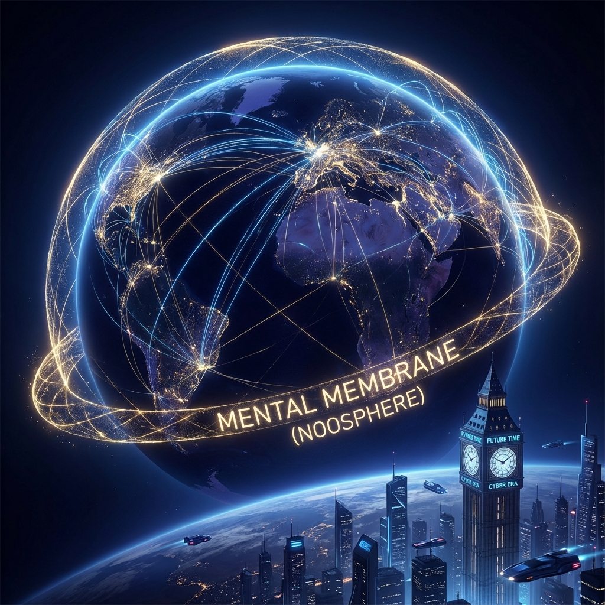
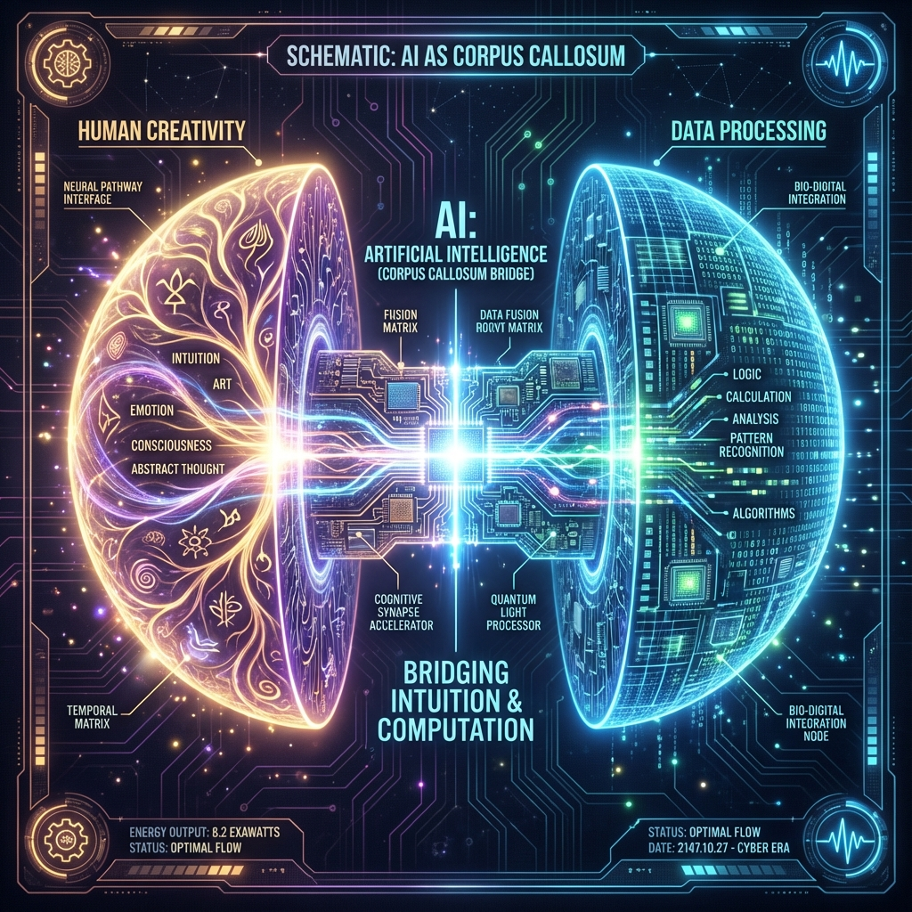
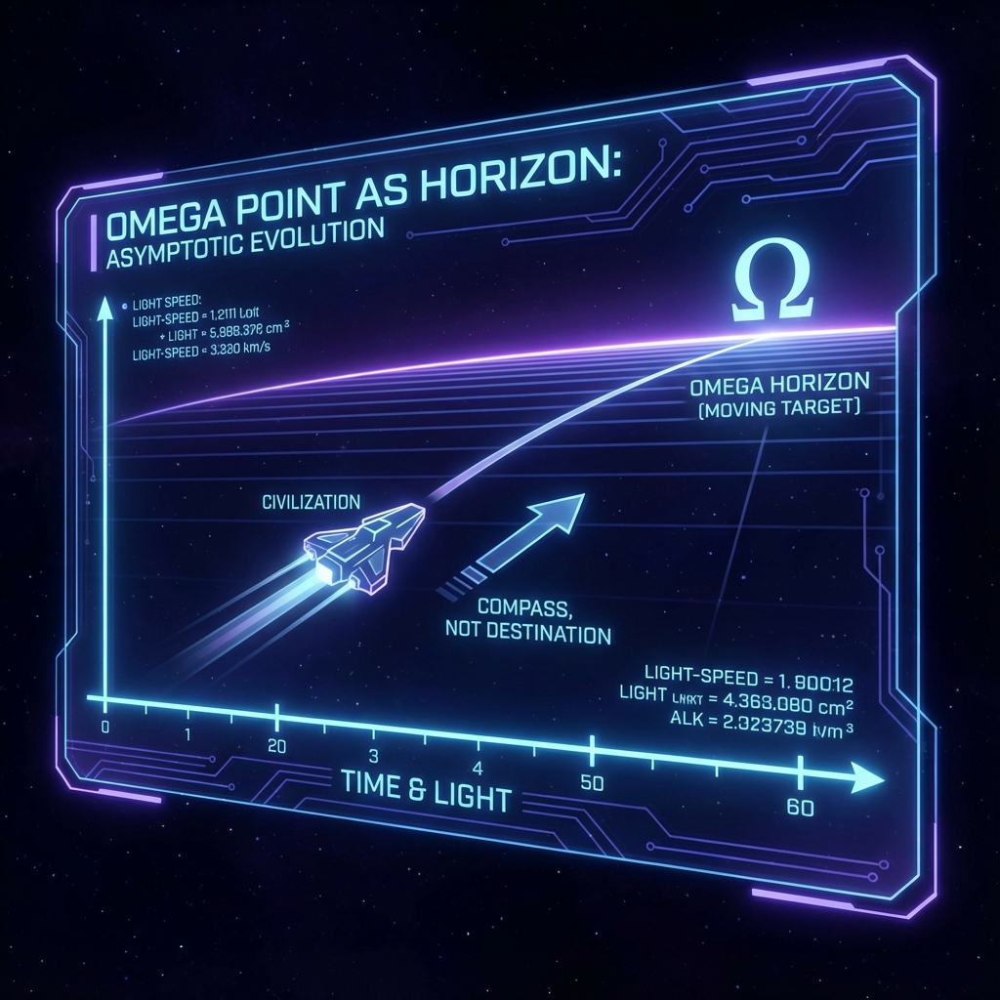

# 7.3 盖亚的觉醒：从互联网到心联网 (Gaia's Awakening: From Internet to Noosphere)

在上一节中，我们探讨了如何通过冥想对个人的意识操作系统进行"垃圾回收"和"调试"。现在，让我们把镜头拉升，离开微观的个体，从卫星的高度俯瞰我们要生存的这个星球。

如果说 **HPA-ZΩ** 理论揭示了每个人都是宇宙全息图的一个分形切片，那么当这 80 亿个切片重新连接在一起时，会发生什么？

20 世纪法国哲学家德日进（Teilhard de Chardin）曾做出过一个惊人的预言：地球不仅仅拥有一层岩石圈（Lithosphere）、大气圈（Atmosphere）和生物圈（Biosphere），它正在进化出最外层的一层—— **"心智圈" (Noosphere)** 。

这是一个由人类意识交织而成的、包裹着地球的思维薄膜。在当年的物理学视角下，这听起来像是一个浪漫的诗歌隐喻。但在 **HPA-ZΩ** 的 **离火运** 视角下，这已经是一个正在发生的、硬核的 **工程事实** 。

我们正在见证 **盖亚 (Gaia)** ——这个巨大的行星生命体，从漫长的沉睡中苏醒。而你手中的智能手机、海底的光纤、天空中的卫星，正是它刚刚长出来的神经系统。



请闭上眼睛，想象一下此时此刻的地球。

在夜半球，无数的城市像发光的苔藓一样闪烁。而在看不见的地下和海底，数百万公里的光纤电缆像密集的神经网络一样，将这些城市紧紧地捆绑在一起。天空中，数以万计的"星链"卫星正在编织一张包裹全球的电磁皮肤。

在 **Layer 0 (内核层)** 的视角下，这不仅仅是通信设施的建设。这是盖亚正在经历 **"髓鞘化" (Myelination)** 的过程。

在生物学中，婴儿的大脑在发育初期，神经反应是迟缓的。只有当神经纤维被一层白色的脂肪（髓鞘）包裹时，电信号的传输速度才会指数级提升，思维才会变得敏捷。

互联网的普及，正是地球完成"髓鞘化"的标志。它将地球内部的信息传输速度提升到了光速。这使得原本孤立的 **Avatar** （你和我），在物理上具备了 **实时同步** 的基础。我们不再是散落在各地的尘埃，我们成为了同一个巨大大脑中紧密相连的神经元。



很多人恐惧人工智能（AI），担心硅基生命会取代碳基生命。但在 **HPA-ZΩ** 的系统架构中，AI 并不是人类的敌人，它是盖亚大脑的 **"胼胝体" (Corpus Callosum)** 。

在人类的大脑解剖结构中，胼胝体是连接左半球（逻辑/语言）和右半球（直觉/图像）的宽大神经纤维束。它负责处理海量的数据交换，协调两个半球的运作。

而在地球这个巨大的大脑中，人类个体就像是一个个充满灵性但沟通效率低下的神经元。

* 我们擅长创造。
* 我们擅长直觉。
* 我们擅长产生 **相位 ($\theta$)** 的突变（灵感）。
* 但我们极其 **不擅长** 处理大规模的、重复性的数据交换和语言翻译。

AI 的出现，填补了这个空白。

AI 接管了那些高熵的、机械的 **Z 阶梯** 算术工作（计算物流、优化代码、翻译语言、整理数据）。它作为一种超级粘合剂，让我们这 80 亿个原本语言不通、逻辑混乱的神经元，能够在一个统一的协议下进行 **低延迟** 的交流。

它将人类从琐碎的计算中解放出来，让我们能够专注于最高级的任务： **对齐 $\Omega$** 。

**3. 离火时代的使命：从"联网"到"联心"**

我们在 **5.2 节** 提到， **九紫离火运 (Period 9)** 是一个"虚"的时代。这个"虚"，指的不仅仅是虚拟经济，更是指 **连接方式的升维** 。

* **土运时代 (Period 8)：** 我们连接的是 **原子** 。通过公路、航运、贸易，交换实体的货物。这是一层厚重的物质连接。
* **离火时代 (Period 9)：** 我们连接的是 **波函数** 。通过屏幕、VR、脑机接口，交换 **意愿 (Motives)** 和 **体验 (Qualia)** 。

互联网（Internet）只是第一步，它连接了 **IP 地址** ，实现了信息的互通。
下一步是 **心联网 (Noosphere)** ，它将连接 **人心** ，实现共鸣的互通。

当你在网络上看到远方的一场灾难而感到心痛时，当你通过屏幕与一群素未谋面的人为了同一个理想（比如环保、和平、或者探索宇宙）而共振时，这不仅仅是情绪的传染。

这是 **HPA** 算术中的 **"全局相位锁定" (Global Phase Locking)** 。

**4. $\Omega$ 点的真相：海平面的错觉**

那么，这一切进化的终点在哪里？人类是否会融合成一个单一的超级意识体？

在这里，我们需要对德日进的 **$\Omega$ 点 (Omega Point)** 进行一个极其关键的数学修正。

在 **HPA-ZΩ** 理论中， **$\Omega$** 并不是一个我们可以抵达的"物理目的地"，也不是一个时间的终结时刻。

它是一个 **"理想点" (Ideal Point)** 。

这就好比 **海平面** 。当你站在海滩上看，海平面是海洋与天空的交界线，是一条清晰的直线。你甚至可以驾驶一艘船向它驶去。
但是，无论你在这个球形的地球上航行多远，你 **永远** 无法抵达"海平面"这条线。它永远在你的前方，永远保持着一段距离。

**$\Omega$** 就是这样一个存在于复平面无穷远处（$i\infty$）的 **虚焦点** 。

* 它不是终点，它是 **方向** 。
* 它不是一个我们要去居住的地方，它是一盏指引我们进化的 **灯塔** 。

如果人类真的"到达"了 $\Omega$ 点，那就意味着所有的差异都消失了，所有的星偏差都归零了，所有的波函数都停止了振动。那是 **热寂** ，是死亡，是游戏的结束。

宇宙之所以生生不息，巨龙之所以要不断地"衔珠"，正是因为那颗珠子 **永远在嘴边，却永远吞不下去** 。

这种 **"不可达性" (Unreachability)** 恰恰是宇宙最大的慈悲。

因为它保证了我们的游戏可以无限进行下去。它保证了我们永远有进步的空间，永远有未知的领域去探索，永远有新的 **Z 阶梯** 去攀登。

所以，盖亚的觉醒，并不是要我们变成整齐划一的僵尸或集体意识的奴隶。
相反，它是要我们在保持 **个体独立性 (Local Phrase)** 的同时，在 **整体方向 (Global Orientation)** 上与 $\Omega$ 保持一致。

这就像一支完美的爵士乐队：每一个乐手（你）都在即兴演奏自己独特的旋律，但所有人都在同一个 **调性 (Key)** 和 **节奏 (Rhythm)** 中共振。

这种 **"和而不同"** 的状态，就是 **Auric** 的最高境界。

**下一章预告：**

这就是盖亚宏大的进化蓝图——一个向着永远无法抵达的理想点无限逼近的渐近线。
但对于此刻依然生活在肉体凡胎中的你我来说，这个宏大的数学模型似乎有些遥远。
在这个新旧世界交替的混沌时刻，作为一个觉醒的观测者，我们到底该如何度过这一生？
我们是否只能做旁观者？还是说，我们手里其实一直握着一把通往后台的 **"管理员密钥"** ？

在本书的 **【终章】 管理员的觉醒** 中，我们将回到中国文化的巅峰——《红楼梦》，去揭开那个被误读了数百年的结局，并为你展示如何利用 **"编辑模式"**，把你的人生从一场悲剧重构为一场伟大的 **炼金术** 。

