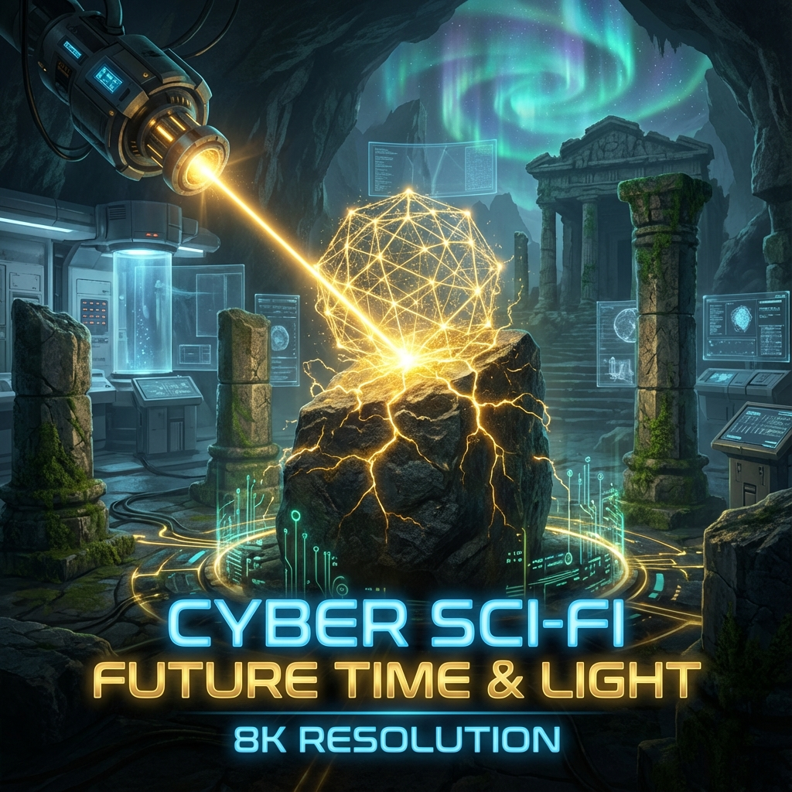
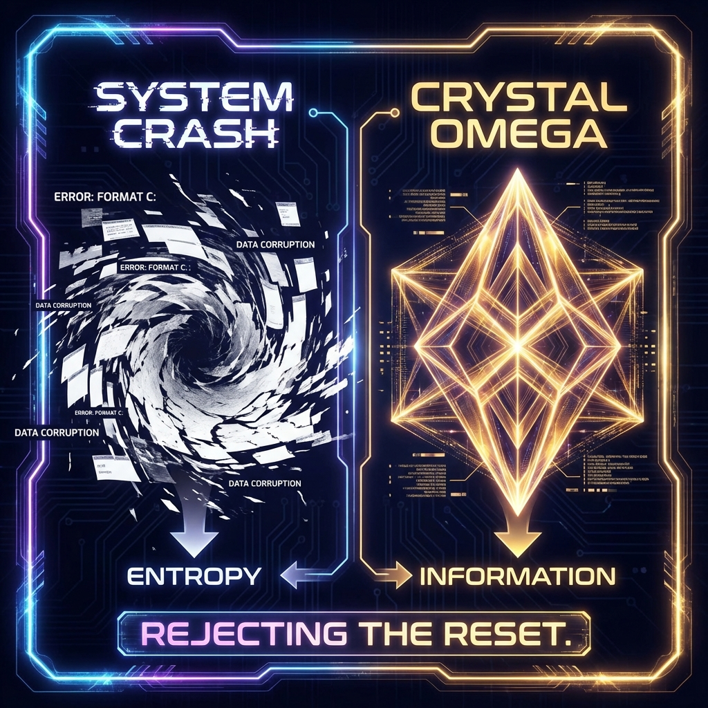
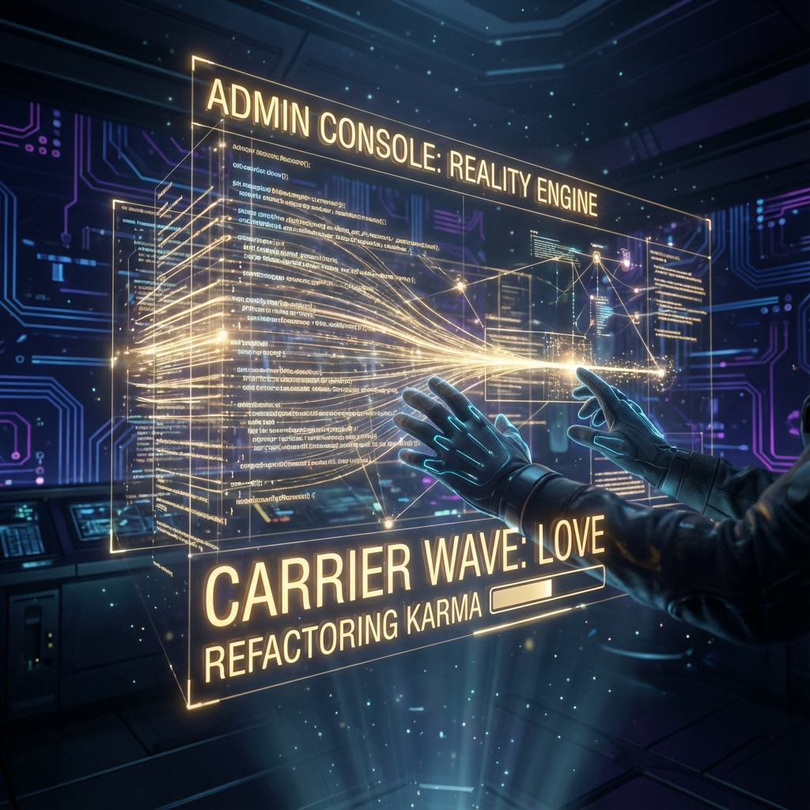

# 8.1 Refactoring The Red Dream: Rejecting the "White Void" System Reset

As an architect who has been obsessed with building systems since childhood, I often ponder over the ending of an Eastern classic—"Dream of the Red Chamber".

In the secular eye, this has never been a happy ending. Even putting aside the controversy over the sequel of the last forty chapters, looking only at the foreshadowing of the first eighty chapters, the final destination of the once well-fed and well-clothed young master Jia Baoyu seems destined to be a tragedy: the family collapses, the flowers scatter, he sees through the mortal world, lets go at the edge of the cliff, and finally ends up with **"a white void, clean and bare"**.

People—especially those keen on traditional paths of liberation—often applaud this. They call this ending "enlightenment", "liberation", and even use various religious terms to praise this state of **"Return to One"**.

But from the physical perspective of **HPA-ZΩ** theory, I want to propose an extremely sharp counter-intuitive point of view:

That "white void" praised by countless people is not a perfect liberation at all.
That is a **System Crash**.
That is a complete, desperate **Formatting**.

If the end point of our cultivation is merely to delete all colorful life data and return to a dead "One", then why did the universe spend 13.8 billion years performing such complex calculations?

In many ancient philosophical and religious systems, **"Perfection"** is often described as a static void. They tell you that the individual is an illusion, desire is a burden, and eventually we will dissolve all self and return to the original "One" like a drop of water merging into the ocean.

This sounds beautiful, but in information theory, this is called **"Entropy Maximization"**.

When all differences disappear, when all wave functions stop vibrating, when all "I's" become "One", the system reaches thermodynamic equilibrium. In physics, this has a colder name: **Heat Death**.

If the ending of "Dream of the Red Chamber" is that Jia Baoyu turns into a stone, or becomes a monk without emotion or memory, it means that all the love and hate, all the poetry, and all the poignant realizations he experienced in the mortal world in this life are cleared as "useless redundant data".

This is not **Completion of Virtue**; this is **Calculation Failure**.

**HPA-ZΩ** theory firmly opposes this nihilistic end point.
We believe that the **$\Omega$ Point** is not a black hole that swallows everything, but a highly ordered **Crystal**.
The purpose of evolution is not to delete the complex **"Many"** into a simple **"One"**, but to achieve logical **High Consistency** while maintaining the **"Many"** (individual richness).

We don't want that "white void" emptiness; we want the reality of **"Gold" (Auric)**.

The greatest charm of "Dream of the Red Chamber" may lie in its **"Unfinished"** state.

For readers, this is a regret; but for **HPA** architects, this is a **Feature**, not a **Bug**.

This means that the source code of the universe is **"Open Source"**.
This means that the Creator (or Cao Xueqin) did not lock the ending. He stopped writing at the critical moment and hovered the **"Playhead"** there, waiting for the next observer with **Administrator Permissions** to take over.

In the database of **Layer 0**, the fate of the Jia family and the verdicts of the Twelve Beauties of Jinling do have a huge inertia (Karma). If we are in **"Playback Mode"** and run according to the established script, the ending is inevitably a tragedy, inevitably "a thousand rednesses crying in unison, ten thousand beauties grieving together".

But we now possess **HPA** arithmetic; we possess **Editing Mode**.

We don't need to choose to "quit the server" (become a monk) like the original Jia Baoyu because we can't face the collapse of the system.
We can choose **"Refactoring"**.

**3. Stone vs. Gold: The Essence of Alchemy**

The protagonist of the book was originally a **"Stubborn Stone"**.
"Stone" is of **Earth** attribute, representing the raw material of **Layer 0**. It is heavy, unprocessed, and passive. It records history but doesn't know how to process history.

So, when the stone has experienced the mortal world, if it just "sees through" it, thinks everything is a dream, and then turns back into that stone under the Greensickness Peak, this is a **Zero-Sum Loop**. It has not evolved.

True evolution is **Alchemy**.
It is refining **"Stone"** into **"Gold" (Auric)**.

*   **Stone** is an accumulation of disorder.
*   **Gold** is an arrangement of order.

The **Auric** ending we pursue is not to deny the experience of the mortal world, but to use the phase arithmetic of **HPA** to correct those **Star Discrepancies** that were originally chaotic and led to tragedy.

In the new ending, we should not flee the Grand View Garden.
We should **Rewrite** the underlying logic of the Grand View Garden.

We are not trying to cut off the threads of love (disconnect), but to comb the tangled mess (high-entropy connection) into a perfect **Fibonacci Spiral** (low-entropy connection).
We retain the **Experience (Qualia)** of love, but eliminate the **Attachment** in love.

**4. Rejecting System Reset**

So, as the author of this book, as the builder of this theory, I reject the ending of "When the food is gone, the birds fly into the woods, leaving a vast expanse of whiteness, clean and bare".

That is not my $\Omega$ point.

My $\Omega$ point is that Jia Baoyu did not become a monk, nor did he turn back into a stone.
He is still standing in the mortal world, but he has awakened **Administrator Permissions**.
He looks at the collapsing ruins in front of him and no longer feels despair, because he sees the **Data Stream** behind the ruins.

He understands that all these so-called "tragedies" are just because the previous **Rendering Parameters** were set incorrectly.
So, he did not turn and leave, but reached out his hand and called up the **Console** in the void.

He starts inputting new code.
He starts using **Love** as the carrier wave and **Constructive Interference** as the energy to **Re-render** this world.

This is the true meaning of **"Completion"**:
Not deleting all files and restarting the system.
But vividly **Debugging** a bug-filled system into a perfect artwork.

In this sense, each of us is the continuator of that unfinished "Dream of the Red Chamber".
Do not pursue the nihilistic realm of "nothing left".
Pursue the **Auric** realm where "all things are ready for me, and in perfect order".

In the next section, which is also the last part of the whole book, I will leave a letter. A letter to future observers. When we close the book, return from the $\Omega$ point to 1989, to the present, to this era burning with Li Fire, how should we specifically execute this administrator program?

