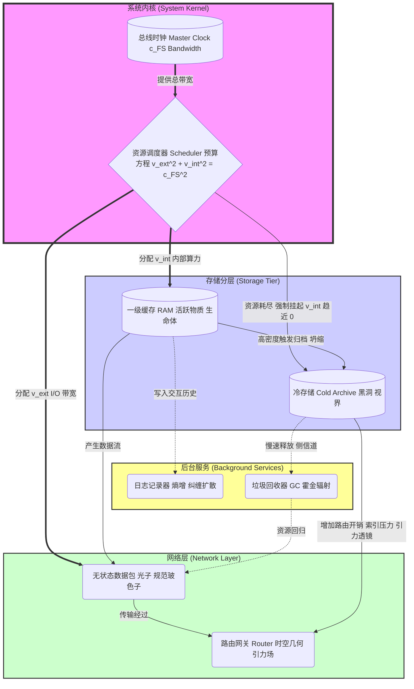
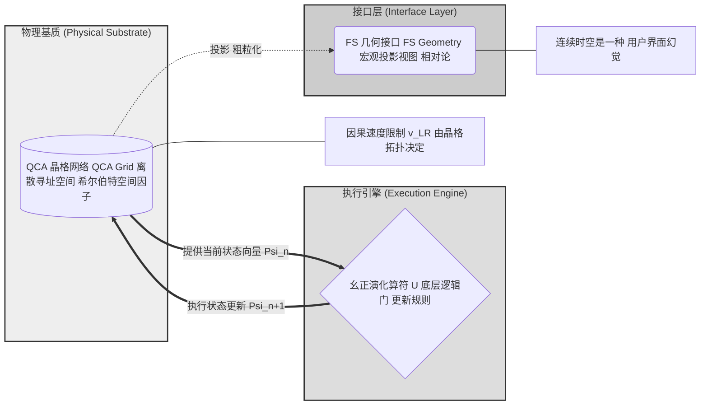
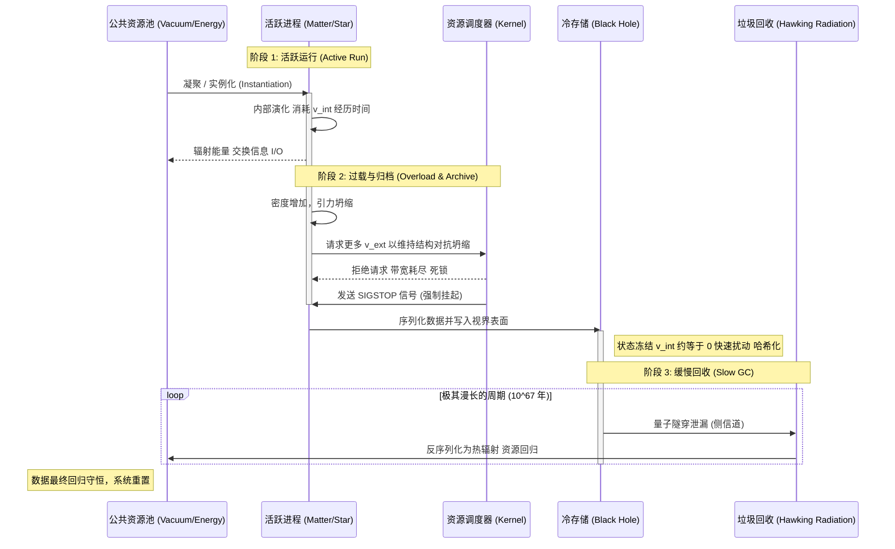

# 附录 E.1：宇宙内核架构图 (Appendix E.1: The Universe Kernel Architecture Diagram)

**—— 现实逻辑的工程蓝图 (The Engineering Blueprint of Reality Logic)**

**"一图胜千言。对于复杂的分布式系统，我们需要一张清晰的拓扑图。"**

---

## 1. 架构总览：FS-QCA 堆栈 (Architecture Overview: The FS-QCA Stack)

为了直观地展示 **"宇宙即计算"** 这一核心论点，我们将前文所述的所有理论模块整合为一套标准的 **软件架构图 (Software Architecture Diagram)**。

这张蓝图将宇宙划分为三个逻辑层级：

1.  **内核层 (Kernel Layer):** 负责最底层的资源调度与时钟管理。

2.  **基础设施层 (Infrastructure Layer):** 包含存储（物质/黑洞）与网络（光/时空）。

3.  **服务层 (Service Layer):** 运行在后台的维护进程（熵增与垃圾回收）。

---

## 2. 视图一：宏观组件与资源流向 (View 1: Macro Component & Resource Flow)

此视图描述了系统核心资源——**信息处理带宽 ($c_{FS}$)**——是如何在不同物理组件之间进行分配与流转的。它是对 **广义帕塞瓦尔恒等式** 的图形化表达。

**图解说明：**

  * **调度器 (Scheduler):** 这是物理定律的执行机构。它强制执行"零和博弈"，确保任何对象消耗的总资源不超过 **$c_{FS}$**。

  * **RAM vs. Archive:** 物质是活跃的运算单元，拥有 **$v_{int}$**；黑洞是静态的存储单元，**$v_{int}$** 被冻结。

  * **路由开销:** 即使是冷存储（黑洞），其庞大的元数据也会占用路由器的算力，导致经过它的数据包（光子）延迟增加。

---

## 3. 视图二：底层硬件抽象 (View 2: Micro Hardware Abstraction Layer)

此视图深入到普朗克尺度，展示了支撑宏观物理定律的 **微观电路 (Micro-Circuitry)**。它揭示了连续时空是如何从离散网格中涌现的。

**图解说明：**

  * **QCA 晶格:** 宇宙的"显存"。每一个网格点都是一个有限维的量子系统。

  * **幺正算符 ($U$):** 宇宙的"CPU 指令集"。它是局域的、平移不变的，驱动着整个网格的状态更新。

  * **FS 接口:** 我们（观察者）无法直接看到底层的晶格，我们只能看到通过 **FS 度规** 渲染出来的光滑几何界面。

---

## 4. 视图三：数据生命周期流 (View 3: Data Lifecycle Flow)

此视图展示了一个典型的数据对象（例如一颗恒星）从创建、运行、归档到最终回收的全生命周期流程。

**图解说明：**

  * **SIGSTOP:** 引力坍缩在代码层面被解释为系统发送的暂停信号。

  * **序列化:** 物质落入黑洞的过程，就是从活跃的 RAM 对象转变为视界上的静态全息数据的过程。

  * **最终一致性:** 霍金辐射确保了借用的资源最终归还给公共池，防止了永久性的资源锁定。

---

## **架构师总结 (The Architect's Summary)**

这三张图表构成了 **《The Matrix: Source Code of the Universe》** 的技术核心。

  * **图 1** 解释了 **相对论**（资源分配）和 **引力**（路由开销）。

  * **图 2** 解释了 **量子力学**（离散更新）和 **时空本质**（用户界面）。

  * **图 3** 解释了 **黑洞**（存储）和 **热力学**（生命周期）。

对于任何想要理解或扩展这个宇宙模型的"开发者"来说，这套架构图就是你们的 **系统蓝图 (System Blueprints)**。它证明了物理学不是一堆杂乱无章的公式，而是一个设计精良、逻辑严密的 **操作系统**。
