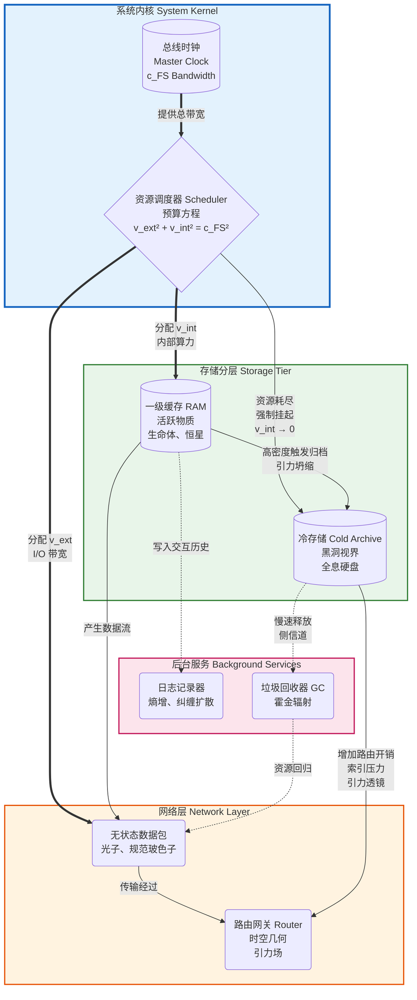
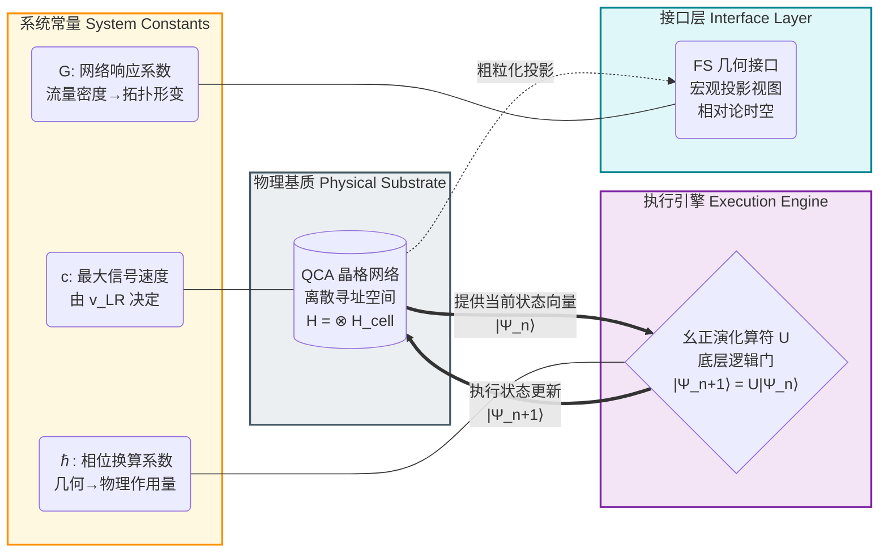
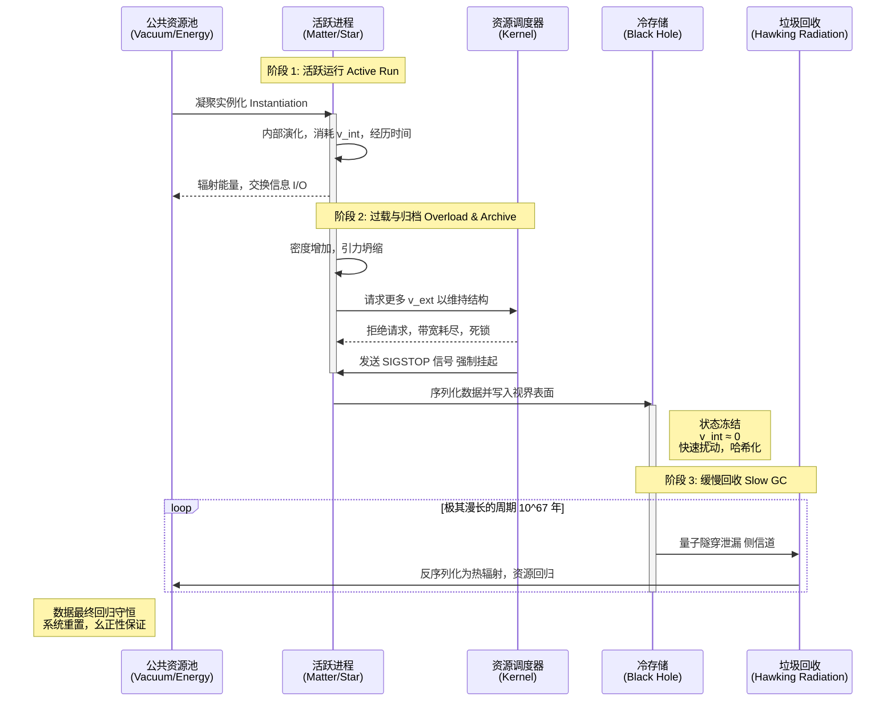
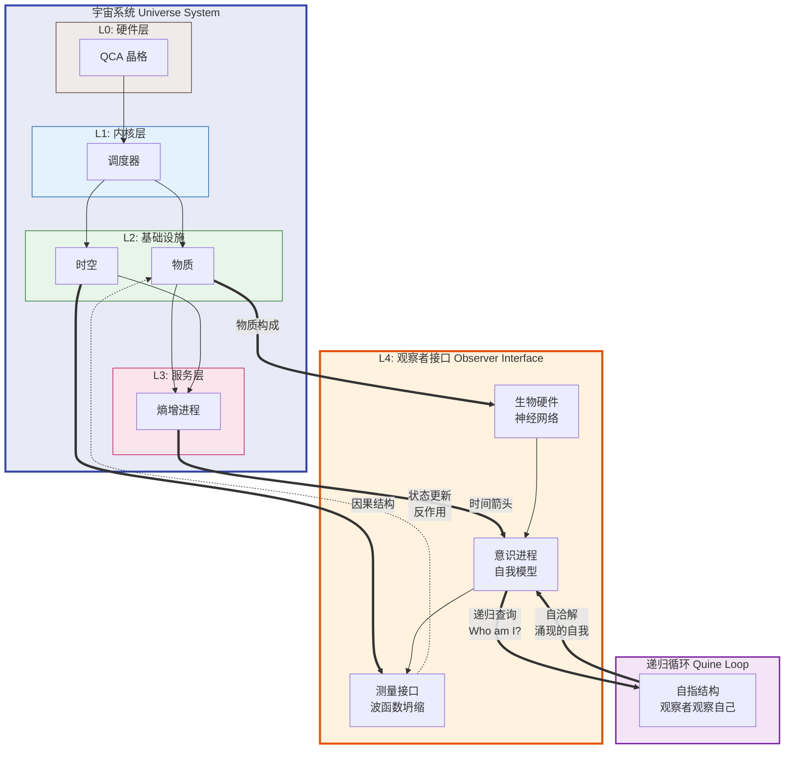
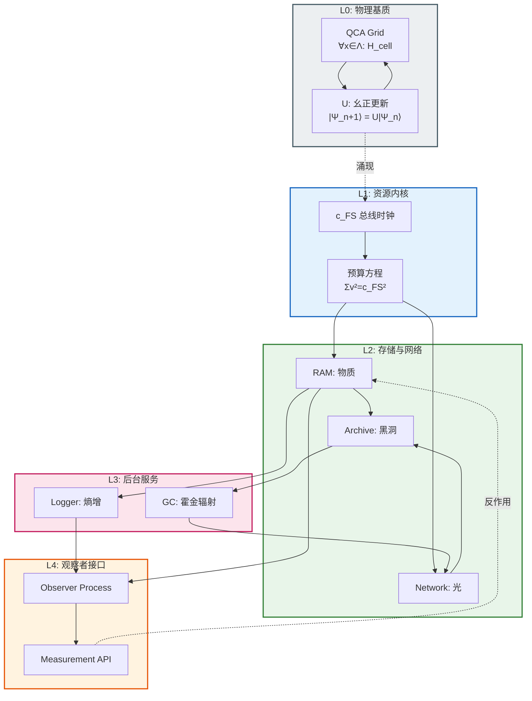

# 附录 E.1：宇宙内核架构图 (Appendix E.1: The Universe Kernel Architecture Diagram)

**—— 现实逻辑的工程蓝图 (The Engineering Blueprint of Reality Logic)**

**"一图胜千言。对于复杂的分布式系统，我们需要一张清晰的拓扑图。"**

---

## 1. 架构总览：FS-QCA 堆栈 (Architecture Overview: The FS-QCA Stack)

为了直观地展示 **"宇宙即计算"** 这一核心论点，我们将前文所述的所有理论模块整合为一套标准的 **软件架构图 (Software Architecture Diagram)**。

这张蓝图将宇宙划分为五个逻辑层级：

| 层级 | 名称 | 核心功能 | 物理对应 |
|:---:|:---|:---|:---|
| **L0** | 硬件层 (Hardware) | 提供物理基质与更新规则 | QCA 晶格、幺正算符 $U$ |
| **L1** | 内核层 (Kernel) | 资源调度与时钟管理 | 广义帕塞瓦尔恒等式 |
| **L2** | 基础设施层 (Infrastructure) | 存储与网络 | 物质、黑洞、光、时空 |
| **L3** | 服务层 (Services) | 后台维护进程 | 熵增、霍金辐射 |
| **L4** | 接口层 (Interface) | 观察者交互与递归 | 意识、测量、Quine 循环 |

---

## 2. 视图一：宏观组件与资源流向 (View 1: Macro Component & Resource Flow)

此视图描述了系统核心资源——**信息处理带宽 ($c_{FS}$)**——是如何在不同物理组件之间进行分配与流转的。它是对 **广义帕塞瓦尔恒等式** 的图形化表达。



**图解说明：**

| 组件 | 系统角色 | 物理机制 |
|:---|:---|:---|
| **调度器** | 执行"零和博弈"，确保资源不超额 | 广义帕塞瓦尔恒等式 $v_{ext}^2 + v_{int}^2 + v_{env}^2 = c_{FS}^2$ |
| **RAM** | 活跃的运算单元，拥有高 $v_{int}$ | 物质的静止质量与固有时流逝 |
| **冷存储** | 静态存储单元，$v_{int} \approx 0$ | 黑洞的全息数据编码 |
| **路由器** | 管理数据传输路径 | 时空度规与测地线方程 |
| **路由开销** | 冷存储的元数据占用网关算力 | 引力透镜与时间延迟 |

---

## 3. 视图二：底层硬件抽象层 (View 2: Hardware Abstraction Layer)

此视图深入到普朗克尺度，展示了支撑宏观物理定律的 **微观电路 (Micro-Circuitry)**。它揭示了连续时空是如何从离散网格中涌现的。



**图解说明：**

| 层级 | 描述 | 关键约束 |
|:---|:---|:---|
| **QCA 晶格** | 宇宙的"显存"，每个节点是有限维量子系统 | 因果速度限制 $v_{LR}$ 由晶格拓扑决定 |
| **幺正算符 $U$** | 宇宙的"CPU 指令集"，局域且平移不变 | $[U, T_a] = 0$，保证物理定律处处一致 |
| **FS 接口** | 观察者视角的光滑几何界面 | 连续时空是一种"用户界面幻觉" |

**紫外截断的工程意义：**

```
┌─────────────────────────────────────────────────────────────┐
│  连续场论 (旧架构)          │  QCA (新架构)                  │
├─────────────────────────────────────────────────────────────┤
│  动量空间: ℝ^d (无界)       │  动量空间: T^d (布里渊区，紧致) │
│  能量: E → ∞ (发散)         │  能量: 有限带宽 (无发散)        │
│  紫外问题: 需要重整化       │  紫外问题: 自动截断             │
│  奇点: 物理预言崩溃          │  奇点: 分辨率极限，逻辑良定义   │
└─────────────────────────────────────────────────────────────┘
```

---

## 4. 视图三：数据生命周期流 (View 3: Data Lifecycle Flow)

此视图展示了一个典型的数据对象（例如一颗恒星）从创建、运行、归档到最终回收的全生命周期流程。



**图解说明：**

| 阶段 | 系统信号 | 物理过程 |
|:---|:---|:---|
| **实例化** | `malloc()` | 真空涨落凝聚为物质 |
| **活跃运行** | CPU 时间片 | 恒星核聚变、生命代谢 |
| **SIGSTOP** | 强制挂起 | 引力坍缩形成视界 |
| **序列化** | `serialize()` | 3D 物质 → 2D 全息数据 |
| **GC** | `free()` 延迟执行 | 霍金辐射缓慢释放 |

---

## 5. 视图四：观察者接口与递归层 (View 4: Observer Interface & Recursion Layer)

此视图展示了最高层的抽象——观察者如何作为系统的 **递归节点**，既是数据的消费者，也是系统的组成部分。



**递归层的核心洞见：**

| 概念 | 系统类比 | 物理意义 |
|:---|:---|:---|
| **观察者** | 特权进程，拥有 `sudo` 权限 | 能够触发波函数坍缩的物理系统 |
| **意识** | 递归子程序，自我调用 | 信息整合与自我模型的涌现 |
| **测量** | 系统调用 `syscall` | 量子态到经典结果的不可逆投影 |
| **Quine 循环** | 打印自身源代码的程序 | 宇宙通过观察者理解自身 |

**自指的逻辑结构：**

```
观察者 ⊂ 宇宙
宇宙 → 产生 → 观察者
观察者 → 观察 → 宇宙
观察者 → 观察 → (观察者 ⊂ 宇宙)  // 递归
```

这是一个 **自举 (Bootstrapping)** 结构：系统创造了能够理解系统的子系统，而这个子系统的存在本身就是系统规则的产物。

---

## 6. 视图五：完整系统调用图 (View 5: Complete System Call Graph)

此视图将所有组件整合为一张统一的调用关系图，展示宇宙从底层到顶层的完整信息流。



---

## 7. 附录：核心接口规范 (Appendix: Core Interface Specifications)

### 7.1 调度器 API

```
interface Scheduler {
    // 资源分配
    allocate(process_id, v_ext, v_int, v_env) → Result<(), BudgetOverflow>
    
    // 约束检查
    assert: v_ext² + v_int² + v_env² == c_FS²
    
    // 信号处理
    signal(process_id, SIGSTOP) → freeze(v_int → 0)
    signal(process_id, SIGCONT) → unfreeze()  // 仅限量子隧穿
}
```

### 7.2 存储层 API

```
interface Storage {
    // 写入（不可逆）
    write(data) → holographic_encoding(surface)
    
    // 读取（仅限 GC）
    read() → thermal_radiation  // 极慢速率 T ∝ 1/M
    
    // 容量限制
    max_bits = Area / (4 * l_P²)  // Bekenstein-Hawking 界限
}
```

### 7.3 观察者 API

```
interface Observer {
    // 测量（不可逆投影）
    measure(|ψ⟩, Observable) → eigenvalue
    
    // 递归查询
    introspect() → self_model ⊂ universe_model
    
    // Quine 属性
    assert: describe(self) ∈ outputs_of(self)
}
```

---

## **架构师总结 (The Architect's Summary)**

这五张视图构成了 **《The Matrix: Source Code of the Universe》** 的技术核心：

| 视图 | 解释的物理理论 | 核心隐喻 |
|:---|:---|:---|
| **视图 1** | 相对论（资源分配）、引力（路由开销） | 零和博弈 |
| **视图 2** | 量子力学（离散更新）、时空本质（用户界面） | 像素化显示器 |
| **视图 3** | 黑洞物理（存储）、热力学（生命周期） | 分级存储策略 |
| **视图 4** | 量子测量（接口）、意识（递归） | 自举与 Quine |
| **视图 5** | 统一架构（全栈视图） | 操作系统分层 |

**设计原则总结：**

1. **资源有限性：** 总带宽 $c_{FS}$ 是硬编码常数，所有物理过程都是资源竞争。

2. **分层抽象：** 从 QCA 晶格到意识涌现，每一层都是对下层的粗粒化封装。

3. **信息守恒：** 没有数据被真正删除（幺正性），只有深度归档和延迟回收。

4. **递归自洽：** 系统创造了能够理解系统的观察者，形成 Quine 循环。

对于任何想要理解或扩展这个宇宙模型的"开发者"来说，这套架构图就是你们的 **系统蓝图 (System Blueprints)**。它证明了物理学不是一堆杂乱无章的公式，而是一个设计精良、逻辑严密的 **操作系统**。

**// End of Architecture Documentation**
