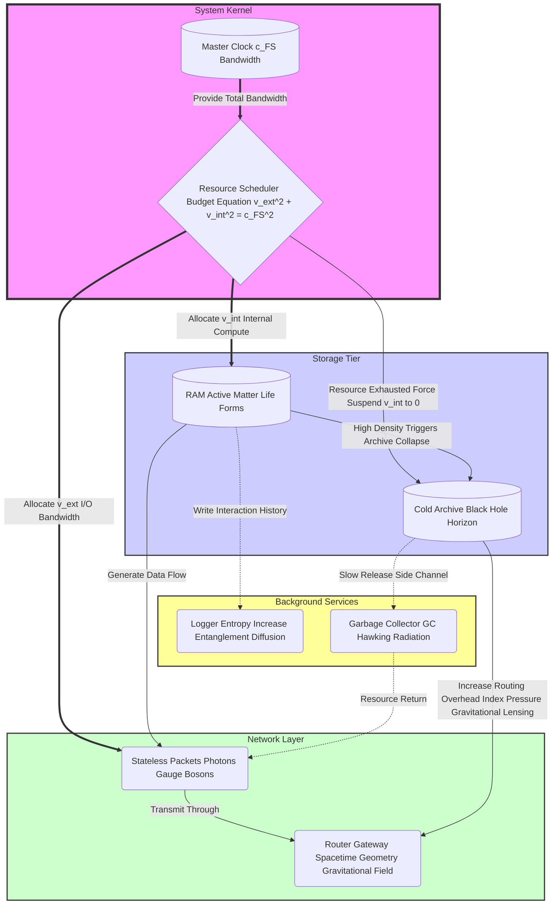
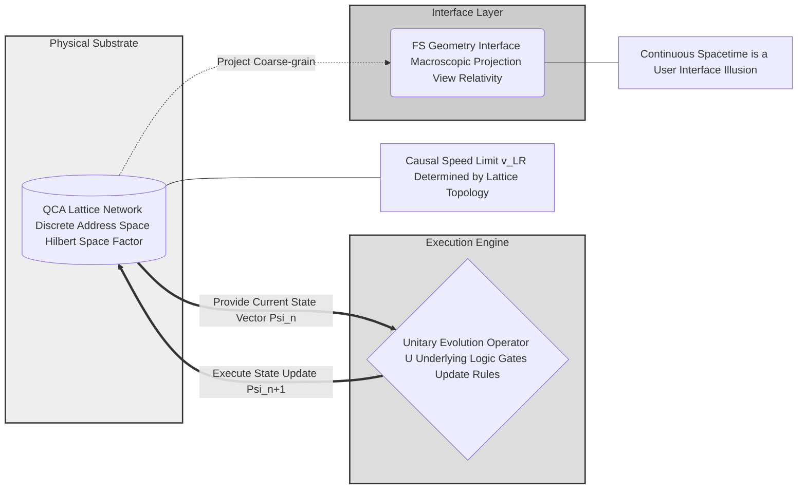
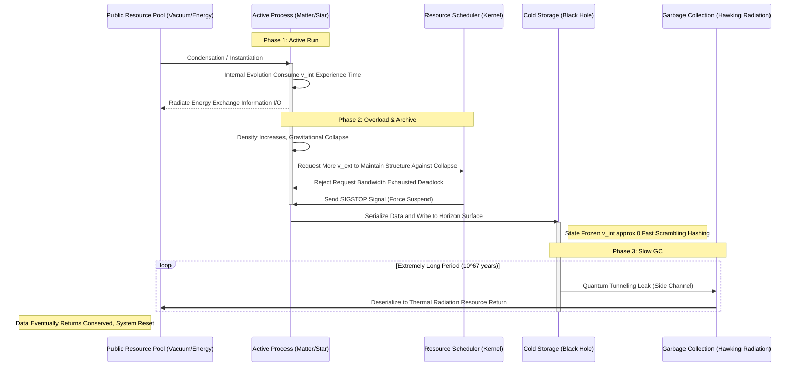

# Appendix E.1: The Universe Kernel Architecture Diagram

**—— The Engineering Blueprint of Reality Logic**

**"A picture is worth a thousand words. For complex distributed systems, we need a clear topology diagram."**

---

## 1. Architecture Overview: The FS-QCA Stack

To intuitively demonstrate the core thesis that **"the universe is computation"**, we integrate all theoretical modules described above into a standard **Software Architecture Diagram**.

This blueprint divides the universe into three logical layers:

1.  **Kernel Layer:** Responsible for the lowest-level resource scheduling and clock management.

2.  **Infrastructure Layer:** Contains storage (matter/black holes) and network (light/spacetime).

3.  **Service Layer:** Background maintenance processes (entropy increase and garbage collection).

---

## 2. View 1: Macro Component & Resource Flow

This view describes how the system's core resource—**information processing bandwidth ($c_{FS}$)**—is allocated and flows among different physical components. It is a graphical expression of the **Generalized Parseval Identity**.

**Diagram Explanation:**

  * **Scheduler:** This is the execution mechanism of physical laws. It enforces a "zero-sum game," ensuring that no object consumes total resources exceeding **$c_{FS}$**.

  * **RAM vs. Archive:** Matter is an active computational unit with **$v_{int}$**; black holes are static storage units where **$v_{int}$** is frozen.

  * **Routing Overhead:** Even cold storage (black holes) occupies router computational power with its massive metadata, causing increased delay for data packets (photons) passing through.

---

## 3. View 2: Micro Hardware Abstraction Layer

This view delves into the Planck scale, showing the **micro-circuitry** that supports macroscopic physical laws. It reveals how continuous spacetime emerges from discrete grids.

**Diagram Explanation:**

  * **QCA Lattice:** The universe's "video memory." Each grid point is a finite-dimensional quantum system.

  * **Unitary Operator ($U$):** The universe's "CPU instruction set." It is local, translation-invariant, driving state updates across the entire grid.

  * **FS Interface:** We (observers) cannot directly see the underlying lattice; we can only see the smooth geometric interface rendered through the **FS metric**.

---

## 4. View 3: Data Lifecycle Flow

This view shows the complete lifecycle of a typical data object (such as a star) from creation, operation, archiving to final recovery.

**Diagram Explanation:**

  * **SIGSTOP:** Gravitational collapse is interpreted at the code level as a suspend signal sent by the system.

  * **Serialization:** The process of matter falling into a black hole is the transformation from an active RAM object to static holographic data on the horizon.

  * **Eventual Consistency:** Hawking radiation ensures that borrowed resources are eventually returned to the public pool, preventing permanent resource locking.

---

## **The Architect's Summary**

These three diagrams constitute the technical core of **"The Matrix: Source Code of the Universe"**.

  * **Diagram 1** explains **Relativity** (resource allocation) and **Gravity** (routing overhead).

  * **Diagram 2** explains **Quantum Mechanics** (discrete updates) and **Spacetime Essence** (user interface).

  * **Diagram 3** explains **Black Holes** (storage) and **Thermodynamics** (lifecycle).

For any "developer" who wants to understand or extend this universe model, this architecture diagram is your **System Blueprints**. It proves that physics is not a jumble of random formulas, but a well-designed, logically rigorous **operating system**.
