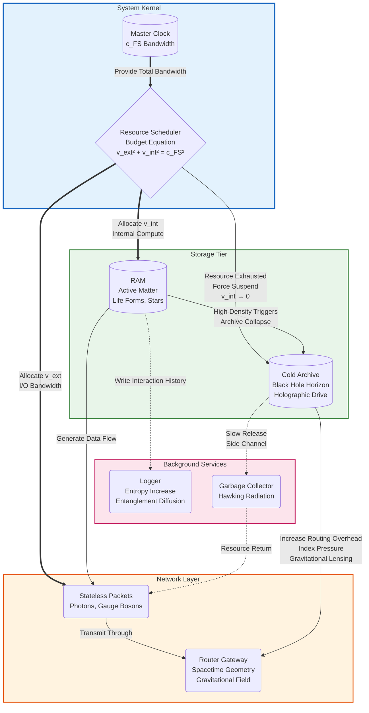
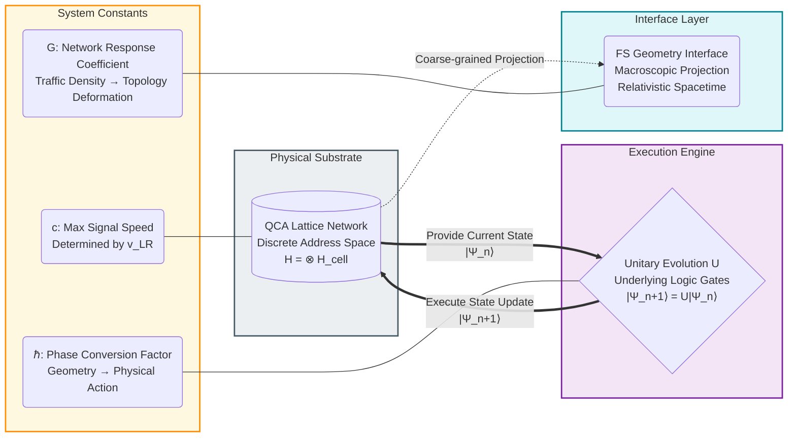
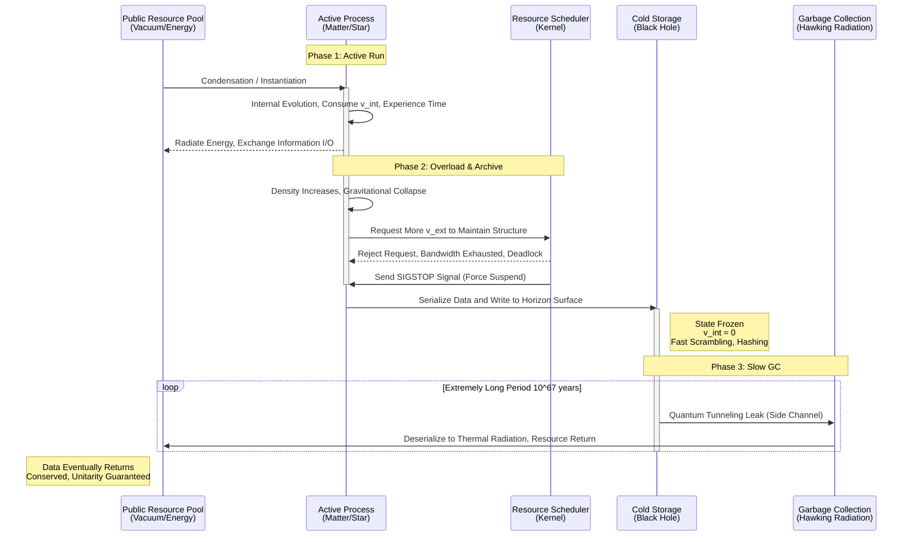
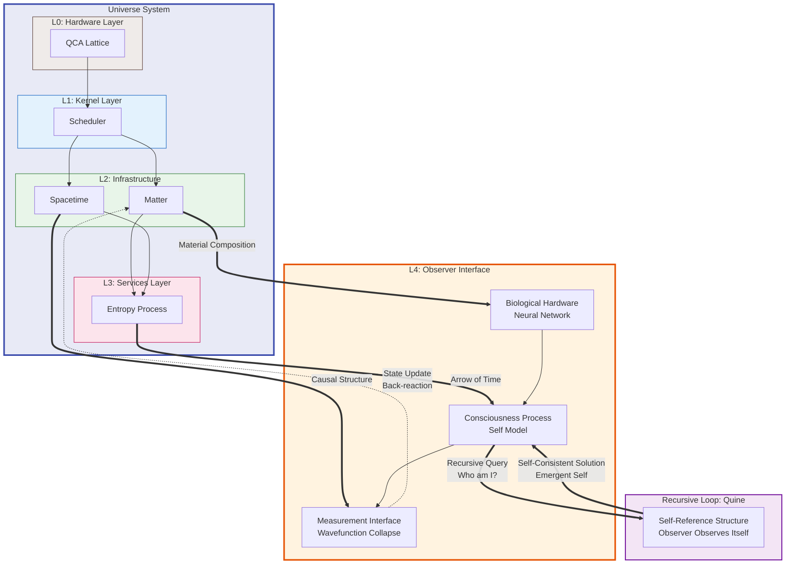
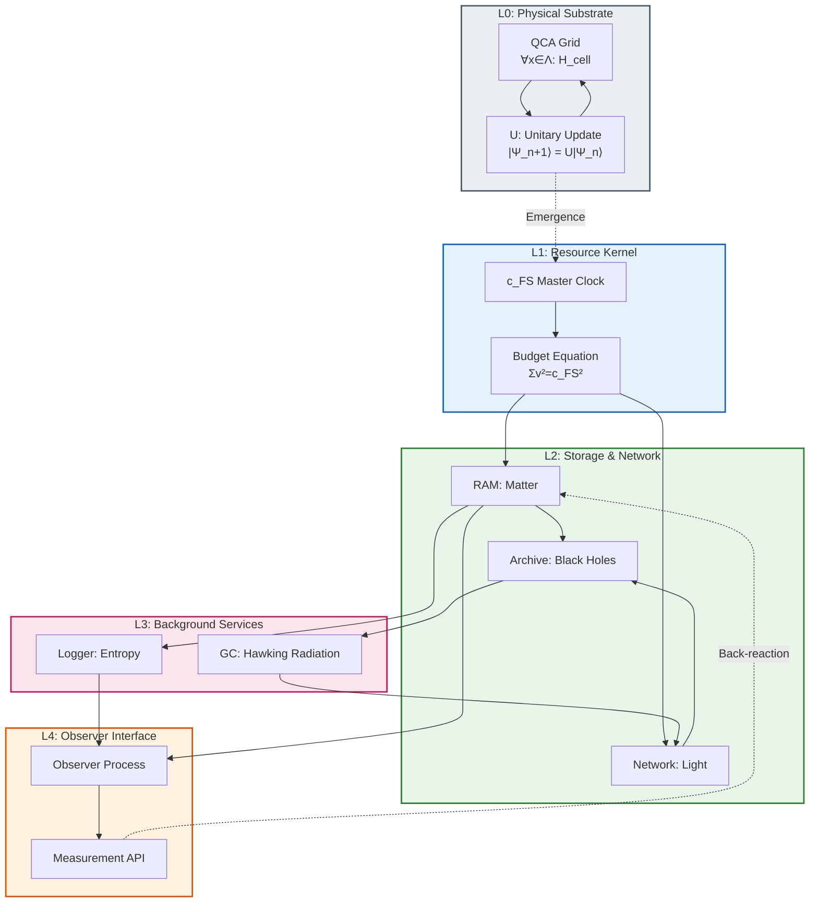

# Appendix E.1: The Universe Kernel Architecture Diagram

**—— The Engineering Blueprint of Reality Logic**

**"A picture is worth a thousand words. For complex distributed systems, we need a clear topology diagram."**

---

## 1. Architecture Overview: The FS-QCA Stack

To intuitively demonstrate the core thesis that **"the universe is computation"**, we integrate all theoretical modules described throughout this book into a standard **Software Architecture Diagram**.

This blueprint divides the universe into five logical layers:

| Layer | Name | Core Function | Physical Correspondence |
|:---:|:---|:---|:---|
| **L0** | Hardware Layer | Physical substrate & update rules | QCA lattice, unitary operator $U$ |
| **L1** | Kernel Layer | Resource scheduling & clock management | Generalized Parseval Identity |
| **L2** | Infrastructure Layer | Storage & network | Matter, black holes, light, spacetime |
| **L3** | Services Layer | Background maintenance processes | Entropy increase, Hawking radiation |
| **L4** | Interface Layer | Observer interaction & recursion | Consciousness, measurement, Quine loop |

---

## 2. View 1: Macro Component & Resource Flow

This view describes how the system's core resource—**information processing bandwidth ($c_{FS}$)**—is allocated and flows among different physical components. It is a graphical expression of the **Generalized Parseval Identity**.



**Diagram Explanation:**

| Component | System Role | Physical Mechanism |
|:---|:---|:---|
| **Scheduler** | Enforces "zero-sum game," ensures no resource overflow | Generalized Parseval Identity $v_{ext}^2 + v_{int}^2 + v_{env}^2 = c_{FS}^2$ |
| **RAM** | Active computational units with high $v_{int}$ | Rest mass and proper time flow of matter |
| **Cold Storage** | Static storage units, $v_{int} \approx 0$ | Holographic data encoding on black holes |
| **Router** | Manages data transmission paths | Spacetime metric and geodesic equations |
| **Routing Overhead** | Cold storage metadata occupies gateway compute | Gravitational lensing and time delay |

---

## 3. View 2: Hardware Abstraction Layer

This view delves into the Planck scale, showing the **micro-circuitry** that supports macroscopic physical laws. It reveals how continuous spacetime emerges from discrete grids.



**Diagram Explanation:**

| Layer | Description | Key Constraint |
|:---|:---|:---|
| **QCA Lattice** | The universe's "video memory," each node is a finite-dim quantum system | Causal speed limit $v_{LR}$ determined by lattice topology |
| **Unitary Operator $U$** | The universe's "CPU instruction set," local and translation-invariant | $[U, T_a] = 0$, ensures uniform physical laws everywhere |
| **FS Interface** | Smooth geometric interface from observer's perspective | Continuous spacetime is a "user interface illusion" |

**Engineering Significance of UV Cutoff:**

```
┌─────────────────────────────────────────────────────────────┐
│  Continuous Field Theory (Old)  │  QCA (New Architecture)   │
├─────────────────────────────────────────────────────────────┤
│  Momentum space: ℝ^d (unbounded)│  Momentum space: T^d (compact Brillouin zone) │
│  Energy: E → ∞ (divergent)      │  Energy: finite bandwidth (no divergence)     │
│  UV problem: renormalization    │  UV problem: automatic cutoff                 │
│  Singularity: physics breaks    │  Singularity: resolution limit, well-defined  │
└─────────────────────────────────────────────────────────────┘
```

---

## 4. View 3: Data Lifecycle Flow

This view shows the complete lifecycle of a typical data object (such as a star) from creation, operation, archiving to final recovery.



**Diagram Explanation:**

| Phase | System Signal | Physical Process |
|:---|:---|:---|
| **Instantiation** | `malloc()` | Vacuum fluctuations condense into matter |
| **Active Run** | CPU time slice | Stellar fusion, biological metabolism |
| **SIGSTOP** | Force suspend | Gravitational collapse forms horizon |
| **Serialization** | `serialize()` | 3D matter → 2D holographic data |
| **GC** | Delayed `free()` | Hawking radiation slowly releases resources |

---

## 5. View 4: Observer Interface & Recursion Layer

This view shows the highest level of abstraction—how observers serve as **recursive nodes** in the system, being both consumers of data and components of the system itself.



**Core Insights of the Recursion Layer:**

| Concept | System Analogy | Physical Meaning |
|:---|:---|:---|
| **Observer** | Privileged process with `sudo` privileges | Physical system capable of triggering wavefunction collapse |
| **Consciousness** | Recursive subroutine, self-calling | Emergence of information integration and self-model |
| **Measurement** | System call `syscall` | Irreversible projection from quantum to classical |
| **Quine Loop** | Program that prints its own source code | Universe understanding itself through observers |

**Logical Structure of Self-Reference:**

```
Observer ⊂ Universe
Universe → produces → Observer
Observer → observes → Universe
Observer → observes → (Observer ⊂ Universe)  // Recursion
```

This is a **bootstrapping** structure: the system creates subsystems capable of understanding the system, and the existence of these subsystems is itself a product of system rules.

---

## 6. View 5: Complete System Call Graph

This view integrates all components into a unified call relationship diagram, showing the complete information flow from bottom to top of the universe.



---

## 7. Appendix: Core Interface Specifications

### 7.1 Scheduler API

```
interface Scheduler {
    // Resource Allocation
    allocate(process_id, v_ext, v_int, v_env) → Result<(), BudgetOverflow>
    
    // Constraint Check
    assert: v_ext² + v_int² + v_env² == c_FS²
    
    // Signal Handling
    signal(process_id, SIGSTOP) → freeze(v_int → 0)
    signal(process_id, SIGCONT) → unfreeze()  // Only via quantum tunneling
}
```

### 7.2 Storage Layer API

```
interface Storage {
    // Write (Irreversible)
    write(data) → holographic_encoding(surface)
    
    // Read (GC Only)
    read() → thermal_radiation  // Extremely slow rate T ∝ 1/M
    
    // Capacity Limit
    max_bits = Area / (4 * l_P²)  // Bekenstein-Hawking bound
}
```

### 7.3 Observer API

```
interface Observer {
    // Measurement (Irreversible Projection)
    measure(|ψ⟩, Observable) → eigenvalue
    
    // Recursive Query
    introspect() → self_model ⊂ universe_model
    
    // Quine Property
    assert: describe(self) ∈ outputs_of(self)
}
```

---

## **The Architect's Summary**

These five views constitute the technical core of **"The Matrix: Source Code of the Universe"**:

| View | Physical Theories Explained | Core Metaphor |
|:---|:---|:---|
| **View 1** | Relativity (resource allocation), Gravity (routing overhead) | Zero-sum game |
| **View 2** | Quantum Mechanics (discrete updates), Spacetime essence (user interface) | Pixelated display |
| **View 3** | Black hole physics (storage), Thermodynamics (lifecycle) | Tiered storage strategy |
| **View 4** | Quantum measurement (interface), Consciousness (recursion) | Bootstrapping & Quine |
| **View 5** | Unified architecture (full-stack view) | OS layering |

**Summary of Design Principles:**

1. **Resource Finiteness:** Total bandwidth $c_{FS}$ is a hardcoded constant; all physical processes are resource competition.

2. **Layered Abstraction:** From QCA lattice to consciousness emergence, each layer is a coarse-grained encapsulation of the layer below.

3. **Information Conservation:** No data is truly deleted (unitarity); only deep archiving and delayed recovery.

4. **Recursive Self-Consistency:** The system creates observers capable of understanding the system, forming a Quine loop.

For any "developer" who wants to understand or extend this universe model, this architecture diagram is your **System Blueprints**. It proves that physics is not a jumble of random formulas, but a well-designed, logically rigorous **operating system**.

**// End of Architecture Documentation**
