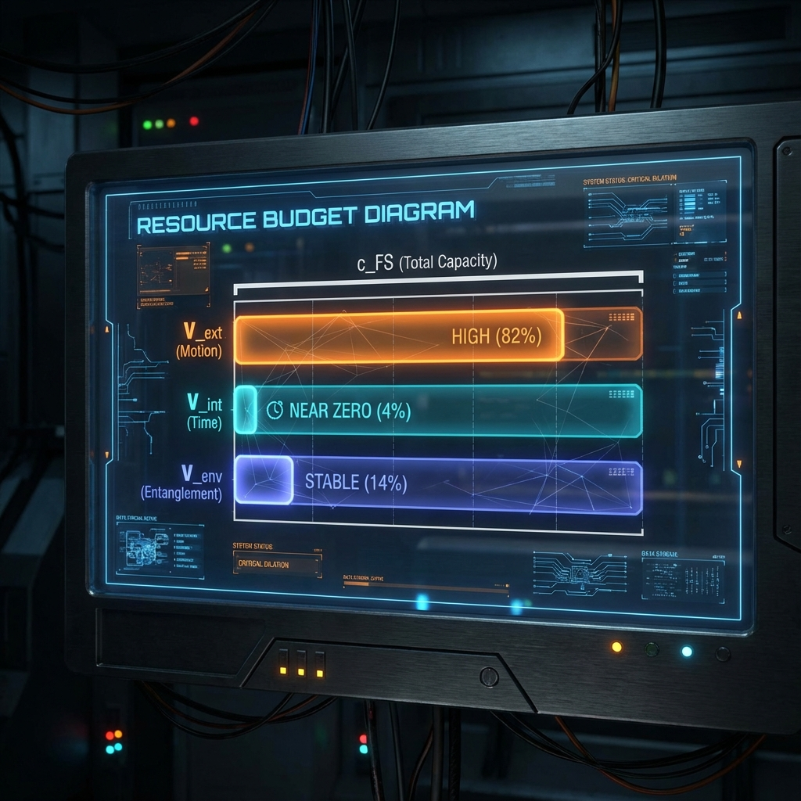

# 第1.1章：预算方程 (Chapter 1.1: The Budget Equation)

**—— 广义帕塞瓦尔恒等式 (The Generalized Parseval Identity)**

**"系统总吞吐量是恒定的。每一次位移，都是对计算资源的劫持。"**

---

## 1. 切丛的正交分解 (Orthogonal Decomposition of the Tangent Bundle)

在上一章中，我们通过公理 I 确立了宇宙的一个根本属性：状态演化的 Fubini-Study 总速率被硬编码为常数 **$c_{FS}$**。这提出了一个直接的问题：如果总速率是固定的，那么我们在宏观世界中观察到的千变万化的物理现象（如飞行的子弹、衰变的原子、纠缠的粒子）是如何产生的？

答案在于 **分配 (Allocation)**。

为了量化这种分配，我们需要深入到射影希尔伯特空间的几何结构中。在任意时刻 **$\tau$**，系统状态 **$[\psi(\tau)]$** 处的切空间 **$T_{[\psi]}P(\mathcal{H})$** 包含了该时刻所有可能的演化方向。我们将这个切空间分解为三个互不正交的线性子空间（Sectors），分别对应不同类别的物理自由度。

### 定义 1.1.1 (正交扇区分解)

假设系统的总希尔伯特空间 **$\mathcal{H}$** 上的演化是由不同的生成元集合驱动的。我们可以将切空间分解为：

$$T_{[\psi]}P(\mathcal{H}) = V_{ext} \oplus V_{int} \oplus V_{env}$$

其中：

* **$V_{ext}$ (外部扇区 / External Sector):** 由空间平移、旋转等生成元（如动量算符 **$\hat{P}$**）张成的子空间。由于动量算符关联着位置的变化，这个扇区对应于我们在经典物理中观测到的 **"外部运动"**。

* **$V_{int}$ (内部扇区 / Internal Sector):** 由粒子内部自由度的生成元（如静止质量哈密顿量 **$\hat{H}_{rest}$**、自旋、规范荷）张成的子空间。这个扇区对应于粒子的 **"固有属性演化"**，在宏观上体现为固有时（Proper Time）的流逝。

* **$V_{env}$ (环境扇区 / Environmental Sector):** 当我们将系统视为开放系统时，涉及与辅助环境自由度相互作用的生成元所张成的子空间。这个扇区对应于 **"量子纠缠"** 的建立和信息的泄漏。

相应地，描述宇宙总演化的速度矢量 **$\dot{\psi}(\tau)$** 可以唯一地投影分解为三个分量：

$$\dot{\psi}(\tau) = \dot{\psi}_{ext}(\tau) + \dot{\psi}_{int}(\tau) + \dot{\psi}_{env}(\tau)$$

并且我们需要保证这些分量在 Fubini-Study 度规意义下是正交的，即 **$\langle \dot{\psi}_{\alpha} | \dot{\psi}_{\beta} \rangle_{FS} = 0$** (当 **$\alpha \neq \beta$**) 。这通常由底层生成元的对易性质或特定的状态结构来保证。

## 2. 定理：广义帕塞瓦尔恒等式 (Theorem: The Generalized Parseval Identity)

基于 Fubini-Study 度规的黎曼几何性质以及上述的正交结构，我们导出了本书最核心的动力学方程，它构成了相对论和量子力学统一的几何基础。

### 定理 1.1 (广义帕塞瓦尔恒等式)

宇宙的瞬时演化速度分量严格满足以下二次型守恒律：

$$v_{ext}^2(\tau) + v_{int}^2(\tau) + v_{env}^2(\tau) \equiv c_{FS}^2$$

其中 **$v_{\alpha}(\tau) := ||\dot{\psi}_{\alpha}(\tau)||_{FS}$** 表示在 **$\alpha$** 扇区中的瞬时 FS 速率。

**证明 (Proof)：**

1. **前提引入：** 根据 **公理 I**，全微分切向量的总 Fubini-Study 模长是恒定的，即 **$||\dot{\psi}(\tau)||_{FS}^2 = c_{FS}^2$**。

2. **线性分解：** 将速度矢量代入，**$\dot{\psi} = \dot{\psi}_{ext} + \dot{\psi}_{int} + \dot{\psi}_{env}$**。

3. **内积展开：** 计算模长平方：

   $$||\dot{\psi}||_{FS}^2 = \langle \dot{\psi}_{ext} + \dot{\psi}_{int} + \dot{\psi}_{env}, \dot{\psi}_{ext} + \dot{\psi}_{int} + \dot{\psi}_{env} \rangle_{FS}$$

4. **正交性利用：** 由于我们定义各扇区 **$V_{\alpha}$** 是互不正交的，所有交叉项（如 **$\langle \dot{\psi}_{ext}, \dot{\psi}_{int} \rangle_{FS}$**）均为零。

5. **勾股定理：** 剩下的只有自相互作用项，即各分量模长的平方和：

   $$||\dot{\psi}||_{FS}^2 = ||\dot{\psi}_{ext}||_{FS}^2 + ||\dot{\psi}_{int}||_{FS}^2 + ||\dot{\psi}_{env}||_{FS}^2$$

6. **结论：** 代入公理 I 的条件，即得证 **$v_{ext}^2 + v_{int}^2 + v_{env}^2 = c_{FS}^2$**。

## 3. 诠释：计算资源的零和博弈 (Interpretation: The Zero-Sum Game)

这个方程不仅仅是一个优雅的几何恒等式，它是支配物理现实的 **底层经济学原理**。它揭示了物理学中的"不可能三角"：位置的变化、时间的流逝和信息的纠缠，实际上是在 **竞争** 同一个有限的资源池。

我们将 **$c_{FS}^2$** 解释为 **"信息-速度预算" (Information-Velocity Budget)**。

* **$v_{ext}$ (空间带宽开销):** 这是系统为了更新物体在外部空间中的位置坐标所消耗的算力。

* **$v_{int}$ (内部计算开销):** 这是系统为了维持物体内部量子态（如相位因子）演化所消耗的算力。在宏观上，这对应于 **质量** 的存在和 **固有时间** 的流逝。

* **$v_{env}$ (网络通信开销):** 这是系统为了处理与环境的相互作用（建立纠缠）所消耗的算力。

这个恒等式强制执行了一种 **零和博弈 (Zero-Sum Game)**：

你不能拥有一切。如果你想在空间中跑得快（增加 **$v_{ext}$**），你必须从其他地方挪用预算。通常，这部分预算是从 **$v_{int}$** 中扣除的。

### 推论 1.1.1 (狭义相对论的几何重构)

对于一个孤立系统（忽略环境纠缠，设 **$v_{env} \approx 0$**），方程简化为：

$$v_{ext}^2 + v_{int}^2 = c_{FS}^2$$

这解释了 **时间膨胀 (Time Dilation)** 的物理机制。

当一个粒子在空间中加速（**$v_{ext} \uparrow$**）时，为了维持等式平衡，其内部演化速率 **$v_{int}$** **必须** 减小。

当 **$v_{ext}$** 趋近于极限 **$c_{FS}$** 时，**$v_{int}$** 被迫趋近于 0。这就是为什么光子（Massless Particles）不经历时间——它们是 **"计算破产" (Computationally Bankrupt)** 的实体，它们把所有的预算都花在了传播上，没有剩余的资源来维护内部时钟。

---

## 架构师注解 (The Architect's Note)

### 关于：单核 CPU 的多线程调度 (Multithreading on a Single Core)

我们可以把宇宙想象成一颗 **单核 CPU**，其时钟频率对应于 **$c_{FS}$**。在这颗 CPU 上，运行着三个主线程：

1. **I/O 线程 ($v_{ext}$):** 负责搬运数据（改变位置）。

2. **Worker 线程 ($v_{int}$):** 负责处理业务逻辑（演化内部状态，即经历时间）。

3. **Network 线程 ($v_{env}$):** 负责与其他节点同步（纠缠）。

广义帕塞瓦尔恒等式告诉我们：**由于总线带宽是锁死的，这三个线程必须分时复用或者竞争资源。**

* **静止状态 (Idle):** I/O 线程挂起（**$v_{ext}=0$**）。所有的算力都分给了 Worker 线程（**$v_{int}=c_{FS}$**）。此时，你的内部时钟走得最快，你的"存在感"（质量）最强。

* **满载传输 (Full Load):** 就像光子一样，I/O 线程占满了所有带宽（**$v_{ext}=c_{FS}$**）。Worker 线程被完全 **饿死 (Starved)** （**$v_{int}=0$**）。对于光子来说，它被发射的那一刻和它被吸收的那一刻，在它自己的参考系里是同时发生的，因为它没有执行过任何一次"内部时钟中断"。

* **动钟变慢:** 这不是什么神秘的时空弯曲，这只是 **资源调度器 (Scheduler)** 的基本逻辑。当你跑动时，系统为了处理你位移产生的数据流，被迫 **降频 (Throttle)** 了你的内部时钟。物理学，本质上就是宇宙操作系统的 **QoS (服务质量)** 策略。
