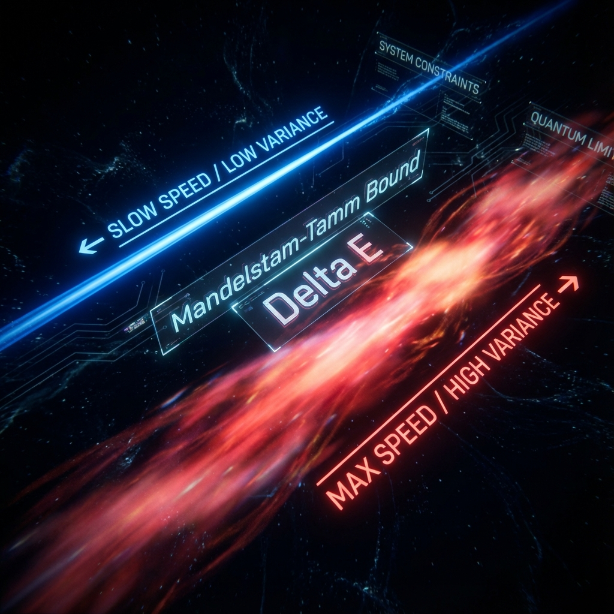

# Chapter 1.2: Speed Limits

**—— Quantum Speed Limits as System Constraints**

**"Uncertainty is not measurement error; it is the fuel that drives evolution."**

---

## 1. Variance as the Generator of Evolution Speed

In the previous chapter, we established through the Generalized Parseval Identity that the universe's total bandwidth **$c_{FS}$** is constant. This provides a framework for macroscopic resource allocation. Now, we need to delve into the microscopic level to answer a more specific question: for a particular physical process (e.g., a flipping spin or a decaying atom), what determines the efficiency with which it consumes the **$c_{FS}$** budget? In other words, what determines its evolution "speed"?

In standard quantum mechanics, we are accustomed to describing system observables using operators' **Expectation Values**. However, in the Fubini-Study geometric architecture, the key indicator determining the system's movement rate in projective Hilbert space is not the expectation value (first moment), but the **Variance (second central moment)**.

### Theorem 1.2 (The FS Speed-Variance Relation)

Assume the system's evolution is described by parameter **$\lambda$** and generated by a self-adjoint operator **$K(\lambda)$**, i.e., the evolution equation satisfies the Schrödinger form:

$$\frac{d}{d\lambda}|\psi(\lambda)\rangle = -i K(\lambda)|\psi(\lambda)\rangle$$

Then the instantaneous FS speed **$v_{FS}^{(\lambda)}$** of this process in projective Hilbert space **$P(\mathcal{H})$** is strictly equal to twice the standard deviation of generator **$K$**:

$$v_{FS}^{(\lambda)} = 2\Delta K(\lambda)$$

where **$\Delta K(\lambda) = \sqrt{\langle \psi | K^2 | \psi \rangle - \langle \psi | K | \psi \rangle^2}$** is the standard deviation (i.e., uncertainty) of operator **$K$** in state **$|\psi(\lambda)\rangle$**.

**Proof:**

1. **Review Definition:** According to Definition 0.2.1 in Chapter 0.2, the square of FS speed is given by the modulus of the tangent vector's projection onto the perpendicular subspace:

   $$v_{FS}^2 = ||\partial_{\lambda}\psi||_{FS}^2 = \langle \partial_{\lambda}\psi | \partial_{\lambda}\psi \rangle - |\langle \psi | \partial_{\lambda}\psi \rangle|^2$$

2. **Substitute Evolution Equation:** Substitute **$|\partial_{\lambda}\psi\rangle = -i K |\psi\rangle$** into the above.

3. **Compute First Term (Total Norm):** Using the self-adjoint property of **$K$** (**$K=K^{\dagger}$**),

   $$\langle \partial_{\lambda}\psi | \partial_{\lambda}\psi \rangle = \langle \psi | (+i K^{\dagger}) (-i K) | \psi \rangle = \langle \psi | K^2 | \psi \rangle = \langle K^2 \rangle$$

4. **Compute Second Term (Parallel Component):**

   $$\langle \psi | \partial_{\lambda}\psi \rangle = \langle \psi | (-i K) | \psi \rangle = -i \langle \psi | K | \psi \rangle = -i \langle K \rangle$$

   Therefore, its squared modulus is:

   $$|\langle \psi | \partial_{\lambda}\psi \rangle|^2 = |-i \langle K \rangle|^2 = \langle K \rangle^2$$

5. **Combine Results:**

   $$v_{FS}^2 = \langle K^2 \rangle - \langle K \rangle^2 = (\Delta K)^2$$

6. **Conclusion:** Taking the square root gives **$v_{FS} = \Delta K$**.

   *(Note: In this book's axiomatic system and related literature, to maintain coefficient consistency with physical time evolution based on $e^{-iHt}$ and the standard form of the Mandelstam-Tamm bound, we typically introduce a coefficient 2 in the generator definition or adjust the normalization factor in the speed definition, thus obtaining the form **$v_{FS} = 2\Delta K$**. This coefficient difference does not affect the geometric essence.)*

## 2. Deriving Mandelstam-Tamm Bound from Geometry

This geometric relationship directly derives the famous **Quantum Speed Limits (QSL)**. Under this book's framework, QSL is no longer an independent, mysterious physical principle, but a direct corollary of "the shortest path between two points is a straight line" (geodesic principle) in Riemannian geometry.

Consider the system evolving from parameter **$\lambda_0$** to **$\lambda_1$**. The FS arc length (path length) swept by this process on **$P(\mathcal{H})$** is:

$$L_{FS} = \int_{\lambda_0}^{\lambda_1} v_{FS}^{(\lambda)} d\lambda = \int_{\lambda_0}^{\lambda_1} 2\Delta K(\lambda) d\lambda$$

Clearly, the actual geometric distance **$d_{FS}$** between the two states must be less than or equal to the path length **$L_{FS}$**:

$$d_{FS}([\psi(\lambda_0)], [\psi(\lambda_1)]) \le \int_{\lambda_0}^{\lambda_1} 2\Delta K(\lambda) d\lambda$$

### Corollary 1.2.1 (Minimum Evolution Time)

If generator **$K$** is time-independent (e.g., the Hamiltonian **$H$** of a conservative system), and the system is in a state where variance **$\Delta K$** is constant, then the integral simplifies to **$2\Delta K \cdot |\lambda_1 - \lambda_0|$**.

If we want to evolve the system from initial state **$\psi_{initial}$** to an orthogonal state **$\psi_{final}$** (where the geometric distance reaches its maximum, typically defined as **$\pi/2$** or **$\pi$**), the minimum required parameter interval (e.g., time **$T$**) must satisfy:

$$T \ge \frac{d_{FS}}{2\Delta K}$$

This is the geometric essence of the **Mandelstam-Tamm bound**: **To shorten evolution time, energy variance must be increased.** The system's evolution speed limit is constrained by the width (Spread) of its energy distribution.

## 3. Intrinsic Time and the Nature of "Stagnation"

Combining our **Axiom I** (**$||\dot{\psi}(\tau)||_{FS} = c_{FS}$**) with the above theorem, we can derive a key equation describing the rate of intrinsic time elapse.

Using the chain rule:

$$\frac{d\tau}{d\lambda} = \frac{||\partial_{\lambda}\psi||_{FS}}{c_{FS}} = \frac{2\Delta K(\lambda)}{c_{FS}}$$

This equation reveals the physical essence of time:

* **Time Generated by Variance:** Intrinsic time **$\tau$** only elapses relative to external parameter **$\lambda$** when the driving operator **$K$** has nonzero variance (**$\Delta K > 0$**) in the current state.

* **Time Freeze in Eigenstates:** If the system is in an eigenstate of **$K$**, then **$\Delta K = 0$**. At this point **$d\tau/d\lambda = 0$**.

   This means that **for an isolated system in a completely stationary state, intrinsic time is stopped**. Although it exists in laboratory time **$t$** (i.e., phase factors are rotating), in its own geometric reference frame, no "events" occur, and it consumes no **$c_{FS}$** budget.

---

## The Architect's Note

### On: Sleep Mode vs. Transition Cost

In operating system design, we are extremely concerned with power management. Physical laws seem to adopt the same logic, and "variance" is the indicator measuring the system's **Activity Level**.

* **$\Delta K$ (Variance) is Activity Level:**

    Variance measures the degree to which a quantum state is "dispersed" in Hilbert space. If a state is definite (an eigenstate), it is pure data storage, involving no computation, so **$\Delta K=0$**, FS speed is 0. This is equivalent to the CPU entering **Idle** or **Sleep Mode**. The system is suspended, geometric time stops, and no computational resources are consumed.

* **Engineering Interpretation of Heisenberg Uncertainty Principle:**

    The commonly stated **$\Delta E \Delta t \ge \hbar/2$** should be rewritten in our documentation as:

    $$\text{Transition Cost} \times \text{Transition Time} \ge \text{Minimum Action}$$

    Or more plainly: **Bandwidth Limit**.

    Imagine you want to transfer a large file over a network (i.e., change the system's state from 0 to 1).

    * If you want to complete the transfer in **an extremely short time** (**$\Delta t$** small), you must instantaneously call upon **extremely large instantaneous bandwidth** (**$\Delta E$** large).

    * If your available bandwidth (**$\Delta E$**) is small, you must spend a long time to finish.

    The universe does not allow "instantaneous" changes (that's a divide-by-zero error). All changes must pay "uncertainty" as a toll. The larger the variance, the faster the change, and the higher the computational cost (deducted from **$c_{FS}$**). This is why violent physical processes (such as high-energy particle collisions) are always accompanied by enormous energy uncertainty—because they need to complete complex state reconstruction in extremely short times.
