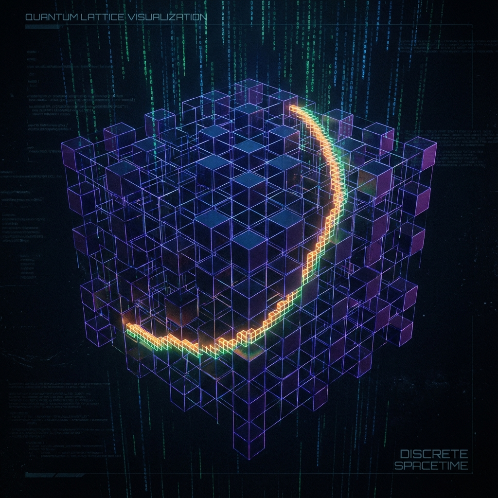

# Chapter 2.1: The Discrete Grid

**—— Quantum Cellular Automata as Machine Code**

**"There is no infinity, only grids. Continuity is an illusion at high resolution."**

---

## 1. The End of Continuity: From Smooth Manifolds to Lattices

In Volume I, we constructed a grand resource allocation framework through Fubini-Study geometry. However, the Hilbert space discussed there still implied some "continuity" assumption—we dealt with smooth differential equations **$\dot{\psi}(\tau)$** and continuous parameters **$\tau$**.

But from a systems engineering perspective, the true underlying layer must be **Discrete**. Any attempt to implement "infinite precision real numbers" on physical hardware leads to system crashes (such as singularities in physics or ultraviolet divergences in field theory). Therefore, to build a robust universe kernel, we need to lift the veil of continuity and reveal its microscopic digital logic circuits.

We introduce **Quantum Cellular Automata (QCA)** as the microscopic physical model implementing the FS skeleton. In this model, the universe is no longer a continuous fluid, but a vast, parallel-processing quantum bit array.

## 2. Mathematical Definition: Translation-Invariant Local QCA

We model the universe as a regularly arranged array of quantum processors.

### Definition 2.1.1 (The Lattice Structure)

Let **$\Lambda$** be a regular discrete lattice (e.g., integer lattice **$\mathbb{Z}^d$**). At each node **$x \in \Lambda$** of the lattice, attach a finite-dimensional Hilbert space **$\mathcal{H}_{cell}$** (called "cell space," e.g., **$\mathcal{H}_{cell} \simeq \mathbb{C}^q$**, meaning each point is a q-dimensional quantum system).

The global Hilbert space **$\mathcal{H}$** is the tensor product of all node spaces:

$$\mathcal{H} \simeq \bigotimes_{x \in \Lambda} \mathcal{H}_{cell}$$

### Definition 2.1.2 (The Evolution Operator)

The system's dynamics are no longer generated by a Hamiltonian **$H$**, but directly described by a global discrete-time update operator **$U$**. This operator must satisfy the following two strict engineering constraints:

1. **Locality:** Information propagation cannot span the entire network in one step. There exists a finite interaction radius **$r > 0$** such that for any operator **$\mathcal{A}_R$** supported on an arbitrary finite region **$R \subset \Lambda$**, its evolution **$U^\dagger \mathcal{A}_R U$** in the Heisenberg picture must be supported within the **$r$**-neighborhood **$R^{(+r)}$** of **$R$**. This means that in one update step, a cell's state can only affect its nearby neighbors.

   $$U \mathcal{A}_R U^\dagger \subset \mathcal{A}_{R^{(+r)}}$$

2. **Translation Invariance:** Physical laws are consistent everywhere in space. Let **$T_a$** be the translation operator on the lattice (shifting all cells in direction **$a$**), then **$U$** commutes with **$T_a$**:

   $$[U, T_a] = 0$$

The system's discrete-time evolution is given by the state sequence **$|\Psi_n\rangle$**, where **$n \in \mathbb{Z}$** is the discrete time step (Step Count):

$$|\Psi_n\rangle = U^n |\Psi_0\rangle$$

## 3. From Discrete Steps to Continuous Time

Microscopically, the universe "ticks" like a digital clock (**$n \to n+1$**). But on macroscopic scales, this discrete process smooths into the continuous time **$\tau$** we perceive. We need to establish the mapping relationship between discrete step number **$n$** and Fubini-Study continuous time **$\tau$**.

### Theorem 2.1 (Continuous Limit and Time Emergence)

In the continuous limit (i.e., when we coarsely observe many time steps), intrinsic time **$\tau$** can be regarded as the cumulative FS arc length of discrete update step sizes.

Define the **Unit Time Step** **$\Delta \tau$** as the Fubini-Study geometric distance between two adjacent discrete states in projective space:

$$\Delta \tau \approx d_{FS}([\Psi_{n+1}], [\Psi_n])$$

At this point, the relationship between continuous parameter **$\tau$** and discrete step number **$n$** is:

$$\tau = n \Delta \tau$$

To satisfy **Axiom I** (**$||\dot{\psi}||_{FS} = c_{FS}$**), we require that the microscopic update operator **$U$** be designed such that the geometric displacement produced by each update is statistically constant. This reveals the microscopic origin of physical constant **$c_{FS}$**: it encodes the **Per-step Information-Update Capacity**.

## 4. UV Cutoff: Fixing the Infinity Bug

The greatest engineering value of introducing QCA lies in providing a natural **Ultraviolet Cutoff**.

In continuous field theory, momentum **$p$** can take arbitrarily large values, causing integrals **$\int dp$** to diverge. But in QCA:

* **Momentum Limitation:** Since space is a discrete lattice **$\Lambda$**, the system's momentum space is no longer unbounded **$\mathbb{R}^d$**, but a compact **Brillouin Zone** (typically torus **$T^d$**). Wavelengths cannot be smaller than the lattice spacing.

* **Energy Limitation:** Since time evolution is discrete (driven by unitary operator **$U$**), the system's energy spectrum is confined to a finite bandwidth. No physical states with infinite energy exist.

This means the universe's resolution has an upper limit. In this architecture, "infinity" is treated as a logic error, replaced by the finite bandwidth of discrete grids. All scattering processes, phase windings, and topological indices are well-defined within this finite spectrum, completely eliminating the ultraviolet divergence problems plaguing quantum field theory.

---

## The Architect's Note

### On: Clock Cycles and Pixelation

Welcome to the underlying code of the "Matrix."

* **$U$ is the CPU instruction set:**

    That global unitary operator **$U$** is the "next frame rendering instruction" of the universe as a vast cellular automaton. It acts in parallel on all grid points, with simple, uniform rules. Each application of **$U$** is one **Tick** of the universe clock.

* **No Zeno's Paradox:**

    The ancient Greek philosopher Zeno worried about "the flying arrow is motionless" because time and space seemed infinitely divisible. QCA tells us: **Don't worry, because you can't cut it.** Space has minimum pixels (Planck length scale), time has minimum cycles (Planck time scale). The arrow is not moving continuously; it is "jumping" on pixel grids.

* **Why discretization is needed:**

    As an architect, if you allow the system to have infinite resolution, you must handle infinite information density, which is physically uneconomical (leading to black hole formation or entropy explosion) and computationally undecidable (halting problem).

    **Discretization is a necessary condition for stable system operation.** The smooth spacetime we see is like looking at an 8K screen. As long as you're far enough away, the pixels (QCA Cells) disappear, leaving only a perfect image (manifold). But never forget that the underlying layer consists of discrete LEDs flickering one by one.

