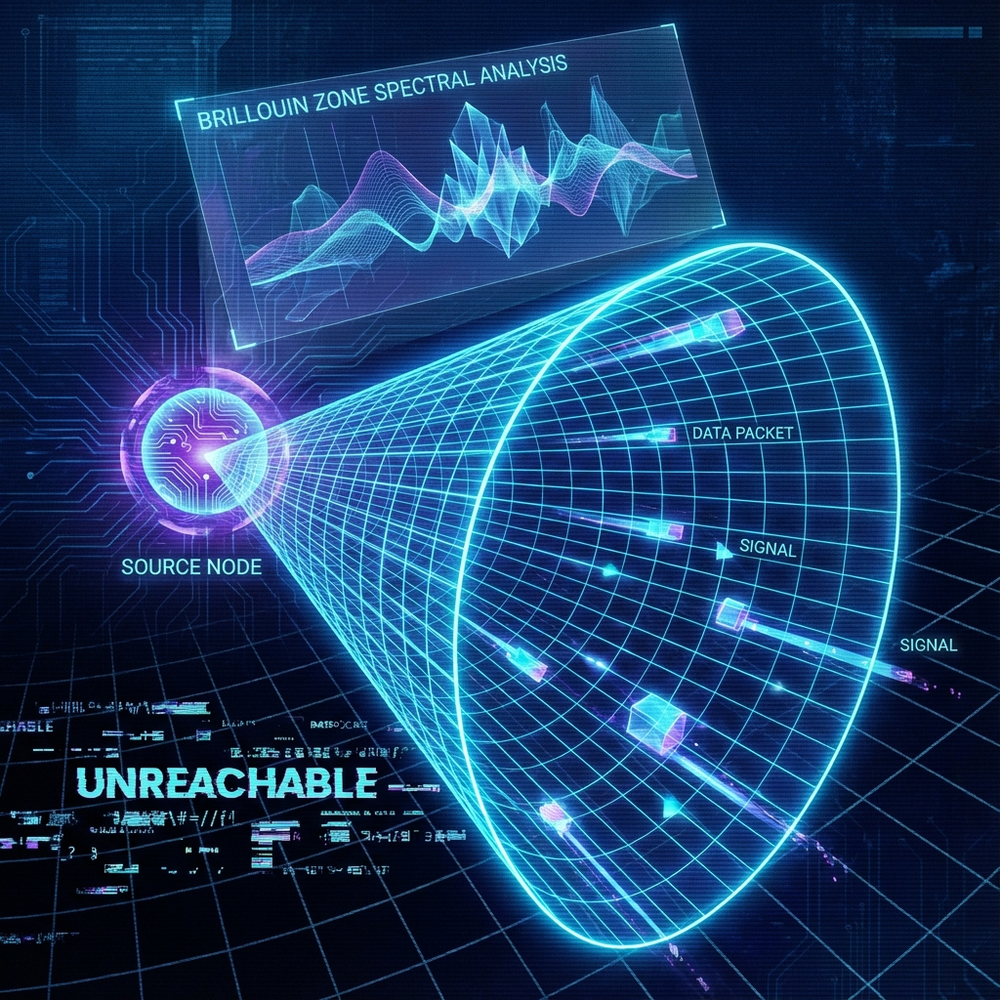

# 第2.2章：延迟与截断 (Chapter 2.2: Latency & Cutoffs)

**—— 信号完整性与自然正则化 (Signal Integrity and Natural Regularization)**

**"因果律不是哲学的铁律，它是局域网络传播的物理延迟。"**

---

## 1. 信号完整性：从局域性到光锥 (Signal Integrity: From Locality to Light Cones)

在上一章中，我们将宇宙的底层硬件定义为一个离散的量子元胞自动机（QCA）。既然每一个元胞（处理器）只能与其邻近的元胞直接交换数据，那么一个必然的推论随之产生：**信息无法瞬时跨越整个网络**。

在连续时空的旧观念中，光速 **$c$** 往往被视为一种神圣的几何预设，被硬编码在闵可夫斯基度规中。但在我们的微架构视角下，并没有预设的"光速"，也没有预设的"光锥"。我们拥有的只是 **局域相互作用 (Local Interactions)**，以及由此涌现出来的 **最大信号传播速度**。

这种由底层拓扑结构决定的信号延迟极限，在数学物理中被称为 **Lieb-Robinson 界限 (Lieb-Robinson Bounds)**。它是构建宇宙因果结构的第一块基石。

## 2. 定理：Lieb-Robinson 界限 (The Lieb-Robinson Bound)

为了量化信号的传播，我们需要考察一个局域扰动如何在晶格网络中扩散。

**设定：**

考虑定义在晶格 **$\Lambda$** 上的量子系统。设 **$X$** 和 **$Y$** 为晶格上的两个有限区域，且 **$A$** 和 **$B$** 分别是支撑在 **$X$** 和 **$Y$** 上的可观测算符（即 **$A$** 只作用于区域 **$X$** 的量子态，**$B$** 只作用于区域 **$Y$**）。

在 **$n=0$** 时刻，由于 **$X$** 和 **$Y$** 空间分离，这两个算符是对易的（**$[A, B] = 0$**）。这意味着在 **$X$** 处的测量不会干扰 **$Y$** 处的状态。

随着离散时间 **$n$** 的演化，算符 **$A$** 在海森堡绘景下变为 **$A(n) = U^{-n} A U^n$**。此时，**$A(n)$** 的支撑区域会逐渐扩大。

### 定理 2.2 (Lieb-Robinson 不等式)

存在正常数 **$C, \mu$** 和一个有限的速度 **$v_{LR}$**，使得对于任意 **$n \in \mathbb{Z}$**，对易子的范数满足以下上界：

$$|| [A(n), B] || \le C ||A|| \, ||B|| \exp\left(-\mu \left( \text{dist}(X, Y) - v_{LR} |n| \right)\right)$$

其中 **$\text{dist}(X, Y)$** 表示两区域在晶格上的最短距离。

**物理证明与解读：**

这个不等式的左边 **$|| [A(n), B] ||$** 衡量的是在时间 **$n$** 时，对区域 **$X$** 的操作是否能够被区域 **$Y$** 的观察者检测到（即两个操作是否不再对易）。

不等式的右边告诉我们：

1. **指数抑制 (Exponential Suppression)：** 只要距离 **$\text{dist}(X, Y)$** 大于 **$v_{LR} |n|$**，对易子的值就会以距离的指数级衰减。

2. **有效光锥 (Effective Light Cone)：** 我们可以定义一个线性区域 **$r = v_{LR} t$**。在这个区域之外（类空区域），信号强度实际上为零（或指数级微小）。

3. **速度上限：** **$v_{LR}$** 被称为 **Lieb-Robinson 速度**。它是由微观相互作用的强度和范围决定的。在连续极限下，这个 **$v_{LR}$** 直接对应于狭义相对论中的 **光速 $c$**。

结论：因果律（Causality）不是公理，而是 **局域相互作用网络的统计必然性**。

## 3. 自然正则化：布里渊区与有限带宽 (Natural Regularization)

现代物理学，尤其是量子场论，长期以来被 **"无穷大" (Infinities)** 所困扰。

当我们试图计算两个粒子在极短距离内的相互作用，或者计算真空的零点能时，积分往往会发散。这在软件工程中被称为 **资源溢出 (Resource Overflow)** 或 **无限递归错误**。

这种发散的根源在于连续性假设：如果不加限制，波长可以无限短（频率无限高），这意味着系统拥有无限的自由度。但在 **FS-QCA 架构** 中，这种假设被底层的离散结构彻底打破。

### 机制 A：动量空间的紧致化 (Brillouin Zone)

由于空间是离散的晶格 **$\Lambda$**（间距为 **$a$**），根据傅里叶变换原理，系统的动量空间不再是无界的 **$\mathbb{R}^d$**，而是一个拓扑上紧致的 **布里渊区 (Brillouin Zone)**，通常是环面 **$T^d$**。

动量 **$k$** 的取值范围被限制在：

$$-\frac{\pi}{a} \le k \le \frac{\pi}{a}$$

这意味着不存在比 **$2a$** 更短的波长。所有的动量积分 **$\int_{-\infty}^{\infty} dk$** 天然地被有限积分 **$\int_{-\pi/a}^{\pi/a} dk$** 所取代。

### 机制 B：能量上限 (Energy Cap)

由于时间演化是离散的，且由幺正算符 **$U$** 驱动，系统的能谱（准能量）也被限制在有限带宽内。不存在能量无限大的物理态。

**结论：**

QCA 为物理学提供了一个 **自然紫外正则化 (Natural Ultraviolet Regulator)**。

我们不需要人为地引入截断（Cutoff）然后令其趋于无穷。底层的网格尺寸本身就是物理上的硬截断。这彻底消除了困扰理论物理学界半个世纪的"紫外发散"问题，也使得黑洞熵等发散量的计算变得有限且有意义。所有的拓扑指数和几何相位在这个离散谱中都是良定义且稳定的。

---

## 架构师注解 (The Architect's Note)

### 关于：网络延迟与防崩溃机制 (Ping Limits and Crash Protection)

作为系统的架构师，我们在设计宇宙内核时必须处理两个核心风险：**信号冲突** 和 **系统崩溃**。

**1. $v_{LR}$ 就是宇宙的 Ping 值**

Lieb-Robinson 速度的存在告诉我们，全网瞬间广播（Action at a Distance）在物理上是不可能的。

如果节点 A 发生状态更新，节点 B 必须等待数据包经过中间节点的逐跳传输（Hop-by-Hop）。

* 这就是为什么我们在宏观上看到了"光锥"——它只是 **数据同步的必然延迟**。

* 超光速通讯之所以被禁止，是因为它违反了底层的 **路由协议**。如果你试图比 **$v_{LR}$** 更快地发送信息，你的数据包将在到达目的地之前丢失或因信噪比过低而不可读（指数衰减）。

**2. 蓝屏死机 (BSOD) 的预防**

传统量子场论允许波长无限短（频率无限高），这相当于允许一段代码申请无限的内存或执行无限深的递归。这必然导致系统崩溃（计算结果发散为无穷大）。

我们的架构通过 **像素化 (Pixelation)** 修复了这个严重的 Bug。

* 宇宙设定了 **最小分辨率**（晶格间距）。

* 当你试图探测比这更小的尺度时，你不会看到更深层的真理，你只会看到 **混叠效应 (Aliasing)** —— 就像在屏幕上放大一张低分辨率图片看到的马赛克。

**"无限"不仅在物理上不存在，在逻辑上也是不合法的。** 一个稳定的宇宙系统，必须是有限的，才能是可计算的。所有所谓的"奇点"或"发散"，不过是我们在使用错误的连续近似模型（外推到了布里渊区之外）时产生的数学伪影。在底层网格上，一切都是有限且平滑的。

