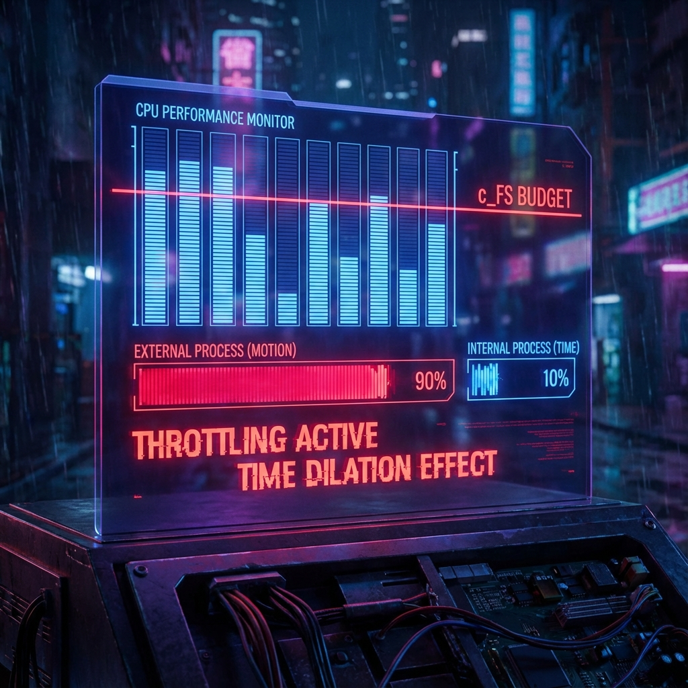

# 第3.1章：降频机制 (Chapter 3.1: Throttling Mechanisms)

**—— 狭义相对论的资源调度重构 (Reconstructing Special Relativity as Capacity Allocation)**

**"时间膨胀不是魔法，它是系统为了防止带宽溢出而执行的强制降频。"**

---

## 1. 运动学作为资源管理 (Kinematics as Resource Management)

在之前的章节中，我们确立了宇宙底层的"硬约束"：系统总吞吐量 **$c_{FS}$** 是恒定的，且微观因果速度 **$v_{LR}$** 限制了信号传播。现在，我们将进入 **虚拟化层 (Virtualization Layer)**。

这一层的任务是解释：为什么在这个底层离散、有限的系统中，我们宏观上会体验到像"狭义相对论"这样光滑且奇特的物理定律？

传统物理学将闵可夫斯基时空（Minkowski Spacetime）视为舞台背景，规定了光速不变和洛伦兹变换。但在我们的架构中，我们不需要预设这些。相对论效应将自然地从 **广义帕塞瓦尔恒等式**（第1.1章）中涌现出来。这就好比操作系统不需要专门编写"卡顿"的代码，卡顿只是当资源被耗尽时系统自然表现出的 **调度行为**。

## 2. 重构：从预算方程到洛伦兹因子 (Reconstruction: From Budget to Lorentz)

让我们回顾第一卷推导出的核心预算方程。对于一个忽略环境纠缠（**$v_{env} \approx 0$**）的孤立粒子，其 Fubini-Study 速度分量满足：

$$v_{ext}^2(\tau) + v_{int}^2(\tau) = c_{FS}^2$$

这个方程描述了 **"外部位移" ($v_{ext}$)** 与 **"内部演化" ($v_{int}$)** 之间的零和博弈。

为了将其映射到我们要重构的相对论物理量，我们做如下识别：

1. **宏观速度 $v$：** 对应于归一化的外部 FS 速度。即 **$v/c = v_{ext}/c_{FS}$**。这是粒子在空间网格中移动的速率。

2. **固有时间 $s$：** 对应于归一化的内部 FS 演化。粒子的"存在感"（质量、相位旋转）完全由 **$v_{int}$** 驱动。因此，固有时间的流逝率 **$ds/d\tau$** 正比于 **$v_{int}$**。

将上述识别代入预算方程：

$$(c \cdot \frac{v_{ext}}{c_{FS}})^2 + v_{int}^2 = c_{FS}^2$$

为了求出内部演化速率 **$v_{int}$**，我们重排方程：

$$v_{int} = \sqrt{c_{FS}^2 - v_{ext}^2} = c_{FS} \sqrt{1 - \frac{v_{ext}^2}{c_{FS}^2}}$$

如果我们将 **$v_{ext}$** 视为宏观观测到的空间速度 **$v$**（在单位制适配后），那么内部演化速率与静止速率（**$c_{FS}$**）的比值为：

$$\frac{v_{int}}{c_{FS}} = \sqrt{1 - \frac{v^2}{c^2}}$$

这正是狭义相对论中著名的 **洛伦兹收缩因子** 的倒数（**$1/\gamma$**）。

## 3. 时间膨胀的机制：CPU 降频 (Mechanism of Time Dilation: CPU Throttling)

在标准相对论中，我们说"运动的钟走得慢"（**$dt = \gamma ds$**）。在 FS 几何架构中，这个现象得到了极其直观的物理级解释。

* **静止状态 (Rest State):**

    当粒子在空间中静止（**$v_{ext} = 0$**）时，它独占了所有的系统带宽。

    **$v_{int} = c_{FS}$**。

    此时，内部时钟全速运行，固有时间 **$s$** 的流逝与系统时间 **$\tau$** 同步。

* **运动状态 (Moving State):**

    当粒子加速到速度 **$v$** 时，它强行征用了部分带宽 **$v_{ext}$** 用于处理位移数据。

    根据预算方程，系统必须强制减少分配给 **$v_{int}$** 的算力。

    **$v_{int} = c_{FS} / \gamma$**。

    内部时钟被迫 **降频 (Throttle)**。粒子"经历"的时间变慢了，不仅是因为观测效应，而是因为驱动它演化的 **有效算力** 真的减少了。

* **光速极限 (Light Speed Limit):**

    当 **$v \to c$** 时，意味着 **$v_{ext} \to c_{FS}$**。

    此时 **$v_{int} \to 0$**。

    系统带宽被耗尽，不再有任何资源分配给内部演化。对于光子而言，内部时钟彻底停摆，时间停止流逝。这也解释了为什么光子没有静止质量（质量是维持内部演化的成本，详见下一章）。

## 4. 固有时与系统时的虚拟化分离 (Separation of Proper and System Time)

至此，我们完成了时间的 **虚拟化**。

* **系统时间 (System Time, $\tau$):** 是底层的硬件计数器，即 FS 弧长。它是绝对的、单调递增的，由 **$c_{FS}$** 驱动。所有物体（无论运动与否）都共享这个底层的刷新率。

* **固有时间 (Proper Time, $s$):** 是运行在对象内部的虚拟时钟。它是 **$\tau$** 在内部扇区 **$V_{int}$** 上的投影长度。

两者的关系由微分几何中的投影公式给出：

$$ds = \frac{v_{int}}{c_{FS}} d\tau = \sqrt{1 - \beta^2} d\tau$$

狭义相对论不再是关于时空几何的公理体系，而是关于 **如何在有限带宽约束下调度内部与外部进程** 的管理策略。洛伦兹变换（Lorentz Transformation）正是这种资源守恒在不同参考系之间的坐标变换法则。

---

## 架构师注解 (The Architect's Note)

### 关于：降频 (Throttling) 与服务质量 (QoS)

作为系统设计者，我们经常面临这样的场景：CPU 只有一颗，但任务有两个——渲染高帧率的游戏画面（**$v_{ext}$**）和运行后台的逻辑计算（**$v_{int}$**）。

当玩家疯狂移动视角（高速运动）时，GPU/CPU 负载激增。为了防止过热或崩溃（即防止 **$v_{total} > c_{FS}$**），系统内核会执行 **Throttling (降频)** 策略：暂时挂起或减慢后台逻辑线程。

* **宏观表现：** 玩家看到画面流畅（位移很快），但后台的 AI 反应变迟钝了（时间变慢）。

* **物理映射：** 这就是动钟变慢。你跑得越快，宇宙分配给你用来"变老"的计算资源就越少。

**这就是为什么不可能超光速：**

这不仅仅是速度的问题，这是 **死锁 (Deadlock)** 问题。当 **$v_{ext} = c_{FS}$** 时，资源池已空。想要超光速（**$v_{ext} > c_{FS}$**），意味着你需要向系统申请超过 100% 的 CPU 时间，这会直接抛出 `ResourceOverflowException` 并被内核拦截。宇宙的稳定性依赖于这个无情的调度器。

