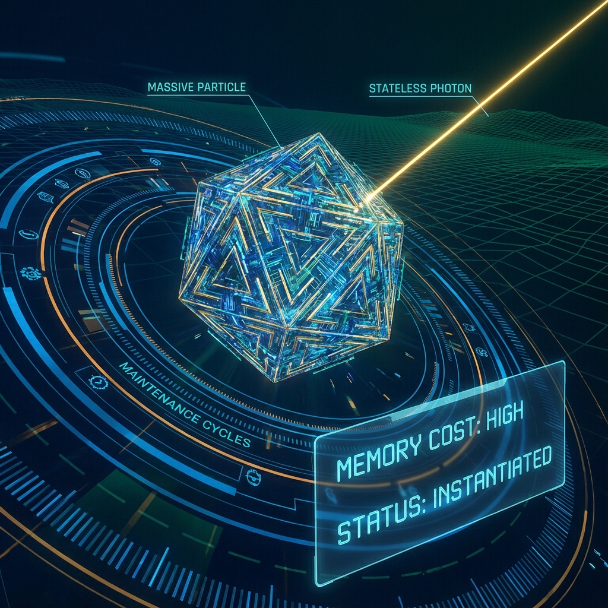

# Chapter 3.2: Object Overhead

**—— Mass as Internal Computation Cost**

**"Mass is not the weight of matter; it is the continuous computational power the system pays to maintain an object's 'existence'."**

---

## 1. The Price of Existence: What is Mass?

In the previous chapter, we reconstructed special relativity as a resource scheduling strategy: external motion (**$v_{ext}$**) must be achieved by appropriating bandwidth from internal evolution (**$v_{int}$**). This naturally raises a deeper question: what exactly is "internal evolution" computing? In the macroscopic physical world, what physical entity does this **$v_{int}$** correspond to?

The answer may surprise you: **$v_{int}$ is Mass**.

In traditional conception, mass is regarded as a static property of objects—a scalar describing "how much matter there is." But in our Fubini-Study geometric architecture, **nothing is static**. All physical properties are projections of underlying dynamic processes.

### Definition 3.2.1 (Geometric Definition of Mass)

For a particle at rest (**$v_{ext}=0$**), according to the budget equation, it must run its internal processes at full rate: **$v_{int} = c_{FS}$**.

This high-speed internal state refresh manifests in quantum mechanics as phase rotation of the wave function:

$$\psi(\tau) \sim e^{-i \omega_{int} \tau}$$

The frequency **$\omega_{int}$** of this internal oscillation is precisely what we macroscopically measure as **Rest Mass**.

According to the fundamental quantum mechanical relation **$E = \hbar \omega$** and relativistic **$E = mc^2$**, we can establish a direct mapping between mass and geometric velocity:

$$m \propto \text{Rate of Internal Rotation} (v_{int})$$

Therefore, mass is not a pile of accumulated atoms; it is **the computational cost the system consumes to continuously refresh the object's current quantum state (existence)**.

## 2. The Cost of State: Reconstructing $E=mc^2$

Why does the famous mass-energy equation **$E=mc^2$** exist? In our architecture, this is no longer a mysterious equality, but a conversion protocol between **Bandwidth (Energy)** and **Overhead (Mass)**.

Let us re-examine the budget allocation in the rest frame:

1. **Total Budget:** **$c_{FS}$** (or **$c$** in physical units). This is the maximum evolution capacity the system can provide.

2. **Internal Overhead:** All budget is invested in **$v_{int}$**.

If we define "energy" **$E$** as the total generator of system evolution (i.e., total computational power called by the system), and "mass" **$m$** as the generator of internal evolution (i.e., computational power maintaining object existence), then for a stationary object:

$$\text{Total Capacity} = \text{Internal Cost}$$

$$E_{rest} = m c^2$$

**The Nature of Inertia:**

Why are massive objects (**$m > 0$**) difficult to accelerate?

Not because they are "heavy," but because they are **busy**.

A massive particle means its internal processes occupy enormous bandwidth (**$v_{int}$** is large). To make it move in space (increase **$v_{ext}$**), the system scheduler must perform expensive **Context Switching**: it must forcibly change the underlying resource allocation vector, stripping computational power from internal maintenance tasks and transferring it to external I/O tasks.

This **resistance to changing resource allocation configuration** is what we macroscopically perceive as **Inertia**. The larger the mass, the more complex the internal processes, and the higher the cost for the scheduler to reallocate resources.

## 3. Optimization: Stateless Packets

If mass is the overhead of maintaining internal state, can we create a **"zero-mass"** object?

In software engineering, this corresponds to the **Stateless** design pattern.

**The Photon:**

Photons are **stateless data packets** optimized to the extreme in the universe system.

* **$m = 0$:** This means it requires no computational power to maintain "self" existence or internal evolution.

* **$v_{int} = 0$:** Its internal clock forever points to 0. It experiences no time, undergoes no decay, produces no aging.

* **$v_{ext} = c_{FS}$:** According to the Generalized Parseval Identity **$v_{ext}^2 + v_{int}^2 = c_{FS}^2$**, since **$v_{int}=0$**, photons must propagate in space at **full bandwidth** (i.e., light speed).

**Conclusion:**

Photons must move at light speed not because something pushed them, but because they are **pure information flow**. They have no internal logic to process; to avoid wasting bandwidth, the system forces their I/O rate to maximum. In FS geometry, photon trajectories are special limits of **geodesics** in projective space—they evolve only in the external sector (momentum space) and are completely stationary in the internal sector.

---

## The Architect's Note

### On: Instantiation vs. Serialization

To help programmers understand the difference between "mass" and "photons," we can use object-oriented programming (OOP) as an analogy.

* **Massive Particle = Instantiated Object**

    When you `new` a complex object (like `UserSession`), it occupies space in memory. You need CPU cycles to maintain its properties (heartbeat packets, state synchronization, garbage collection).

    This **"maintenance cost"** is **Mass**.

    Because the object is "heavy" (occupies many resources), when you transmit it over the network (move it), you must first package it, and it's difficult to make it run very fast.

* **Photon = Serialized Data Stream / JSON**

    A photon is not a living "object"; it's just a serialized binary data string (JSON string).

    It has no "state" (State), requires no CPU maintenance (Mass = 0).

    Its sole mission is to transmit over the network (space).

    Because it's pure data with no runtime overhead, it can (and must) transmit at the **maximum rate allowed by the line** (light speed/bandwidth).

**Physics Insight:**

The universe's underlying code achieves performance balance through this distinction. It allows "heavy" matter to build stable structures (galaxies, life), while utilizing "light" photons for high-speed information synchronization. **$E=mc^2$** is actually a **Resource Conversion Protocol**: it tells us that if you destroy an object (annihilate mass), you can release how much bandwidth (energy) to become pure data flow (photons).

