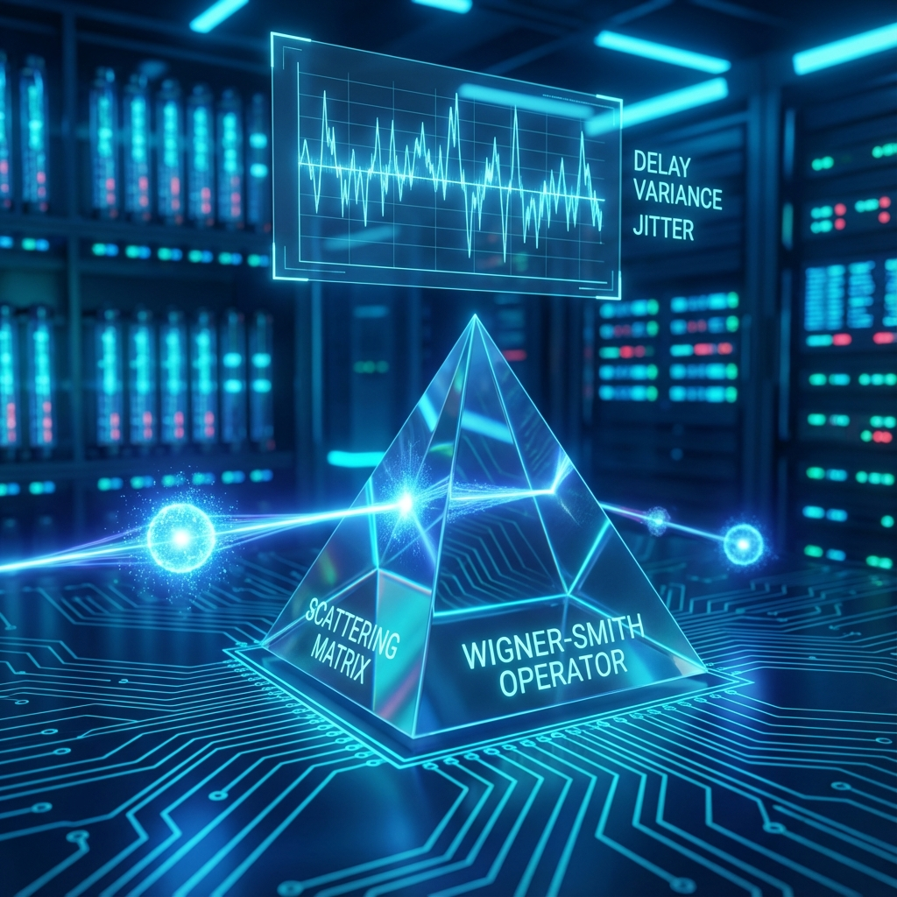

# Chapter 4.1: Geometry in Energy Space

**—— The Wigner-Smith Operator and Delay Variance**

**"Every interaction is a network request with latency. The jitter of delay defines your movement speed in energy space."**

---

## 1. Scattering as System I/O

In previous volumes, we discussed internal resource management (relativity) and underlying micro-architecture (QCA). Now, we turn our attention to **Interaction**. In particle physics, the most basic form of interaction is **Scattering**.

In the Fubini-Study geometric architecture, we reconstruct the scattering process as a standard **Input/Output (I/O)** operation.

* **Input State ($|\chi_{in}\rangle$):** Data packet sent by the client (incident particle).

* **Scattering Matrix ($S$ Matrix):** Server-side processing logic (interaction potential).

* **Output State ($|\chi_{out}\rangle$):** Data packet returned by the server (outgoing particle).

The core question we focus on is: when the system's energy (input parameter) changes slightly, how much does the output result change geometrically? This rate of change not only reveals the nature of interactions but also directly defines "time delay" in the microscopic world.

## 2. Mathematical Definition: The Wigner-Smith Time Delay Operator

In scattering theory, the scattering matrix $S(\omega)$ is a unitary operator depending on energy $\omega$, mapping incident channel states to outgoing channel states:

$$|\chi_{out}(\omega)\rangle = S(\omega) |\chi_{in}(\omega)\rangle$$

To quantify how drastically $S(\omega)$ changes with energy, we introduce the **Wigner-Smith Time Delay Operator** $Q(\omega)$.

### Definition 4.1.1 (Wigner-Smith Operator)

$$Q(\omega) := -i S(\omega)^{\dagger} \frac{d S(\omega)}{d\omega}$$

This is a Hermitian (self-adjoint) operator.

**Physical Meaning:**

In single-channel scattering, $S(\omega) = e^{2i\delta(\omega)}$, where $\delta(\omega)$ is the scattering phase shift. At this point, $Q(\omega)$ reduces to a scalar function:

$$Q(\omega) = -i e^{-2i\delta} (2i \delta' e^{2i\delta}) = 2 \frac{d\delta}{d\omega}$$

According to wave packet group velocity theory, $2d\delta/d\omega$ is precisely the **Time Delay** for which the wave packet lingers in the scattering region.

Therefore, $Q(\omega)$ is a generalized operator measuring the "phase-energy" response rate caused by the scattering process.

## 3. Theorem: FS Speed is Delay Variance

Now, we connect this scattering operator with our **Fubini-Study Geometry**.

We regard energy $\omega$ as the parameter $\lambda$ driving system evolution. If moving along the energy axis, how fast does the scattering state $|\chi(\omega)\rangle$ "run" in projective Hilbert space?

### Theorem 4.1 (FS Speed in Energy Space)

Assume the evolution of scattering states with energy is generated by the Wigner-Smith operator, satisfying the local evolution equation (in appropriate gauge):

$$\frac{\partial}{\partial \omega} |\chi(\omega)\rangle = -\frac{i}{2} Q(\omega) |\chi(\omega)\rangle$$

Then the **FS Speed** $v_{FS}(\omega)$ of this state along the energy axis in projective Hilbert space is strictly equal to the **Standard Deviation** (square root of variance) of the Wigner-Smith operator:

$$v_{FS}(\omega) = \Delta Q(\omega) = \sqrt{\langle Q^2 \rangle - \langle Q \rangle^2}$$

*(Note: Depending on definition conventions, sometimes expressed as $v_{FS} = 2\Delta K$, where $K=Q/2$, hence $v_{FS}=\Delta Q$. The core point is that speed is proportional to the fluctuation of the delay operator.)*

**Proof Outline:**

This conclusion directly applies the "speed-variance relation" from **Chapter 1.2**.

1. The generator is $K = Q/2$.

2. According to Theorem 1.2, $v_{FS} = 2\Delta K$.

3. Substituting gives $v_{FS} = 2\Delta(Q/2) = \Delta Q$.

### Corollary 4.1.1 (No Delay Fluctuation Means No Geometric Evolution)

If the system is in an eigenstate of $Q$ (e.g., single-channel scattering, or identical delays across channels in multi-channel), then $\Delta Q = 0$, meaning $v_{FS}(\omega) = 0$.

This reveals a profound geometric fact: **For pure phase-shift processes of a single mode, they are stationary in projective space.**

Only when the incident state is a superposition of multiple channels, and different channels have **inconsistent time delays** (i.e., there exists **Delay Jitter**), will the scattering state undergo geometric deflection as energy changes.

## 4. Association Between Geometric Distance and Bandwidth

This theorem provides us with a method to measure time delay through geometric distance. For a narrow wave packet with finite bandwidth $\sigma$, the distance $D_{FS}$ between its input and output states in FS space is approximately:

$$D_{FS} \approx |T_{WS}(\omega_0)| \cdot \sigma$$

where $T_{WS}$ is the average time delay at the central energy.

This means: **Time delay is the product of geometric distance in energy space and bandwidth.**

---

## The Architect's Note

### On: Network Latency and Jitter

As system architects, we regard scattering experiments as **API calls** to the universe server.

* **$S(\omega)$ is the Service Endpoint:** You give it an input (incident wave), it gives you an output (outgoing wave).

* **$Q(\omega)$ is the Latency Monitor:** It tells us how long it took to process this request.

* **$\Delta Q$ (Variance) is Network Jitter:**

    This is the most crucial insight of this chapter.

    If your request packet contains only a single frequency (single channel), the server's processing time is fixed ($\Delta Q=0$). Although there is delay, the output signal is simply "a bit late," with no deformation in data structure (geometric shape).

    But if your request packet is a complex broadband signal (multi-channel superposition), and the server processes different frequencies at different speeds (dispersion), then $\Delta Q > 0$. This causes **distortion** in the output signal.

**Physical Essence of FS Speed:**

In energy space, **"speed" is "distortion rate"**.

If $v_{FS}$ is large, it means that with tiny energy changes, the system's response undergoes massive structural changes. This typically occurs near **Resonance**—when the server is under high load, delay is extremely unstable, and any tiny frequency perturbation causes dramatic jumps in output results.

