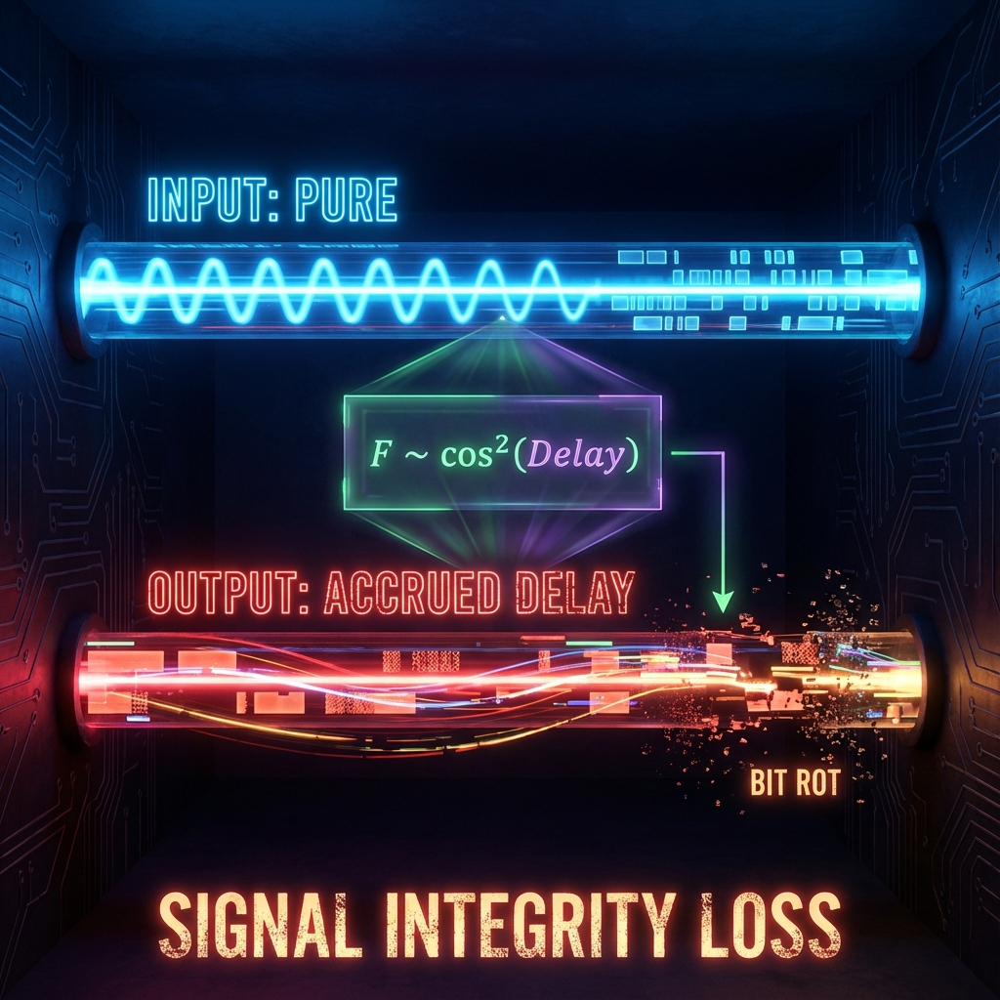

# 第4.2章：数据保真度 (Chapter 4.2: Data Fidelity)

**—— 延迟-保真度权衡协议 (The Delay-Fidelity Trade-off Protocol)**

**"任何偏离基准时钟的响应，无论是迟到还是早退，都是对原始信号的扭曲。"**

---

## 1. 保真度：信号完整性的度量 (Fidelity as Signal Integrity)

在上一章中，我们建立了能量空间中的 FS 几何，并发现散射过程中的 **时间延迟 (Time Delay)** 本质上是系统状态在射影空间中移动的距离。

现在，我们面临一个更实际的工程问题：当宇宙服务器（散射中心）处理一个数据包（波包）时，如果处理时间过长（大延迟）或者处理逻辑异常（负延迟），输出的数据包还能保持原样吗？

在量子信息与通信中，我们使用 **保真度 (Fidelity, $F$)** 来衡量两个量子态的相似程度。对于纯态 $|\Psi_{in}\rangle$ 和 $|\Psi_{out}\rangle$，保真度定义为它们重叠模的平方：

$$F = |\langle \Psi_{in} | \Psi_{out} \rangle|^2$$

在几何架构下，保真度与 Fubini-Study 距离 $D_{FS}$ 存在直接的三角关系：

$$D_{FS} = \arccos \sqrt{F} \quad \text{或者} \quad F = \cos^2(D_{FS})$$

这意味着，**任何非零的几何位移（即非零的 FS 距离），必然导致保真度的下降（$F < 1$）。**

## 2. 窄带分析：波包的几何演化 (Narrow-Band Analysis)

为了得到可实验验证的预测，我们考察最常见的物理场景：**窄带波包散射 (Narrow-Band Scattering)**。

假设输入信号是一个频谱宽度为 **$\sigma$** 的波包，其中心频率（能量）集中在 **$\omega_0$** 附近。输入态可以表示为频谱函数 $f(\omega)$ 与能量本征态的叠加：

$$|\Psi_{in}\rangle = \int f(\omega) |\omega, in\rangle d\omega$$

经过散射矩阵 $S(\omega)$ 的处理（即"I/O 操作"），输出态变为：

$$|\Psi_{out}\rangle = \int f(\omega) S(\omega) |\omega, in\rangle d\omega$$

在单通道情形下，散射矩阵仅仅是一个相位因子 $S(\omega) = e^{2i\delta(\omega)}$。如果带宽 $\sigma$ 足够窄，我们可以将相位在 $\omega_0$ 附近进行泰勒展开：

$$\delta(\omega) \approx \delta(\omega_0) + \delta'(\omega_0)(\omega - \omega_0)$$

其中，一阶导数 $\delta'(\omega_0)$ 正是 Wigner-Smith 时间延迟 $T_{WS}$ 的一半（根据定义习惯）。

## 3. 预测：延迟-保真度权衡 (Prediction: The Delay-Fidelity Trade-off)

基于上述展开和上一章建立的几何速度公式，我们可以推导出一个精确的权衡关系。

### 定理 4.2 (延迟-保真度权衡)

对于带宽为 **$\sigma$** 的窄带波包，如果散射过程在中心能量处产生 Wigner-Smith 时间延迟 **$T_{WS}(\omega_0)$**，则输入态与输出态之间的保真度 **$F$** 近似满足以下关系：

$$F \approx \cos^2(2 |T_{WS}(\omega_0)| \sigma)$$

或者在小角度近似下（当延迟或带宽较小时）：

$$F \approx 1 - 4 T_{WS}^2 \sigma^2$$

**物理证明与解读：**

1. **几何距离计算：** 我们在第 4.1 章和相关推导中得知，窄带波包在散射前后的 FS 距离 $D_{FS}$ 正比于延迟算符的方差。对于线性相位近似，这转化为：

   $$D_{FS} \approx 2 |T_{WS}| \sigma$$

   （注：系数 2 取决于具体的通道定义，这里采用单通道相位 $2\delta$ 的标准约定）。

2. **权衡机制：** 这个公式揭示了一个残酷的 **不确定性权衡**。

   * 如果你想要高保真度（$F \to 1$），你必须要么让延迟趋近于零（$T_{WS} \to 0$），要么让带宽趋近于零（$\sigma \to 0$，即单色平面波）。

   * 一旦你拥有有限的带宽（传递信息所必需）且遭遇显著的时间延迟，信号质量必然下降。

3. **实验预测：** 这一效应可以在介观导体或光子波导中进行实验验证。通过制备具有特定脉宽的光脉冲并使其通过一个谐振腔（产生大延迟），我们可以直接测量干涉条纹的可见度（即保真度）随延迟时间的变化，验证余弦平方的衰减规律。

## 4. 负延迟的真相：相位预取 (The Truth About Negative Delay)

散射理论中最令人困惑的现象之一是 **负 Wigner-Smith 延迟 (Negative Delay)**。即输出波包的峰值似乎比"真空光速传播"的参考波包更早到达。这是否意味着逆因果律（Retrocausality）或时间旅行？

在 FS 几何架构中，答案是否定的。我们通过几何距离公式 $D_{FS} \propto |T_{WS}|$ 看到了真相。

* **符号的无关性：** FS 距离 $D_{FS}$ 依赖于延迟的 **绝对值** $|T_{WS}|$。无论是正延迟（滞后）还是负延迟（超前），在射影空间中都表现为 **态矢量偏离了原始方向**。

* **保真度衰减：** 公式 $F \approx \cos^2(2 |T_{WS}| \sigma)$ 同样适用于负延迟。这意味着，虽然"负延迟"听起来像是系统性能的提升（提前响应），但这种"抢跑"同样是以牺牲信号保真度为代价的。

**物理图景：**

负延迟本质上是 **相位重整 (Phase Reshaping)** 或 **预取 (Pre-fetching)** 效应。系统利用波包前端的相干性，通过干涉相消抑制了波包的尾部，同时增强了前部，使得"重心"前移。这种操作需要消耗算力来重组波函数结构，因此它同样会在射影空间中产生位移，导致原始信号的"原真性"受损。在微观的 QCA 层面，所有的演化步骤依然是严格向前推进的，没有任何违反因果律的逆向操作。

---

## 架构师注解 (The Architect's Note)

### 关于：抖动 (Jitter) 与数据包损坏 (Packet Corruption)

作为架构师，我们将"散射"视为一种 **网络传输**。

* **理想传输 ($T_{WS} = 0$)：**

    数据包进入交换机，瞬间被转发，没有任何滞留。输出包 = 输入包。保真度 $F=1$。

* **正延迟 ($T_{WS} > 0$)：**

    数据包在缓冲区里排队。虽然内容没变，但时序变了。如果这个延迟对于波包内所有频率分量是一致的（无色散），这只是单纯的 `Sleep()`。但通常，不同频率分量延迟不同（色散），这就像网络抖动（Jitter），导致数据包重组时波形变形。**延迟越大，累积的相位错位越严重，数据包损坏率（$1-F$）越高。**

* **负延迟 ($T_{WS} < 0$)：**

    这在软件中对应于 **推测执行 (Speculative Execution)** 或 **预读 (Prefetch)**。

    交换机根据数据包的头部（Head）猜测内容并提前构建输出包。

    * **代价：** 这种猜测往往依赖于数据包的特定结构（波包相干性）。如果预测逻辑过于激进（负延迟过大），输出的数据包虽然"快"了，但可能丢失了尾部的关键校验信息。

    * **结论：** 无论是拖延症（正延迟）还是抢跑（负延迟），对于追求位级一致性（Bit-perfect）的系统来说，都是一种 **失真**。

    宇宙的 I/O 接口有一个严苛的 QoS 策略：**Timing is Data (时序即数据)。** 破坏了时序，你就破坏了数据本身。

