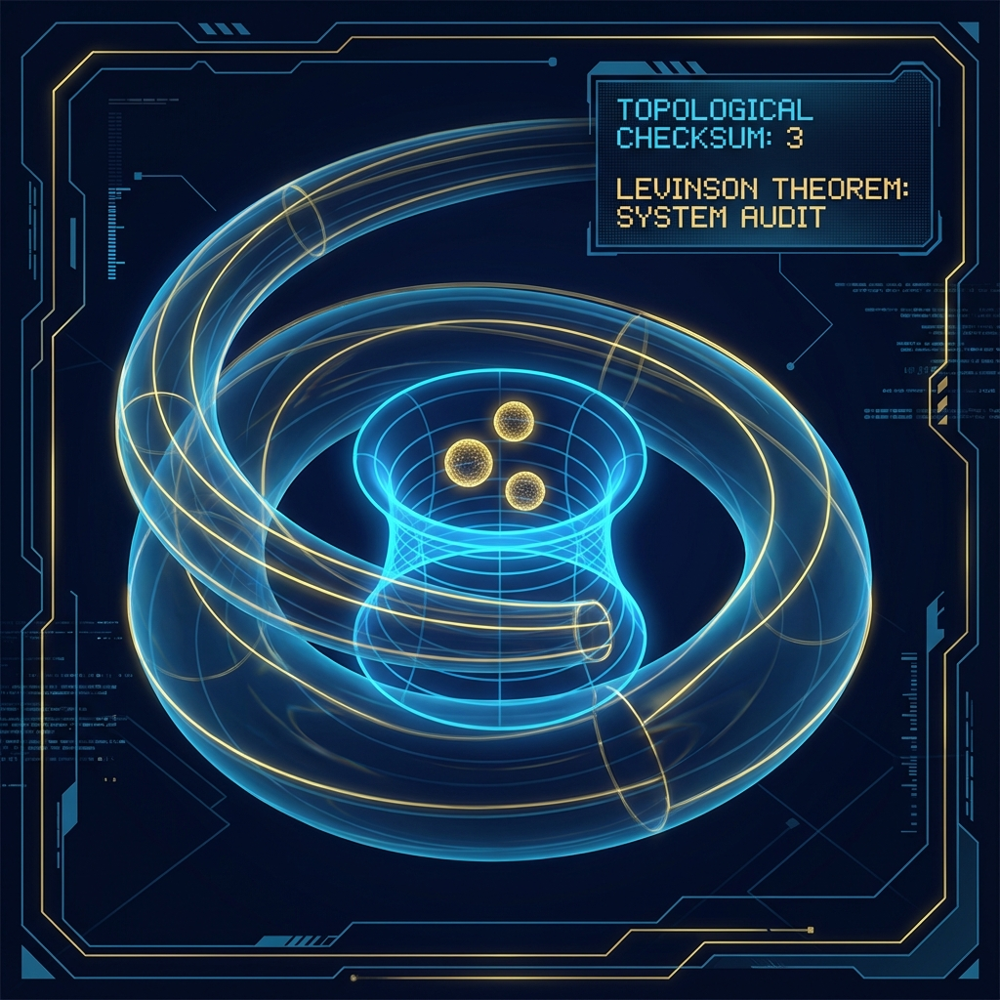

# 第4.3章：拓扑校验和 (Chapter 4.3: Topological Checksums)

**—— FS-Levinson 关系与束缚态计数 (The FS-Levinson Relation and Bound State Counting)**

**"几何测量的是误差，而拓扑测量的是存在。它是系统防止数据丢失的循环冗余校验 (CRC)。"**

---

## 1. 拓扑作为系统完整性 (Topology as System Integrity)

在前面的章节中，我们要么关注局部的几何距离（如 FS 距离、时间延迟），要么关注动态的资源分配（如相对论）。现在，我们要引入一种全新的测量维度：**拓扑 (Topology)**。

在系统工程中，当我们传输大量数据时，仅仅保证每个比特的信号完整性（几何保真度）是不够的。我们需要一种宏观的机制来验证"文件到底传完了没有"或者"数据包里到底有几个对象"。这种机制通常被称为 **校验和 (Checksum)**。

在物理学的 I/O 接口（散射）中，也存在类似的机制。当我们向一个未知的势场（黑盒系统）发射探测波时，我们不仅能测量它反射回来的时间（延迟），还能通过分析散射波的 **全局相位缠绕 (Global Phase Winding)**，推断出这个黑盒内部藏着多少个稳定的粒子。这些被"囚禁"在势场内部的稳定粒子，被称为 **束缚态 (Bound States)**。

我们将证明，束缚态的数量不是一个随机的参数，而是一个严格受控的 **拓扑不变量**，直接编码在散射矩阵的 FS 几何轨迹中。

## 2. 散射矩阵的相位轨迹 (The Phase Trajectory of the S-Matrix)

为了提取这个拓扑信息，我们需要考察散射矩阵 $S(\omega)$ 的行列式。

对于一个多通道散射系统，$S(\omega)$ 是一个幺正矩阵。其行列式是一个模为 1 的复数，可以写成指数形式：

$$\det S(\omega) = e^{i\phi(\omega)}$$

其中 $\phi(\omega)$ 被称为 **总散射相位 (Total Scattering Phase)**。

现在，让我们在射影希尔伯特空间（或者更准确地说，在幺正群 $U(N)$ 的流形上）跟踪随能量 $\omega$ 变化的轨迹。

随着能量从零（$\omega=0$）增加到无穷大（$\omega \to \infty$），复数 $e^{i\phi(\omega)}$ 会在单位圆上移动。

* **FS 弧长：** 这条曲线在单位圆上的几何长度正比于 $\int |\partial_\omega \phi(\omega)| d\omega$。

* **缠绕数 (Winding Number)：** 更重要的是，这条曲线绕原点转了多少圈？

## 3. 定理：FS-Levinson 关系 (The FS-Levinson Relation)

在标准量子力学中，Levinson 定理将散射相位的总变化与束缚态数量联系起来。在我们的几何架构中，这一定理被重构为一条关于 **射影空间轨迹拓扑性质** 的语句。

### 定理 4.3 (FS-Levinson 关系)

假设系统哈密顿量 $H = H_0 + V$，且势 $V$ 满足适当的衰减条件。散射矩阵行列式的相位轨迹在能量区间 $[0, \infty)$ 上的 **总拓扑缠绕数**，直接等于系统内部存在的 **束缚态数量 ($N_b$)**。

数学表达式为：

$$\frac{1}{2\pi} \Delta \phi_{total} = \frac{1}{2\pi} (\phi(\infty) - \phi(0)) = -N_b + \text{Corrections}$$

*(注：系数和符号取决于具体约定，通常相位的总下降量 $\phi(0) - \phi(\infty)$ 等于 $\pi N_b$，即半圈代表一个束缚态)*

**物理证明与解读：**

1. **谱的完备性：** 希尔伯特空间的总维数是守恒的。当势阱 $V$ 引入了 $N_b$ 个离散的束缚态（负能级）时，它实际上是从连续谱（正能级散射态）中"借走"了相应数量的状态密度。

2. **谱移函数 (Spectral Shift Function)：** 散射相位 $\phi(\omega)$ 本质上是在测量连续谱的状态密度相对于自由情况的"亏损"。

3. **几何图像：** $S(\omega)$ 在射影空间中的每一次完整的顺时针旋转（相位减少 $2\pi$），都标志着有一个量子态从连续谱"掉落"到了束缚谱中。

## 4. 离散世界中的鲁棒性 (Robustness in a Discrete World)

在连续理论中，Levinson 定理的证明往往涉及复杂的解析延拓。但在我们的微架构（QCA）中，这一结论变得异常清晰且 **鲁棒 (Robust)**。

在 QCA 晶格模型中，能量谱是离散的有限集合 $\{\omega_k\}$。散射矩阵 $S(\omega_k)$ 不再是一条连续曲线，而是复平面单位圆上的一系列离散点。

行列式 $\det S(\omega_k)$ 描绘出一条 **多边形路径 (Polygonal Path)**。

### 特性 4.3.1 (离散拓扑指数)

在这个离散设置下，我们依然可以定义离散的缠绕数。这个整数指数具有极强的抗干扰能力：

* **紫外不敏感 (UV Insensitivity)：** 无论我们如何细化晶格（增加高能模态），只要低能部分的结构保持不变，总缠绕数就不会改变。

* **作为校验和：** 这意味着即使微观细节（微扰）发生变化，只要不发生相变（即束缚态不被弹出或吸入），这个拓扑整数就保持恒定。它是系统稳定性的终极度量。

---

## 架构师注解 (The Architect's Note)

### 关于：系统一致性校验 (System Consistency Check)

作为架构师，我们要问：为什么宇宙需要这个定理？

想象你在设计一个文件系统。文件（量子态）要么存储在 **内存** 中（束缚态，Bound States），要么在 **网络** 上传输（散射态，Scattering States）。

**FS-Levinson 关系** 实际上就是宇宙操作系统的 **资源审计日志 (Audit Log)**。

* **$\phi(\infty) - \phi(0)$ 是流量统计：** 它记录了流经 I/O 端口（散射通道）的总相位流量。

* **$N_b$ 是库存清单：** 它记录了被锁在系统内部的对象数量。

这个定理告诉我们：**"总资源 = 库存 + 流量"。**

如果你发现散射出的相位少了几圈（流量亏损），那么唯一的解释就是：**系统内部一定隐藏了相应数量的束缚态。**

这就是为什么我们称之为 **"拓扑校验和"**。

当你无法直接打开黑盒查看内部有多少粒子时，你只需要测量输入输出信号的相位缠绕。如果绕了 3 圈，里面就一定有 3 个粒子。这是一种 **非侵入式 (Non-intrusive)** 的、基于全局几何性质的系统状态检测机制。

它保证了宇宙作为一个巨大的计算系统，其资源账目永远是平的。没有"幽灵"粒子能凭空消失或出现而不留下相位的痕迹。

