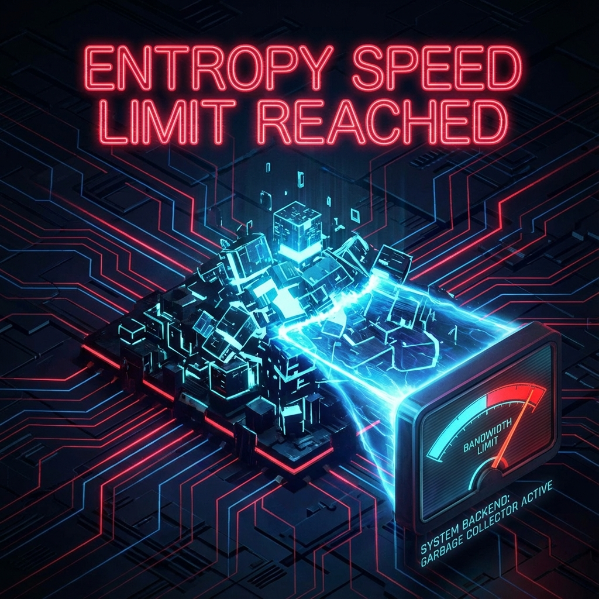

# Chapter 5.1: Entropy Limits

**—— The Entropic Speed Limit and the Cost of Erasure**

**"The rate at which a system generates chaos is not infinite; it is limited by bus bandwidth."**

---

## 1. From State to Logs: Forgotten Information

In previous volumes, the physical processes we discussed (motion, scattering) were mostly based on **Pure States** undergoing unitary evolution. From the perspective of the entire system, the universe's state **$|\psi(\tau)\rangle$** always remains pure, and information never gets lost. This is like a computer's memory always preserving complete runtime data.

However, observers in the real world (us) cannot access the entire universe's memory. We can only observe local subsystems. When we focus our attention locally, we inevitably lose information about the environment. This **Loss of Information** is recorded in physics as **Entropy**.

We reconstruct thermodynamics as the universe operating system's **Logging System**. Entropy is not a mysterious fluid; it is a **counter of discarded information**. The core task of this chapter is to prove: because the system's total bandwidth **$c_{FS}$** is finite, the amount of information we can "discard" or "generate" per unit time is also strictly limited. This is called the **Entropic Speed Limit**.

## 2. Mathematical Framework: Reduced States and Von Neumann Entropy

Consider dividing the universe's Hilbert space **$\mathcal{H}$** into two parts: the **System** we care about and the remaining **Environment**.

$$\mathcal{H} = \mathcal{H}_{sys} \otimes \mathcal{H}_{env}$$

For the entire system's pure state **$|\psi(\tau)\rangle$**, the subsystem's state is described by the **Reduced Density Matrix**:

$$\rho_{sys}(\tau) = \text{Tr}_{env} (|\psi(\tau)\rangle \langle \psi(\tau)|)$$

The subsystem's degree of disorder is measured by **Von Neumann Entropy**:

$$S_{vN}(\tau) = -\text{Tr}(\rho_{sys}(\tau) \ln \rho_{sys}(\tau))$$

## 3. Theorem: The Entropic Speed Limit

Since the entire system's evolution speed is limited by **$c_{FS}$** (Axiom I), is the subsystem's entropy change rate also limited? The answer is yes.

### Theorem 5.1 (FS Entropic Speed Limit)

For any finite subsystem with dimension **$d_{sys}$**, the absolute value of its Von Neumann entropy's rate of change with respect to intrinsic time **$\tau$** has a hard upper bound:

$$|\dot{S}_{vN}(\tau)| \le L_{sys} c_{FS}$$

where **$L_{sys}$** is a coefficient depending on subsystem dimension, approximately **$\ln d_{sys}$** for large systems.

**Proof:**

1. **Geometric Distance Limit:** Consider two moments **$\tau$** and **$\tau + \Delta \tau$**. The Fubini-Study distance between entire system states **$|\psi\rangle$** and **$|\phi\rangle$** is **$d_{FS}$**. According to FS speed definition, when **$\Delta \tau \to 0$**, **$d_{FS} \approx c_{FS} \Delta \tau$**.

2. **Trace Distance Contraction:** The trace distance **$T_{glob}$** between entire system pure states is given by the sine relation: **$T_{glob} = \sin(d_{FS})$**.

   Since partial trace (Partial Trace) is a trace-preserving map, it can only decrease or maintain distances between states (data processing inequality). Therefore, the trace distance **$T_{sys}$** between subsystem density matrices satisfies:

   $$T_{sys} \le T_{glob} \approx c_{FS} \Delta \tau$$

3. **Fannes-Audenaert Continuity Bound:** This is a powerful theorem in quantum information theory connecting the distance between two states and their entropy difference. For two states with distance **$T_{sys}$**, the upper bound on entropy difference is:

   $$|S(\rho') - S(\rho)| \le T_{sys} \ln(d_{sys}-1) + h_2(T_{sys})$$

   where **$h_2$** is the binary entropy function. When **$T_{sys} \to 0$**, higher-order terms vanish, and the dominant term is **$T_{sys} \ln d_{sys}$**.

4. **Deriving the Rate:** Substituting **$T_{sys} \le c_{FS} \Delta \tau$** into the above, dividing by **$\Delta \tau$** and taking the limit, we obtain the proof.

## 4. Physical Meaning: The Bandwidth Bottleneck of Erasure

The inequality **$|\dot{S}| \le L \cdot c_{FS}$** reveals the kinematic limits of thermodynamic processes.

* **No Instant Thermalization:** A system cannot reach thermal equilibrium instantaneously. Entropy increase requires time, because "creating disorder" itself is a change in physical state, which must consume **$c_{FS}$** budget.

* **Dynamic Version of Landauer's Principle:** Landauer's principle tells us that erasing information requires energy. Our theorem tells us that **erasing information (changing entropy) requires bandwidth**. To rapidly change a system's entropy (rapid cooling or rapid heating), you need not only energy but also sufficiently large **$c_{FS}$** to support such drastic state evolution.

---

## The Architect's Note

### On: Garbage Collection Rate

In system design, memory management is a core issue. When programs run, they generate large amounts of temporary objects (Garbage). If not cleaned up, memory leaks occur.

* **Entropy ($S$) is Fragmentation Degree:**

    Entropy measures the disorder of system memory state. Low entropy is ordered data structures; high entropy is chaotic heap and stack.

* **$c_{FS}$ Limits GC (Garbage Collection) Speed:**

    Theorem 5.1 tells us: **The universe's garbage collector is not instantaneous.**

    Cleaning memory (reducing entropy) or writing logs (increasing entropy) are essentially bit-flip operations on memory.

    Since bus bandwidth **$c_{FS}$** is finite (e.g., 3GB/s), the amount of memory fragmentation you can organize per second is limited.

* **System Insight:**

    What happens if you try to run a process that generates garbage faster than **$L_{sys} c_{FS}$**?

    It will **Throttle**.

    This is why violent phase transitions (like in the early Big Bang) can only occur in extremely short times, because the system's effective temperature was extremely high then, actually borrowing enormous geometric speed. In today's universe, due to limited interactions, entropy increase is a slow, gentle background process.

    **The second law of thermodynamics is not an absolute command; it is a statistical trend under bandwidth constraints.**

