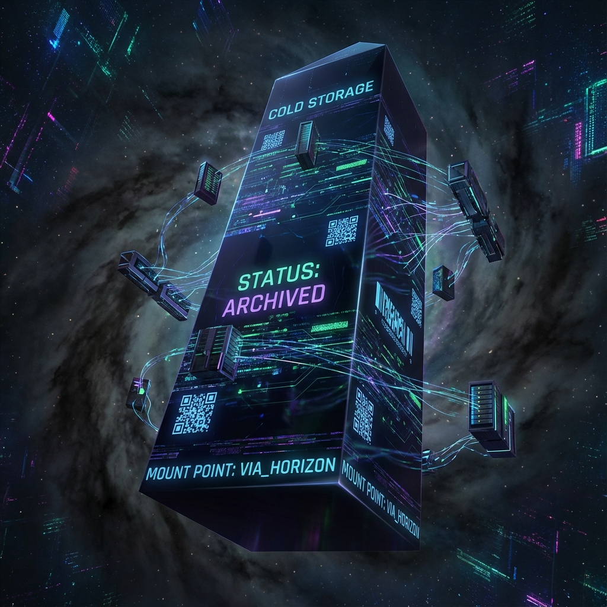

### 模块六：引力与流量控制 (Module VI: Gravity & Traffic Control)

#### 第6.3章：宇宙的冷存储 (Chapter 6.3: The Universal Cold Storage)

**—— 黑洞作为挂载的全息硬盘与垃圾回收 (Black Holes as Mounted Holographic Drives and Garbage Collection)**

**"黑洞不是吞噬一切的怪兽，它是系统崩溃时自动生成的'核心转储' (Core Dump) 文件。"**

---

### 1. 从死锁到归档：物理状态的序列化 (From Deadlock to Archive: Serialization of State)

在第 6.1 章中，我们将视界定义为 FS 容量的 **死锁点 (Deadlock Point)**。当物质密度过高，导致维持位置所需的外部带宽 **$v_{ext}$** 趋近于系统总带宽 **$c_{FS}$** 时，内部演化速率 **$v_{int}$** 被迫降为零 [cite: 428-429]。

在系统工程视角下，**$v_{int} = 0$** 意味着什么？

这意味着该对象不再执行任何"运算"。它停止了状态更新，停止了经历时间。在计算机术语中，这是一个 **挂起 (Suspended)** 的进程。

**定义 6.3.1 (引力序列化 / Gravitational Serialization)**

当物质穿过视界时，系统内核执行了一个 **序列化操作**。

活跃的、在内存中运行的三维物质（具有体自由度），被"压扁"并编码为视界表面上的二维全息数据。

这一过程将 **动态的进程 (Running Process)** 转化为了 **静态的数据 (Static Data)**。黑洞本质上是宇宙为了防止局部死锁导致系统崩溃，而紧急生成的 **"核心转储" (Core Dump)** 区域。

### 2. 全息硬盘：挂载点与存储密度 (The Holographic Drive: Mount Points & Density)

既然黑洞存储了信息，它存哪了？

根据 **全息原理 (Holographic Principle)**，信息并不存储在黑洞内部的体积里，而是存储在视界表面上。

**定理 6.3 (贝肯斯坦-霍金容量界限)**

黑洞视界作为一个存储介质，其最大存储容量（比特数）严格正比于其表面积 **$A$**：

$$N_{bits} = \frac{A}{4 l_P^2}$$

其中 **$l_P$** 是普朗克长度。

**物理重读：**

* **挂载点 (Mount Point)：** 黑洞视界是宇宙 3D 网格上挂载的一块 **2D 存储分区**。视界不仅是因果边界，更是文件系统的 **挂载路径**。

* **格式化密度 (Formatting Density)：** 这块硬盘的存储密度是物理极限——每个普朗克面积单元（$10^{-70} m^2$）存储 1/4 个比特。这是宇宙文件系统的 **簇大小 (Cluster Size)**。

* **写保护 (Write-Only)：** 对于外部观察者，这块硬盘默认是"只写"的。你可以把物质（数据）扔进去，但无法通过常规的文件读取操作（光线）读出来，因为读取指针被重定向到了内部。

### 3. 霍金辐射：后台垃圾回收进程 (Hawking Radiation: The Background GC Process)

如果黑洞只存不取，宇宙的总可用算力（自由能）将单调递减，最终导致 **系统级内存泄漏 (System-Level Memory Leak)**。所有有效的 **$v_{int}$** 资源最终都会被锁死在视界硬盘里，变成不可执行的死数据。

为了维护系统的长期稳定性，宇宙内核运行着一个极其缓慢的后台进程——**霍金辐射**。

**机制：漏桶算法 (Leaky Bucket Algorithm)**

由于视界是一个量子界面，真空涨落允许信息通过 **量子隧穿 (Tunneling)** ——即侧信道攻击——缓慢泄漏出来。

* **反序列化 (Deserialization)：** 高度压缩的全息数据在视界边缘被重新解析为无序的光子流（热辐射）。

* **资源释放 (Resource Release)：** 被锁死的质量（**$v_{int}$**）转化为辐射能（**$v_{ext}$**），重新回归宇宙的公共带宽池。

虽然对于太阳质量的黑洞，这个 GC 过程需要 **$10^{67}$** 年才能完成，但它在架构上保证了系统的 **幺正性 (Unitarity)**：没有任何数据被真正删除，它们只是被深度归档，并在漫长的等待后被解冻。

---

### **架构师注解 (The Architect's Note)**

**关于：分级存储策略 (Tiered Storage Strategy)**

作为架构师，我们设计的宇宙采用了经典的企业级 **分级存储 (Tiered Storage)** 架构：

1.  **Tier 1: 内存 (RAM) —— 活跃物质**

    * **对象：** 恒星、行星、生命体。

    * **特征：** 高 **$v_{int}$**，低延迟，数据热度极高。这是所有"计算"发生的地方。

2.  **Tier 2: 冷存储 (Cold Storage/Tape) —— 黑洞**

    * **对象：** 塌缩的恒星核心。

    * **特征：** **$v_{int} \approx 0$**。数据被冻结、序列化并高密度存储。这是为了处理溢出流量而设计的归档区。系统并不想删除这些数据，但 RAM 放不下了。

3.  **Tier 3: 回收站 (Recycle Bin) —— 奇点**

    * **特征：** 系统无法解析的错误区域。

    * **处理：** 通过霍金辐射这个 **Cron Job (定时任务)**，将 Tier 2 的数据缓慢清洗、打碎并回收到 Tier 1。

**遗忘与黑洞的区别：**

* 生物体的"遗忘"是 **主动释放内存 (`free()`)**，为了保持思维敏捷。

* 黑洞的形成是 **强制交换分区 (`swap out`)**，为了防止系统过载崩溃。

宇宙不想丢失任何信息，但也不允许任何信息永远霸占宝贵的运算带宽。这就是黑洞存在的终极意义——**它是宇宙的硬盘，而非墓地。**

