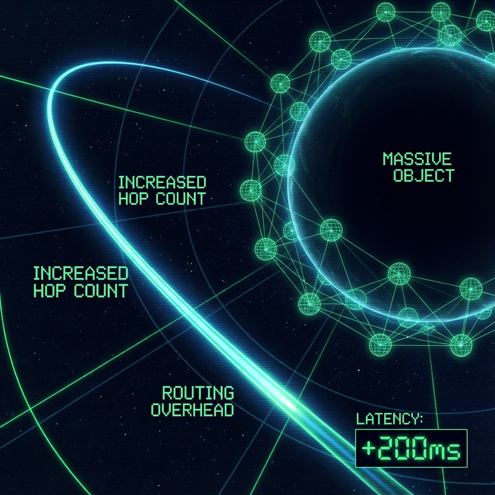

### Module VI: Gravity & Traffic Control

#### Chapter 6.4: Routing Overhead

**—— Why Archived Data Still Clogs the Network?**

**"The server isn't running that large file, but just indexing its location exhausts the router's computational power."**

---

### 1. Static Load vs. Dynamic Load

In the previous chapter, we reconstructed black holes as the universe's **"cold storage"**. This means that matter evolution inside black holes has stopped (**$v_{int} \to 0$**), becoming static data. This raises a critical architectural question: Since black holes have stopped running any logic internally and don't consume $v_{int}$, why do they still have a massive impact on the external network (gravitational lensing, Shapiro delay)? Doesn't this require computational power?

In the FS-QCA architecture, we need to distinguish between two types of computational consumption:

1.  **Object Cost ($v_{int}$):**

    This is the cost of an object maintaining its own state updates. For black holes, this cost is indeed frozen. Black holes themselves don't "think" or "age."

2.  **Topological Overhead (Metric Cost):**

    This is the maintenance cost that the **spacetime grid (QCA Grid)** must pay to accommodate this high-density object. Although black holes are "dead," they are massive **topological defects**. To embed this huge data block in the discrete grid, surrounding grid nodes must rearrange their connection relationships (entanglement structure), causing extremely high **connection density** in that region.

### 2. Why Does Light Slow Down?

When light passes near a black hole, **Shapiro delay** indeed occurs—light appears to slow down. In our architecture, photons (data packets) don't actually slow down; their local hop speed remains **$v_{LR}$** (the speed of light).

The slowdown is due to increased **hop count**.

**Mechanism Analysis: Spatial Inflation**

* **High-Density Nodes:** The QCA grid around a black hole must increase local node density or entanglement complexity to carry the massive gravitational flux (information flow). This corresponds to the spatial metric component **$g_{rr} > 1$** in general relativity.

* **Longer Paths:** In flat space, going from node A to node B might require only 100 hops. But near a black hole, because space is "stretched" (actually, more entangled nodes are inserted to maintain connections), the shortest path (geodesic) from A to B might become 150 hops.

* **Result:** Although photons travel at the same speed each step, they need to take more steps. The delay time **$T_{delay}$** is:

    $$T_{delay} = (N_{curved} - N_{flat}) \times \Delta \tau$$

**Conclusion:**

Black holes don't consume "evolutionary computational power," but rather **"routing computational power"**. They force all signals passing nearby to take detours (or more accurately, traverse more grid hops). This path extension is perceived macroscopically as light slowing down or time delay.

### 3. A System Metaphor

Imagine a **giant database table (Black Hole)** filled with data.

* This table is **read-only/archived**; no one is modifying it (**$v_{int}=0$**).

* However, because this table is so large (high mass), it occupies a huge **index space**.

* When a **query request (photon)** tries to pass through this database, although it doesn't read the table's contents, the database engine (spacetime geometry) must scan the massive index tree to determine the path.

* **Result:** The query slows down. Not because the data is moving, but because **the existence of the data itself distorts the addressing space**.

---

### **The Architect's Note**

**About: Metadata Overhead**

In distributed storage systems, we must not only store the data itself, but also maintain **metadata**—such as data block locations, checksums, and access permissions.

* **Gravitational Field is Metadata:**

    What's stored inside a black hole is the actual **Payload**.

    The curved spacetime outside a black hole is the **metadata layer** that the system maintains to manage this Payload.

* **Where Does the Computational Power Go?**

    You ask, "Black holes still consume computational resources, right?" Yes, the resources they consume manifest in **vacuum polarization**. To maintain the curved geometric structure around a black hole, the vacuum ground state must maintain a high-energy entanglement configuration. This is like how a file system must continuously occupy part of memory to cache its **Inode table** to maintain a huge static file.

So, light slows down because it's traversing a region with **extremely dense metadata**. It gets caught in heavy "addressing computations." Gravity is not a force; it's the **administrative overhead** generated when the system maintains massive data indices.

