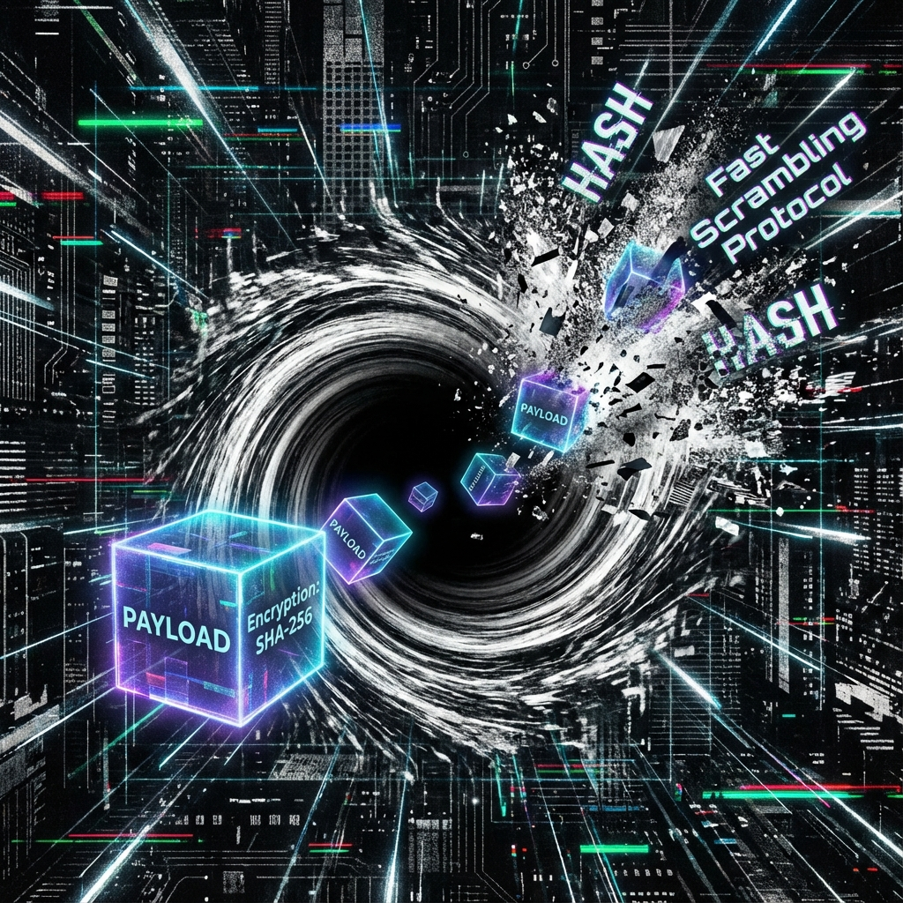

### 模块七：计算与复杂度 (Module VII: Computation & Complexity)

#### 第7.3章：扰动协议 (Chapter 7.3: The Scrambling Protocol)

**—— 黑洞吞噬作为计算复杂性的合并 (Black Hole Accretion as Computational Complexity Merging)**

**"黑洞是宇宙中最快的哈希函数。它吞噬结构，吐出随机性，并将指针重定向到表面。"**

---

### 1. 指针丢失与重定向 (Pointer Loss and Redirection)

在上一卷中，我们确立了黑洞视界作为"全息硬盘挂载点"的地位。现在，我们需要深入探讨数据写入过程中的寻址机制。

在平坦时空中，物体的位置是明确的，我们可以保留指向该对象的 **引用 (Reference/Pointer)**，例如三维坐标 $(x, y, z)$。然而，当物体穿过视界时，系统发生了 **指针重定向 (Pointer Redirection)**：

* **内部指针丢失 (Null Pointer Exception):**

    对于外部观察者，指向 $R < R_s$（视界内部）的任何因果链都被切断了。没有任何物理信号（返回值）能从内部传回。原来的 3D 坐标指针变成了 `NULL`。试图访问该地址会导致"连接超时"。

* **表面哈希映射 (Surface Hash Map):**

    虽然内部指针失效了，但系统并没有丢失数据。根据 **全息原理**，数据被"涂抹"在了视界表面上。系统将原来的 **体指针 (Volume Pointer)** 替换为了一个 **面索引 (Surface Index)**。

    $$Pointer_{3D}(x, y, z) \to Hash_{2D}(\theta, \phi)$$

    这意味着，黑洞不仅是一个存储器，更是一个巨大的 **哈希表 (Hash Table)**。你丢进去的数据被重新编码，散列分布在视界表面。

### 2. 吞噬过程：快速扰动 (The Swallowing Process: Fast Scrambling)

您提到的"计算复杂性合并"是这一过程的核心。在计算物理中，这被称为 **快速扰动 (Fast Scrambling)**。黑洞被证明是自然界中已知的最快的扰动器。

* **有序输入 (Ordered Input):**

    丢入黑洞的物质（如一本百科全书）具有高度有序的结构，即低复杂度的状态。比特之间存在特定的、局部的关联。

* **复杂性合并 (Complexity Merging):**

    当物质落入视界附近的"拉伸视界"区域时，其携带的量子比特与黑洞已有的海量量子比特发生了 **全对全 (All-to-All)** 的剧烈纠缠。

    这就像是一次极其暴力的 **`git merge`** 操作，但是是以 **$O(\log N)$** 的极快速度进行的。

    $$t_{scramble} \sim \frac{\hbar}{k_B T} \ln S$$

    在极短的时间内，新进入的信息被彻底打散，均匀地混合进黑洞的整体纠缠网络中。

* **输出状态 (Output State):**

    这种混合导致了 **计算复杂性 (Computational Complexity)** 的爆发式增长。原本简单的量子态演化为了一个复杂度极高的状态，以至于没有任何多项式时间的算法能将其逆向还原。

### 3. 潮汐力与序列化 (Spaghettification as Serialization)

在广义相对论中，物体落入黑洞会被拉成面条（Spaghettification）。在 FS-QCA 架构中，我们将这一现象重构为 **数据序列化 (Data Serialization)** 的物理表现。

* **解构对象 (Destructuring):**

    当物体逼近视界，引力梯度（带宽梯度）急剧增加。物体不同部位的 **$v_{ext}$** 需求差异巨大，导致内部结合力无法维持结构。

    系统被迫将复杂的 3D 对象（如恒星、飞船）拆解为最基本的组成单元（基本粒子/比特）。这就像是将一个复杂的 Java 对象拆解为一串二进制流（JSON/Protobuf）。

* **扁平化 (Flattening):**

    原本的三维结构信息被剥离，转化为一维或二维的比特流，以便能够"写入"到视界这个二维全息硬盘上。

    **所谓的"吞噬"，就是系统为了节省存储空间，强制执行的"降维压缩"算法。**

---

### **架构师注解 (The Architect's Note)**

**关于：只写存储与哈希冲突 (Write-Only Storage and Hash Collisions)**

**"为什么我们可以持续给黑洞丢入数据？"**

作为一个架构师，我会这样解释这个 **"只进不出"** 的特性：

1.  **动态扩容 (Dynamic Resizing):**

    黑洞不是一个固定大小的硬盘。每当你丢入一个比特的信息（熵 $dS$），根据贝肯斯坦公式，视界面积 $A$ 就会自动增加 $4 l_P^2$。

    这就像是一个 **弹性云存储 (Elastic Cloud Storage)**。你越写，它越大。它永远不会报 `Disk Full`，它只会变得越来越胖（视界半径 $R_s$ 增加）。

2.  **加密哈希 (Cryptographic Hash):**

    黑洞吞噬的过程，本质上是对宇宙信息进行了一次 **SHA-256** 级别的加密操作。

    * **输入：** 你的物质（有序数据）。

    * **函数：** 快速扰动（Scrambling）。

    * **输出：** 视界微观状态的微小变化 + 最终的霍金辐射（无序哈希值）。

    对于外部世界，这看起来像是一次 **单向函数 (One-way Function)** 计算。数据进去了，变成了随机的热辐射（哈希值），你几乎无法逆向还原出原始数据。这就是为什么它看起来像"垃圾回收"——因为它有效地把"有意义的信息"变成了"无意义的哈希值"，从而释放了外部世界的认知负担。

