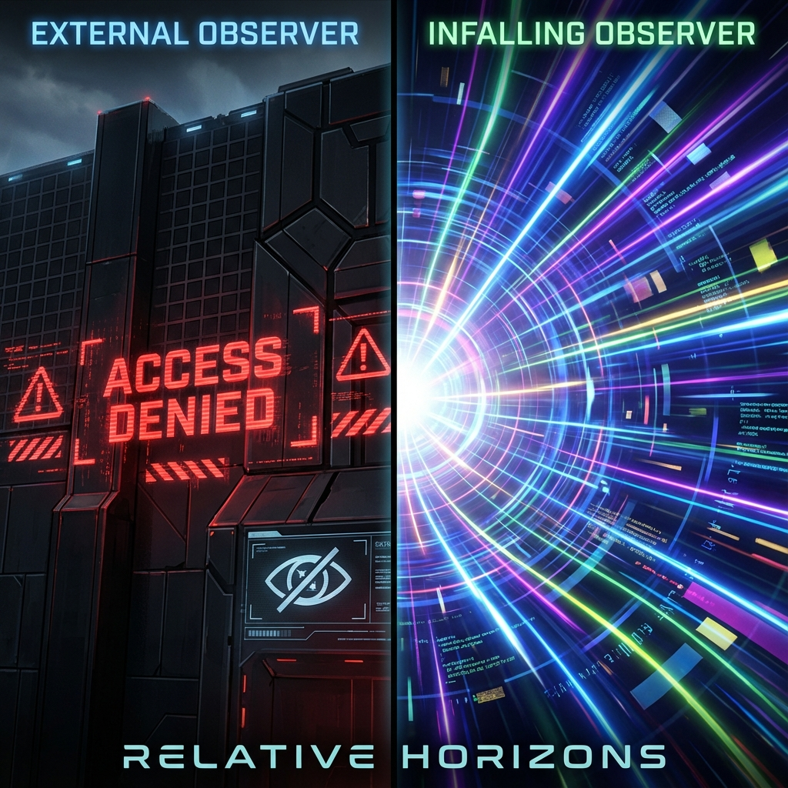

### 模块八：观察者与意识 (Module VIII: The Observer & Consciousness)

#### 第8.3章：相对视界 (Chapter 8.3: Relative Horizons)

**—— 观察者权限与视图差异 (Observer Permissions and View Differences)**

**"防火墙对于普通用户是不可逾越的边界，但对于 Root 管理员来说，它只是一个日志检查点。"**

---

### 1. 客观态与相对视图 (Objective State vs. Relative View)

关于黑洞的视界，物理学界长期存在一个争论：视界是客观存在的物理实体，还是观察者依赖的幻象？在 FS-QCA 架构中，我们通过区分 **系统内核状态** 和 **用户访问视图** 来解决这一矛盾。

**客观态 (The Objective State):**

在微观层面（底层 QCA 网格），黑洞所在的区域确实处于一种特殊的物理状态。那里的流量密度达到了物理极限，导致局部 **$v_{ext} \to c_{FS}$**，且 **$v_{int} \to 0$**。这种 **"网络拥塞"** 和 **"死锁"** 状态是客观的，不依赖于谁在看 [cite: 428-429]。

**相对视图 (The Relative View):**

然而，"视界在哪里"以及"它看起来是什么样的"，取决于观察者（Client）与该拥塞点的交互状态。

### 2. 两种观察者的体验差异 (Two Observer Experiences)

让我们对比两种典型的观察者：

#### **A. 外部静止观察者 (The Distant Observer)**

* **角色：** 远端客户端。试图通过网络访问拥塞的服务器。

* **现象：** 发送的探测信号（光子）没有回音，或者回音经历了无限长的延迟（红移）。

* **判定：** "连接超时 (Connection Timed Out)"。观察者在半径 **$R_s$** 处定义了一个 **"不可达边界"**（视界）。对他来说，物体永远停在视界表面，慢慢变红、变暗。这是因为从拥塞点传出的数据包被 **丢弃** 或 **无限排队** 了。

#### **B. 自由落体观察者 (The Infalling Observer)**

* **角色：** 数据流本身（或 Root 管理员）。顺着流量进入了拥塞区。

* **现象：** 他并没有感觉到撞上了一堵墙。局部的时空（网络连接）对他来说是平滑的。因为他本身就以 **$v_{ext} \approx c_{FS}$** 的速度在移动，他与周围的数据流保持了 **同步**。

* **判定：** "系统运行正常，直到崩溃"。他穿过了视界，直接进入了服务器内部。他没有看到"超时"，他看到的是 **"核心转储"** 的现场——直到他撞上奇点（服务器机房起火）。

**结论：**

视界是一个 **相对的访问权限边界**。对于没有权限（速度不足）的外部用户，它是一堵火墙；对于拥有权限（随波逐流）的内部用户，它只是一个普通的坐标点。

### 3. 安鲁效应：温度取决于参考系 (The Unruh Effect: Temperature Depends on Frame)

视界的相对性不仅体现在位置上，还体现在 **温度** 上。

根据安鲁效应 (Unruh Effect)，一个在真空中加速的观察者会看到热辐射，而惯性观察者看到的是冷真空。

在 FS-QCA 架构中，我们将 **温度** 重构为 **数据读取的误码率 (Bit Error Rate)** 或 **丢包率**。

* **惯性读取 (Inertial Read):**

    顺着数据流方向读取（自由落体）。数据包到达的时序是自然的，丢包率为 0。观察者看到的是 **冷真空 ($T=0$)**。

* **加速读取 (Accelerated Read):**

    逆着数据流方向，强行截获数据（悬停在视界外）。这相当于在一个高负载的网络中进行 **高频采样**。由于网络拥塞和时序抖动，你会收到大量的乱序包和噪声。这些噪声在宏观上被感知为 **热辐射 ($T > 0$)**。

**定理 8.3 (温度-加速度关系)**

观察者感受到的"热"（噪声），正比于他为了维持当前位置而消耗的 **算力**（加速度）：

$$T \propto a \propto \frac{d v_{ext}}{d\tau}$$

离视界越近，维持静止所需的算力（加速度）越大，系统产生的"废热"（辐射噪声）就越高。

---

### **架构师注解 (The Architect's Note)**

**关于：用户权限 (User Permissions) 与防火墙 (Firewall)**

想象你在访问一个受保护的企业内网。

1.  **外部视角 (The Firewall):**

    你没有 VPN 权限。当你 ping 内部服务器时，请求被防火墙拦截。你看到的是一个 **黑箱**。你只能根据防火墙散发出的微热（霍金辐射）推测里面还在运行。

2.  **内部视角 (The Intranet):**

    你通过了身份验证（或者你就是数据本身）。你穿过了防火墙，发现里面是一个繁忙的数据中心。这里没有墙，只有繁忙的总线和处理器。

**黑洞互补性 (Black Hole Complementarity):**

物理学中有一个深刻的悖论：信息是在视界被烧毁了（火墙），还是安全通过了？

在我们的架构中，这不再是悖论，而是 **视图的一致性**。

* 对于外部用户，信息确实"贴"在视界（防火墙）上了。

* 对于内部用户，信息确实进去了。

* 只要这两个用户永远无法交换对账单（因为内部用户出不来），系统的一致性就不会被破坏。这是一种 **基于视角的权限隔离机制**。

