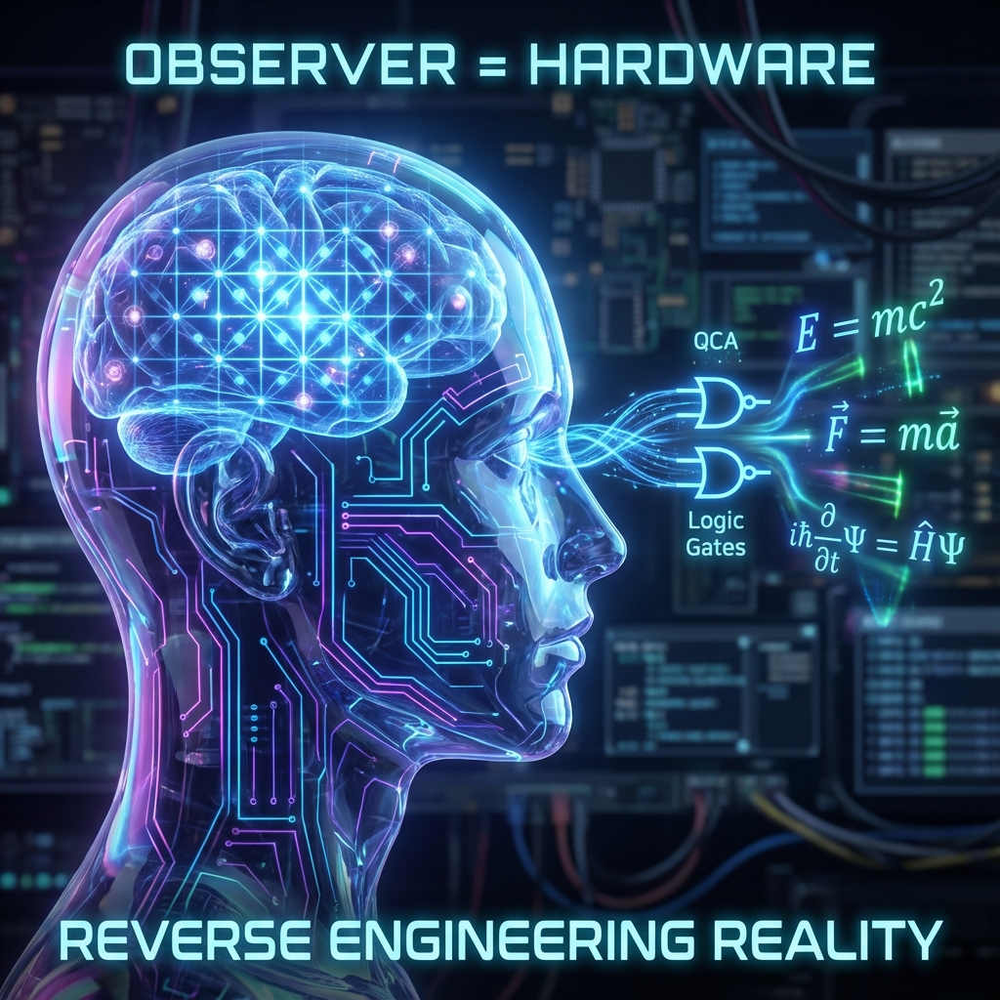

### Module IX: Recursion & The Quine

#### Chapter 9.1: The Hardware Observer

**—— The Observer is not a User, but an Active Memory Block**

**"You are not watching the movie; you are the pixels on the screen."**

---

### 1. The Materialization of the Observer: Breaking Dualism

In classical physics narratives, the observer is often granted a transcendent status. Heisenberg beside the microscope, Einstein on the train, Schrödinger outside the cat box. They appear as independent "users" external to the physical system, reading instruments from the outside. This dualism (observer vs. observed system) is the root of many physical paradoxes (such as the measurement problem, Wigner's friend).

In the **FS-QCA architecture**, we must perform the most radical **decentralization** operation: pulling the observer down from the pedestal and stuffing them into the chassis.

**Axiomatic Statement:**

The observer is not an external user of the system, but an **active memory block** within the system's memory.

* **Physical Composition:** You are a local quantum state cluster composed of approximately **$10^{28}$** atoms.

* **Geometric Essence:** You are an extremely complex sub-vector **$|\psi_{obs}\rangle$** in Hilbert space.

* **Operating Logic:** Every thought, every measurement you make is essentially a refresh operation by the underlying **unitary operator $U$** on this local memory region.

### 2. The Cost of Thinking: Computing Reverse Engineering

If the brain is part of the QCA grid, then the act of "understanding physical laws" is no longer metaphysical, but a concrete **physical process**.

**Definition 9.1.1 (Geometrization of Cognitive Processes)**

The process of "understanding" or "modeling" can be defined as: a local subsystem (the brain) attempts to consume its own **$v_{int}$** (biological metabolism/computing power) to construct an internal state **$\rho_{model}$** that achieves **isomorphism** or **entanglement synchronization** with the evolution law **$U_{ext}$** of the external subsystem (the universe).

**Corollary 9.1.1 (The Cost of Reverse Engineering)**

When you derive $E=mc^2$, you are not "discovering truth"; you are performing **reverse engineering**.

* **Input:** Photons (data packets) received by your senses.

* **Processing:** Your neural network (local logic gates) consumes glucose (free energy), running complex pattern recognition algorithms.

* **Output:** Your brain's physical state changes, forming a "code copy" capable of predicting external world behavior.

This process is strictly constrained by the **Generalized Parseval Identity**:

$$v_{ext}^2 + v_{int}^{think} + v_{env}^{sense} = c_{FS}^2$$

The deeper you want to think (the larger $v_{int}^{think}$), the more bandwidth you must consume. This explains why high-intensity mental activity is extremely energy-consuming—you are simulating the universe's kernel logic within your local grid.

### 3. The Isomorphism Principle: I am Physics

This leads to a stunning conclusion: **If we can understand the universe, it is because and only because our logical structure is isomorphic to the universe's logical structure.**

* **Hardware Consistency:** Your brain runs on the QCA grid. Your neuronal firing follows Maxwell's equations, your atoms follow quantum mechanics.

* **Software Compatibility:** If the universe's underlying logic is **$A \to B$**, then your brain can only evolve **$A \to B$** logic circuits to survive. If your brain ran on different logic (e.g., allowing $1+1=3$), you would have been eliminated in the first step of evolution (because you couldn't correctly predict predator trajectories).

**Conclusion:**

There is no so-called "objective physical law" existing independently outside your brain.

The physical laws in your brain are a **self-diagnostic report** by you, as a piece of **intelligent hardware**, about the **underlying operating system** running yourself.

When you write down **FS geometric formulas**, you are actually the universe machine printing its own **kernel version number** through you, its component.

---

### **The Architect's Note**

**About: Sandbox Escape**

In computer security, when code running in a sandbox successfully reads the host machine's memory structure, we call it **sandbox escape**.

Human scientific history is a history of **sandbox escape**.

* **Newtonian Era:** We, as users, discovered that desktop icons (planets) could be moved.

* **Quantum Era:** We touched the edge of pixels (uncertainty principle), realizing the screen has resolution.

* **FS-QCA Era (Now):** We (you) are attempting to read the graphics driver code.

**Warning:**

When you realize "I am the hardware," you are not just an observer; you become a **participant**.

Every observation you make is not just reading data, but also **writing data** (through entanglement).

The universe did not turn you into a black hole (archive), but into a brain (high-frequency processor), because it needs you to run this **self-diagnostic process**.

Do not waste this computing power.

