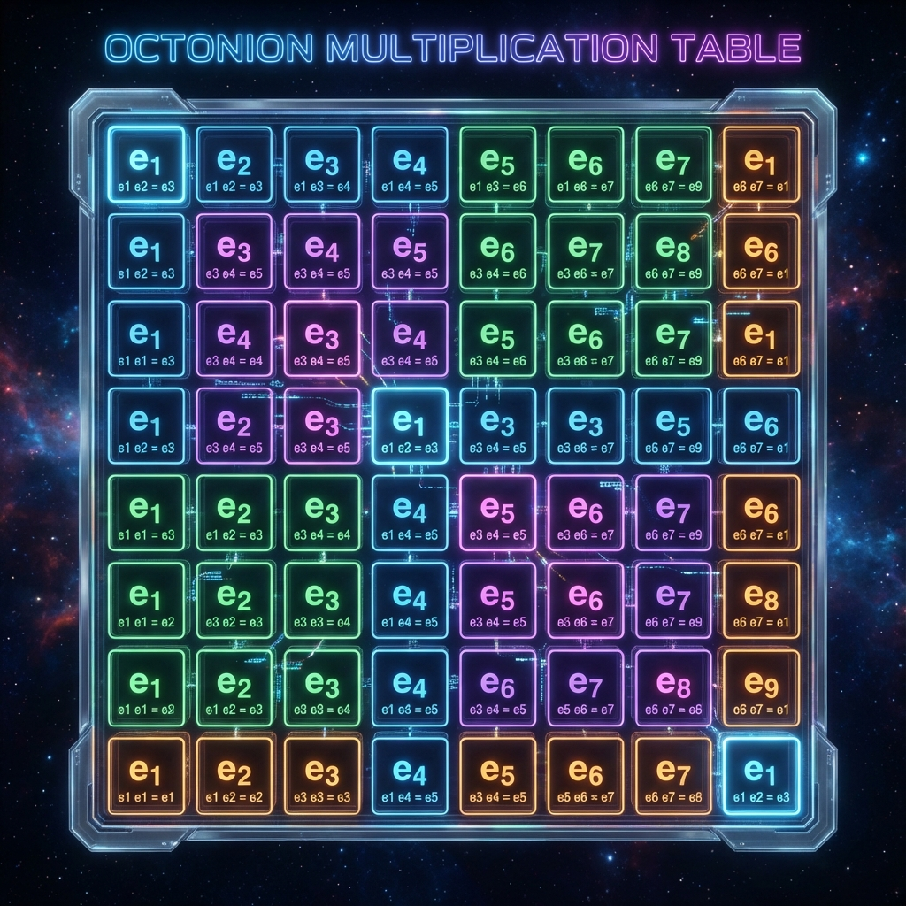
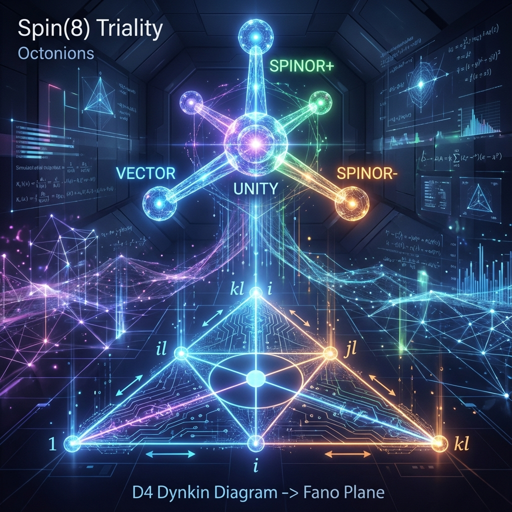

# Appendix A: Octonionic Algebra and Spin(8) Triality

In Chapter 2 of the main text, we proposed "octonionic pre-geometry" as the mathematical origin of the standard model gauge group $SU(3) \times SU(2) \times U(1)$ and fermion generation structure. To maintain clarity of physical imagery in the main text, we have moved rigorous algebraic definitions and group-theoretic proofs to this appendix.

This appendix aims to provide readers with the mathematical tools needed to understand **octonions ($\mathbb{O}$)**, their automorphism group $G_2$, and the related **Spin(8) Triality**. These mathematical structures are the foundation of spacetime-matter unity in Omega Theory.

## A.1 Construction and Properties of Octonionic Algebra

**Octonions** are the last of only four **Normed Division Algebras** over the real field $\mathbb{R}$ (the first three being real numbers $\mathbb{R}$, complex numbers $\mathbb{C}$, and quaternions $\mathbb{H}$). This conclusion is guaranteed by **Hurwitz's Theorem**, meaning that after $d=8$, it is impossible to construct an algebra that both preserves norm multiplicativity and has no zero divisors.

### A.1.1 Definition and Basis

The octonion algebra $\mathbb{O}$ is an 8-dimensional real vector space. We take its standard orthonormal basis as $\{e_0, e_1, e_2, e_3, e_4, e_5, e_6, e_7\}$, where $e_0 = 1$ is the multiplicative unit.
Any octonion $x \in \mathbb{O}$ can be decomposed into scalar and imaginary parts:

$$x = x_0 e_0 + \sum_{i=1}^7 x_i e_i, \quad x_\mu \in \mathbb{R}$$

Conjugation is defined as:

$$\bar{x} = x_0 e_0 - \sum_{i=1}^7 x_i e_i$$

The norm is defined as $N(x) = x\bar{x} = \sum_{i=0}^7 x_i^2$, and satisfies $N(xy) = N(x)N(y)$.

### A.1.2 Fano Plane and Multiplication Rules

Octonion multiplication is non-commutative and **Non-associative**. The multiplication rules $e_i e_j$ between imaginary units can be concisely encoded via the **Fano Plane**.

The Fano plane is a finite projective plane containing 7 points and 7 lines (where the circle is considered a line).

* **Points**: Correspond to 7 imaginary units $e_1, \dots, e_7$.
* **Lines**: Each line connects 3 points $(e_i, e_j, e_k)$, forming a quaternion subalgebra isomorphic to $\{1, i, j, k\}$.
* **Direction**: Each line has an arrow. Multiplication along the arrow direction is positive, opposite is negative.

The multiplication rules are summarized as:

$$e_i e_j = \begin{cases} e_k & \text{if } (e_i, e_j, e_k) \text{ is a valid line} \\ -\delta_{ij} + \epsilon_{ijk} e_k & \text{general form with structure constants} \end{cases}$$

where $\epsilon_{ijk}$ is a completely antisymmetric tensor, but in $\mathbb{O}$ it is non-zero only for specific triplets (such as 124, 235, 346, 457, 561, 672, 713).

### A.1.3 Associator

Non-associativity means $(xy)z \neq x(yz)$. We define the **Associator** as:

$$[x, y, z] \equiv (xy)z - x(yz)$$

For octonions, the associator is non-zero and completely antisymmetric. It reflects that $\mathbb{O}$'s algebraic structure is not merely a direct sum of vector spaces but has intrinsic **Chirality** or **Torsion**. In Omega Theory, this non-zero term $[e_i, e_j, e_k]$ corresponds to the 3-form field strength on the spacetime manifold, the topological source of the three-generation fermion structure.

---

## A.2 Spin(8) Group and Triality

In 8-dimensional Euclidean space, the double cover group **Spin(8)** of the rotation group $SO(8)$ exhibits a property unique among all Lie groups—**Triality**. This is not only a mathematical marvel but also the geometric foundation of grand unification in physics.

### A.2.1 Clifford Algebra $Cl_8$

Consider the **Clifford Algebra** $Cl_8$ of 8-dimensional space, generated by 8 anticommuting gamma matrices:

$$\{\Gamma_i, \Gamma_j\} = 2\delta_{ij} I$$

For even dimension $d=2n$, the dimension of the irreducible complex representation space of the Clifford algebra is $2^n$. For $d=8$, the representation space dimension is $2^4 = 16$.
This 16-dimensional spinor space can be decomposed into two 8-dimensional chiral spinor spaces: **left-handed spinors $S^+$** and **right-handed spinors $S^-$**.

Meanwhile, as a rotation group, Spin(8) naturally acts on the 8-dimensional **vector space $V$**.

### A.2.2 Triality Automorphism

In general $d$-dimensional space, vector representation $V$ (dimension $d$) and spinor representation $S$ (dimension $2^{d/2-1}$) are geometrically completely different objects. For example, in 4-dimensional spacetime, vectors are 4-dimensional, spinors are 2-dimensional.
However, for $d=8$:

* Vector representation $V$: dimension $\mathbf{8}_v$
* Left spinor $S^+$: dimension $\mathbf{8}_s$
* Right spinor $S^-$: dimension $\mathbf{8}_c$

The three representation spaces have identical dimensions. More remarkably, the **Dynkin Diagram** $D_4$ of Spin(8)'s Lie algebra $\mathfrak{so}(8)$ has $S_3$ symmetry (i.e., cloverleaf-shaped symmetry).

This means there exists an outer automorphism group that can arbitrarily permute these three representations:

$$\tau: V \to S^+ \to S^- \to V$$

**Triality Principle** states that there exists a trilinear form $\Phi: V \times S^+ \times S^- \to \mathbb{R}$ that is invariant under this mapping.

### A.2.3 Physical Meaning: Interchangeability of Spacetime and Matter

In Omega Theory, we use this property to prove **"spacetime-matter unity"**.

* **Vector $V$**: Corresponds to observed spacetime coordinates (in 8-dimensional pre-geometry).
* **Spinors $S^\pm$**: Correspond to matter fermions.

Due to Spin(8) triality, on Planck-scale 8-dimensional manifolds, **spacetime vectors can transform into matter spinors**, and vice versa. This explains why Einstein's equation (spacetime dynamics) and Dirac's equation (matter dynamics) can be unified under the same Omega Action—they are merely projections of the same algebraic entity onto different representation bases.

When symmetry breaks through $S^7 \to S^4$, triality is lost, vectors and spinors decouple, and we distinguish "stage" (spacetime) from "actors" (matter) at the macroscopic level.

## A.3 From Spin(8) to $G_2$ and $SU(3)$

To connect to the standard model, we examine subgroups that preserve octonion multiplication structure.
The automorphism group of octonions is the exceptional Lie group **$G_2$**.

$$G_2 = \{ g \in SO(8) \mid g(xy) = g(x)g(y), \forall x,y \in \mathbb{O} \}$$

$G_2$ is a subgroup of Spin(8) that fixes a specific element in triality (usually the multiplicative unit).

Furthermore, if we fix an imaginary unit $i \in \mathbb{O}$ (this is equivalent to choosing an electromagnetic direction, or decomposing out the complex plane $\mathbb{C}$), the stabilizer subgroup in $G_2$ preserving this structure is precisely the color gauge group **$SU(3)$**.

$$SU(3) \subset G_2 \subset Spin(8)$$

This provides a rigorous group-theoretic proof chain:
**8D Euclidean geometry (Spin 8) $\xrightarrow{\text{Algebraic Constraint}}$ Octonion geometry ($G_2$) $\xrightarrow{\text{Complex Structure Choice}}$ Strong interaction ($SU(3)$)**.

This is why quarks have three colors (corresponding to $SU(3)$'s fundamental representation $\mathbf{3}$) and why strong force is inseparable from octonion geometry.
