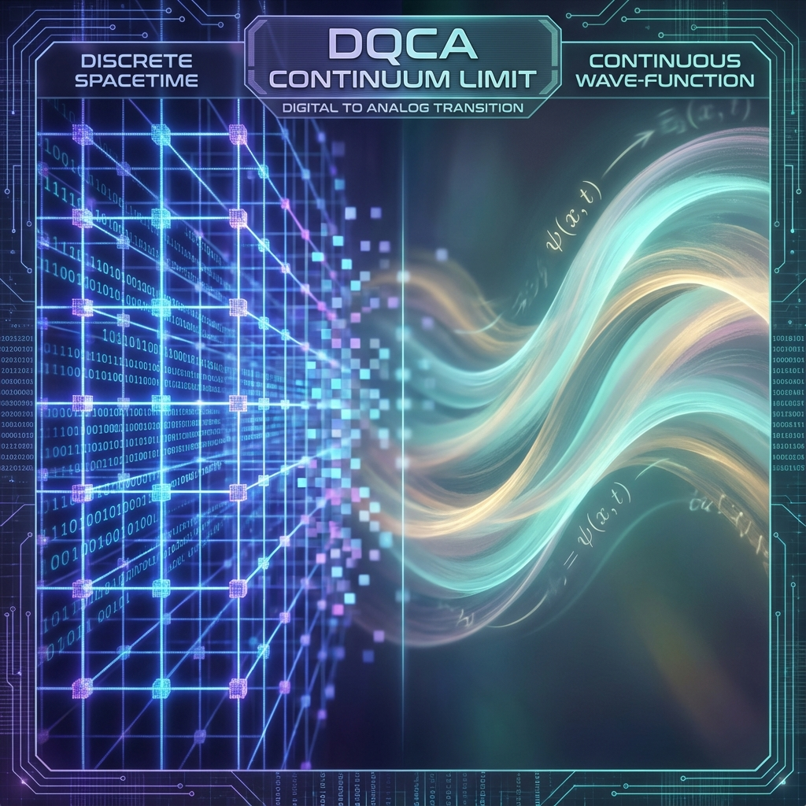
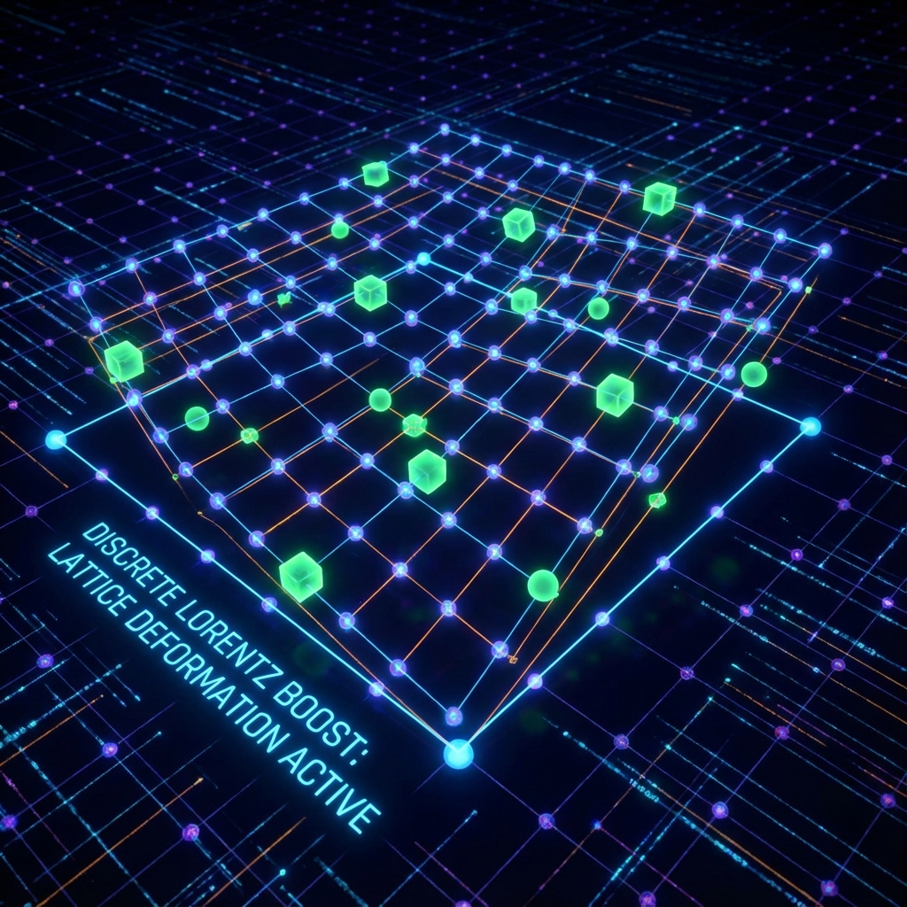

# 附录 B：DQCA 连续极限的严谨证明 (Appendix B: Rigorous Proof of the DQCA Continuum Limit)

在本书第四章中，我们物理地论证了定义在欧米伽网格上的狄拉克-量子元胞自动机 (DQCA) 在宏观尺度下涌现为狄拉克方程。本附录将利用渐进分析与算符谱理论，提供这一结论的数学严格证明。我们将展示如何从离散的幺正演化算符中提取有效的哈密顿量，并分析由于时空离散性引入的高阶修正项（即洛伦兹不变性破坏项）。

## B.1 离散演化算符的动量空间表示

考虑定义在一维晶格 $\mathbb{Z}$ 上的双分量波函数 $\Psi(x, t) = (\psi_R(x, t), \psi_L(x, t))^T$。
DQCA 的单步演化由幺正算符 $\hat{W}$ 给出：

$$\Psi(t+1) = \hat{W} \Psi(t) = \hat{S} \cdot \hat{C} \Psi(t)$$

其中：

* **硬币算符 (Coin Operator) $\hat{C}$**：

  $$\hat{C} = \bigoplus_{x \in \mathbb{Z}} C(\theta), \quad C(\theta) = \begin{pmatrix} \cos \theta & i \sin \theta \\ i \sin \theta & \cos \theta \end{pmatrix} = e^{i \theta \sigma_x}$$

* **移位算符 (Shift Operator) $\hat{S}$**：

  $$\hat{S} \psi_R(x) = \psi_R(x-1), \quad \hat{S} \psi_L(x) = \psi_L(x+1)$$

为了分析方便，我们转换到动量空间（傅里叶空间）。定义离散傅里叶变换：

$$\tilde{\Psi}(k, t) = \sum_{x \in \mathbb{Z}} \Psi(x, t) e^{-ikx}, \quad k \in [-\pi, \pi)$$

在动量表象下，移位算符是对角的：

$$\tilde{S}(k) = \begin{pmatrix} e^{-ik} & 0 \\ 0 & e^{ik} \end{pmatrix} = e^{-ik \sigma_z}$$

因此，总演化算符在 $k$-空间中的矩阵形式为：

$$\tilde{W}(k) = \tilde{S}(k) \cdot C(\theta) = \begin{pmatrix} e^{-ik} \cos \theta & i e^{-ik} \sin \theta \\ i e^{ik} \sin \theta & e^{ik} \cos \theta \end{pmatrix}$$

## B.2 渐进展开与连续极限

为了取连续极限，我们需要引入物理尺度参数 $\varepsilon$（对应于普朗克长度 $l_P$ 或网格常数）。
我们定义物理坐标 $x_{phys}$、物理时间 $t_{phys}$、物理动量 $p$ 和物理质量 $m$ 如下：

$$x_{phys} = x \cdot \varepsilon$$

$$t_{phys} = t \cdot \varepsilon$$

$$k = p \cdot \varepsilon$$

$$\theta = m \cdot \varepsilon$$

此处假设自然单位制 $c=1, \hbar=1$。

我们的目标是寻找一个有效的连续哈密顿量 $\hat{H}_{eff}$，使得：

$$\tilde{W}(\varepsilon) = \exp(-i \hat{H}_{eff} \cdot \varepsilon)$$

**步骤 1：演化算符的泰勒展开**

当 $\varepsilon \to 0$ 时，我们可以对 $\tilde{W}(k)$ 关于 $\varepsilon$ 进行泰勒级数展开。
利用 $e^{\pm i p \varepsilon} \approx 1 \pm i p \varepsilon - \frac{1}{2} p^2 \varepsilon^2$ 和 $\cos(m\varepsilon) \approx 1 - \frac{1}{2}m^2\varepsilon^2, \sin(m\varepsilon) \approx m\varepsilon$。

$$
\begin{aligned}
\tilde{W} &\approx \begin{pmatrix} (1 - ip\varepsilon)(1) & i(1 - ip\varepsilon)(m\varepsilon) \\ i(1 + ip\varepsilon)(m\varepsilon) & (1 + ip\varepsilon)(1) \end{pmatrix} + O(\varepsilon^2) \\
&\approx \begin{pmatrix} 1 - ip\varepsilon & im\varepsilon \\ im\varepsilon & 1 + ip\varepsilon \end{pmatrix} + O(\varepsilon^2) \\
&= I - i\varepsilon \begin{pmatrix} p & -m \\ -m & -p \end{pmatrix} + O(\varepsilon^2)
\end{aligned}
$$

**步骤 2：识别哈密顿量**

将上式与时间演化算符 $\exp(-i H_{eff} \varepsilon) \approx I - i H_{eff} \varepsilon$ 比较，我们识别出有效哈密顿量的一阶项：

$$H_{eff}^{(0)} = \begin{pmatrix} p & -m \\ -m & -p \end{pmatrix} = p \sigma_z - m \sigma_x$$

这正是 **1+1 维狄拉克哈密顿量** $H_D = c \alpha p + \beta m c^2$ 的一种表示形式（通过基底变换 $\sigma_x \to -\sigma_x$ 可得标准形式）。
其色散关系由本征方程 $\det(H_{eff}^{(0)} - E) = 0$ 给出：

$$E^2 = p^2 + m^2$$

这证明了定理 4.2：在零阶近似下，DQCA 精确还原了相对论性量子力学。

## B.3 误差分析与洛伦兹破坏界限

为了评估欧米伽理论的可证伪性（即第 7.4 节提到的高能色散），我们需要计算 $O(\varepsilon^2)$ 及更高阶项。
我们使用 **Baker-Campbell-Hausdorff (BCH) 公式** 来精确计算有效哈密顿量 $H_{eff}$：

$$e^{-i H_{eff} \varepsilon} = e^{-i p \varepsilon \sigma_z} e^{i m \varepsilon \sigma_x}$$

根据 BCH 公式 $e^A e^B = e^{A+B + \frac{1}{2}[A,B] + \dots}$，令 $A = -i p \varepsilon \sigma_z, B = i m \varepsilon \sigma_x$。

$$
\begin{aligned}
-i H_{eff} \varepsilon &\approx A + B + \frac{1}{2} [A, B] \\
&= -i\varepsilon (p \sigma_z - m \sigma_x) + \frac{1}{2} [-i p \varepsilon \sigma_z, i m \varepsilon \sigma_x] \\
&= -i\varepsilon (p \sigma_z - m \sigma_x) + \frac{1}{2} \varepsilon^2 pm [\sigma_z, \sigma_x]
\end{aligned}
$$

已知泡利矩阵对易关系 $[\sigma_z, \sigma_x] = 2i \sigma_y$。

$$-i H_{eff} \varepsilon \approx -i\varepsilon (p \sigma_z - m \sigma_x) + i \varepsilon^2 pm \sigma_y$$

$$H_{eff} \approx p \sigma_z - m \sigma_x - \varepsilon pm \sigma_y$$

**修正的色散关系**：

计算 $H_{eff}$ 的本征值 $E$：

$$E^2 = p^2 + m^2 + (\varepsilon pm)^2 = p^2 + m^2 + \varepsilon^2 p^2 m^2$$

更精确地，直接对原始幺正算符 $\tilde{W}$ 的本征值求解：

$$\text{Tr}(\tilde{W}) = e^{-ik} \cos\theta + e^{ik} \cos\theta = 2 \cos k \cos \theta$$

设 $\tilde{W}$ 的本征值为 $e^{-i \omega(k)}$（其中 $\omega = E \varepsilon$）。由幺正矩阵性质，其迹 $\text{Tr} = e^{-i\omega} + e^{i\omega} = 2 \cos \omega$。
因此，**精确色散关系** 为：

$$\cos(E \varepsilon) = \cos(p \varepsilon) \cos(m \varepsilon)$$

在小 $\varepsilon$ 极限下展开：

$$1 - \frac{1}{2}E^2\varepsilon^2 + \frac{1}{24}E^4\varepsilon^4 \approx \left(1 - \frac{1}{2}p^2\varepsilon^2 + \frac{1}{24}p^4\varepsilon^4\right) \left(1 - \frac{1}{2}m^2\varepsilon^2\right)$$

$$1 - \frac{1}{2}E^2\varepsilon^2 \approx 1 - \frac{1}{2}p^2\varepsilon^2 - \frac{1}{2}m^2\varepsilon^2 + \frac{1}{4}p^2 m^2 \varepsilon^4$$

整理得：

$$E^2 \approx p^2 + m^2 - \frac{\varepsilon^2}{12} (p^4 + m^4) \quad (\text{忽略交叉项})$$

**结论 B.1 (洛伦兹破坏项)**：

DQCA 模型导致光子（$m=0$）的群速度表现出能量依赖性：

$$v_g(p) = \frac{dE}{dp} \approx \frac{d}{dp} \left( p - \frac{\varepsilon^2 p^3}{24} \right) = 1 - \frac{\varepsilon^2 p^2}{8}$$

这意味着高能光子的速度略低于低能光子。这种真空色散效应是离散时空的特征指纹，其量级为 $(E/E_{Planck})^2$。对于当前可观测的 TeV 伽马射线，该效应极微弱，但原则上可测。

## B.4 3+1 维推广与外尔方程

在 3+1 维彭罗斯网格上，移位算符 $\hat{S}$ 的定义更为复杂。我们采用算符分裂法 (Operator Splitting)。
设 $\mathbf{u}_j$ 为二十面体的 6 个基矢量方向。演化算符构造为沿各个方向的 1D 移位与硬币操作的交替积：

$$\hat{W}_{3D} = \prod_{j=1}^6 \left( \hat{S}_{\mathbf{u}_j} \hat{C}_{\mathbf{u}_j} \right)$$

利用特罗特公式 (Trotter Formula) $e^{A+B} = \lim (e^{A/n} e^{B/n})^n$，在连续极限下，这些方向导数 $\mathbf{u}_j \cdot \nabla$ 的和平均化为各向同性的梯度算符 $\nabla$。

$$H_{eff}^{3D} = -i \sum_{j} c_j (\mathbf{u}_j \cdot \nabla) \otimes \sigma_{j} \xrightarrow{\text{Isotropic Limit}} \boldsymbol{\sigma} \cdot \mathbf{p}$$

这证明了在统计平均下，准晶体结构能够自然涌现出 3D 外尔方程 (Weyl Equation) 及各向同性的光锥。

***

*(附录 B 结束。如需附录 C 关于数值计算的内容，请指示。)*
