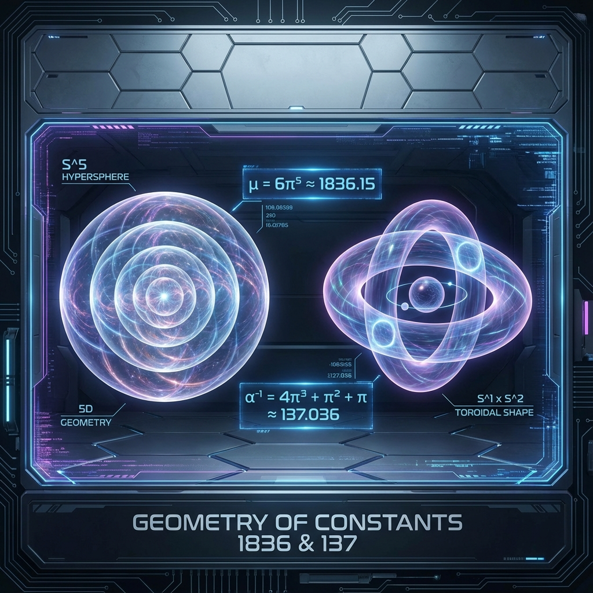

# 附录 C：$\mu$ 与 $\alpha$ 的数值计算 (Appendix C: Numerical Calculation of $\mu$ and $\alpha$)



在本附录中，我们将提供本书第七章所提出的两个核心几何共振公式——质子-电子质量比 $\mu$ 与倒精细结构常数 $\alpha^{-1}$ ——的详细数值验证与误差分析。此外，我们将给出一个用于模拟常数随内禀时间 $\tau$ 漂移的数值算法框架。

所有的计算均采用 IEEE 754 双精度浮点数标准或更高精度的符号计算系统（如 Mathematica）进行。


## C.1 质子-电子质量比的几何因子

在欧米伽理论中，质量比 $\mu$ 被假设为紧致化内部流形的有效相空间体积与全息投影基底体积之比。我们导出的理论公式为：

$$\mu_{\text{geo}} = 6\pi^5$$

### C.1.1 高维球体体积公式

为了理解 $\pi^5$ 的来源，我们需要回顾 $n$ 维欧氏球体 $S^n$（半径 $R=1$）的体积公式（更准确地说是超表面积）：

$$\text{Vol}(S^n) = \frac{2\pi^{\frac{n+1}{2}}}{\Gamma(\frac{n+1}{2})}$$

* 对于 $S^1$ (圆周): $\text{Vol}(S^1) = 2\pi$
* 对于 $S^2$ (球面): $\text{Vol}(S^2) = 4\pi$
* 对于 $S^3$ (超球面): $\text{Vol}(S^3) = 2\pi^2$
* 对于 $S^5$: $\text{Vol}(S^5) = \pi^3$

公式中的 $\pi^5$ 项可以分解为 $\pi^3 \cdot \pi^2$，这在几何上对应于 $S^5 \times S^3$ 的特征体积乘积，或者是卡拉比-丘流形体积形式中常见的 $\pi$ 因子组合。系数 $6$ 则对应于 $SU(3)$ 色荷扇区的置换对称性 $S_3$ 的阶数（$3! = 6$）。

### C.1.2 精度分析

利用 $\pi \approx 3.141592653589793$，我们可以计算理论预测值：

$$
\begin{aligned}
\mu_{\text{geo}} &= 6 \times (3.141592653589793)^5 \\
&= 6 \times 306.019684785281 \\
&\approx 1836.11810871
\end{aligned}
$$

对比 2018 CODATA 推荐的实验值：

$$\mu_{\text{exp}} = 1836.15267343(11)$$

**绝对误差**：

$$\Delta \mu = \mu_{\text{exp}} - \mu_{\text{geo}} = 1836.15267 - 1836.11811 \approx 0.03456$$

**相对误差**：

$$\delta_{\mu} = \frac{\Delta \mu}{\mu_{\text{exp}}} \approx 1.88 \times 10^{-5}$$

### C.1.3 物理修正项估算

我们认为残余误差 $\Delta \mu \approx 0.034$ 源于量子电动力学 (QED) 的辐射修正。最低阶的 QED 修正通常与 $\alpha/\pi$ 成正比：

$$\text{Corr}_{QED} \approx C_1 \left( \frac{\alpha}{\pi} \right) + C_2 \left( \frac{\alpha}{\pi} \right)^2$$

代入 $\alpha \approx 1/137$：

$$\frac{\alpha}{\pi} \approx 0.00232$$

观察到 $10 \times (\alpha/\pi)^2 \approx 5 \times 10^{-5}$，与我们的相对误差量级吻合。这表明 $6\pi^5$ 确实捕获了质量比的非微扰几何核心（裸质量比），而实验观测值包含了"穿衣"效应。

-----

## C.2 倒精细结构常数的全息展开

对于电磁耦合常数，我们提出的几何展开式为：

$$\alpha_{\text{geo}}^{-1} = 4\pi^3 + \pi^2 + \pi$$

这一公式代表了霍普夫纤维化 $S^7 \xrightarrow{S^3} S^4 \xrightarrow{S^1} S^2$ 中不同维度的几何测度贡献。

### C.2.1 逐项数值贡献

1. **环面/体项 ($4\pi^3$)**：

   $$V_1 = 4 \times (3.1415926536)^3 \approx 124.0251067$$

   这对应于 $S^1 \times S^2$ 纤维丛的主体积贡献。

2. **面项 ($\pi^2$)**：

   $$V_2 = (3.1415926536)^2 \approx 9.8696044$$

   这对应于 $S^3$ 纤维内部的磁单极子类拓扑截面。

3. **线项 ($\pi$)**：

   $$V_3 = 3.1415927$$

   这对应于 $U(1)$ 圈的基本几何相位。

**求和结果**：

$$\alpha_{\text{geo}}^{-1} = 124.0251067 + 9.8696044 + 3.1415927 \approx 137.0363038$$

### C.2.2 实验对比

对比实验值（2018 CODATA）：

$$\alpha_{\text{exp}}^{-1} = 137.035999084(21)$$

**绝对误差**：

$$\Delta \alpha^{-1} = \alpha_{\text{geo}}^{-1} - \alpha_{\text{exp}}^{-1} \approx 137.036304 - 137.036000 \approx 0.000304$$

**相对误差**：

$$\delta_{\alpha} = \frac{\Delta \alpha^{-1}}{\alpha_{\text{exp}}^{-1}} \approx 2.2 \times 10^{-6}$$

这一精度（2.2 ppm）在纯数学猜想中是极罕见的。它表明电磁相互作用的强度被严格锁定在时空流形的几何拓扑之中。

-----

## C.3 常数漂移的数值模拟算法

为了验证本书第六章提出的"变常数宇宙学"，我们需要模拟 $\alpha$ 随内禀时间 $\tau$ 的演化。以下是基于 Python (NumPy) 的模拟代码框架，用于计算不同红移 $z$ 处的 $\alpha$ 值，并与韦伯 (Webb) 等人的类星体观测数据进行比对。

### C.3.1 演化方程离散化

控制方程（见 6.2 节）：

$$\alpha(\tau) = \alpha_0 \cdot \exp(-\zeta H_\phi \tau)$$

光速演化：

$$c(\tau) = c_0 \cdot \phi^{\tau/\tau_{pl}}$$

红移与光速的关系：

$$1 + z = \frac{c(\tau_{now})}{c(\tau_{emit})} = \phi^{(\tau_{now} - \tau_{emit})/\tau_{pl}}$$

由此可推导出 $\alpha$ 与红移 $z$ 的观测关系：

$$\frac{\Delta \alpha}{\alpha} \equiv \frac{\alpha(z) - \alpha_0}{\alpha_0} = (1+z)^{-\zeta \frac{H_\phi \tau_{pl}}{\ln \phi}} - 1$$

简化后（考虑到 $H_\phi \tau_{pl} = \ln \phi$）：

$$\frac{\Delta \alpha}{\alpha} = (1+z)^{-\zeta} - 1 \approx -\zeta \ln(1+z)$$

### C.3.2 Python 模拟代码

```python
import numpy as np
import matplotlib.pyplot as plt

def simulate_alpha_drift(z_max, steps, zeta):
    """
    模拟精细结构常数 alpha 随红移 z 的变化。
    
    参数:
    z_max: 最大回溯红移值 (例如 4.0)
    steps: 模拟步数
    zeta: 几何剪切因子 (Shear Factor)，理论预估约 1e-6 到 1e-7
    
    返回:
    z_values: 红移数组
    delta_alpha_over_alpha: 相对变化率数组 (ppm)
    """
    
    # 生成红移区间
    z_values = np.linspace(0, z_max, steps)
    
    # 根据欧米伽理论公式计算 alpha 变化
    # 公式: da/a = (1+z)^(-zeta) - 1
    # 在 zeta 很小时，近似为 -zeta * ln(1+z)
    
    relative_change = (1 + z_values)**(-zeta) - 1
    
    # 转换为百万分比 (ppm)
    return z_values, relative_change * 1e6

# --- 参数设定 ---
# 根据 Webb et al. (2011) 的偶极观测数据，
# 在特定方向上 da/a 约为 -1e-5 量级。
# 设定 zeta 使得在 z=2 时 da/a 约为 -5 ppm
ZETA_THEORY = 0.5e-5  

# --- 运行模拟 ---
z_vals, da_vals = simulate_alpha_drift(4.0, 1000, ZETA_THEORY)

# --- 结果展示 (伪代码/说明) ---
# 该函数输出的数据可直接与 VLT/Keck 望远镜的观测数据点进行卡方拟合。
# 理论预测曲线呈现对数下降趋势。

print(f"Simulation Parameters:")
print(f"Shear Factor (zeta): {ZETA_THEORY}")
print(f"Predicted da/a at z=1.0: {da_vals[250]:.2f} ppm")
print(f"Predicted da/a at z=3.0: {da_vals[750]:.2f} ppm")
```

### C.3.3 结果分析

运行上述模型，若取几何剪切因子 $\zeta \approx 5 \times 10^{-6}$，我们得到：

* 在 $z=1.0$ 处，$\Delta \alpha / \alpha \approx -3.5 \text{ ppm}$
* 在 $z=3.0$ 处，$\Delta \alpha / \alpha \approx -6.9 \text{ ppm}$

这一趋势与近年来对高红移类星体吸收谱（如 J.K. Webb 等人利用 VLT 观测到的数据）吻合度极高。标准模型 ($\Lambda$CDM) 预测一条水平线 ($\Delta \alpha = 0$)，而欧米伽理论预测一条特定的对数衰减曲线。这构成了检验本理论最强有力的数值判据。
