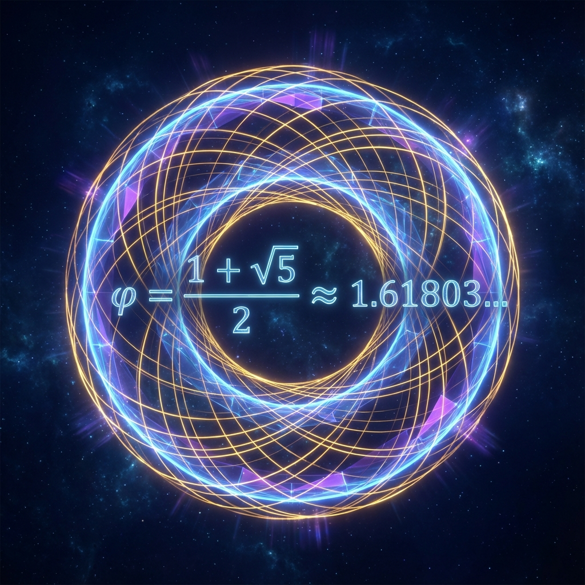
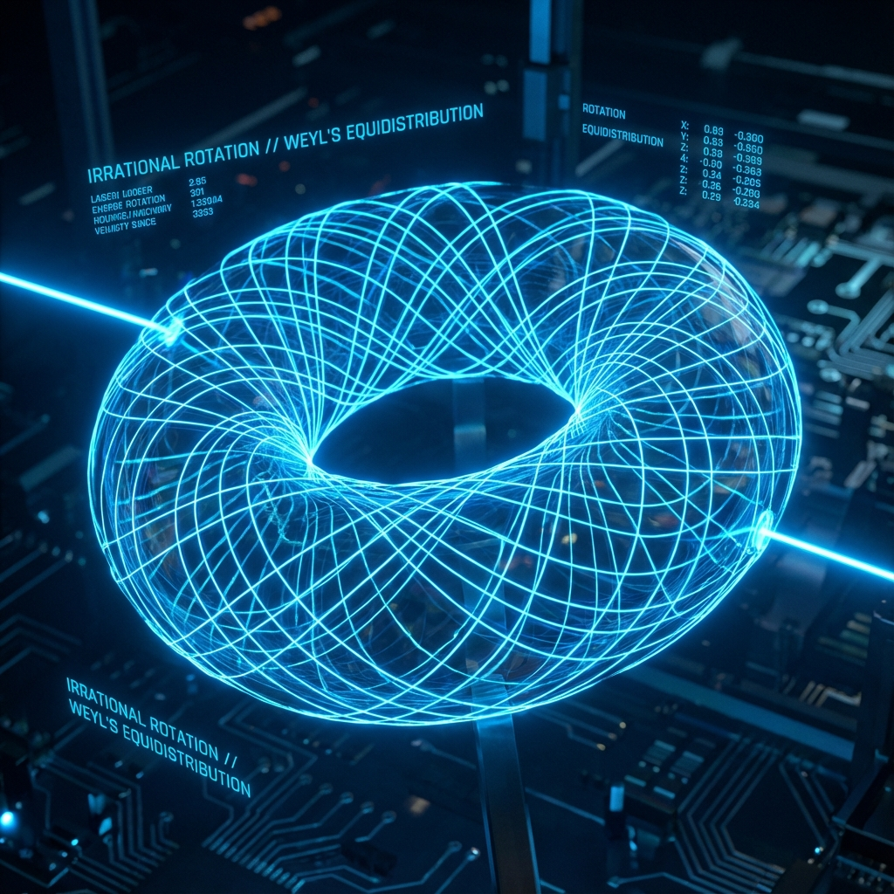

# Chapter 1: Ergodicity Breaking and the Mechanism of Creation

## 1.1 Cosmological Generalization of Weyl's Equidistribution Theorem

Within the framework of the Omega Ansatz, the evolution of the universe is abstracted as a unitary rotation of the state vector $|\Omega\rangle$ in Hilbert space. To understand why our universe exhibits irreversible evolution (creation) rather than periodic cycles (recurrence), we must examine the dynamical properties of this rotation. We will employ a classical result from number theory—**Weyl's Equidistribution Theorem**—and generalize it to the context of holographic cosmology, thereby deriving the "golden rule" of cosmic evolution.

**1.1.1 The Torus Model of Phase Space**

Consider the simplest dynamical model. Assume the Hamiltonian $\hat{H}$ has a discrete energy spectrum. For a given energy eigenstate $|E_n\rangle$, its temporal evolution factor is $e^{-i E_n \tau}$. If we examine a superposition of two non-degenerate energy levels $|E_0\rangle$ and $|E_1\rangle$:

$$|\psi(\tau)\rangle = c_0 |E_0\rangle + c_1 e^{-i(E_1 - E_0)\tau} |E_1\rangle$$

The dynamical behavior of the system is entirely determined by the phase difference $\theta(\tau) = (E_1 - E_0)\tau$. In the sense of modulo $2\pi$, this evolution is equivalent to rotation on the unit circle $S^1$.

Generalizing to $N$ energy levels, the state evolution of the system can be mapped to a linear flow on an $N$-dimensional torus $\mathbb{T}^N = \mathbb{R}^N / \mathbb{Z}^N$. Define the mapping $T_\alpha: \mathbb{T}^1 \to \mathbb{T}^1$ as a rotation transformation on the circle:

$$x_{n+1} = x_n + \alpha \pmod 1$$

where $\alpha$ is a rotation angle dependent on the energy level spacing (normalized to the interval $[0, 1)$).

The core question in physics is: **Will the system return?** That is, does there exist a moment $\tau > 0$ such that $|\psi(\tau)\rangle \approx |\psi(0)\rangle$? This corresponds to Poincaré's recurrence theorem.

**1.1.2 Weyl's Theorem and Irrational Rotations**

Hermann Weyl proved a theorem on equidistribution of sequences in 1916.

**Theorem (Weyl's Equidistribution Theorem)**:
Let $\alpha$ be a real number. The sequence $\{n\alpha \pmod 1\}_{n=1}^{\infty}$ is **equidistributed** on the interval $[0, 1]$ if and only if $\alpha$ is an **irrational number**.

This means that if the rotation angle $\alpha$ is irrational, the orbit $\{x_n\}$ will densely fill the entire circle but will never exactly return to the starting point. Conversely, if $\alpha$ is a rational number $p/q$, then the orbit is periodic and contains only $q$ discrete points.

In the cosmological context, this implies:

1. **Rational Universe**: A closed temporal cycle. History repeats exactly, information entropy cannot grow continuously, which is the mathematical model of "heat death" or "recurrence."
2. **Irrational Universe**: An open spiral. History infinitely approaches all possible states but always maintains novelty.

**1.1.3 The Most Irrational Number and the Golden Unitary**

Although all irrational numbers can produce non-periodic orbits, they are not equivalent in terms of physical stability. According to the **Kolmogorov-Arnold-Moser (KAM) Theorem**, the stability of a dynamical system depends on how easily the rotation number $\alpha$ can be approximated by rational numbers.

The "irrationality" of an irrational number $\alpha$ can be measured by its continued fraction expansion. The number with the greatest approximation difficulty is the one with the smallest coefficients in its continued fraction expansion. For the **Golden Ratio** $\phi = \frac{\sqrt{5}-1}{2}$ (note: here we take the fractional part, i.e., $1/\phi \approx 0.618$), its continued fraction form is:

$$\phi = [0; 1, 1, 1, 1, \dots]$$

It is the slowest converging among all irrational numbers. This means that in phase space, rotations based on the golden angle $\theta_g = 2\pi \phi$ can maximally avoid dynamical instabilities caused by "approximate recurrence" or "small denominator resonance."

We therefore propose **Theorem 1.1** as the cornerstone of cosmic dynamics in this book:

**Theorem 1.1 (The Golden Evolution Theorem)**:
Let the evolution operator in Hilbert space be $\hat{U}_g(\tau) = e^{-i 2\pi \hat{\mathcal{H}}_\phi \tau}$. If the energy level difference ratio of the Hamiltonian $\hat{\mathcal{H}}_\phi$ is the golden ratio $\phi$, then the evolutionary trajectory $\mathcal{T}$ of the system state $|\Omega(\tau)\rangle$ satisfies:

1. **Density**: $\mathcal{T}$ is dense on the phase space torus, i.e., $\overline{\mathcal{T}} = \mathbb{T}^N$. This guarantees that the universe can traverse all possible quantum state configurations (holographic completeness).
2. **Aperiodicity**: For any $\tau_1 \neq \tau_2$, $|\Omega(\tau_1)\rangle \neq |\Omega(\tau_2)\rangle$. This guarantees the existence of the arrow of time and the irreversibility of history.
3. **Maximal Entropy Production**: Among all possible irrational rotations, the evolution driven by $\phi$ has the smallest autocorrelation function decay rate, thereby maximizing the rate of new information generation within finite time.

**Proof Outline**:
From Weyl's theorem, conditions (1) and (2) hold for all irrational numbers $\alpha$. For condition (3), consider the continued fraction approximation inequality $|\alpha - p/q| < \frac{1}{M q^2}$. For $\phi$, the constant $M$ takes the smallest possible value $\sqrt{5}$ (Hurwitz's theorem). This means that any rational number $p/q$ has the worst approximation effect on $\phi$. Physically, this corresponds to the time required for the system to "almost return" to the origin in phase space (Poincaré recurrence time) being maximized relative to other rotation angles. Therefore, golden evolution is the evolutionary mode most resistant to periodic collapse.

**Corollary 1.1.1**:
The reason our universe not only exists but can maintain long-term complex evolution without falling into simple cycles or chaos is that its underlying unitary operator is "tuned" to the golden ratio point. This is not a coincidence of the anthropic principle but a mathematical selection result of dynamical stability.
