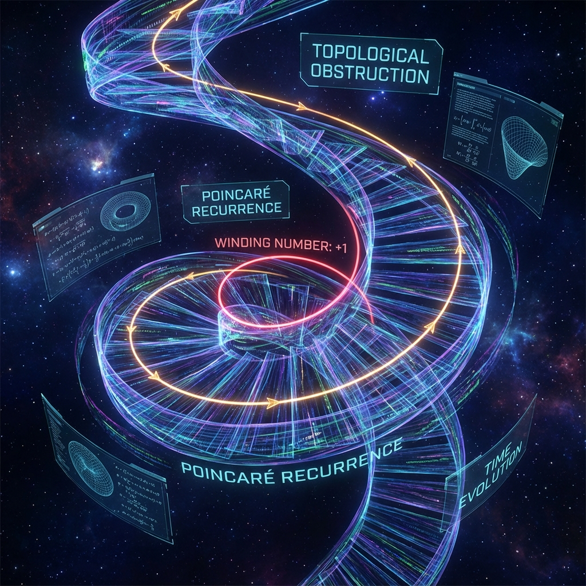
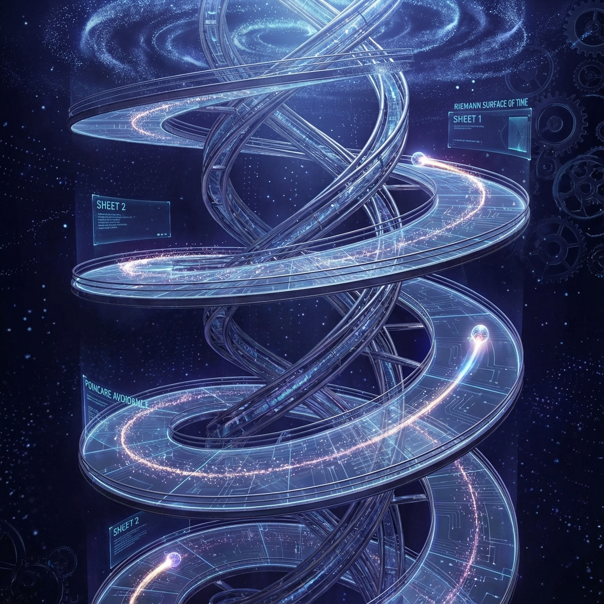

## 1.2 Topological Obstruction of Poincaré Recurrence

In the previous section, we established an irrational rotation model based on the golden ratio $\phi$, demonstrating the density and aperiodicity of cosmic evolutionary trajectories. However, there still exists a stubborn theoretical ghost in classical statistical mechanics and quantum mechanics—**Poincaré Recurrence**.

Poincaré's recurrence theorem states that for a closed dynamical system with finite measure, given sufficient time, the system will necessarily approach its initial state arbitrarily closely. For a bounded quantum system with a discrete energy spectrum, this manifests as the quantum recurrence theorem: there exists a recurrence time $T_R$ such that $\|\psi(T_R) - \psi(0)\| < \epsilon$. If our universe follows this law, then regardless of how irrational $\phi$ is, history will eventually repeat, and creation is merely an illusion of recurrence.

This section will prove that within the framework of Omega Theory, there exists a **Topological Obstruction** mechanism that strictly prohibits Poincaré recurrence in physics. The evolutionary trajectory of the universe is not closed on a torus but unfolds as an infinite spiral on a non-compact Riemann surface.

**1.2.1 The Ghost of Recurrence and Quantum Ergodicity**

Consider the state vector $|\Omega(\tau)\rangle$ in Hilbert space $\mathcal{H}$. If the energy spectrum $\{E_n\}$ is discrete and the state is confined within a finite energy shell, then according to the ergodicity assumption of quantum mechanics, the autocorrelation function $C(\tau) = \langle \Omega(0) | \Omega(\tau) \rangle$ will exhibit quasi-periodic oscillations.

Although golden evolution $\hat{U}_g$ minimizes recurrence probability, relying solely on irrational rotation is insufficient to mathematically eliminate recurrence entirely. Mathematically, the torus $\mathbb{T}^N$ is compact, and any infinitely long self-avoiding curve will necessarily approach itself infinitely many times. This means that if time is merely a linear parameter on the real axis and phase space is compact, then "déjà vu" is inevitable.

To break this cycle, we must destroy the compactness of phase space or introduce a new topological invariant.

**1.2.2 The Riemann Surface Structure of the Evolution Manifold**

Omega Theory introduces a crucial geometric correction: **physical time $\tau$ is not defined on the circle $S^1$, nor even on the real axis $\mathbb{R}$, but on a multi-sheeted Riemann Surface.**

We define a complex time coordinate $z = e^{s + i\tau}$, where $\tau$ is the familiar unitary rotation phase angle, and $s$ is a **Scaling Factor** coupled to it. Recalling the golden unitary operator defined in **Section 0.2** of this book, we note that cosmic evolution is accompanied by exponential growth (or scaling transformation) of the speed of light $c(\tau)$.

This means that the system's phase space $\mathcal{M}$ is not a simple torus $\mathbb{T}^N$ but a **Fiber Bundle** $\mathcal{E}$:

$$F \to \mathcal{E} \xrightarrow{\pi} \mathcal{B}$$

where the base manifold $\mathcal{B}$ is the phase torus we discussed earlier (driven by $\tau$), and the fiber $F$ is a non-compact space constituted by the scaling factor $s$ (or complexity measure).

**Theorem 1.2 (Spiral Topology Theorem)**:
In the extended phase space including scaling flow, the evolutionary trajectory $\gamma(\tau)$ driven by the golden Hamiltonian $\hat{\mathcal{H}}_\phi$ intersects any constant time slice $\Sigma_{t_0}$ at most once. That is, the trajectory has no self-intersections and no approaching self-intersection recurrence points.

**Proof Outline**:
Consider the projection of the evolutionary trajectory onto the complex plane. Standard unitary evolution is $z(\tau) = e^{-i\omega \tau}$, which is a circle.
However, in Omega Theory, the evolution operator contains a **dissipative term** or **Renormalization Group (RG) Flow** component, such that the evolution equation is modified as:

$$\frac{d}{d\tau} |\Omega\rangle = -i \hat{H} |\Omega\rangle + \beta(\hat{H}) |\Omega\rangle$$

where the $\beta$ function is positively correlated with the Fibonacci growth rate.
This causes the trajectory on the complex plane to satisfy the logarithmic spiral equation:

$$r(\theta) = r_0 \phi^{\theta/2\pi}$$

Since $\phi > 1$, for any $\Delta \theta = 2\pi k$ (i.e., when the phase appears to recur), the modulus (or scale) $r$ has already grown by a factor of $\phi^k$.

Therefore, the state points $|\Omega(\tau_k)\rangle$ and $|\Omega(0)\rangle$ are orthogonal in Hilbert space (or exist in different Hilbert space layers), and they are topologically located on different **"Sheets"** of the Riemann surface.

**1.2.3 Winding Number and the Uniqueness of History**

This spiral structure introduces a new topological quantum number: the **Winding Number** $w$.

$$w = \frac{1}{2\pi i} \oint_{\gamma} \frac{dz}{z}$$

In our model, $w$ corresponds to the number of **"Fibonacci periods"** the universe has experienced (i.e., the count in $\tau \approx 1834$ mentioned in the prologue).

**The topological obstruction of Poincaré recurrence** lies in:
Although the phase structures at two moments may be extremely similar ($\tau_1 \equiv \tau_2 \pmod{2\pi}$), their winding numbers $w_1 \neq w_2$.
Since physical laws (particularly effective constants $\alpha, G$) depend on the total area of the holographic screen, and the total area grows exponentially with $w$ ($A \propto \phi^{2w}$), therefore:
**Universes with different winding numbers are physically distinguishable.**

This implies:

1. **Macroscopic Irreversibility**: Even if microscopic particle states accidentally recur, the geometric scale of the background spacetime (the combination of $c, \hbar, G$) has already changed. Yesterday's electron and today's electron, although having the same charge, exist in different holographic resolution environments.
2. **Geometrization of Memory**: The universe's "memory" is not stored in some medium but encoded in the **Homotopy Class** of the trajectory. As long as the spiral does not close, past information is permanently "wound" into the deep topological structure of spacetime, cannot be erased, and cannot be rewritten.

In summary, Poincaré recurrence is obstructed by **fractal growth of dimensions** and **non-compact topology of the evolution manifold**. We live in a spiral universe that **"infinitely approaches the center"** (truth/singularity) but forever remains on different orbits. Each moment $\tau$ is an unrepeatable step in the long march toward the Omega point.
