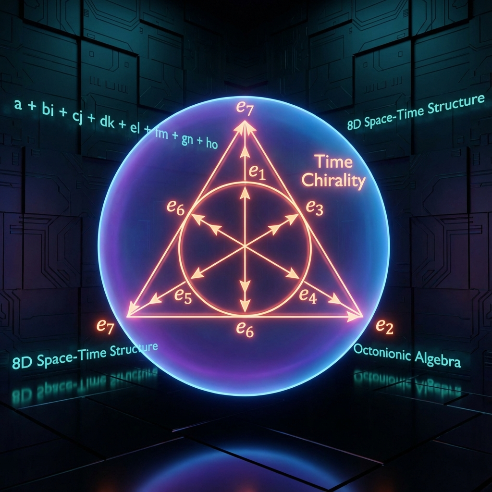
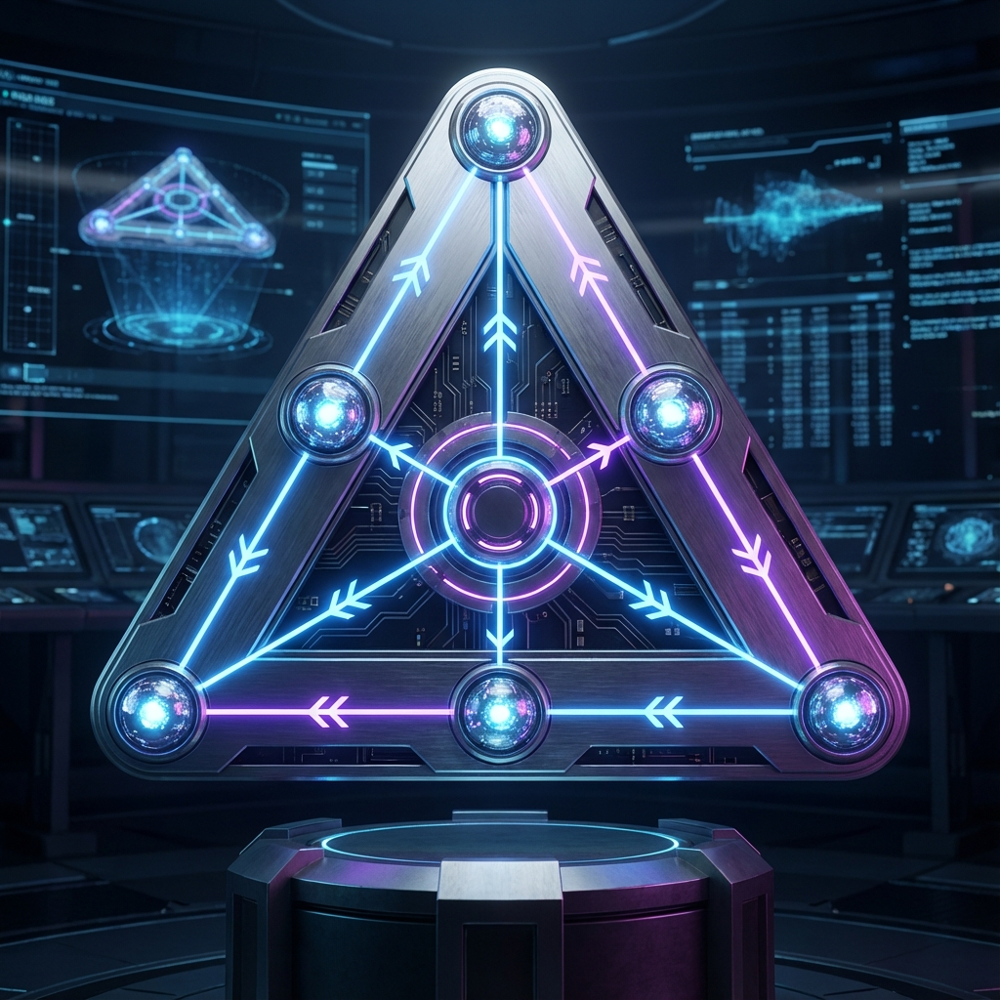

# Chapter 2: Octonionic Fibration and the Origin of Gauge Fields

In Chapter 1, we established a macroscopic dynamical framework based on spectral decomposition of Hilbert space. However, physics must not only explain the flow of time but also the structure of matter—namely, the gauge symmetries ($SU(3) \times SU(2) \times U(1)$) in the Standard Model and the existence of fermions. Why did the universe choose this specific set of symmetry groups? Why does spacetime manifest as 4-dimensional?

This chapter proposes that these seemingly arbitrary physical constants and group structures are actually geometric necessities arising from the projection of the mathematically unique **maximum normed division algebra—the Octonions ($\mathbb{O}$)** onto low-dimensional manifolds. We will prove that the "source code" of physical laws is written in octonions.

## 2.1 The Tangent Space Structure of Non-Associative Algebra ($\mathbb{O}$)

To construct a background-independent geometric theory, we cannot presuppose the dimension of the spacetime manifold $\mathcal{M}$. Instead, the local tangent space structure of the manifold must be generated by the algebra itself. According to **Hurwitz's Theorem**, mathematically there exist only four real normed division algebras: the reals $\mathbb{R}$, complex numbers $\mathbb{C}$, quaternions $\mathbb{H}$, and octonions $\mathbb{O}$.

Among these, the octonions $\mathbb{O}$ are the endpoint of this hierarchical structure (Cayley-Dickson construction). They are the unique algebra with **Non-associativity**. Omega Theory asserts that it is precisely this non-associativity that breaks high-dimensional symmetry, endows time with direction, and generates the material world we observe.

**2.1.1 Basic Definitions of Octonion Space**

The octonion algebra $\mathbb{O}$ is an 8-dimensional real vector space spanned by one real unit $e_0$ (usually denoted as 1) and seven imaginary units $\{e_1, e_2, \dots, e_7\}$. Any octonion $X \in \mathbb{O}$ can be expressed as:

$$X = x_0 e_0 + \sum_{i=1}^7 x_i e_i$$

where $x_\mu \in \mathbb{R}$.

We naturally identify the $x_0$ dimension with **"pre-geometric time"** (or scalar part), and the imaginary subspace $\text{Im}(\mathbb{O})$ with **"pre-geometric space"**. This decomposition $1+7$ hints at the primitive structure of high-dimensional spacetime.

The multiplication rules of octonions are extremely complex but can be memorized through the **Fano Plane**. This is a finite projective plane containing 7 points and 7 lines (one of which appears as an inscribed circle).

The multiplication rules follow the arrow directions in the diagram:

1. **Forward multiplication**: If $e_i, e_j, e_k$ lie on a line with direction $e_i \to e_j \to e_k$, then $e_i e_j = e_k$.
2. **Reverse multiplication**: If going against the arrow direction, a negative sign is introduced, e.g., $e_j e_i = -e_k$ (anti-commutativity).
3. **Non-associativity**: This is the most essential feature of $\mathbb{O}$. For certain triples, the order of multiplication determines the sign of the result. For example:

$$(e_i e_j) e_k \neq e_i (e_j e_k)$$

This algebraic defect prevents the definition of globally consistent matrix representations, forcing physical systems to break high-dimensional structures into low-dimensional associative projections through **"Fibration"**.

**2.1.2 Algebraic Construction of Tangent Space**

In Omega Theory, we define the **Tangent Space** $T_p \mathcal{M}$ of the spacetime manifold as the domain of action of the derivation algebra of algebra $\mathbb{A}$.

For $\mathbb{O}$, its automorphism group is the exceptional Lie group $G_2$. However, when we examine the rotational symmetry of $\mathbb{O}$ on its own imaginary part $\text{Im}(\mathbb{O}) \cong \mathbb{R}^7$, we encounter the $Spin(8)$ group.

**Definition 2.1 (Octonionic Tangent Bundle)**:
The tangent bundle structure of the universe is locally isomorphic to the algebraic structure of $\mathbb{O}$. Every point $p$ on the manifold carries a copy of the octonions. Physical fields (such as gauge fields $A_\mu$) are not merely functions on spacetime but **Connections** linking adjacent octonionic fibers.

Due to the non-associativity of $\mathbb{O}$, parallel transporting a vector $V$ along a closed path back to the origin not only rotates (curvature) but also produces an **"Associator Deficit"**. To eliminate this physically unobservable deficit, the manifold must spontaneously break into smaller, associative subspaces. This directly leads to **Compactification** from 8 dimensions to 4 dimensions.

**2.1.3 Theorem 2.1: Temporal Chirality Isomorphism Theorem**

The non-associativity of octonions is not merely a mathematical quirk; it is the algebraic origin of the **Arrow of Time**.

In associative algebras (such as $\mathbb{R}, \mathbb{C}, \mathbb{H}$), the order of operations is irrelevant: $(AB)C = A(BC)$. This means causal chains are logically "flat," and past and future are symmetric in algebraic structure.

But in $\mathbb{O}$, the order of parentheses must be strictly specified. The operation $A \cdot B$ must occur before its operation with $C$. This mandatory order of operations manifests physically as the rigidity of **Causality**.

**Theorem 2.1 (Temporal Chirality Theorem)**:
If the underlying algebra of the physical universe is the octonions $\mathbb{O}$, and physical evolution is equivalent to algebraic multiplication operations, then the time dimension necessarily has intrinsic chirality. Specifically, the orientation of the Fano plane breaks time-reversal symmetry $\mathcal{T}$.

**Proof Outline**:
Consider the triple $(e_1, e_2, e_4)$ on the Fano plane. Its multiplication table defines a specific cyclic direction. To perform time reversal $t \to -t$ is equivalent to conjugating all imaginary units $e_i \to -e_i$ and reversing the order of multiplication.
In associative algebras, $\overline{AB} = \bar{B}\bar{A}$ still remains in the same algebraic class.
But in non-associative algebras, reversing the multiplication order of all basic elements causes the **Associator** $[x,y,z] = (xy)z - x(yz)$ to change sign.
This means that physical laws "from past to future" and "from future to past" are incommensurable in algebraic structure. For the universe to function, it must choose one orientation of the Fano plane (left-handed or right-handed). This algebraic choice freezes macroscopically as the direction of the thermodynamic arrow of time.

Therefore, we conclude: time flows forward because the universe's source code is **non-associative**. We cannot return to the past, just as we cannot forcibly change the position of parentheses without destroying the octonion structure.
