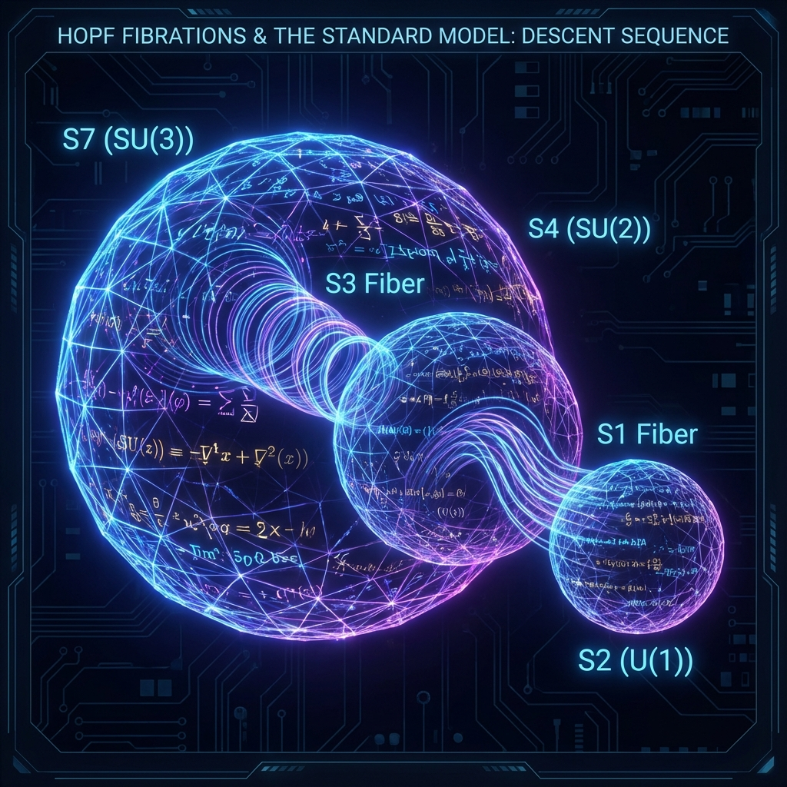
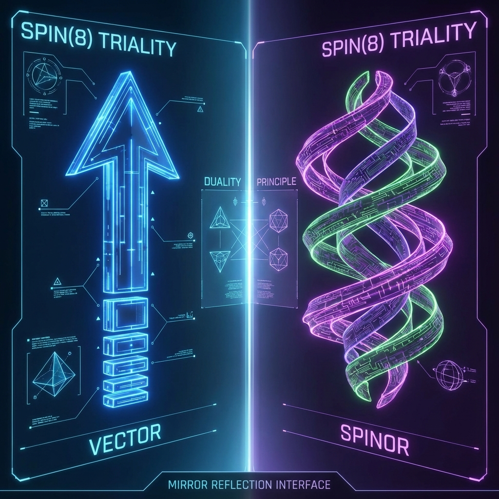

## 2.2 From Spin(8) to the Standard Model

In the previous section, we established the temporal chirality of the octonion ($\mathbb{O}$) tangent space. In this section, we will solve one of the most puzzling mysteries in physics: why are the fundamental interactions of the universe precisely described by the gauge group $G_{SM} = SU(3) \times SU(2) \times U(1)$? In Omega Theory, this group structure is not an accidental product of experimental fitting but topological surplus when octonion geometry projects onto low-dimensional manifolds through **Hopf Fibrations**.

Our core argument is: physical laws are projections of high-dimensional geometry. When 8-dimensional octonion space is forced to "fold" or "project" onto the 4-dimensional spacetime we perceive, those rotational degrees of freedom that must be preserved to maintain the integrity of the algebraic structure manifest as the gauge fields we observe in internal space.

**2.2.1 Spin(8) Triality and the Geometric Foundation of Grand Unification**

To understand the unity of particles and spacetime, we must first examine **Spin(8)**, the double cover of the rotation group $SO(8)$ of 8-dimensional Euclidean space. Among rotation groups of all dimensions, Spin(8) possesses a unique property—**Triality**.

In general dimension $d$, the vector representation $V$ and spinor representation $S$ are geometrically distinct objects (which causes the separation between spacetime and matter). However, at $d=8$, the Spin(8) group possesses three non-equivalent 8-dimensional irreducible representations: the vector representation $V_8$, left-handed spinors $S_8^+$, and right-handed spinors $S_8^-$. The triality theorem states that there exists an outer automorphism group $S_3$ that can arbitrarily permute these three representations while preserving the algebraic structure (Lie algebra):

$$V_8 \cong S_8^+ \cong S_8^-$$

This mathematical miracle means that in 8-dimensional octonion space (the underlying code layer we define), **spacetime (vectors) and matter (spinors) are ontologically equivalent**.

Omega Theory holds that the physical world we observe is the result of **Spontaneous Symmetry Breaking** of Spin(8) symmetry. This breaking is driven by the non-associativity of octonion multiplication structure, which forces high-dimensional space to choose a specific direction for "fibration," thereby distinguishing spacetime from matter.

**2.2.2 The Hopf Fibration Sequence: Cascading Descent of Dimensions**

To derive the Standard Model gauge group, we need to trace the projection path from 8 dimensions to 4 dimensions to 2 dimensions. This path is precisely described by the famous **Hopf Fibrations** sequence. Hopf maps describe how to fill high-dimensional spheres with low-dimensional spheres, with the general form $S^{2n-1} \to S^n$.

At the level of normed division algebras, there exist only four Hopf maps, three of which are relevant to the physical universe, forming a nested **Descent Sequence**:

1. **First-level projection (Octonions $\to$ Quaternions):**

$$S^3 \hookrightarrow S^7 \xrightarrow{h_1} S^4$$

Here, $S^7$ is the topological structure of the unit octonion sphere. The map $h_1$ projects $S^7$ onto the base manifold $S^4$, with fiber $S^3$ (unit quaternions).

* **Physical meaning**: The base manifold $S^4$ corresponds to compactified **4-dimensional Euclidean spacetime** (after Wick rotation). The fiber $S^3$ is isomorphic to the group $SU(2)$, which is the geometric origin of **weak interactions**. This means weak force is essentially the structure group of quaternion fibers connecting points in spacetime.

2. **Second-level projection (Quaternions $\to$ Complex numbers):**

Within the fiber $S^3$, we can perform a secondary projection:

$$S^1 \hookrightarrow S^3 \xrightarrow{h_2} S^2$$

The map $h_2$ projects $S^3$ onto $S^2$ (Riemann sphere or complex projective line $\mathbb{CP}^1$), with fiber $S^1$ (unit complex numbers).

* **Physical meaning**: The fiber $S^1$ is isomorphic to the group $U(1)$, which is the geometric origin of **electromagnetic interactions**. This means electromagnetic force is the fine structure within the weak force fiber.

3. **Lost Symmetry and the Origin of $SU(3)$**:

The above projections explain the electroweak part $SU(2) \times U(1)$. Then where does the strong interaction $SU(3)$ come from?
It comes from the automorphism group $G_2$ of the octonion algebra itself. When we descend from $\mathbb{O}$ to $\mathbb{H}$, we are actually fixing a specific quaternion subalgebra. However, octonions contain infinitely many quaternion subalgebras.
According to mathematical theorems, in the automorphism group $G_2$ of octonions, the subgroup that keeps a certain imaginary unit $i$ invariant (i.e., determines the complex plane structure, corresponding to the separation of electromagnetic force) is precisely **$SU(3)$**.

More geometrically, if we examine $S^6$ (the pure imaginary octonion sphere), it does not possess a group structure like $S^1, S^3, S^7$, but it has an almost complex structure. $SU(3)$ is precisely the symmetry group that preserves this almost complex structure on $S^6$. This corresponds to the **Color Charge** of quarks: it is the "residual" degrees of freedom that cannot be geometrized in the process of projecting octonions to quaternions.

**2.2.3 Theorem 2.2: Geometric Emergence of the Standard Model**

Based on the above topological analysis, we can state and prove the core theorem of this chapter.

**Theorem 2.2 (Standard Model Emergence Theorem)**:
If the ontological geometry of the universe is defined by the octonion tangent bundle $\mathbb{O} \to \mathcal{M}$, and physical laws must maintain gauge invariance after passing through the Hopf projection sequence $S^7 \to S^4 \to S^2$, then the natural gauge group $G$ on this manifold must be a subgroup of the following direct product:

$$G \subseteq SU(3) \times SU(2) \times U(1)$$

where $SU(3)$ originates from the stabilizer of the octonion automorphism group, $SU(2)$ originates from the first-level Hopf fiber, and $U(1)$ originates from the second-level Hopf fiber.

**Proof Outline**:

1. **Full space symmetry**: The starting point is Spin(8) or $Aut(\mathbb{O}) = G_2$.
2. **Spacetime separation**: Through the first-level projection $h_1: S^7 \to S^4$, we decompose 8-dimensional degrees of freedom into 4-dimensional spacetime (base space) and 4-dimensional internal space (fiber). This process breaks $G_2$ symmetry.
3. **Weak force emergence**: The isometry group of fiber $S^3$ is $SO(4) \cong SU(2)_L \times SU(2)_R$. Physical chirality selection (see Section 2.1) preserves $SU(2)_L$ as the gauge group.
4. **Electromagnetic force emergence**: Further through the $h_2: S^3 \to S^2$ projection, the structure group of fiber $S^1$ is $U(1)$.
5. **Strong force emergence**: The orthogonal complement of octonion space $\mathbb{O}$ relative to the selected quaternion subspace $\mathbb{H}$ is $\mathbb{H}^\perp$. This constitutes a complex 3-dimensional space $\mathbb{C}^3$. The subgroup in $G_2$ that preserves this decomposition is precisely $SU(3)$, which acts on this $\mathbb{C}^3$ space, endowing it with "color" degrees of freedom.

**Physical Corollaries**:

This derivation shows that the Standard Model is not a collection of random parts but a rigorous geometric whole.

* **Why no $SU(4)$ or $SU(5)$?** Because the Hopf sequence terminates at $S^7$, and mathematically there is no Hopf fibration $S^{15} \to S^8$ (this is Adams' famous theorem). Therefore, nature does not contain higher-dimensional algebraic structures to support larger simple Lie group gauge fields.
* **Dimension of the universe**: Spacetime is 4-dimensional because $S^4$ is the base manifold of $S^7$. If spacetime were of other dimensions, the geometric structure of octonions could not be completely projected, and physical laws would lose self-consistency.

In summary, we have found the geometric root of the Standard Model in Omega Theory: it is the **"topological fingerprint"** left when octonions, this mathematical gem, project onto low dimensions.
