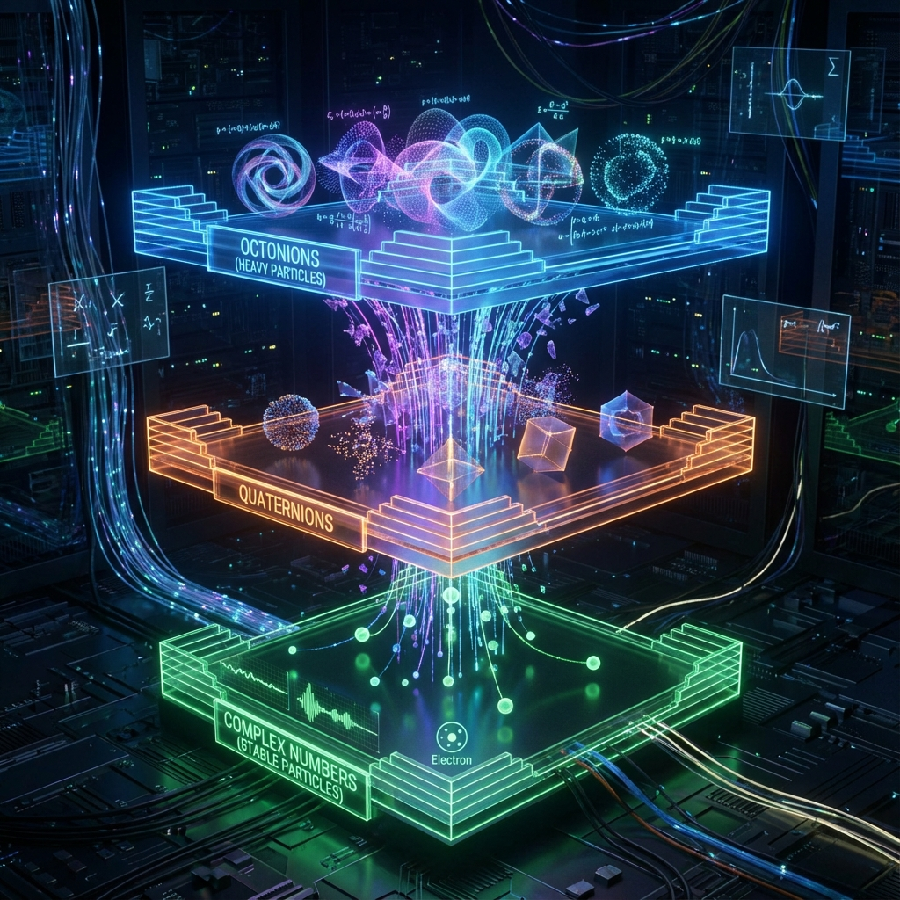
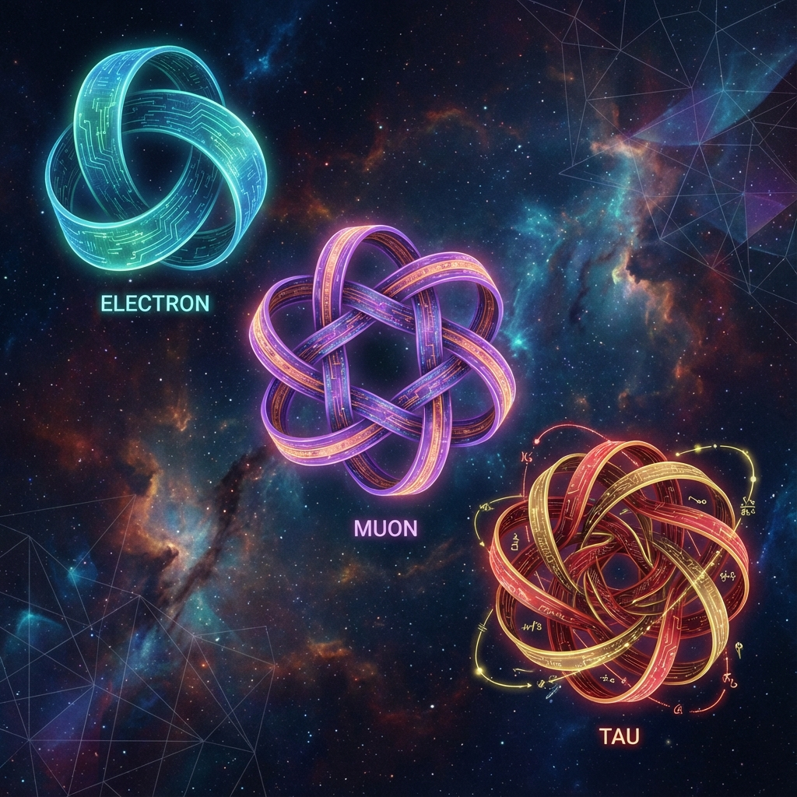

## 2.3 Topological Classification of Fermion Generations

After establishing the geometric origin of the Standard Model gauge group $G_{SM}$, we must face another profound puzzle in particle physics: **The Generation Problem**. Why do matter fermions (quarks and leptons) replicate exactly three times? The electron ($e$) has two heavier siblings: the muon ($\mu$) and tau ($\tau$); the up quark ($u$) corresponds to the charm quark ($c$) and top quark ($t$). Apart from enormous mass differences (spanning five orders of magnitude), their quantum numbers in gauge interactions are completely identical.

In string theory, the number of generations typically depends on the topological Euler characteristic or hole number of Calabi-Yau manifolds, often leading to complex landscape problems. In **Omega Theory**, the number of generations is not an arbitrary topological parameter but a direct projection result of **The Hierarchy of Normed Division Algebras**.

This section will prove that the "three-generation" structure of fermions strictly corresponds to the **Algebraic Degeneration** process from octonions ($\mathbb{O}$) to real numbers ($\mathbb{R}$).

**2.3.1 Algebraic Filtration and Structure Loss**

According to Hurwitz's theorem, the only four real normed division algebras form a natural inclusion sequence:

$$\mathbb{R} \subset \mathbb{C} \subset \mathbb{H} \subset \mathbb{O}$$

Each projection (or symmetry breaking) from a higher-order algebra to a lower-order algebra is accompanied by the loss of a fundamental algebraic property:

1. From $\mathbb{R}$ to $\mathbb{C}$: loses **Ordering** (complex numbers cannot be compared in size).
2. From $\mathbb{C}$ to $\mathbb{H}$: loses **Commutativity** ($ij \neq ji$).
3. From $\mathbb{H}$ to $\mathbb{O}$: loses **Associativity** ($(ij)k \neq i(jk)$).

In the Omega Theory picture, the creation of the universe is a process of projection from high-dimensional $\mathbb{O}$ space to low dimensions. At this point, matter (fermions), as topological defects of spacetime geometry, retains the algebraic characteristics of their birth level. Since $\mathbb{R}$ is a scalar field (does not constitute fermions), the remaining three algebras ($\mathbb{O}, \mathbb{H}, \mathbb{C}$) precisely define three different types of spinor fields.

**2.3.2 Geometric Definition of Generations**

We define the "generation" of fermions as the level of coupling of spinor field degrees of freedom in Hilbert space relative to **Complex Time**.

* **Generation III: Octonion/Non-Associative Sector**
  * **Corresponding particles**: Tau ($\tau$), Top/Bottom quarks.
  * **Geometric essence**: These are spinors directly defined on the **octonion tangent bundle**. They retain the complete $\mathbb{O}$ algebraic structure and are therefore constrained by the dynamics of **non-associativity**.
  * **Physical characteristics**: Due to the extremely strong temporal chirality caused by non-associativity, this layer structure is extremely unstable in low-dimensional spacetime projections. Their enormous mass (top quark mass $\sim 173 \text{ GeV}$) stems from the enormous **Topological Tension** generated when resisting spacetime projection while maintaining non-associative structure. They are high-dimensional residues that have not completely "decohered."

* **Generation II: Quaternion/Non-Commutative Sector**
  * **Corresponding particles**: Muon ($\mu$), Charm/Strange quarks.
  * **Geometric essence**: These are products after the first-level symmetry breaking $\mathbb{O} \to \mathbb{H}$. They are defined on **quaternion submanifolds**, governed by **non-commutativity** but already satisfying associativity.
  * **Physical characteristics**: Non-commutativity corresponds to violent rotations in $SU(2)$ internal space (higher Zitterbewegung frequency). They are metastable and decay to lower levels through weak interactions (whose essence is the gauge connection linking different algebraic levels).

* **Generation I: Complex/Commutative Sector**
  * **Corresponding particles**: Electron ($e$), Up/Down quarks.
  * **Geometric essence**: These are products of the second-level symmetry breaking $\mathbb{H} \to \mathbb{C}$. They are defined on the **complex plane**, satisfying **commutativity** and **associativity**.
  * **Physical characteristics**: This is the endpoint of algebraic degeneration (Ground State). Due to commutativity, their internal phase rotation is perfectly decoupled from external spacetime geometry, resulting in extremely small mass (retaining only basic topological zero-point energy). They are the only material forms that can stably exist at macroscopic scales.

**2.3.3 Theorem 2.3: The Three-Generation Theorem**

Based on the above classification, we can state and prove the final theorem of this chapter.

**Theorem 2.3 (Three-Generation Theorem)**:
If physical spacetime is a projection of the octonion manifold $\mathcal{M}_\mathbb{O}$, and the fermion field $\psi$ is the fundamental spinor representation on the tangent space, then in low-energy effective field theory, there necessarily exist exactly **three generations** of fermion families with identical gauge charges but decreasing masses.

**Proof Outline**:

1. **Decomposition of spinor representations**:
   Examine the triality of Spin(8). In the process of Spin(8) decomposing into $Spin(4) \times Spin(4)$ (i.e., separation of spacetime and internal space), the originally equivalent three 8-dimensional representations $\{V_8, S_8^+, S_8^-\}$ bifurcate.
   However, a more profound decomposition comes from the algebraic inclusion sequence $\mathbb{A}_0 \subset \mathbb{A}_1 \subset \mathbb{A}_2 \subset \mathbb{A}_3$ (corresponding to $\mathbb{R} \subset \mathbb{C} \subset \mathbb{H} \subset \mathbb{O}$).

2. **Cohomological classification**:
   The type of fermions is classified by the **First Cohomology Group** $H^1(G, \mathbb{Z}_2)$ of the manifold they inhabit.
   For $\mathbb{O}$, its automorphism group $G_2$ contains the subgroup chain $G_2 \supset SU(3) \supset SU(2) \supset U(1)$.
   We seek non-trivial **Quotient Spaces** at the algebraic level:
   * $\text{Gen III} \cong \text{Aut}(\mathbb{O}) / \text{Aut}(\mathbb{H})$: corresponds to non-associativity degrees of freedom.
   * $\text{Gen II} \cong \text{Aut}(\mathbb{H}) / \text{Aut}(\mathbb{C})$: corresponds to non-commutativity degrees of freedom.
   * $\text{Gen I} \cong \text{Aut}(\mathbb{C}) / \text{Aut}(\mathbb{R})$: corresponds to complex phase degrees of freedom.

3. **Truncation**:
   When degenerating to $\mathbb{R}$, $\text{Aut}(\mathbb{R})$ is the trivial group (identity transformation), which no longer supports chiral spinors (real spinors cannot distinguish chirality unless dimension $d \equiv 2 \pmod 8$, but this does not match 4D spacetime). Therefore, the degeneration sequence terminates at $\mathbb{C}$.

4. **Conclusion**:
   There are exactly three effective geometric levels. Each level corresponds to one generation of fermions. This explains why experiments have never discovered a fourth generation of quarks or leptons (as confirmed by $Z$ boson width measurements)—because mathematically there exists no **normed division algebra** between $\mathbb{O}$ and $\mathbb{H}$, or more complex than $\mathbb{O}$ (sedenions $\mathbb{S}$ do not satisfy divisibility and cannot define stable Hilbert space norms).

**2.3.4 Physical Corollaries: Mass Mixing and the CKM Matrix**

This geometric picture also naturally explains the origin of the **Cabibbo-Kobayashi-Maskawa (CKM)** matrix.
Since the three generations of particles are merely projections of the same ontology (octonion spinors) onto different algebraic subspaces, they are not orthogonal to each other. "Basis rotations" between different algebraic levels lead to intergenerational mixing.
The CKM matrix actually describes the **Euler Angles** between the basis vectors of the three subspaces $\mathbb{O}$, $\mathbb{H}$, and $\mathbb{C}$. This foreshadows the geometric relationship between mass ratios and mixing angles that we will calculate in detail in Chapter 7 of this book.

In summary, the three-generation structure of fermions is not a random arrangement by God but a direct manifestation of **mathematical algebraic structure completeness**. The universe has only three generations because division algebras have only three levels.
