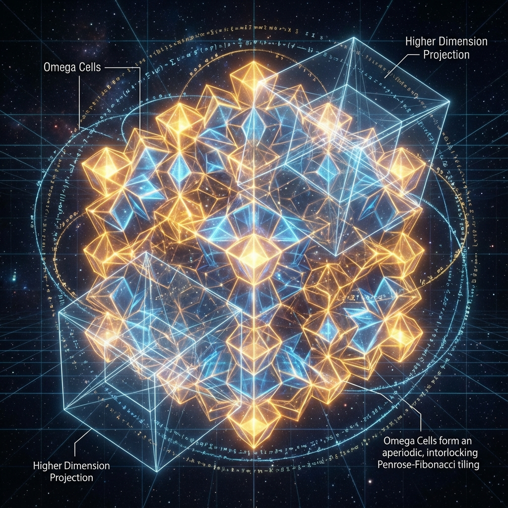
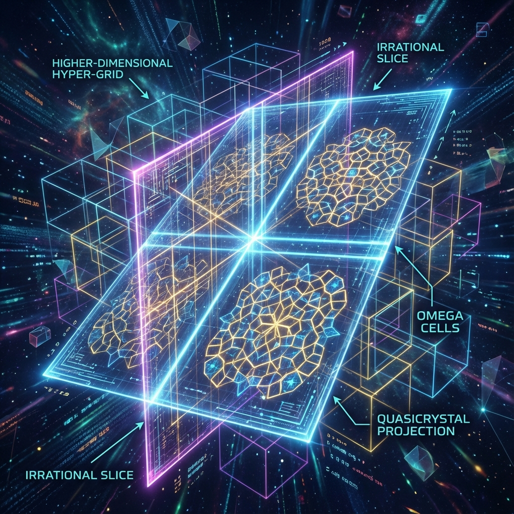

# Part II: Discrete Manifolds and Quantum Gravity

## Chapter 3: The Omega Cell and Causal Structure

In Part I, we constructed the algebraic ontology of the universe, demonstrating how octonion algebra encodes the gauge symmetries and generational structure of physical laws. However, gauge fields must attach to some background—spacetime. General relativity models spacetime as a smooth pseudo-Riemannian manifold $\mathcal{M}$. But at the Planck scale $l_P$, quantum fluctuations render the concept of smooth manifolds invalid, and the metric $g_{\mu\nu}$ loses definition.

This chapter aims to construct a **Background Independent** discrete spacetime model. We abandon the continuous manifold assumption and propose a microscopic structure based on **Quasicrystal** geometry. We will prove that four-dimensional spacetime is not a pre-existing stage but an emergent entity composed of countless basic computational domains called **"Omega Cells"** tiled according to Fibonacci rules.

## 3.1 Penrose-Fibonacci Tiling

To restore macroscopic Lorentz invariance in discrete structures, we cannot use simple periodic lattices (such as cubic grids), because periodic lattices have specific privileged axes that destroy spatial isotropy. The aperiodic tilings discovered by mathematician Roger Penrose provide a perfect solution: they possess long-range order yet have no translational periodicity, and contain fivefold rotational symmetry—which is forbidden in periodic lattices.

**3.1.1 Geometric Definition of the Omega Cell**

We define the fundamental building block of spacetime—the **Omega Cell**—as a spacetime generalization of a four-dimensional **Rhombohedron**, i.e., a **Hyper-rhombohedron**.

**Definition 3.1 (Omega Cell)**:
The Omega cell $\mathcal{C}_\Omega$ is a compact convex set in Minkowski spacetime $\mathbb{R}^{3,1}$, defined as a linear combination of a set of lightlike vectors $\{k_i\}_{i=1}^4$:

$$\mathcal{C}_\Omega = \left\{ x^\mu = \sum_{i=1}^4 \lambda_i k_i^\mu \ \bigg| \ 0 \le \lambda_i \le 1 \right\}$$

where the basis vectors $k_i^\mu$ satisfy the light cone condition $\eta_{\mu\nu} k_i^\mu k_i^\nu = 0$.

Physically, this geometric body corresponds to the intersection of two light cones: a **Causal Diamond** bounded by a light cone opening toward the past (receiving input) and a light cone opening toward the future (sending output).

Unlike standard lattices, the edge lengths of Omega cells are not arbitrary but strictly quantized. According to the holographic principle, each cell encodes finite bits of information.

**3.1.2 Projection Method Construction and the Golden Ratio**

How do Omega cells arrange in vacuum? They follow the rules of **Penrose Tiling**. This tiling can be generated from high-dimensional hypercubic lattices through the **"Cut-and-Project Method"**.

Consider an $N$-dimensional Euclidean space $\mathbb{R}^N$ (for 3D quasicrystals, typically $N=6$), containing a hypercubic lattice $\mathbb{Z}^N$. We select a low-dimensional subspace $E$ (physical space) passing through the origin, such that the direction of $E$ relative to the lattice axes is determined by the **Golden Ratio $\phi$**.

**Construction Process**:

1. **Slice**: Define a "strip" $S = E + K$, where $K$ is the projection of the $N$-dimensional unit hypercube onto the orthogonal complement space $E^\perp$.
2. **Select**: Choose all lattice points $x \in \mathbb{Z}^N \cap S$ that fall within the strip $S$.
3. **Project**: Orthogonally project these points onto the physical subspace $E$.

The resulting point set constitutes vertices $V$ in physical space. The edges connecting these vertices form the skeleton of Omega cells. Since the projection slope involves the irrational number $\phi$, the resulting structure has **Self-similarity** and **aperiodicity**.

**3.1.3 Fibonacci Stacking and Spatial Expansion**

A key property of Penrose tiling is that it contains two types of rhombi ("fat" and "thin"), whose number ratio precisely tends to $\phi$ in the infinite limit. This corresponds to two different quantum states of Omega cells.

More importantly, Penrose tiling supports **"Inflation/Deflation"** operations. Through specific rules, each rhombus in the tiling can be decomposed into smaller self-similar rhombi, and vice versa.

In Omega Theory, this mathematical operation corresponds to physical **cosmic expansion**.
Let $\tau$ be intrinsic time. The lattice constant of the universe (i.e., the characteristic scale of Omega cells) $a(\tau)$ is not fixed but refines as holographic resolution increases:

$$a(\tau_{n+1}) = \phi^{-1} a(\tau_n)$$

This means that the "volume" expansion of physical space is actually **Recursive Subdivision** of the discrete grid.

This fractal structure based on $\phi$ guarantees:

1. **Isotropy**: At large scales, quasicrystals have no special slip planes, and the speed of light $c$ in them is statistically uniform in all directions.
2. **Holographic Completeness**: Any local geometric configuration will repeat at sufficiently large scales (though aperiodic), ensuring redundant backup of information.

In summary, spacetime is not a smooth continuum but a **dynamically growing Penrose-Fibonacci network**. Every node is a logic gate, every edge is an information channel. The continuous geometry we perceive is merely the macroscopic thermodynamic limit of this vast computational graph.
