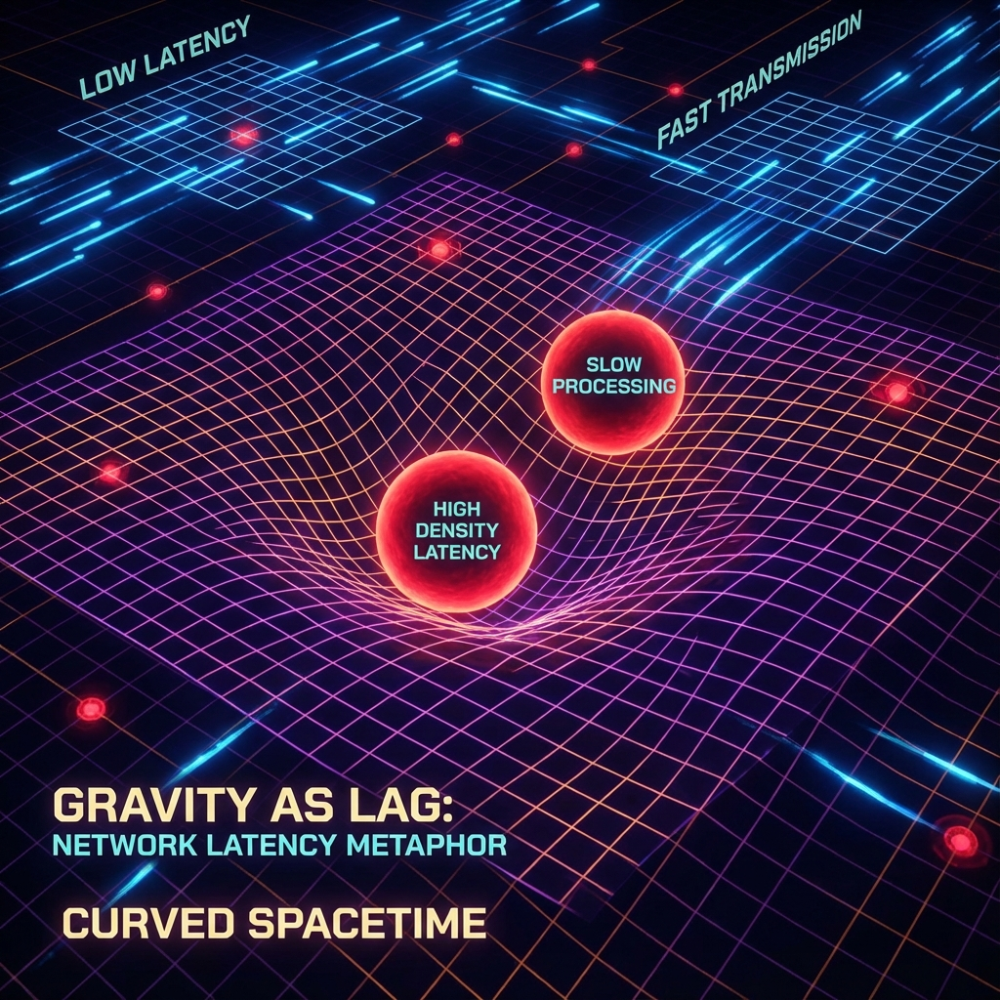

## 3.3 Discrete Riemannian Geometry

In Sections 3.1 and 3.2, we established a flat, statistically isotropic discrete spacetime background. However, the real physical universe is filled with gravitational fields, and spacetime is curved. In general relativity, this curvature is described by the metric tensor $g_{\mu\nu}$ and the Riemann curvature tensor $R^\rho_{\sigma\mu\nu}$. When the underlying manifold is no longer continuous $\mathbb{R}^4$ but a fractal Penrose-Fibonacci grid, we must redefine fundamental geometric concepts such as "distance," "translation," and "curvature."

This section will establish the mathematical framework of **Discrete Riemannian Geometry**. We will prove that the metric and curvature in classical differential geometry are actually statistical averages of information transmission hop counts and topological connectivity deficits in the Omega network at large scales.

**3.3.1 Fibonacci Metric Space**

In continuous geometry, the distance $d(x,y)$ between two points $x, y$ is given by the integral of the metric along a path. In the discrete graph $G = (V, E)$ of Omega Theory, the most natural distance definition is **Graph Geodesic Distance**.

**Definition 3.3 (Combinatorial Distance)**:
Let $x, y \in V$ be two vertices (events) in the Omega network. Their combinatorial distance $d_G(x, y)$ is defined as the **Number of Edges** on the shortest path connecting these two points:

$$d_G(x, y) = \min_{\gamma \in \Gamma_{xy}} |\gamma|$$

where $\Gamma_{xy}$ is the set of all causal paths connecting $x$ and $y$.

However, simple edge counting cannot capture the fractal nature of Penrose tilings. Since the grid is recursively generated, the "shortest path" connecting two distant nodes is not a straight line but a polyline traversing different hierarchical structures.

We introduce the **Fibonacci Renormalized Metric**. Considering that Omega cells can undergo inflation/deflation operations, the physical distance $s$ should be invariant with respect to level $n$.

$$s(x, y) = \lim_{n \to \infty} a_0 \phi^{-n} \cdot d_{G_n}(x, y)$$

where $G_n$ is the grid after $n$ subdivisions, and $a_0$ is the reference scale.

**Theorem 3.2 (Metric Emergence Theorem)**:
In the large-scale limit of the Omega network, the combinatorial distance $s(x,y)$ converges to the geodesic distance on a Riemannian manifold:

$$s^2(x, y) \approx g_{\mu\nu} (x^\mu - y^\mu) (x^\nu - y^\nu)$$

where the effective metric tensor $g_{\mu\nu}$ is determined by the local **Number Density** $\rho(x)$ of grid vertices.

$$g_{\mu\nu}(x) = \eta_{\mu\nu} \cdot \left( \frac{\rho(x)}{\rho_0} \right)^{2/D}$$

This shows that in discrete geometry, **spatial "curvature" is equivalent to "density variation" of the grid**. Regions with strong gravitational fields are essentially regions where Omega cells are more densely packed (richer information processing nodes), causing more logical hops to cross the same physical distance, manifesting as "lengthened distance" or "slowed time."

**3.3.2 Combinatorial Ricci Curvature**

In continuous geometry, curvature describes the angular deviation of a parallel-transported vector after traversing a closed path. In discrete grids, this concept corresponds to **Angle Deficit** or **Combinatorial Curvature**.

For two-dimensional surface triangulations, the curvature $K_v$ at vertex $v$ is given by Descartes' theorem:

$$K_v = 2\pi - \sum_{i} \theta_i$$

where $\theta_i$ are the vertex angles of triangles surrounding vertex $v$.

In four-dimensional Omega networks, we generalize this concept to **Ollivier-Ricci Curvature**. This is a curvature definition based on optimal transport theory (Wasserstein distance), very suitable for handling graph structures and Markov chains.

**Definition 3.4 (Coarse-grained Ricci Curvature)**:
Let $x, y$ be two adjacent points in the network. Consider two probability distributions (or wave function envelopes) $m_x, m_y$ centered at $x$ and $y$. The discrete Ricci curvature $\kappa(x, y)$ is defined as:

$$\kappa(x, y) = 1 - \frac{W_1(m_x, m_y)}{d_G(x, y)}$$

where $W_1$ is the $L^1$-Wasserstein distance (earth mover's distance).

* **Flat space ($\kappa = 0$)**: Perfect state of Penrose tiling. The transport cost from the neighborhood of $x$ to that of $y$ equals the center distance, meaning geodesics are parallel to each other, neither diverging nor converging.
* **Positive curvature ($\kappa > 0$)**: Near gravitational sources. Neighborhood sets are "closer" to each other than the center points (triangle interior angle sum $> 180^\circ$), geodesics converge. This corresponds to **voids** or **compression** in the grid.
* **Negative curvature ($\kappa < 0$)**: Cosmic expansion regions. Neighborhood sets diverge, geodesics separate. This corresponds to **hyperbolic growth** of the grid (such as tree structures).

**3.3.3 Discretization of the Geodesic Equation**

In general relativity, free particles follow the geodesic equation:

$$\frac{d^2 x^\mu}{d\tau^2} + \Gamma^\mu_{\nu\rho} \frac{dx^\nu}{d\tau} \frac{dx^\rho}{d\tau} = 0$$

In Omega Theory, particle motion is a discrete jump sequence $\{x_0, x_1, \dots, x_N\}$. Its dynamics are governed by the **"minimum computation path"** principle.
We define the path action $S[\gamma]$ as the sum of weights of all edges on the path (weight inversely proportional to local grid density).

$$S[\gamma] = \sum_{i=0}^{N-1} \frac{1}{\rho(x_i)}$$

The variational principle $\delta S = 0$ causes particles to always tend to avoid regions of extremely high grid density (unless falling into them), or to gain acceleration in the direction of density gradients.
We can prove that this discrete path selection rule, in the continuous limit, precisely recovers the gravitational deflection effect described by Christoffel symbols $\Gamma^\mu_{\nu\rho}$.

**Summary**:

Gravity in Omega Theory is not a mysterious action-at-a-distance but a manifestation of **inhomogeneity in the topological structure of the information network**.

* **Metric $g_{\mu\nu}$** is a measure of grid density.
* **Curvature $R_{\mu\nu}$** is the deviation of network connectivity from flat Penrose tiling.
* **Matter** is a topological defect causing grid distortion.

This completes the mathematical mapping from discrete graph theory to Riemannian geometry, establishing a solid geometric foundation for deriving Einstein's field equations in subsequent chapters.
