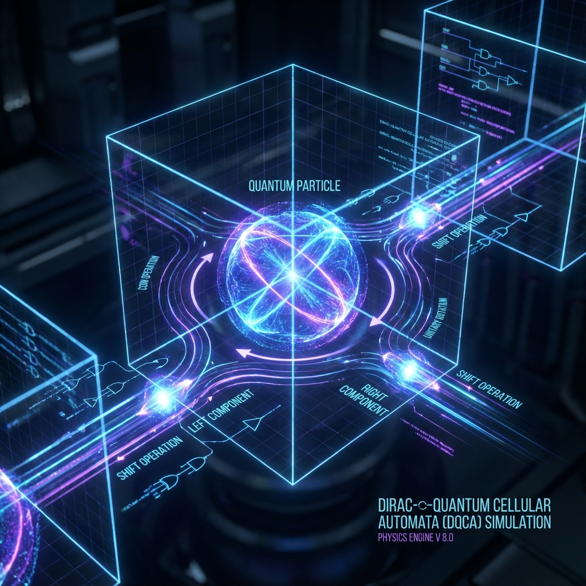
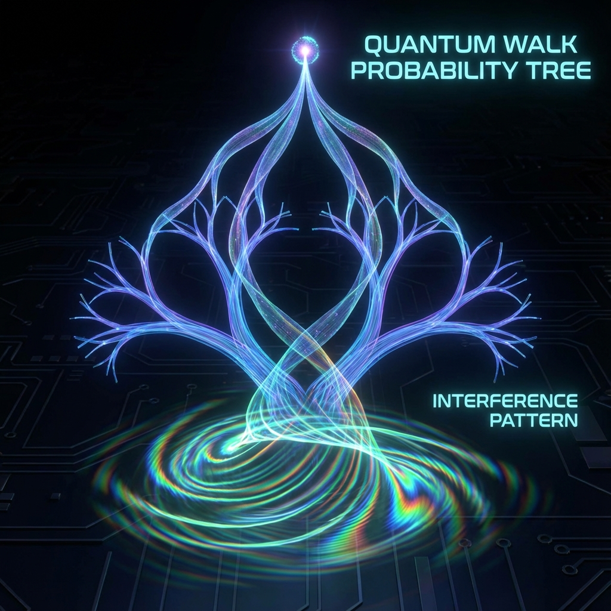

# Chapter 4: Computational Ontology of Quantum Mechanics

In the previous two chapters, we constructed a pre-geometric ontology based on octonion algebra and a discrete spacetime background based on Penrose tiling. Now, we face the most fundamental fracture in contemporary physics: spacetime is geometric (general relativity), while matter is probabilistic (quantum mechanics). In the standard model, quantum mechanics is treated as a self-evident axiomatic system—Hilbert space, wave functions, and the Schrödinger equation are all introduced as a priori assumptions.

**Omega Theory** rejects this dualism. We assert that quantum mechanics is not the underlying rule of this level of the universe but an **Emergent Phenomenon** of discrete information processing systems in the macroscopic statistical limit. Just as the continuity equation of fluid mechanics emerges from discrete collisions of water molecules, the wave equation of quantum mechanics emerges from discrete information jumps on the Omega cell network.

This chapter will prove: any local interaction rules operating on discrete causal graphs that satisfy unitarity (i.e., quantum cellular automata) must follow the Dirac equation in the large-scale limit. This not only eliminates the "wave-particle" opposition but also reveals the **computational ontology** essence of wave functions.

## 4.1 Dirac-Quantum Cellular Automata (DQCA)

Quantum Cellular Automata (QCA) are quantum generalizations of classical Cellular Automata (CA). Unlike classical CA, QCA state evolution must be **Unitary** to ensure total probability conservation; it is also **Reversible**, which ensures information is not erased (consistent with Landauer's principle). We will particularly focus on a class of models called **Dirac-QCA (DQCA)**, as they directly simulate the dynamical behavior of spin-1/2 particles.

**4.1.1 Discrete Hilbert Space and Spin Networks**

Consider the Omega network graph $G = (V, E)$ defined in Chapter 3. We define the Hilbert space $\mathcal{H}_G$ for single-particle states on this graph.
The quantum state $|\Psi(t)\rangle \in \mathcal{H}_G$ of a particle consists of two parts:

1. **Position State**: $|x\rangle$, where $x \in V$ corresponds to grid vertices (Omega cells).
2. **Coin State**: $|s\rangle$, corresponding to the particle's internal degrees of freedom (spin/chirality). In the simplest 1+1 dimensional model, the coin space $\mathcal{H}_C$ is two-dimensional, with basis $\{|R\rangle, |L\rangle\}$ (right-moving and left-moving states).

The full system's state vector can be expressed as a tensor product:

$$|\Psi(t)\rangle = \sum_{x \in V} \psi(x, t) \otimes |x\rangle = \sum_{x \in V} \begin{pmatrix} \psi_R(x, t) \\ \psi_L(x, t) \end{pmatrix} |x\rangle$$

Here, the complex amplitudes $\psi_{R/L}(x, t)$ represent the probability amplitudes of finding a particle with a specific chirality at position $x$ and time $t$.

**4.1.2 Construction of Evolution Operators: Coin and Shift**

On discrete time $\tau \in \mathbb{Z}$, a single-step evolution $\hat{U}_{step}$ of QCA can be decomposed into the ordered action of two fundamental operators: local **Coin Operator ($\hat{C}$)** and non-local **Shift Operator ($\hat{S}$)**.

$$\hat{U}_{step} = \hat{S} \cdot \hat{C}$$

$$|\Psi(t+1)\rangle = \hat{S} \hat{C} |\Psi(t)\rangle$$

**1. Coin Operator $\hat{C}$ (The Coin Operator)**

The coin operator acts on the internal coin space $\mathcal{H}_C$ of each vertex, representing **local processing** or **scattering** of information. This is the topological reorganization occurring inside Omega cells (corresponding to octonion rotations we discussed in Section 2.1).
The most general $SU(2)$ unitary coin operator (matrix representation in the $(R, L)$ basis) is:

$$\hat{C}(\theta) = \bigoplus_{x \in V} \begin{pmatrix} \cos \theta & i \sin \theta \\ i \sin \theta & \cos \theta \end{pmatrix}$$

where $\theta$ is the **Mixing Angle**.

* If $\theta = 0$, the operator is the identity matrix, left and right chiralities do not mix, and particles move only in straight lines.
* If $\theta = \pi/4$ (Hadamard Walk), particles undergo maximum entanglement at each node, causing strong quantum interference.
* **Physical interpretation**: In Section 4.3, we will prove that this mixing angle $\theta$ directly corresponds to the particle's **rest mass** $m_0$. The larger the mass, the greater the flip probability, and the harder it is for particles to undergo long-range displacement.

**2. Shift Operator $\hat{S}$ (The Shift Operator)**

The shift operator determines the particle's jump direction on the lattice based on its internal state (coin state). It is responsible for **information transmission**.
The conditional shift operator defined on a 1D lattice is:

$$\hat{S} = \sum_{x \in \mathbb{Z}} \Big( |x+1\rangle\langle x| \otimes |R\rangle\langle R| + |x-1\rangle\langle x| \otimes |L\rangle\langle L| \Big)$$

Its effect is:

* Components in the $|R\rangle$ state jump one step to the right: $\psi_R(x) \to \psi_R(x+1)$.
* Components in the $|L\rangle$ state jump one step to the left: $\psi_L(x) \to \psi_L(x-1)$.

**4.1.3 Quantum Walk and Causal Cone**

Combining $\hat{C}$ and $\hat{S}$, we obtain the single-step dynamical equation (discrete form):

$$\begin{aligned} \psi_R(x, t+1) &= \cos\theta \cdot \psi_R(x-1, t) + i \sin\theta \cdot \psi_L(x-1, t) \\ \psi_L(x, t+1) &= i \sin\theta \cdot \psi_R(x+1, t) + \cos\theta \cdot \psi_L(x+1, t) \end{aligned}$$

This process is called a **Quantum Walk**. Unlike classical random walks that produce diffusive distributions (Gaussian distribution with width $\sigma \sim \sqrt{t}$), DQCA produces probability distributions exhibiting **Ballistic Transport** characteristics.

**Theorem 4.1 (Speed of Light Bound)**:
For the DQCA defined above, the support set of the wave function at time $t$ for any initial localized state $|\Psi(0)\rangle = |0\rangle \otimes |s\rangle$ is strictly confined within the interval $[-t, t]$.
This shows that even on discrete grids, DQCA strictly obeys **causality**. The maximum jump speed of the grid (1 cell/Tick) is the universe's **speed of light** $c_{grid}$.

Furthermore, the wave function distribution of quantum walks exhibits a characteristic bimodal structure (most probability concentrated at light cone edges), which is topologically isomorphic to the propagation behavior of massless Dirac fields (Green's functions). This suggests that in the Omega network, **"waves" are merely statistical envelopes of numerous discrete information packets under multipath interference**. Quantum mechanics is not describing the undulation of entities but describing **the flow patterns of information on computational graphs**.
