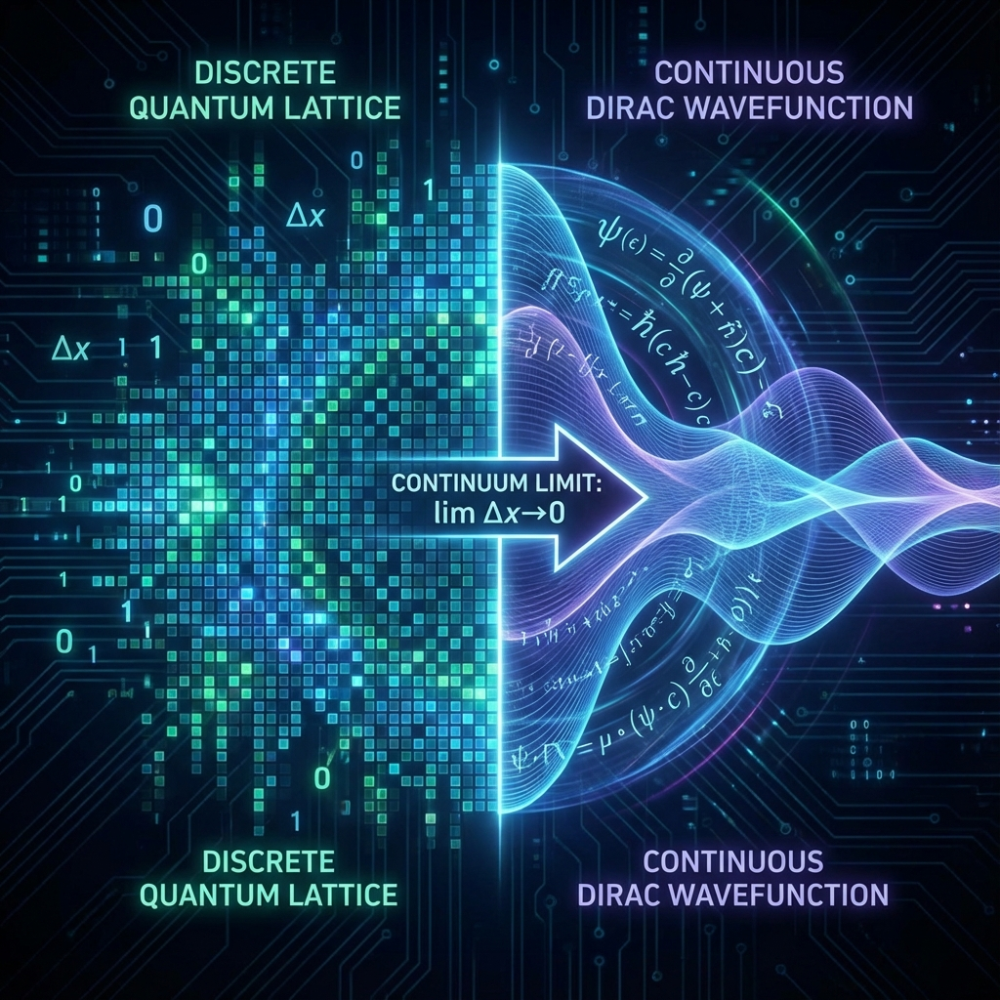
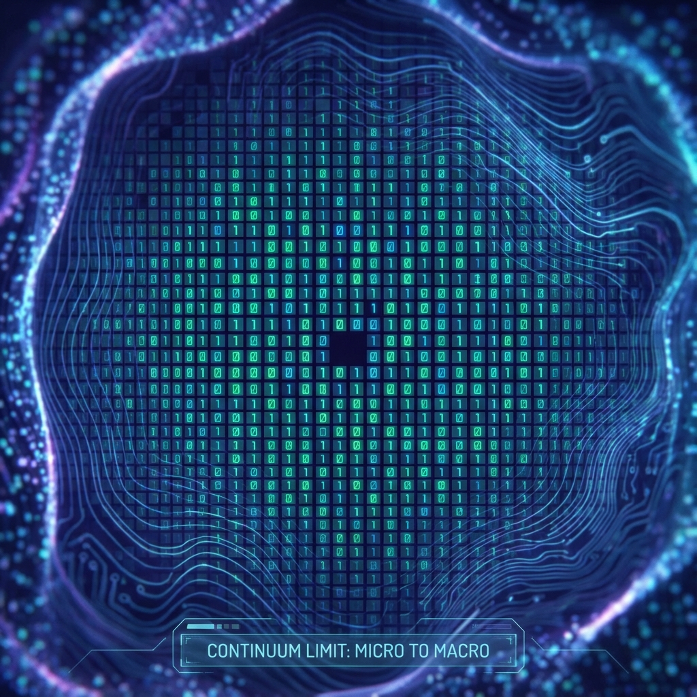

## 4.2 Continuum Limit and Wavefunction Emergence

In Section 4.1, we established the microscopic dynamical model of Dirac-Quantum Cellular Automata (DQCA). This is a completely discrete system defined on a rigid spacetime lattice. However, the physical world we observe in laboratories—at least at current energy scales—exhibits high continuity. Electrons follow partial differential equations (Dirac equation), not difference equations.

The core task of this section is to bridge this gap. We will prove **Theorem 4.2**, that in the limit of extremely fine spacetime grids (lattice constant $\varepsilon \to 0$), the discrete evolution equations of DQCA strictly converge to the continuous Dirac equation. This proof has profound ontological significance: it shows that **the wave function $\psi(x,t)$ is not the primitive state of physical entities but a statistical envelope of underlying discrete information flow under coarse-grained horizons**.

**4.2.1 Scale Transformation and Taylor Expansion**

Consider a one-dimensional DQCA model. Let the spatial step size of the lattice be $\delta x$ and the time step size be $\delta t$. To obtain a meaningful physical limit, we set the speed of light $c = \delta x / \delta t$ as a constant (usually normalized to 1).

We introduce a small quantity $\varepsilon$ and map discrete coordinates $(n, \tau)$ to continuous physical coordinates $(x, t)$:

$$x = n \cdot \delta x, \quad t = \tau \cdot \delta t$$

where $\delta x \sim \varepsilon, \delta t \sim \varepsilon$.

Recalling the discrete dynamical equations from 4.1.3:

$$\begin{aligned}
\psi_R(x, t+\delta t) &= \cos\theta \cdot \psi_R(x-\delta x, t) + i \sin\theta \cdot \psi_L(x-\delta x, t) \\
\psi_L(x, t+\delta t) &= i \sin\theta \cdot \psi_R(x+\delta x, t) + \cos\theta \cdot \psi_L(x+\delta x, t)
\end{aligned}$$

To examine the continuum limit, we need to scale the mass parameter (mixing angle $\theta$). If $\theta$ is constant, then at large scales the particle's flip frequency will tend to infinity, causing particles to be unable to propagate (localized). To obtain particles with finite mass, the mixing angle must decrease linearly with step size $\varepsilon$. Define physical mass $m$ satisfying:

$$\theta = m \cdot \delta t = \frac{m c^2}{\hbar} \delta t \quad (\text{in natural units } \theta \approx m \varepsilon)$$

Now, assuming the wave function $\psi(x,t)$ is sufficiently smooth (which holds for low-energy states), we can perform Taylor series expansion on both sides, retaining terms up to first order in $\varepsilon$ (ignoring $O(\varepsilon^2)$):

**Left side (temporal evolution)**:

$$\psi_{R/L}(x, t+\delta t) \approx \psi_{R/L}(x, t) + \delta t \cdot \partial_t \psi_{R/L}(x, t)$$

**Right side (spatial shift and mixing)**:

Using approximations $\cos\theta \approx 1, \sin\theta \approx \theta \approx m \delta t$, and $\psi(x \pm \delta x) \approx \psi(x) \pm \delta x \cdot \partial_x \psi$.

For the right-handed component $\psi_R$:

$$\begin{aligned}
\text{RHS}_R &\approx (1) \cdot (\psi_R - \delta x \partial_x \psi_R) + i (m \delta t) \cdot (\psi_L - \delta x \partial_x \psi_L) \\
&\approx \psi_R - \delta x \partial_x \psi_R + i m \delta t \psi_L \quad (\text{discarding second-order small quantities})
\end{aligned}$$

For the left-handed component $\psi_L$:

$$\begin{aligned}
\text{RHS}_L &\approx i (m \delta t) \cdot (\psi_R + \delta x \partial_x \psi_R) + (1) \cdot (\psi_L + \delta x \partial_x \psi_L) \\
&\approx \psi_L + \delta x \partial_x \psi_L + i m \delta t \psi_R
\end{aligned}$$

**4.2.2 Algebraic Derivation of the Dirac Equation**

Substituting the Taylor expansions back into the original difference equations, canceling zero-order terms $\psi(x,t)$, and dividing both sides by $\delta t$ (noting $\delta x/\delta t = c = 1$):

$$\begin{aligned}
\partial_t \psi_R &= -\partial_x \psi_R + i m \psi_L \\
\partial_t \psi_L &= +\partial_x \psi_L + i m \psi_R
\end{aligned}$$

Rearranging terms, we obtain a set of coupled first-order partial differential equations:

$$\begin{cases}
(\partial_t + \partial_x) \psi_R = i m \psi_L \\
(\partial_t - \partial_x) \psi_L = i m \psi_R
\end{cases}$$

This is precisely the **1+1 dimensional Dirac equation** in chiral representation. To see this more clearly, we can introduce Pauli matrices. Define the spinor $\Psi = \begin{pmatrix} \psi_R \\ \psi_L \end{pmatrix}$. The above system can be rewritten in matrix form:

$$\left[ I \partial_t + \sigma_z \partial_x \right] \Psi = i m \sigma_x \Psi$$

Or multiply by $i$ and rearrange into standard covariant form (using $\gamma$ matrices, in 1+1 dimensions $\gamma^0 = \sigma_x, \gamma^1 = -i\sigma_y$):

$$(i \gamma^\mu \partial_\mu - m) \Psi = 0$$

Thus, we have completed the mathematical leap from discrete QCA to continuous field theory.

**4.2.3 Theorem 4.2: DQCA Limit Convergence Theorem**

Based on the above derivation, we state the core theorem of this chapter, which guarantees complete compatibility between Omega Theory and existing quantum field theory in the low-energy regime.

**Theorem 4.2 (DQCA Limit Convergence Theorem)**:
Let $\mathcal{A}_\varepsilon$ be a unitary quantum cellular automaton defined on a Penrose-Fibonacci grid with lattice constant $\varepsilon$. If its local update rules satisfy:

1. **Unitarity**: $\hat{U}^\dagger \hat{U} = I$;
2. **Local Causality**: Information transmission speed is limited to 1 cell/step;
3. **Small Mass Limit**: The chirality mixing angle $\theta$ has a linear relationship with time step $\varepsilon$: $\theta = m \varepsilon$;

Then in the continuum limit $\varepsilon \to 0$, the probability amplitude distribution $\Psi(x,t)$ generated by the system evolution operator $\hat{U}^N$ (where $N = t/\varepsilon$) **uniformly converges** to the solution of the massive Dirac equation $(i \not{\partial} - m)\Psi = 0$.

**Proof Notes**:
For the 3+1 dimensional case, the proof is slightly more complex, involving isotropic averaging of the Penrose network (see Section 3.2). On quasicrystal networks, the shift operator $\hat{S}$ is no longer simple left-right movement but a weighted sum along icosahedral vertex directions. According to the quantum analog of the central limit theorem, the tensor product of these discrete displacements averages macroscopically to the gradient operator $\nabla = (\partial_x, \partial_y, \partial_z)$, thereby deriving the 3+1 dimensional Weyl equation (massless limit) or Dirac equation (massive case).

**4.2.4 Physical Interpretation: The Illusory Nature of Waves**

This derivation reveals a startling fact about the ontology of quantum mechanics: **"waves" are not fundamental existence**.

1. **The Nature of Probability Amplitudes**: The complex wave function $\psi$ is merely **Counting Statistics** of discrete bit states on Omega cells. When we say "the probability of an electron appearing somewhere," we are actually counting how many discrete paths in the holographic network converge to that node at that instant.
2. **The Origin of Imaginary $i$**: The mysterious appearance of the imaginary unit $i$ in the Dirac equation directly originates from the coin operator $\hat{C}$ (rotation matrix) in DQCA. It represents a **90-degree logical rotation** or **topological phase accumulation** inside Omega cells. The "phase" in quantum mechanics is essentially the **"azimuth angle"** of microscopic geometry.
3. **The Origin of Mass**: The coupling term $im\psi$ on the right side of the equation shows that mass $m$ is the **coupling strength** between left-handed and right-handed components. Microscopically, this means mass is not an intrinsic property of particles but the frequency at which particles undergo **Chirality Flip** during propagation.

Therefore, quantum mechanics is no longer a puzzling axiomatic system; it is the smooth approximation that **"interactive discrete computational systems"** present to us as **"low-resolution observers"**. Just as images we see on screens appear continuous but are all pixels when magnified, quantum field theory is merely the macroscopic pixel art of Omega Theory.
