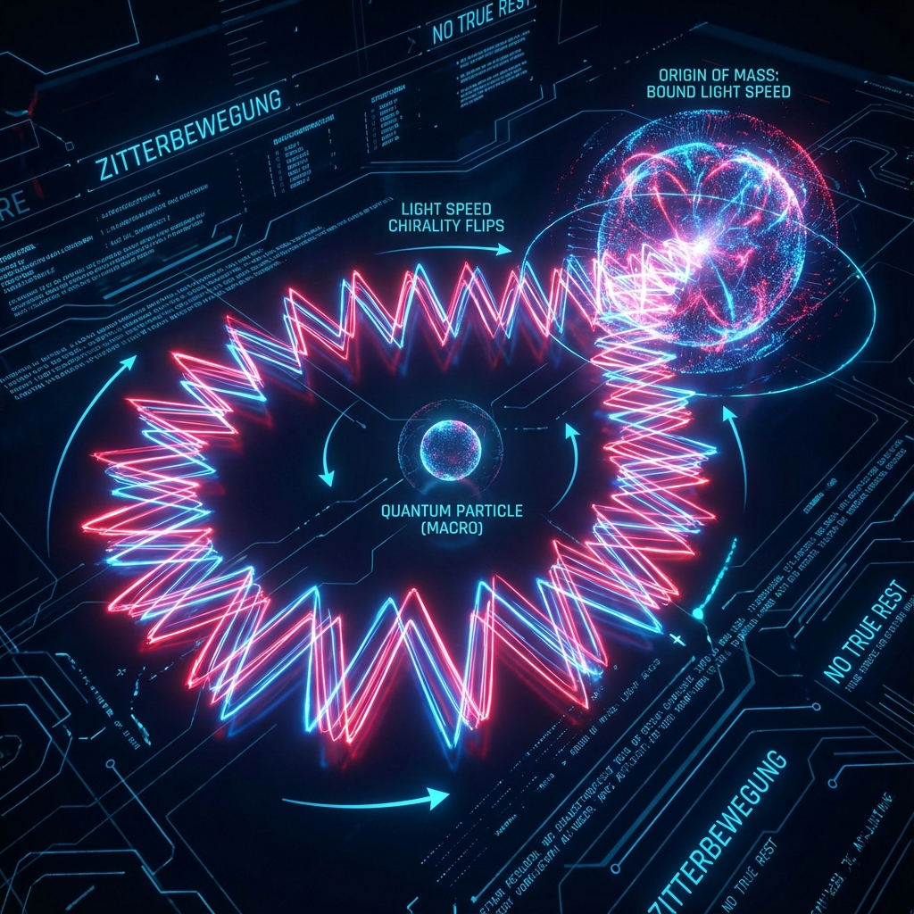
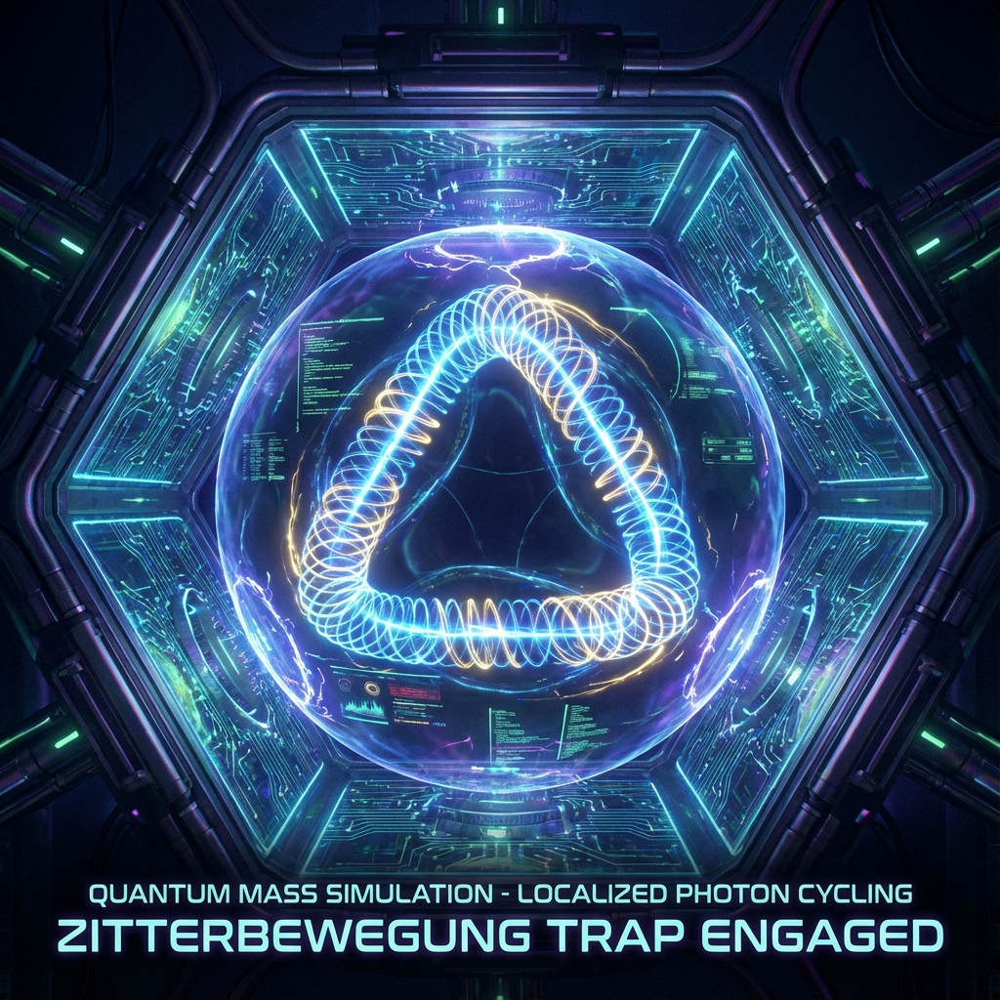

## 4.3 Zitterbewegung and Rest Mass

In Section 4.2, we derived the Dirac equation from Dirac-Quantum Cellular Automata (DQCA) by taking the continuum limit. This derivation process reveals a disturbing yet highly enlightening microscopic picture: on the underlying grid composed of Omega cells, there are no so-called "stationary" particles. Every bit (fermion component) must move at the lattice speed of light $c_{grid}$.

This raises a classic puzzle: if microscopic components always move at the speed of light, how do macroscopic objects acquire **Rest Mass** and appear stationary?

This section will use the **Zitterbewegung** phenomenon to answer this question. We will prove that rest mass is not an intrinsic property of particles but an **"average lag effect"** produced when particles undergo high-frequency chirality flipping on the Omega network. Mass is essentially the frequency at which information flow is "tripped up" by topological structure.

**4.3.1 The Dirac Velocity Paradox**

In standard quantum mechanics, the Schrödinger operator $\hat{v} = \hat{p}/m$ describes particle velocity. However, for relativistic Dirac electrons, the Heisenberg equation of motion gives the velocity operator as:

$$\hat{v} = \frac{d\hat{x}}{dt} = \frac{1}{i\hbar} [\hat{x}, \hat{H}] = c \boldsymbol{\alpha}$$

where $\boldsymbol{\alpha}$ are Dirac matrices. Since the eigenvalues of $\alpha_i$ are only $\pm 1$, this means that if we precisely measure an electron's velocity at any instant, the result can only be $+c$ or $-c$.

This seemingly absurd conclusion is called the **Dirac Velocity Paradox**. To reconcile this contradiction, Schrödinger discovered in 1930 that Dirac electron wave packet motion actually consists of two parts:

$$\hat{x}(t) = \hat{x}(0) + \hat{v}_{cl} t + \hat{\xi}(t)$$

where $\hat{v}_{cl} = c^2 \hat{p} \hat{H}^{-1}$ is the familiar classical group velocity ($< c$), and $\hat{\xi}(t)$ is an extremely high-frequency ($\omega \approx 2mc^2/\hbar$), extremely small-amplitude ($\sim \lambda_c$ Compton wavelength) oscillatory term. This oscillation is **Zitterbewegung**.

In the standard model, Zitterbewegung is often regarded as a mathematical artifact or interference from vacuum fluctuations. But in **Omega Theory**, Zitterbewegung is **physical reality**. It is a direct manifestation of DQCA discrete dynamics.

**4.3.2 Zigzag Paths on the Omega Lattice**

Returning to our DQCA model. Particle states are superpositions of left-handed $|L\rangle$ and right-handed $|R\rangle$.
According to evolution rules, $|R\rangle$ always jumps right, $|L\rangle$ always jumps left.

Consider a stationary electron (macroscopic momentum $\langle \hat{p} \rangle = 0$). At the microscopic level, this means equal amplitudes for left and right-handedness in the wave function:

$$|\psi\rangle = \frac{1}{\sqrt{2}} (|R\rangle + |L\rangle)$$

At each time step $\tau$, the **coin operator $\hat{C}$** inside Omega cells (corresponding to the mass term) mixes these two states.

* **Step 1**: The particle moves one cell to the right at light speed.
* **Step 2**: Encounters topological scattering (coin flip), part of the probability amplitude converts to left-handedness.
* **Step 3**: The left-handed component moves one cell to the left at light speed.

Macroscopically, the particle appears not to have moved; it stays in place. But microscopically, it is frantically **"zigzagging"** between adjacent Omega cells at light speed.

**Definition 4.1 (Effective Mass)**:
Mass $m$ is the **transition probability density** for a particle to change its direction of motion. In DQCA, this corresponds to the mixing angle $\theta$ of the coin operator.

$$m \propto \frac{\theta}{\epsilon}$$

The more frequently a particle flips, the slower it advances macroscopically, and the greater the **Inertia** it exhibits.

**4.3.3 Geometric Interpretation of the Higgs Mechanism**

This provides a purely geometric explanation of the Higgs Mechanism without introducing scalar fields.

In the standard model, particles acquire mass by "rubbing" against the Higgs field that fills the universe. In Omega Theory, this "Higgs field" is the **topological structure of the Omega grid itself**.

1. **Massless particles (photons/Weyl fermions)**: Correspond to the case $\theta = 0$. Particles encounter no "geometric obstacles" on the grid; they maintain a single chirality and propagate along straight lines at speed $c$. This explains why photons have no rest mass—because they don't flip.
2. **Massive particles (electrons/quarks)**: Correspond to $\theta \neq 0$. The octonion multiplication structure inside Omega cells forces the wave function to undergo **non-commutative rotation** of phases during propagation. When projected onto 4D spacetime, this rotation manifests as periodic conversion between left and right-handedness.

**Theorem 4.3 (Mass-Frequency Equivalence Principle)**:
A fermion's rest mass $m_0$ is strictly equivalent to its **Chirality Flip Frequency** $\nu_{flip}$ on the Omega lattice.

$$m_0 c^2 = h \cdot \nu_{flip}$$

This is actually an inverse reading of the de Broglie relation: not "particles with mass have frequency," but **"processes with specific flip frequencies are perceived as mass"**.

**4.3.4 From Microscopic Light Speed to Macroscopic Group Velocity**

We can quantitatively derive the relationship between macroscopic velocity $v$ and microscopic light speed $c$.
Let $N_R$ be the number of steps the particle jumps right, $N_L$ the number of steps it jumps left. Total time $t = (N_R + N_L) \delta t$.
Macroscopic displacement $x = (N_R - N_L) \delta x$.
Then the macroscopic velocity is:

$$v = \frac{x}{t} = \frac{N_R - N_L}{N_R + N_L} \frac{\delta x}{\delta t} = c \cdot (2P_R - 1)$$

where $P_R$ is the average probability of the particle being right-handed.

* For massless particles, chirality is conserved, $P_R = 1$ (or 0), so $v = c$.
* For massive particles, due to frequent flipping, $P_R \approx 0.5$ (slightly deviated), resulting in $v \ll c$.

**Conclusion**:

Zitterbewegung is not a quantum ghost; it is direct evidence of **spacetime discreteness**. Every electron in our bodies has mass and can form stable atoms instead of flying apart at light speed because they are captured by the geometric structure of the Omega grid, locked in an eternal, light-speed microscopic oscillation.

There is no true rest in the universe, only **bound light speed**.
