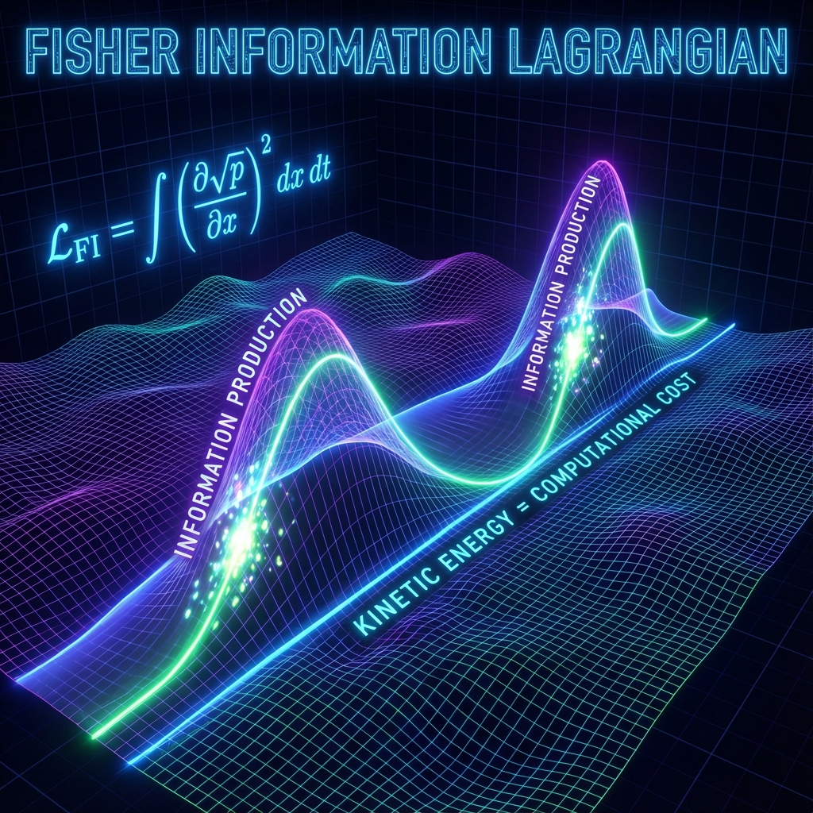
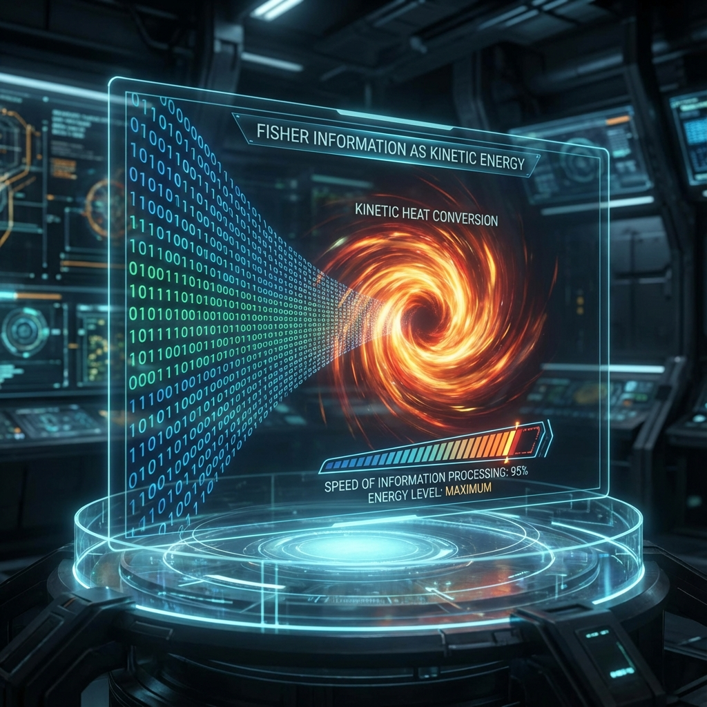

# Part III: Holographic Dynamics

## Chapter 5: The Omega Action Principle

In the previous two parts, we constructed the static ontology of the universe (Hilbert space vector $|\Omega\rangle$) and the discrete spacetime background (Omega grid). Chapter 4 proved that at microscopic scales, discrete quantum cellular automata naturally emerge wave functions satisfying the Dirac equation. However, to establish a complete unified field theory, we must explain the dynamical origin of macroscopic physical laws: why do particles follow the principle of least action? Why do gravitational field equations have specific forms?

This chapter proposes **The Omega Action**, denoted $S_\Omega$. We assert that the famous **Principle of Least Action** in physics is essentially the **"Principle of Least Computational Complexity"** in computation theory. The universe is an optimization algorithm seeking to process maximum information at minimum bit cost. We will prove that by minimizing Fisher Information and imposing topological constraints, we can derive the core Lagrangians of the Standard Model and General Relativity.

## 5.1 Fisher Information Lagrangian

In classical mechanics, the Lagrangian is usually defined as kinetic energy minus potential energy ($T-V$). Although this definition is mathematically valid, it is ontologically arbitrary. Why does kinetic energy take a quadratic form? Why is potential energy determined by position? Within the framework of **Information Geometry**, these physical quantities gain deeper interpretation: they are geometric measures on probability distribution manifolds.

**5.1.1 Physical Reality as Probability Distribution**

Recalling the axioms of Part I, matter fields $\psi(x)$ are essentially probability amplitude distributions on the Omega grid. According to B. Roy Frieden's pioneering work, the essence of physical measurement is extracting information from systems. The measure describing the efficiency of this extraction process is **Fisher Information**.

For a probability density function $p(x) = |\psi(x)|^2$ parameterized by spacetime coordinates $x^\mu$, its Fisher Information $I$ is defined as:

$$I = \int \frac{1}{p(x)} \left( \frac{\partial p}{\partial x^\mu} \right) \left( \frac{\partial p}{\partial x_\mu} \right) d^4x$$

This quantifies how dramatically the probability distribution changes with position. If the distribution is extremely flat (disordered), information is extremely low, gradients are zero; if the distribution is highly localized (ordered), information is extremely high.

In Omega Theory, we generalize this concept to complex amplitudes $\psi$, constructing **Omega Information Flux Density**:

$$J_\mu = \frac{\partial \psi}{\partial x^\mu}$$

Then the corresponding Fisher Information $I_\Omega$ is proportional to the modulus squared of the gradient:

$$I_\Omega \propto \int g^{\mu\nu} (\nabla_\mu \psi)^\dagger (\nabla_\nu \psi) \sqrt{-g} d^4x$$

**5.1.2 Derivation of the Kinetic Term**

We observe that the form of $I_\Omega$ remarkably coincides with the **Kinetic Term** of scalar or spinor fields. This is no coincidence.

**Theorem 5.1 (Information-Kinetic Equivalence Principle)**:
The kinetic term $\mathcal{L}_{kin}$ of any physical field is essentially the **Fisher Information Production Rate** when that field propagates on the spacetime manifold. Minimizing the action $S \sim \int \mathcal{L}_{kin}$ is equivalent to requiring the system to transmit probability amplitudes in the smoothest way (minimal information loss) during evolution.

For spin-1/2 Dirac fields $\Psi$, we introduce the covariant derivative $\mathcal{D}_\mu$ to include gauge connections (i.e., the $SU(N)$ geometry derived in Chapter 2). At this point, the information-based Lagrangian density $\mathcal{L}_{\text{Info}}$ is:

$$\mathcal{L}_{\text{Info}} = \bar{\Psi} i \gamma^\mu \mathcal{D}_\mu \Psi$$

This term represents the **"software-hardware interaction cost"**: the computational bandwidth consumed when the wave function $\Psi$ (software) flows on the curved spacetime background $g_{\mu\nu}$ (hardware).

**5.1.3 Topological Potential and Geometric Constraints**

If the universe contained only $\mathcal{L}_{\text{Info}}$, the system would tend toward maximum entropy uniform distribution (heat death). To generate structure, constraint terms must be introduced. In the Standard Model, this is achieved by artificially introducing potential energy terms $V(\phi)$. In Omega Theory, potential energy terms originate from **topological geometric constraints**.

Recalling Section 1.2, the universe must evolve along the Fibonacci spiral. Any state deviating from this **Golden Trajectory** generates enormous "geometric tension." We formalize this tension as **Topological Potential** $\mathcal{V}_{\text{Topo}}$.

$$\mathcal{V}_{\text{Topo}}(\Psi) = \lambda \left( |\Psi|^2 - \rho_{\phi}(\tau) \right)^2$$

where $\rho_{\phi}(\tau) \propto \phi^{2\tau}$ is the ideal information density determined by the golden unitary operator.

* When the system's local information density $|\Psi|^2$ matches the Fibonacci growth rate of the cosmic background, the potential is zero, and the system is in a **resonant state**.
* When deviations occur (e.g., formation of overly dense black holes or under-dense voids), $\mathcal{V}_{\text{Topo}}$ increases dramatically.

Furthermore, to break time-reversal symmetry (see Section 2.1), we must introduce a **Chiral Term**, typically manifesting as a topological Chern-Simons term:

$$\mathcal{L}_{\text{Chiral}} = \kappa \epsilon^{\mu\nu\rho\sigma} F_{\mu\nu} F_{\rho\sigma}$$

This locks the direction of the arrow of time.

**5.1.4 Total Omega Action**

Combining the above terms, we write the ultimate formula governing the interactive computational universe—**The Omega Action**:

$$S_{\Omega} = \int_{\mathcal{M}} d^4x \sqrt{-g} \left[ \underbrace{\frac{R}{16\pi G_{\text{eff}}}}_{\text{Geometric Entropy (Hardware)}} + \underbrace{\bar{\Psi} i \gamma^\mu \mathcal{D}_\mu \Psi}_{\text{Fisher Information (Software)}} - \underbrace{\lambda (|\Psi|^2 - \phi^{\tau})^2}_{\text{Fibonacci Constraint}} + \underbrace{\mathcal{L}_{\text{Chiral}}}_{\text{Chirality}} \right]$$

The physical meaning of this formula can be reinterpreted as the **Principle of Least Computational Complexity**:

1. **First term ($R$)**: Minimize the curvature of the spacetime grid, i.e., maintain the flatness of the hardware architecture.
2. **Second term ($\mathcal{D}_\mu$)**: Minimize the gradient of information flow, i.e., find optimal transmission paths.
3. **Third term ($\phi$)**: Force system output to synchronize with the golden ratio growth rate, i.e., satisfy system clock frequency.
4. **Fourth term (Chiral)**: Force causal ordering of computational processes.

"Forces" in physics, whether gravitational, electromagnetic, or strong, are **Lagrange Multipliers** generated to satisfy the above **optimization algorithm** within this framework. Particle trajectories are the "least-effort" computational paths found macroscopically by the cosmic computer.
