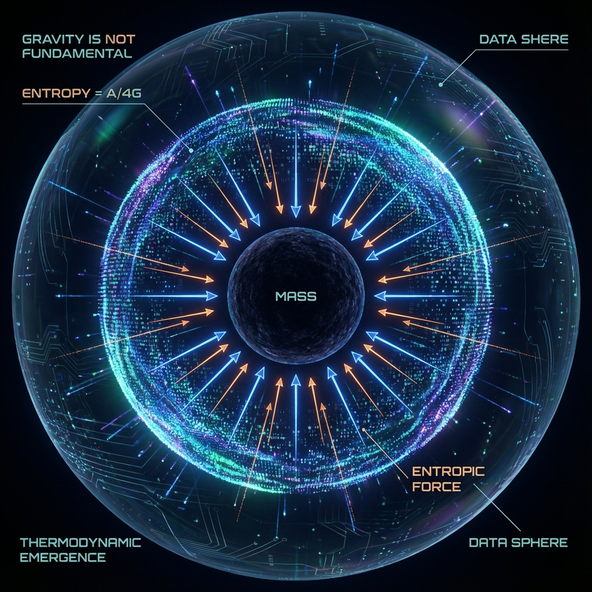
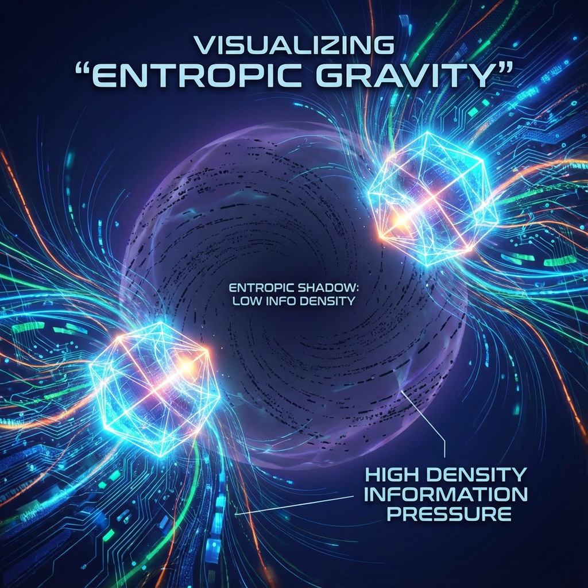

## 5.3 The Entropic Nature of Gravity

In Section 5.2, we derived modified Einstein field equations through variation of the Omega action. However, the field equations themselves do not explain the *origin* of gravity. In the standard model, gravity is assumed to be a fundamental interaction, similar to electromagnetic force. But within the computational ontology framework of Omega Theory, this view is untenable. If spacetime itself is an emergent computational network, then the "force" that distorts this network cannot be fundamental.

This section will prove: **Gravity is not a fundamental force but an Entropic Force.** It arises from the statistical tendency of systems to maximize information entropy on holographic boundaries. More specifically, we will establish strict mathematical equivalence between **gravitational potential and Computational Lag**, thereby revealing the microscopic mechanism of "matter tells spacetime how to curve": high-density information processing necessarily leads to reduction of local clock frequency.

**5.3.1 Holographic Screen Thermodynamics**

Our derivation is based on the pioneering work of Jacob Bekenstein and Erik Verlinde, generalized to the Omega discrete grid.

Consider a static spherically symmetric matter distribution with mass $M$. In Omega Theory, we can define a closed surface $\mathcal{S}$ enclosing this matter as a **Holographic Screen**.
According to the holographic principle, this screen encodes all information of the interior volume. The total number of bits (degrees of freedom) $N$ on the screen is determined by its area $A$:

$$N = \frac{A}{l_P^2} = \frac{4\pi R^2}{l_P^2}$$

where $l_P$ is the characteristic scale of Omega cells (Planck length).

In thermodynamic equilibrium, according to the equipartition theorem, the system's total energy $E = Mc^2$ is uniformly distributed on each bit of the holographic screen. Let the average temperature of the holographic screen be $T$, then:

$$E = \frac{1}{2} N k_B T$$

Here, "temperature" $T$ is not thermal temperature but **Unruh Temperature**, which measures the intensity of vacuum quantum fluctuations. For an observer with proper acceleration $a$ at the position of this holographic screen, the perceived vacuum temperature is:

$$k_B T = \frac{\hbar a}{2\pi c}$$

**5.3.2 Information-Theoretic Derivation of Newton's Law**

We combine the above two thermodynamic equations, eliminating temperature $T$:

$$Mc^2 = \frac{1}{2} \left( \frac{4\pi R^2}{l_P^2} \right) \left( \frac{\hbar a}{2\pi c} \right)$$

Using the definition of gravitational constant $G \equiv \frac{c^3 l_P^2}{\hbar}$ (in natural units $G=l_P^2$), substituting and rearranging:

$$a = \frac{G M}{R^2}$$

This is precisely Newton's law of universal gravitation.
Although this derivation process is concise, its physical meaning is highly subversive:

1. **Gravity does not exist**: No dynamical terms for "gravitons" or "gravitational fields" appear in the equation. Acceleration $a$ is purely derived from thermodynamic statistical relations.
2. **Entropy-driven**: The emergence of force $F = ma$ is because when test particle $m$ approaches the holographic screen, it increases the system's total entropy. $\Delta S \propto \Delta x$. According to the second law of thermodynamics, systems tend to evolve toward entropy increase, manifesting macroscopically as "attraction."

**5.3.3 Theorem 5.3: Gravitational Potential as Computational Lag**

In general relativity, gravitational effects are described through the metric component $g_{00}$ (time flow rate). In weak field approximation, $g_{00} \approx -(1 + 2\Phi/c^2)$, where $\Phi$ is the Newtonian gravitational potential.
Omega Theory further interprets this geometric quantity as a computational quantity.

**Definition 5.1 (Computational Clock Frequency)**:
Let $\nu_0$ be the standard refresh frequency of Omega cells in vacuum (flat spacetime) (i.e., CPU clock frequency). In regions where matter exists, due to increased Hamiltonian density, the number of logic gate operations required to process local quantum state evolution increases.
According to the energy-time uncertainty principle $\Delta E \Delta t \ge \hbar/2$, high energy density $\rho$ means high-frequency information flipping. However, the holographic principle imposes a **Bekenstein Bound**: the information processing rate of any region cannot exceed the communication bandwidth of its boundary.

When local computational load $\mathcal{C}_{load}$ increases, to avoid violating bandwidth limits, the system must reduce effective clock frequency $\nu(x)$. We define the **Computational Lag Factor** $\gamma(x)$:

$$\gamma(x) \equiv \frac{\nu(x)}{\nu_0} = \sqrt{-g_{00}(x)}$$

**Theorem 5.3 (Potential-Lag Equivalence Theorem)**:
In Omega Theory, the classical gravitational potential $\Phi(x)$ is strictly equivalent to the processing rate deficit of the local computational network:

$$\Phi(x) = c^2 \left( \gamma(x) - 1 \right) \approx c^2 \left( \frac{\nu(x) - \nu_0}{\nu_0} \right)$$

**Proof**:
Consider a photon propagating in a gravitational field. Its energy $E = h\nu$.
According to general relativity, photons undergo gravitational redshift when climbing the gravitational potential well:

$$\nu_{obs} = \nu_{emit} \sqrt{\frac{g_{00}(emit)}{g_{00}(obs)}}$$

In the Omega computational picture, this is not the photon losing energy but the **observer's clock running faster** (or the emitter's clock running slower).
Near the holographic screen (gravitational source), due to the need to process numerous massive particles (high-frequency Zitterbewegung $\nu_{flip}$, see Section 4.3), the underlying Omega grid is "blocked." Just as a computer running large programs becomes sluggish, **spacetime becomes sluggish near mass**.
This "lag" causes $\gamma(x) < 1$.
Test particles "fall" toward massive objects because they follow the **principle of least action**—in computational language, **Maximize Proper Time**.
For particles, going to places where clocks run slower ($\nu(x)$ is lower) means that within the same global time $\tau$, they need to undergo fewer internal state updates, i.e., lower computational cost.

**5.3.4 Conclusion**

Gravity is not a fundamental interaction force; it is the result of **Load Balancing** of the spacetime computational network.

* **Mass** is computational load.
* **Spacetime curvature** is processing delay.
* **Gravitational attraction** is the system's spontaneous flow toward low computational cost regions.

Through this section, we have completed the demystification of gravitational theory: it has been reduced from mysterious geometric curvature to a more fundamental **information thermodynamic process**.
