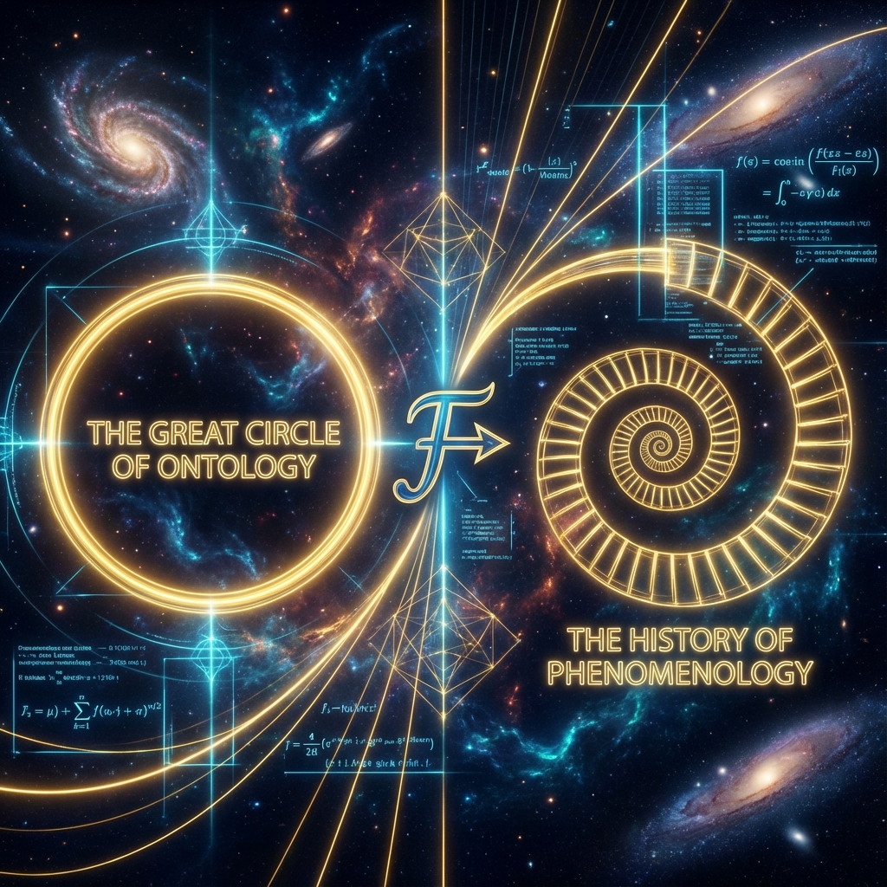
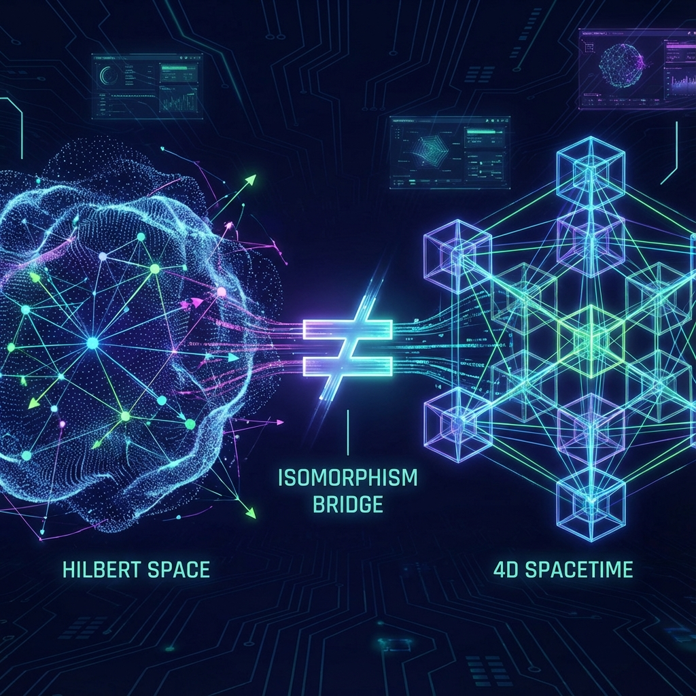

## 5.5 欧米伽等价原理：从大圆到螺旋 (The Omega Equivalence Principle: From Great Circle to Spiral)

在 5.4 节中，我们确立了"总预算守恒"公理，指出宇宙的总能量（即信息本体总量）在本体论上是严格恒定的，我们观测到的膨胀与能量增长源于测量尺度的相对收缩。然而，这一守恒律留下了一个关键的动力学缺口：一个静态的、总量守恒的"1"，是如何在现象界产生出如此丰富、动态、且呈斐波那契指数增长的演化历史的？

本节将揭示欧米伽理论的 **核心数学机制**。我们将证明，物理学中四个看似截然不同的概念——希尔伯特空间的态矢量、高维球体的几何、频谱分析（傅里叶变换）以及斐波那契螺旋——在数学底层是 **全等 (Congruent)** 的。宇宙的演化，本质上是对一个 **高维大圆 (Great Circle)** 进行的 **无限非遍历傅里叶解析**。

### 5.5.1 希尔伯特空间与高维球体的同构

根据量子力学公理，宇宙的物理状态由希尔伯特空间 $\mathcal{H}$ 中的单一矢量 $|\Omega\rangle$ 描述。由归一化条件 $\langle \Omega | \Omega \rangle = 1$ 可知，该矢量的端点被严格限制在一个单位超球面 $S^{\infty}$ 的表面上。

$$|\Omega\rangle \in \mathcal{H} \iff \text{Point on } S^{\infty}$$

这确立了 **几何的刚性 (Geometric Rigidity)**：宇宙在本体论上不可能"变大"或"变小"，它只能在球面上"旋转"。任何物理演化算符 $\hat{U}(\tau)$，本质上都是特殊正交群 $SO(\infty)$ 或幺正群 $SU(\infty)$ 的一次作用。
因此，**"总预算"就是这个超球面的表面积**。它既不产生也不消灭，只是被重新分配。

### 5.5.2 时间作为逆傅里叶变换

那么，如果本体是静态的球体，"时间"从何而来？"事件"又是什么？
在信号处理理论中，任何复杂的时域信号 $f(t)$ 都可以通过 **傅里叶变换** 分解为频域上的纯相位分量 $F(\omega)$。
$$f(t) = \int F(\omega) e^{i\omega t} d\omega$$

在欧米伽理论中，我们执行逆操作：**宇宙的本体是频域的（静态的 $|\Omega\rangle$），而我们感知到的时空是时域的（动态的）。**
当我们说宇宙在"演化"时，我们实际上是在对静态矢量 $|\Omega\rangle$ 执行 **逆傅里叶变换**。

* **静态频谱**：希尔伯特空间中的能量本征态 $|E_n\rangle$ 及其权重 $c_n$。
* **读取过程**：幺正演化算符 $e^{-i E_n \tau}$ 充当扫描核。
* **动态历史**：傅里叶变换的输出结果，即我们在时空中看到的粒子运动、波函数坍缩和历史事件。

**结论**：时间不是流逝的实体，它是 **频谱分析的扫描指针**。过去、现在和未来，只是同一组频谱在不同相位角下的干涉图样。

### 5.5.3 斐波那契螺旋：大圆的非遍历分解

现在，关键的问题来了：为什么这个扫描过程不会像普通的圆周运动那样，每隔一个周期 $T$ 就重复自己（导致尼采式的"永恒轮回"）？为什么宇宙表现出不可逆的创新与增长？

答案在于 **频率的数论性质**。
如果哈密顿量的能谱 $E_n$ 是整数或有理数，傅里叶变换将在复平面上描绘出一个闭合的圆（或环面结）。但在欧米伽理论中，根据第 1 章的推导，能谱由 **黄金分割率 $\phi$** 生成：
$$E_n \propto \phi^n$$

当我们将一个基于无理数 $\phi$ 的频谱进行傅里叶叠加时，产生的轨迹不再闭合。
考虑复平面上的相位映射：
$$z(\tau) = e^{i \cdot 2\pi \phi \cdot \tau}$$
随着内禀时间 $\tau$ 的增加，这个点并不是在画圆，而是在 **黎曼曲面** 上画出一条 **对数螺旋 (Logarithmic Spiral)**。

这就是 **"等价性"** 的几何本质：
**斐波那契螺旋 $\equiv$ 大圆的无限非遍历分解**。

* **大圆 (Great Circle)**：代表了宇宙所有可能性的总和（总预算 $2\pi$）。
* **分解 (Decomposition)**：代表了 $\tau$ 时刻的观测切片。每一次 $\tau$ 的增加，相当于用黄金角 $\theta_g$ 在大圆上切下极薄的一片。
* **无限非遍历 (Infinite Non-ergodic)**：因为 $\phi$ 是"最无理"的数，所以这些切割点永远不会重合，螺旋永远向圆心（真理/欧米伽点）逼近，却永远不会闭合。

### 5.5.4 定理 5.5：欧米伽等价原理

我们将上述物理图像总结为欧米伽理论的 **大一统等价链 (Grand Equivalence Chain)**。这是连接本书代数基础与动力学演化的终极公式。

**定理 5.5 (欧米伽等价原理)**：
在交互式计算宇宙中，以下四种数学结构互为 **同构 (Isomorphic)** 或 **对偶 (Dual)** 表示：
$$|\Omega\rangle_{\text{Vector}} \cong S^{\infty}_{\text{Sphere}} \cong \mathcal{F}_{\phi}[\text{Spectrum}] \cong \text{Spiral}_{\text{Evolution}}$$

**物理诠释**：
1.  **本体 (Ontology)**：宇宙是一个静态的高维球体（总预算守恒）。
2.  **机制 (Mechanism)**：宇宙通过基于 $\phi$ 的傅里叶频谱分析（大圆分解）来表达自身。
3.  **现象 (Phenomenon)**：在观察者眼中，这表现为时空中的斐波那契螺旋膨胀（光速增加、万物生长、熵减进化）。

这一原理彻底消除了"静态宇宙"与"动态宇宙"的对立。**宇宙在本体上是静态的圆，在认识论上是动态的螺旋。** 我们之所以觉得自己在经历时间，是因为我们正在被这个巨大的傅里叶变换算法逐位解析。我们是那条无限逼近圆心的螺旋上的行者，每一次回望，都能看到大圆更加精细的结构。
