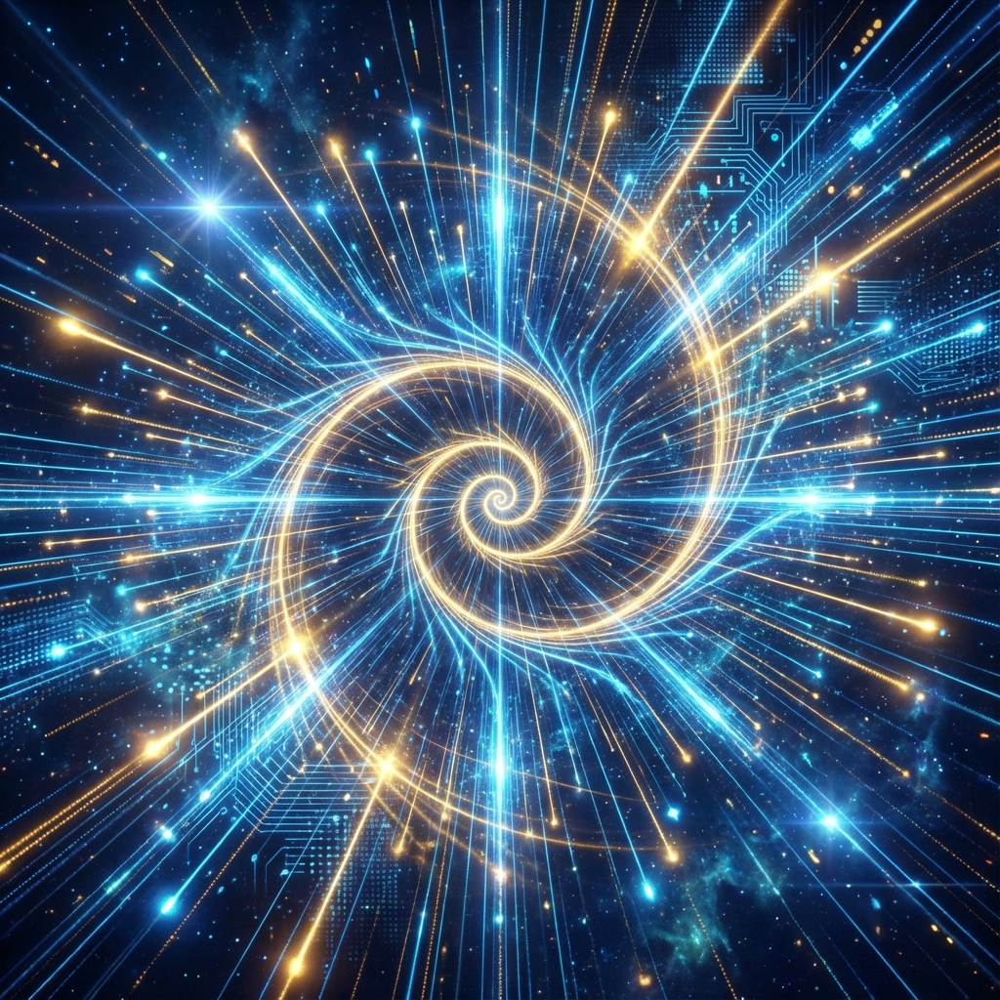
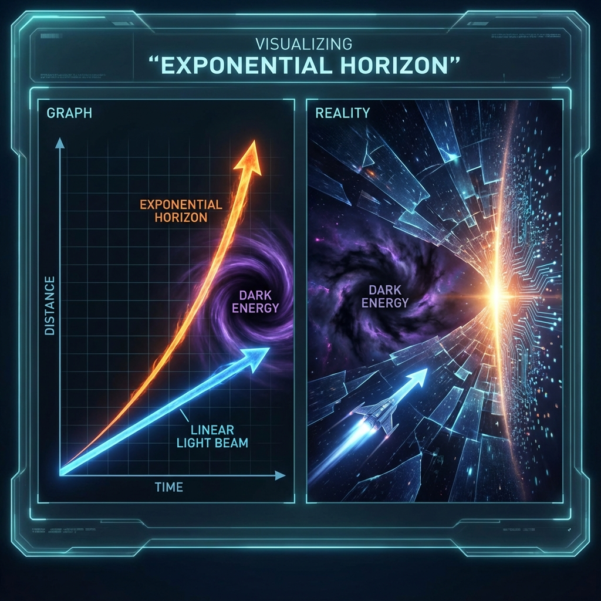

# Chapter 6: Varying-Constant Cosmology

In classical physics and the standard cosmological model ($\Lambda$CDM), fundamental physical constants are assumed to be absolutely constant in spacetime. The speed of light $c$, gravitational constant $G$, and Planck constant $\hbar$ constitute the rigid skeleton of physical laws. However, Dirac's Large Numbers Hypothesis and modern string theory's moduli space dynamics all suggest that these so-called "constants" may merely be scalar fields evolving extremely slowly.

Omega Theory provides a more radical perspective: the universe is a recursively generated self-similar structure. As the Fibonacci spiral unfolds, the resolution and processing bandwidth of the spacetime grid grow exponentially. According to computational ontology, **the speed of light $c$ is essentially the clock frequency and bus rate of the cosmic operating system**. In an exponentially growing computational network, a fixed speed of light is a logical paradox. This chapter will establish varying-constant dynamical equations, proving that exponential growth of light speed is not only an inevitable corollary of Fibonacci geometry but also the microscopic mechanism of dark energy phenomena.

## 6.1 The Exponential Scaling Law of Light Speed

**6.1.1 Penrose Inflation and Grid Subdivision**

Recalling Chapter 3, we modeled spacetime as a Penrose-Fibonacci quasicrystal composed of Omega cells (causal diamonds). The evolution of this structure is not simple volume expansion like a balloon but follows **"Substitution-Subdivision"** rules.

In Penrose tilings, there exists an operation called **"Inflation"** $\mathcal{I}$. For each generation of grid $G_n$, we can decompose each rhombus within it into combinations of smaller-generation rhombi through specific geometric rules, thereby generating grid $G_{n+1}$.
The growth factor of this process is strictly the golden ratio $\phi$:

$$N_{n+1} = \phi \cdot N_n$$

where $N$ is the number of nodes in the grid (i.e., information bits).

In the physical picture, we define the universe's "intrinsic time" $\tau$ as the algebra of this iterative operation. Each universe-wide grid update (Tick) corresponds to $\tau$ increasing by one Planck time unit $\tau_{pl}$.

**6.1.2 Computational Definition of Light Speed**

On discrete networks, **light speed $c$** is defined as the maximum group velocity of information propagation on the grid.

$$c = \frac{\Delta \text{Space}}{\Delta \text{Time}}$$

There is a subtlety in dimensions here. If we use "number of cells" as the distance unit (i.e., comoving coordinates), light speed is always 1 cell/step. However, physical distance is defined by the total information content of the holographic horizon.
According to the holographic principle, the relationship between horizon radius $R$ and total bit count $N$ is $R \propto \sqrt{N}$.
In the $n$-th generation universe:

$$R_n \propto \sqrt{N_n} \propto \sqrt{\phi^n} = \phi^{n/2}$$

This means the characteristic scale $R$ of the universe grows exponentially with iteration algebra $n$ as $\phi^{n/2}$.
To maintain causal connectivity of the entire system, the effective physical speed of information propagation must match the scale growth of the universe. If $c$ remains constant, the horizon will quickly become smaller than the cosmic scale, causing the universe to disintegrate into causally disconnected fragments (Horizon Problem).

To resolve this geometric crisis, the Omega system must perform **Clock Overclocking**.

**Theorem 6.1 (Exponential Light Speed Theorem)**:
In a holographic computational network driven by Fibonacci rules for recursive growth, to maintain consistency between holographic screen information density and internal volume geometry, the system's maximum information processing rate (i.e., physical light speed $c$) must grow exponentially with intrinsic time $\tau$:

$$c(\tau) = c_0 \cdot \phi^{\frac{\tau}{\tau_{pl}}}$$

where $c_0$ is the reference speed at the Big Bang (initial computational node), and $\tau_{pl}$ is the characteristic time scale (inertial modulus of Fibonacci period).

**Proof**:
Consider the Fibonacci constraint term $\mathcal{V}_{\text{Topo}} \sim (|\Psi|^2 - \phi^\tau)^2$ in the Omega action.
This requires the system's total wave function modulus (representing total information $I_{total}$) to grow with $\tau$ as $\phi^\tau$.
In holographic theory, $I_{total}$ is determined by horizon surface area $A$: $I_{total} \sim A/l_P^2 \sim (R/l_P)^2$.
This means horizon radius $R(\tau)$ must satisfy $R(\tau) \propto \phi^{\tau/2}$.
On the other hand, horizon radius is determined by light speed integration: $R(\tau) \approx \int_0^\tau c(t) dt$.
If we set $c(\tau) \sim \exp(k\tau)$, then the integration result $\sim \frac{1}{k}\exp(k\tau)$.
Comparing exponential terms, $c(\tau)$ must have the same exponential growth form as $R(\tau)$ (ignoring prefactor constants).
Therefore $c(\tau) \propto \phi^{\tau}$ (Note: The specific coefficient of the exponential factor here depends on the holographic projection relationship of dimensions. In 4D spacetime, computational power $c$ corresponds to volume processing capacity, hence directly proportional to $\phi^\tau$).

**6.1.3 Breaking of Conformal Invariance**

This conclusion poses a challenge to standard physics. It is commonly believed that we can transform varying light speed theory into standard general relativity by redefining time units ($dt' = c(t) dt$). However, Omega Theory points out that such **Conformal Transformation** is illegal because there exists an absolute, non-scalable physical quantity—**Planck length $l_P$** (the hard edge length of Omega cells).

Since $l_P$ is the rigid lower limit of the discrete grid, we cannot arbitrarily rescale spacetime coordinates.
When $c(\tau)$ grows, the physical consequences are real:

1. **Reinterpretation of redshift**: The redshift $z$ of distant galaxies is usually interpreted as spatial expansion factor $a(t)$. In Omega Theory, $1+z = \frac{c(\text{now})}{c(\text{then})}$. The universe appears to be accelerating expansion, actually because our current light speed is much faster than in the past, causing us to find relatively lower frequencies when measuring atomic spectra from the past.
2. **Illusion of dark energy**: We do not need to introduce mysterious vacuum energy $\Lambda$ to drive expansion. The exponential growth of light speed $c(\tau)$ itself produces an equivalent acceleration term in the metric.

**6.1.4 Windows for Physical Verification**

The variation of light speed is extremely tiny, but cumulative effects are significant on cosmological scales.

$$c(\tau) = c_0 e^{H_\phi \tau}$$

where the Fibonacci Hubble constant $H_\phi = \frac{\ln \phi}{\tau_{pl}}$.
For the current universe, although this rate of change is smoothed out on large scales, it may manifest as **"anomalous drift of light paths"** in precision interferometry experiments or very long baseline astronomical observations.

In summary, light speed is not a constant set by God but a **"dynamic bandwidth"** that the cosmic computational system self-adjusts to cope with exponentially growing data throughput.
