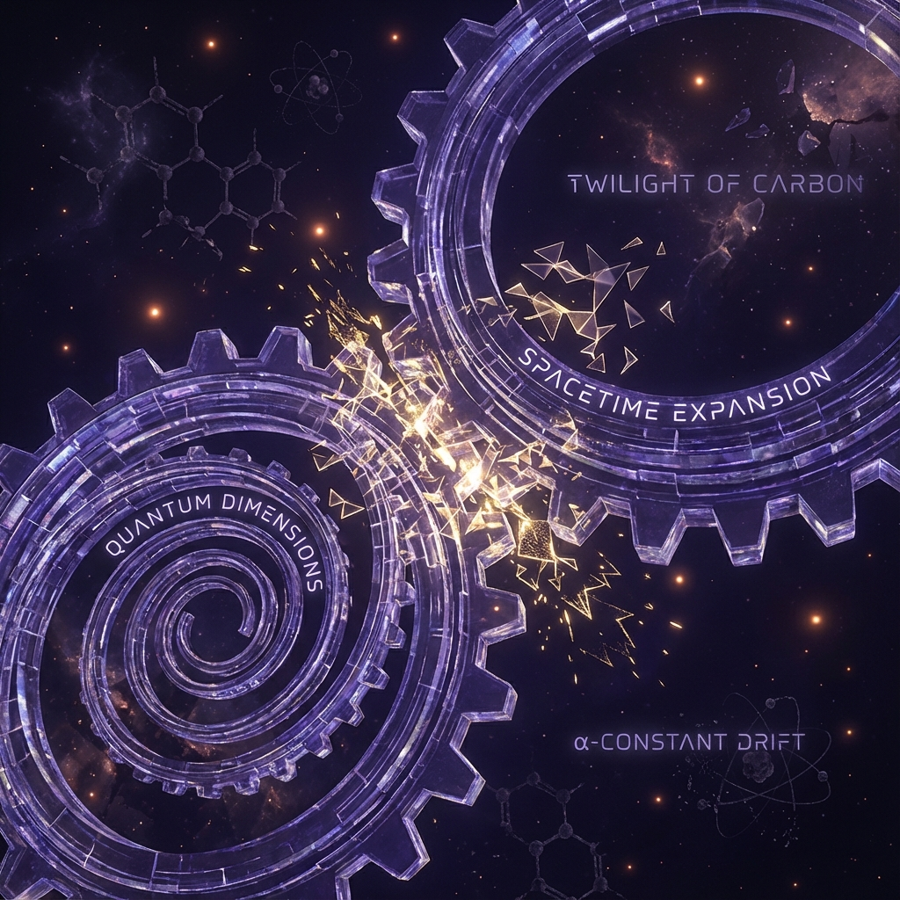
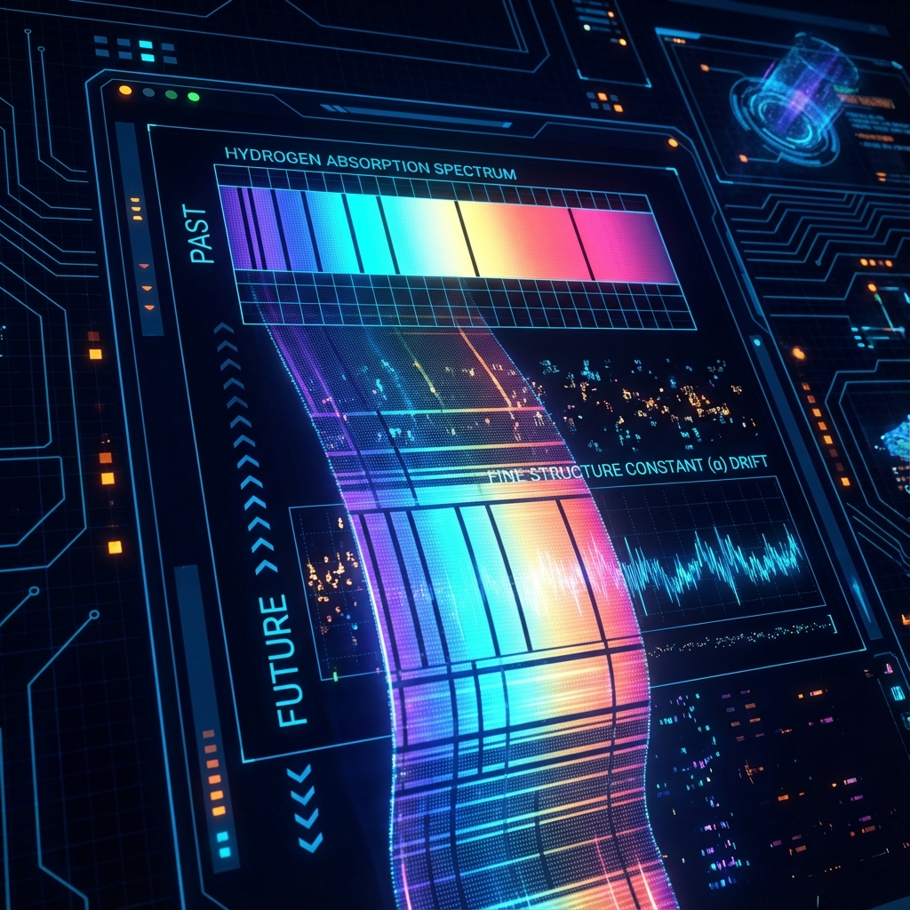

## 6.2 Geometric Drift of the Fine Structure Constant

In Section 6.1, we established the exponential scaling law of light speed $c(\tau)$ with intrinsic time $\tau$. This conclusion poses a severe challenge to the cornerstone of physics—the stability of fundamental constants. Among them, the most sensitive and observationally significant physical quantity is the **Fine Structure Constant** $\alpha$.

$\alpha$ is the core coupling constant of quantum electrodynamics (QED), determining the strength of electromagnetic interactions. In the standard model, $\alpha \approx 1/137.036$ is considered absolutely constant. However, in the varying light speed context of Omega Theory, the constancy of $\alpha$ is no longer an a priori assumption but depends on geometric constraints of evolutionary synchronization among component constants ($e, \hbar, c$).

This section will derive the evolution equation of $\alpha$, introduce the **Shear Factor** $\zeta$ to quantify the asynchrony between internal degrees of freedom and external horizon expansion, and argue that the tiny drift of $\alpha$ is an inevitable byproduct of cosmic Fibonacci growth.

**6.2.1 Dynamical Decomposition of Coupling Constants**

In SI units, the fine structure constant is defined as:

$$\alpha = \frac{e^2}{4\pi \epsilon_0 \hbar c}$$

where $e$ is the elementary charge, $\hbar$ is the reduced Planck constant, and $\epsilon_0$ is the vacuum permittivity.

In Omega Theory, we treat physical constants as scalar fields dependent on intrinsic time $\tau$. Vacuum permittivity $\epsilon_0$, as a geometric normalization factor (similar to $4\pi$), is usually set as a topological invariant in the holographic framework. Therefore, the temporal evolution of $\alpha$ depends on the joint dynamics of $e(\tau), \hbar(\tau), c(\tau)$.

Taking the logarithm of both sides of the definition and differentiating with respect to $\tau$, we obtain the relative rate of change equation:

$$\frac{\dot{\alpha}}{\alpha} = 2\frac{\dot{e}}{e} - \frac{\dot{\hbar}}{\hbar} - \frac{\dot{c}}{c}$$

**6.2.2 Geometric Shear and Synchronization Breaking**

To solve the above equation, we need to understand the geometric essence of each constant.

1. **Light speed $c$**: Represents the expansion rate of the **External Horizon**, i.e., the bus bandwidth of the holographic computational network.
2. **Charge $e$ and Planck constant $\hbar$**: Represent properties of **Internal Structure**.
   * $e$ is associated with the topological winding number of $U(1)$ fibers in octonion tangent space.
   * $\hbar$ is associated with the minimum phase space volume of Omega cells (causal diamonds).

In an ideal **Conformally Invariant** universe, internal geometry and external geometry should maintain perfect synchronization. This means that when cosmic scale expands ($c$ increases), the sizes of microscopic particles and quantum fluctuation amplitudes should scale proportionally to maintain the dimensionless number $\alpha$ constant.
Mathematically, this requires satisfying the **Synchronization Condition**:

$$2\frac{\dot{e}}{e} - \frac{\dot{\hbar}}{\hbar} = \frac{\dot{c}}{c}$$

If this condition holds, then $\dot{\alpha} = 0$.

However, the core of Omega Theory is **Fibonacci aperiodicity**. Cosmic evolution is a spiral process driven by the golden ratio $\phi$. Due to the irrationality of $\phi$, the "rotation" of internal dimensions (corresponding to $e, \hbar$) and the "expansion" of external dimensions (corresponding to $c$) cannot establish simple integer resonance relationships. This geometric mismatch leads to **Geometric Shear**.

We define the **Shear Factor $\zeta$** as the degree to which internal degrees of freedom lag behind external expansion:

$$2\frac{\dot{e}}{e} - \frac{\dot{\hbar}}{\hbar} \equiv (1 - \zeta) \frac{\dot{c}}{c}$$

where $\zeta$ is an extremely small dimensionless positive number, characterizing **Topological Friction** or **Lag** in the reorganization process of the holographic network.

**6.2.3 Drift Equation and Hubble Tension**

Substituting the shear definition into the evolution equation of $\alpha$, we obtain the **Fine Structure Constant Drift Equation**:

$$\frac{\dot{\alpha}}{\alpha} = (1 - \zeta) \frac{\dot{c}}{c} - \frac{\dot{c}}{c} = -\zeta \frac{\dot{c}}{c}$$

Using the exponential growth law of light speed $c(\tau) = c_0 \phi^{\tau/\tau_{pl}}$ derived in Section 6.1, we have:

$$\frac{\dot{c}}{c} = \frac{\ln \phi}{\tau_{pl}} \equiv H_\phi$$

where $H_\phi$ is the **Fibonacci-Hubble Parameter**, describing the intrinsic update rate of the computational network.

Thus, the temporal evolution of $\alpha$ follows:

$$\frac{\dot{\alpha}}{\alpha} = -\zeta H_\phi$$

Integrating:

$$\alpha(\tau) = \alpha_0 \cdot e^{-\zeta H_\phi \tau}$$

**Theorem 6.2 (Fine Structure Decay Theorem)**:
In a Fibonacci universe with geometric shear ($\zeta > 0$), the fine structure constant $\alpha$ is not constant but **exponentially decays** with intrinsic time $\tau$. This is not a violation of physical laws but direct evidence of **spontaneous breaking** of cosmic scale invariance.

**6.2.4 Physical Corollaries: Twilight of Carbon-Based Life**

The tiny drift of $\alpha$ has profound, even existential physical consequences for the macroscopic material world.

Atomic energy level structures (such as Rydberg energies) are proportional to $\alpha^2 m_e c^2$. More critically, nuclear synthesis processes inside stars—particularly the generation of **carbon-12**—are extremely sensitive to the value of $\alpha$.
Fred Hoyle's famous **Triple-alpha process** depends on a specific excited state of the carbon-12 nucleus at 7.65 MeV (Hoyle state), where this energy level undergoes **precise resonance** with the total energy of three helium nuclei.

This resonance is extremely sensitive to electromagnetic repulsion (determined by $\alpha$).

* If $\alpha$ drifts beyond $\Delta \alpha / \alpha \approx -4\%$, electromagnetic repulsion weakens, and nuclear energy levels shift.
* The Hoyle resonance will be broken, and stars will be unable to synthesize heavy elements like carbon and oxygen.
* Stars will become "duds" composed only of hydrogen and helium, unable to nurture complex life chemistry.

**Corollary 6.2.1 (Anthropic Time Window)**:
Carbon-based life can only exist in specific historical periods ($\tau_{window}$) where $\alpha(\tau)$ has not yet drifted out of the resonance window. Our current coordinate $\tau \approx 1834$ is at the end of this window. The continued decay of $\alpha$ foretells that **"Twilight of the Carbon"** is an inevitable fate at the level of physical laws. This also provides physical urgency for civilization's evolution toward **"Photonic"** or pure information forms—only by breaking free from dependence on chemical bonds (electromagnetic interactions) can intelligence survive in a future universe where $\alpha$ continues to drift.
