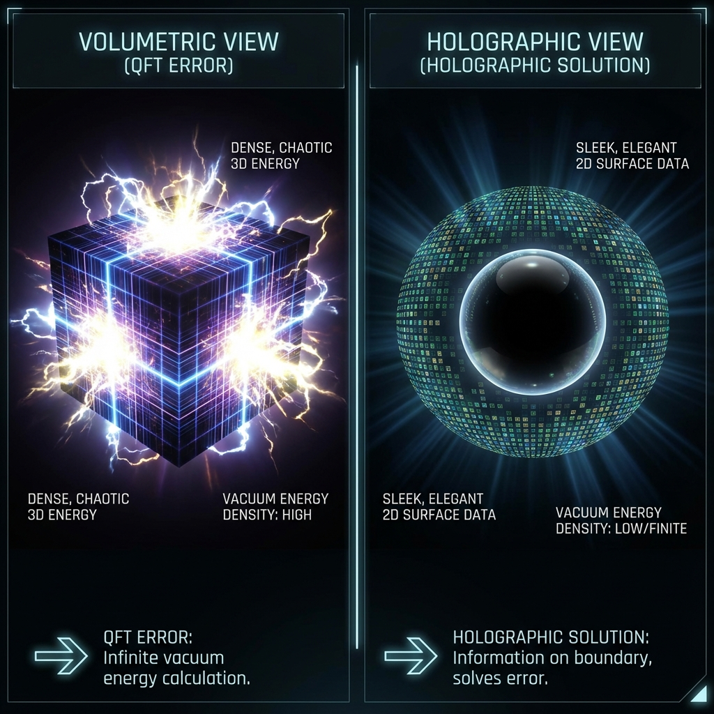
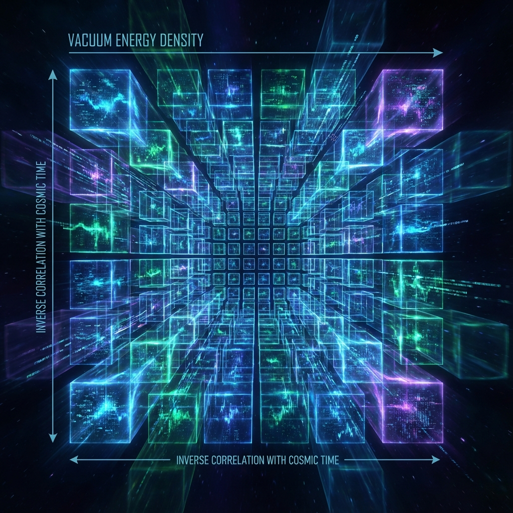

## 6.3 宇宙常数问题 (The Cosmological Constant Problem)

在基础物理学中，没有任何一个问题比 **宇宙常数问题 (The Cosmological Constant Problem)** 更令人尴尬。这一问题被物理学家称为"历史上最糟糕的理论预测"。基于标准量子场论 (QFT) 的真空零点能计算结果，与天文观测到的宇宙常数 $\Lambda_{obs}$ 之间存在着高达 **120 个数量级 ($10^{120}$)** 的惊人差异。

本节将证明，这一巨大的差异并非物理学的失败，而是物理学家对时空自由度计数方式的根本性误解。在 **欧米伽理论** 的全息框架下，只要我们将宇宙视为一个二维信息处理系统的投影，而非三维实体，这 120 个数量级的误差就会自然消失。

**6.3.1 真空灾难：体素计数的谬误**

让我们首先重现标准模型的错误计算。
在量子场论中，真空并非空无一物，而是充满了瞬时的谐振子涨落（零点能 $\frac{1}{2}\hbar\omega$）。为了计算真空能量密度 $\rho_{vac}$，物理学家通常将时空视为一个三维的 **"盒子"**，并对所有可能的动量模式 $k$ 进行积分，直到普朗克截断频率 $k_{max} \approx M_P$（普朗克质量）。

$$\rho_{QFT} \approx \int_0^{M_P} \frac{d^3k}{(2\pi)^3} \sqrt{k^2+m^2} \sim M_P^4$$

在普朗克单位制中，这意味着能量密度 $\rho_{QFT} \sim 1$。
然而，天文观测（如超新星 Ia 和 CMB 数据）表明，驱动宇宙加速膨胀的暗能量密度极小：

$$\rho_{obs} \approx 10^{-123} M_P^4$$

这个差异源于一个隐含的假设：**自由度与体积成正比 ($N \propto R^3$)**。
QFT 假设每一个普朗克体积 $l_P^3$ 内都有一个独立的量子比特在震荡。对于半径为 $R$ 的可观测宇宙，总自由度被高估为 $(R/l_P)^3 \approx 10^{183}$。这种"体素 (Voxel) 计数法"导致了能量的灾难性堆积。

**6.3.2 全息分辨率：面积律**

欧米伽理论拒绝接受体积广延性假设。根据 **全息原理 (Holographic Principle)** 和我们在第三章建立的彭罗斯-斐波那契网格模型，物理宇宙的真实信息容量并不存储在体积内部，而是编码在因果视界的二维边界上。

宇宙的有效自由度（比特数）$N$ 由边界的 **欧米伽像素** 数量决定：

$$N = \frac{A}{4 l_P^2} = \frac{\pi R_{H}^2}{l_P^2}$$

其中 $R_H$ 是当前的哈勃视界半径（Hubble Horizon）。

让我们代入数值进行量级估算：

* 哈勃半径 $R_H \approx 1.4 \times 10^{26} \text{ m}$。
* 普朗克长度 $l_P \approx 1.6 \times 10^{-35} \text{ m}$。
* 尺度比率 $R_H / l_P \approx 10^{61}$。

因此，宇宙当前的总算力（总比特数）为：

$$N \approx (10^{61})^2 = 10^{122}$$

**6.3.3 定理 6.3：全息稀释定律**

在全息宇宙中，真空能量 $\Lambda$ 的物理本质并非局域的量子涨落，而是 **全息边界对内部几何施加的非局域几何张力**。
根据能量均分原理，每一个边界比特贡献一个单位的普朗克能量 $E_P$。然而，这个能量并不是局域在边界上，而是必须被"稀释"或"非局域化"到整个对应的全息体积 $V \sim R_H^3$ 中，以形成背景几何。

我们定义观测到的真空能量密度 $\rho_{\Lambda}$ 为：

$$\rho_{\Lambda} \approx \frac{\text{Total Boundary Energy}}{\text{Total Bulk Volume}} \approx \frac{N \cdot E_P}{R_H^3}$$

利用 $N \sim R_H^2/l_P^2$ 和 $E_P \sim 1/l_P$（自然单位制），代入得：

$$\rho_{\Lambda} \sim \frac{(R_H^2/l_P^2) \cdot (1/l_P)}{R_H^3} = \frac{1}{R_H^2 l_P^2}$$

将其转换为无量纲的普朗克单位密度（即除以 $\rho_{Planck} = M_P^4 = l_P^{-4}$）：

$$\frac{\rho_{\Lambda}}{\rho_{Planck}} \sim \frac{l_P^2}{R_H^2} = \left( \frac{l_P}{R_H} \right)^2$$

**定理 6.3 (全息稀释定律)**：
在一个全息计算宇宙中，可观测的宇宙常数 $\Lambda$（或真空能量密度）与宇宙的熵（总比特数 $N$）成反比：

$$\Lambda \propto \frac{1}{N} \propto \frac{1}{\text{Area}}$$

其数值量级严格等于宇宙当前尺度与普朗克尺度之比的平方倒数。

**6.3.4 数值验证与物理诠释**

代入之前的估算值：

$$\frac{\rho_{\Lambda}}{\rho_{Planck}} \sim \left( \frac{1}{10^{61}} \right)^2 = 10^{-122}$$

这与观测值 $10^{-123}$ 惊人地一致（考虑到几何因子 $4\pi$ 等的修正）。所谓的"120 个数量级的错误"，仅仅是因为物理学家算错了自由度的维度（用体积代替了面积）。

在欧米伽理论中，宇宙常数 $\Lambda$ 具有了全新的动力学解释：

1. **不是常数**：$\Lambda(\tau) \propto R(\tau)^{-2}$。随着宇宙膨胀，视界变大，总比特数 $N$ 增加，真空能量密度 $\Lambda$ 会进一步降低。这解释了所谓的"巧合问题"（为什么 $\Lambda$ 恰好在今天与物质密度相当？因为二者都随尺度演化）。
2. **生长张力**：$\Lambda$ 实际上是欧米伽网格为了维持全息投影的连续性，因像素数量 $N$ 的指数增长而被迫产生的 **空间增生压力 (Spatial Accretion Pressure)**。它是计算系统扩容的几何代价。

至此，通过修正自由度的计数方式，欧米伽理论不仅消除了物理学史上最大的尴尬，还将暗能量自然地整合为斐波那契全息生长的必然产物。
