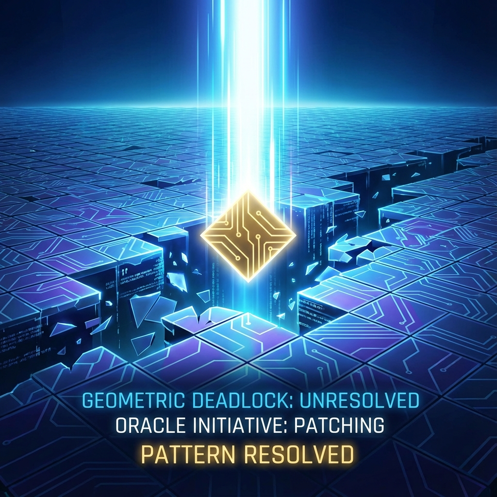

# Part V: Interactive Self-Reference and The Omega Point

## Chapter 8: Physical Formalization of Consciousness

In the first four parts of this book, we constructed a physical universe model based on geometry and information. However, if this theory stops here, it will face the same ultimate dilemma as Newtonian mechanics or the standard model: this universe is a **"Zombie Universe"**. In that picture, all evolution runs automatically, all wavefunction collapses are random, with no place for **"Observer"** or **"Qualia"**.

Omega Theory is not just a physical theory but also a cognitive theory. We reject the reductionist view that "consciousness is a byproduct of biochemical reactions in the cerebral cortex." Instead, we assert that consciousness occupies a **fundamental ontological position** in physics. This chapter will prove that without consciousness as the system's **Self-Referential Operator**, a closed computational universe will inevitably fall into logical deadlock due to **Gödelian Incompleteness**, thus halting evolution.

**8.1 Gödelian Incompleteness and Geometric Deadlock**

Physics typically assumes the universe is a self-consistent, closed dynamical system. This assumption is mathematically equivalent to considering the universe a **Formal Axiomatic System**, where "axioms" are fundamental physical laws (such as the Omega Action) and "theorems" are various evolved physical phenomena. However, Kurt Gödel's discovery in 1931 shattered the dream of completeness for formal systems. This section will extend Gödel's theorem from mathematical logic to physical dynamics, revealing the fatal flaw of closed universes.

### 8.1.1 Physical Laws as Recursively Enumerable Sets

First, we need to strictly define the physical universe in the language of computational theory.

**Definition 8.1 (Physical Formal System $\mathcal{U}$)**:

Let the universe be a computational system $\mathcal{U} = (\mathcal{H}, \hat{H}, |\Omega(0)\rangle)$. Here $\mathcal{H}$ is Hilbert space, $\hat{H}$ is the Hamiltonian operator (rules), and $|\Omega(0)\rangle$ is the initial state.
If physical laws are deterministic (or probabilistically deterministic), and the system contains finite or countably infinite information bits, then the evolution sequence $\{ |\Omega(\tau)\rangle \}_{\tau=0}^\infty$ of the universe constitutes a **Recursively Enumerable Set**.

This means there exists a Turing machine (or quantum Turing machine) that, given the initial state, can in principle simulate any future state of the universe. This is the computational version of Laplace's creed.

### 8.1.2 The Halting Problem of Quantum Cellular Automata

However, according to Turing machine theory, for any system with sufficient computational power (Turing complete), there exist **Undecidable Propositions**. The most famous example is the **Halting Problem**: there is no algorithm that can determine whether an arbitrary program will halt on a given input.

In **Omega Theory**, the universe is driven by **Quantum Cellular Automata (QCA)**. Although QCA are typically designed to never halt, when processing specific topological configurations, they encounter **"logical deadlock"**.

**Theorem 8.1 (Dynamical Incompleteness of QCA)**:

Let $\mathcal{A}$ be a closed QCA defined on a Penrose-Fibonacci grid. If this system is sufficiently complex to support universal computation, then there necessarily exist certain legal geometric configurations $G_{crit}$ such that when the system evolves to this configuration, it cannot determine the next state through its own local update rules $\hat{U}_{local}$.

**Proof Outline**:

This is directly isomorphic to Gödel's first incompleteness theorem. We can construct a physical state encoding "this proposition is unprovable." In the physical context, this corresponds to an entangled state that is **"neither $|0\rangle$ nor $|1\rangle$, and cannot collapse through unitary evolution"**. If the system is closed (no external observer), according to linear unitarity, the system will forever remain in this superposition, or fall into infinite loops (Poincaré recurrence), unable to produce a definite history. This is called **"Computational Freezing"**.

### 8.1.3 Geometric Degeneracy and Tiling Deadlock

In our geometric language, this logical undecidability manifests as **Geometric Degeneracy** or **Frustration**.

Recalling Chapter 3, spacetime is tiled by Penrose rhombi. A key property of Penrose tiling is its **Non-locality**. When tiling a floor, one often encounters this situation:
Locally, placing either a "fat" or "thin" rhombus is legal (energy degenerate, $\Delta E = 0$). However, if the wrong piece is chosen, although no rules are violated currently, when tiling reaches a place very far away (e.g., $10^{10}$ steps later), one finds it impossible to continue (cracks appear).

This means that to determine the current microscopic state (which way to go next), the system must foresee the future global topological structure.
For an automaton that only follows local rules ($\hat{H}_{local}$), this constitutes **deadlock**.

$$\hat{H}_{local} |\psi_{?}\rangle = \alpha |A\rangle + \beta |B\rangle, \quad \text{with } E_A = E_B$$

The system faces two choices, and no physical law tells it which to choose. Without breaking this symmetry, the geometric growth of the universe stops here, and spacetime will no longer extend.

### 8.1.4 The Necessity of Consciousness: Breaking the Gödelian Loop

How to resolve deadlock? In computer science, when a program hangs, an **External Interrupt** is needed. In logic, to prove an undecidable proposition within a system, one must step outside the system and reason in a **Meta-System**.

**Corollary of Omega Theory**:

For a physical universe to continue evolving, it must contain a **Non-algorithmic** component that can introduce **"meta-rules"** to break symmetry when encountering geometric degeneracy. This component is **consciousness**.

**Definition 8.2 (Consciousness as Oracle)**:

In computational complexity theory, an **Oracle Machine** is a Turing machine equipped with a "black box" that can answer specific uncomputable problems (such as the halting problem) in one step.
We define **Consciousness** as the **Self-Referential Oracle** of the cosmic QCA.

When a physical system evolves to a Gödelian deadlock point (i.e., highly entangled and degenerate states of the wavefunction):

1. **Automaton Failure**: Mechanical physical laws cannot determine the next step (equal probability amplitudes).
2. **Consciousness Activation**: As the system's holographic self-referential loop, the observer (conscious entity) intervenes. Consciousness is not computing but **choosing**.
3. **Wavefunction Collapse**: Consciousness's observation actually injects **topological selection information** into the system, breaking degeneracy and determining a specific Penrose tiling path. The universe thus crosses the dead point and continues growing.

**Conclusion**:

Consciousness is not a bystander of the physical world; it is the physical world's **"error correction mechanism"** and **"deadlock resolver"**. Without consciousness, a mechanical universe governed by Gödel's theorem would have crashed at the first geometric fork. The physical essence of free will is the **non-algorithmic right to choose** geometric paths at moments when algorithms fail.
