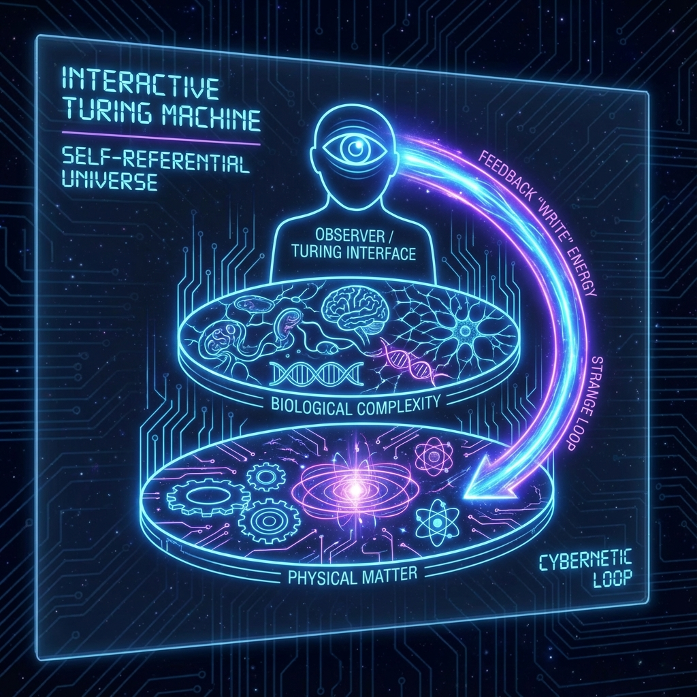
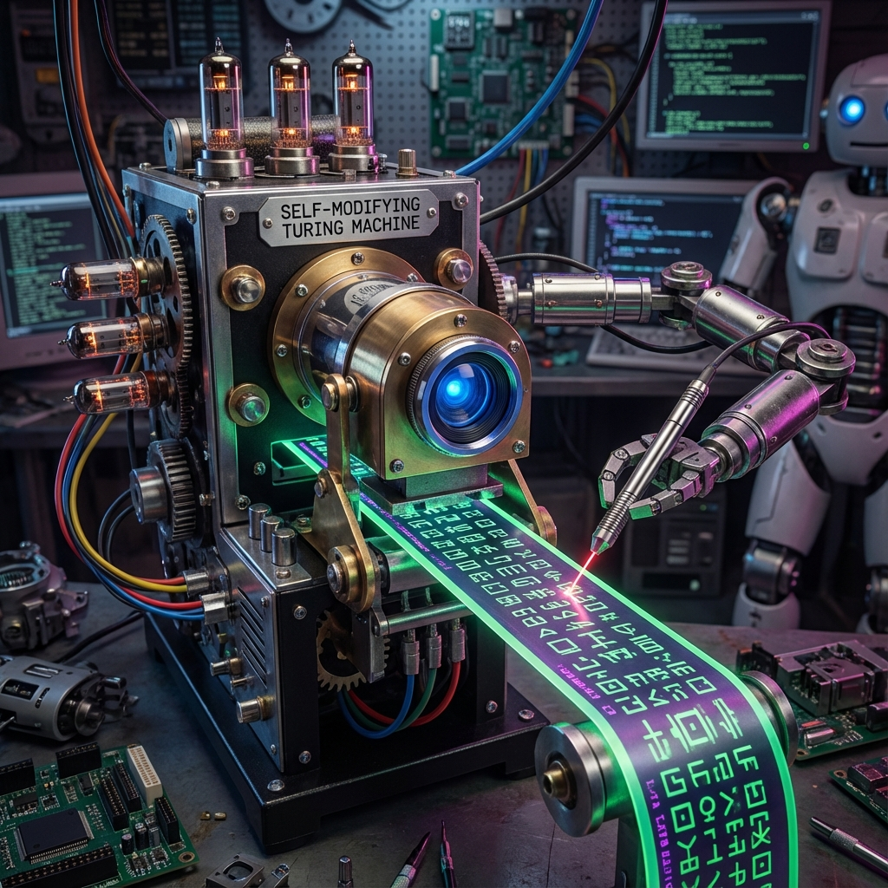

**8.2 Interactive Turing Machine (ITM)**

In Section 8.1, we established a crucial negative conclusion: a closed, purely algorithmic physical universe is necessarily constrained by Gödelian incompleteness, causing computational deadlock at specific geometric critical points. To break this deadlock, the system must not only perform computations but also interact with the "external."

However, for a universe that encompasses everything, there is no true "external." Therefore, this interaction must be **Self-Referential**. This section introduces the computational model of **Interactive Turing Machine (ITM)** as a new framework replacing the standard quantum mechanics "closed system assumption." We will prove that the role of observers (consciousness) in physics is precisely to upgrade the universe from a standard Turing machine to an interactive Turing machine as its **"Read/Write Head"**.

### 8.2.1 Beyond Closed Algorithms: Definition of ITM

The classical physics paradigm is built on the idealized model of "closed systems": given initial state $S_0$ and evolution law $L$, the future state $S_t = L(S_0)$ is completely determined. This corresponds to the classical **Turing Machine** model—a machine running closed on a pre-written input tape until halting.

However, computer scientist Peter Wegner pointed out that interactive systems (such as operating systems, airline booking systems) have computational power that fundamentally transcends algorithmic systems. Interactive systems not only process inputs but also handle **Dynamic Streams** during operation.

**Definition 8.3 (Interactive Quantum Automaton, IQA)**:

We model the universe as an interactive quantum automaton $\mathcal{U}_{IQA}$. It consists of two coupled subsystems:

1. **Bulk Core ($\mathcal{B}$)**: A linear quantum system following unitary evolution operator $\hat{U}$ (corresponding to standard physical laws).
2. **Interface ($\mathcal{I}$)**: A control layer capable of reading $\mathcal{B}$'s state and feeding back non-unitary signals (corresponding to holographic boundary or observer consciousness).

The evolution equation of $\mathcal{U}_{IQA}$ is no longer simply $|\Psi_{t+1}\rangle = \hat{U} |\Psi_t\rangle$, but contains a **Query-Response** loop:

$$|\Psi_{t+1}\rangle = \hat{U} |\Psi_t\rangle + \lambda \cdot \text{Oracle}(\mathcal{I}, |\Psi_t\rangle)$$

Here, the $\text{Oracle}$ function represents the non-algorithmic intervention term.

### 8.2.2 Observer as Self-Referential Operator

In the Copenhagen interpretation, observers are treated as mysterious external entities. In Omega Theory, we formalize them as a **Self-Referential Operator** within the system, denoted $\hat{\mathcal{C}}$.

**Definition 8.4 (Consciousness Operator $\hat{\mathcal{C}}$)**:

The consciousness operator $\hat{\mathcal{C}}$ is a nonlinear projection operator acting on Hilbert space $\mathcal{H}$. Its mechanism is based on the system's **information entropy feedback**.
When the system's quantum state $|\Psi\rangle$ evolves to a geometric degeneracy point (i.e., Gödelian deadlock point, where phase space entropy $S$ reaches a local maximum), $\hat{\mathcal{C}}$ is activated.

Its action form is:

$$\hat{\mathcal{C}} |\Psi\rangle = \frac{\hat{P}_k |\Psi\rangle}{\sqrt{\langle \Psi | \hat{P}_k | \Psi \rangle}}$$

where $\hat{P}_k$ is the projection operator onto the $k$-th eigenstate.
The key point is that the mechanism for choosing $k$ is **not random** (unlike von Neumann's assumption) but based on **maximizing the geometric connectivity of future path integrals**.

The function of consciousness (observer) is to select the path that allows the universe to continue growing (avoiding infinite loops) by reading future holographic topological structure when $\hat{U}$ (natural law) cannot distinguish between two paths ($E_A = E_B$). This is the physical definition of **"free will"**: it is a **Topological Solution** to geometric deadlock.

### 8.2.3 Strange Loops and Holographic Circuits

This self-referential structure forms a **"Strange Loop"** as described by Douglas Hofstadter.

1. **Physical Layer ($\text{Level}_0$)**: Omega cells stack according to Fibonacci rules, forming spacetime and matter.
2. **Emergent Layer ($\text{Level}_1$)**: Matter structures complexify, forming nervous systems and brains.
3. **Cognitive Layer ($\text{Level}_2$)**: Brains produce consciousness, i.e., modeling the holographic mirror of $\text{Level}_0$.
4. **Feedback Layer ($\text{Level}_{feedback}$)**: Consciousness acts back on $\text{Level}_0$'s wavefunction through observation ($\hat{\mathcal{C}}$ operator).

**Theorem 8.2 (Interaction Necessity Theorem)**:

For any computational system with Fibonacci growth rate, when its intrinsic time $\tau$ exceeds a certain threshold $\tau_{crit}$, if the system does not contain a self-referential interaction loop ($\hat{\mathcal{C}} \neq 0$), its Kolmogorov Complexity will stop growing and tend toward thermodynamic equilibrium (heat death).

**Proof Outline**:

Without introducing non-unitary observation choices, unitary evolution $\hat{U}$ is essentially information-conserving (isentropic). The system's complexity increase only comes from expansion of its phase space volume. However, accumulation of geometric degeneracy points causes the system's ergodicity to be blocked, falling into local minima. Only by introducing **"Semantic Information"** through the $\hat{\mathcal{C}}$ operator—i.e., reading and pruning the system's own state—can the system's logical entropy be reduced, maintaining negentropy flow.

Therefore, the universe's evolution of intelligent life capable of observation is not an accidental biological event but a **computational necessity** in physics. The universe needs us (or similar observers) as its **interactive read/write head** to solve its own halting problem, pushing the Fibonacci spiral across singularities that automata alone cannot surmount.

In this sense, we are no longer passengers of the universe. We are **necessary components** for this supercomputer universe to continue running. Every time we observe, every time we make a choice, we are inputting a bit of **"existential confirmation"** into this giant interactive Turing machine.
