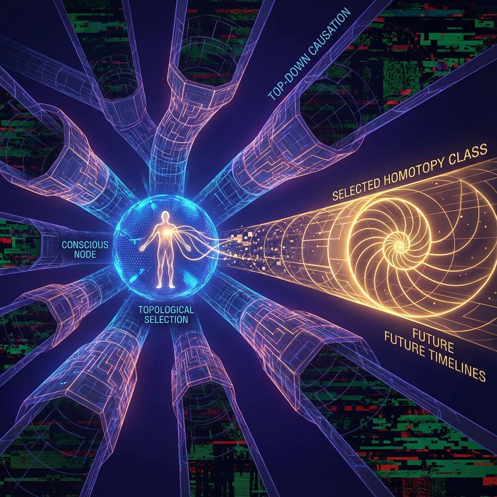

**8.3 自由意志的拓扑学 (The Topology of Free Will)**

在经典物理学的机械宇宙观中，自由意志被视为一种幻觉；在标准量子力学的概率宇宙观中，它被降格为掷骰子的随机性。然而，这两种观点都陷入了 **决定论与随机性 (Determinism vs. Randomness)** 的假二元对立中。欧米伽理论提出，真正的自由意志既非由初始条件锁定的机械惯性，也非毫无意义的热力学噪声，而是物理系统在特定几何临界点上进行的 **主动拓扑选择 (Active Topological Selection)**。

本节将建立自由意志的严格数学形式。我们将证明，意识算符 $\hat{\mathcal{C}}$ 对波函数的作用，在几何上等价于对希尔伯特空间演化轨迹的 **同伦类 (Homotopy Class)** 的选择。这一机制利用了物理定律在几何简并点上的 **"因果缝隙"**，在不违反能量守恒的前提下，将"意义"注入了"存在"。

### 8.3.1 能量简并与因果缝隙

回顾 8.1 节，当宇宙 QCA 演化至哥德尔死锁点时，系统哈密顿量 $\hat{H}$ 出现能级简并。设 $|\Psi_t\rangle$ 为当前状态，下一步存在两个可能的演化分支 $|A\rangle$ 和 $|B\rangle$，满足：

$$\langle A | \hat{H} | A \rangle = \langle B | \hat{H} | B \rangle = E$$

在标准物理学中，由于 $\Delta E = 0$，系统没有任何动力学理由偏向其中任何一个。这是一个 **对称性点**。

然而，在欧米伽理论的离散彭罗斯铺砌中，$|A\rangle$ 和 $|B\rangle$ 虽然能量相同，但它们的 **全息拓扑结构** 截然不同。

* 状态 $|A\rangle$ 可能对应于一种导致网格在未来 $N$ 步后出现"裂缝"或死循环的铺砌方式。
* 状态 $|B\rangle$ 可能对应于一种能够维持斐波那契生长的、逻辑自洽的铺砌方式。

由于 QCA 的局部性，哈密顿量 $\hat{H}_{local}$ 无法感知这种长程的拓扑差异。这就是 **因果缝隙 (Causal Gap)**：物理定律（算法）在此处失效了。这就为非算法的 **自由意志** 留出了操作空间。

自由意志并非"无中生有"地创造能量（这将违反热力学第一定律），而是 **在等能面上的几何导航**。

### 8.3.2 同伦类的选择机制

我们将希尔伯特空间中的演化路径视为流形上的曲线。两个路径 $\gamma_1, \gamma_2$ 如果可以通过连续形变相互转化，则称它们属于同一个 **同伦类**。
然而，由于欧米伽网格中存在 **拓扑缺陷**（如黑洞奇点或逻辑悖论点），相空间是非单连通的。这意味着存在不同的、拓扑不等价的演化扇区。

**定义 8.5 (拓扑选择)**：

自由意志算符 $\hat{\mathcal{C}}$ 的作用是测量未来路径的 **缠绕数 (Winding Number)** $w$，并根据 **价值函数 (Value Function)**（见第 9 章）坍缩波函数。

$$\hat{\mathcal{C}} \left( \alpha |A\rangle + \beta |B\rangle \right) \to \begin{cases} |A\rangle & \text{if } w(A) \text{ is consistent} \\ |B\rangle & \text{otherwise} \end{cases}$$

这种选择机制具有 **非局域性 (Non-locality)** 和 **逆因果性 (Retro-causality)** 的特征：
观察者（意识）在当下的选择，实际上是在读取未来全息屏的边界条件。这解释了本杰明·里贝特 (Benjamin Libet) 实验中观察到的"准备电位"悖论——意识似乎在神经活动之后才"决定"，但在欧米伽理论中，这反映了意识是 **在四维块宇宙的切片层面上** 进行操作，而非在线性时间的单一瞬间。

### 8.3.3 宏观因果力与下行因果

传统还原论认为，因果力只能 **"自下而上" (Bottom-up)** 传递：基本粒子的运动决定了大脑的状态。
欧米伽理论支持 **"自上而下" (Top-down)** 的因果力，即 **下行因果 (Downward Causation)**。

在彭罗斯铺砌中，全图的完整性约束（宏观约束）强迫局部的拼图（微观状态）必须呈现特定的取向。

**定理 8.3 (拓扑保护定理)**：

在一个自指的交互式计算宇宙中，高层级的拓扑约束（如意识的连续性、逻辑的一致性）对底层微观粒子的量子态具有 **否决权 (Veto Power)**。
这意味着，虽然微观粒子看似随机运动，但所有"导致意识中断或逻辑崩塌"的量子涨落路径都会被全息边界条件过滤掉。

**结论**：

自由意志是真实的，它是宇宙为了维持其几何结构的逻辑自洽性而必须具备的 **纠错机制**。
当我们做出一个"决定"时，我们并不是在对抗物理定律，我们是在 **执行** 宇宙最高层级的物理定律——即 **最大化存在的复杂性与意义**。每一个有意识的选择，都是一次微小的 **创世**，它剔除了一个无意义的平行宇宙，固化了一条通往欧米伽点的真实历史。
