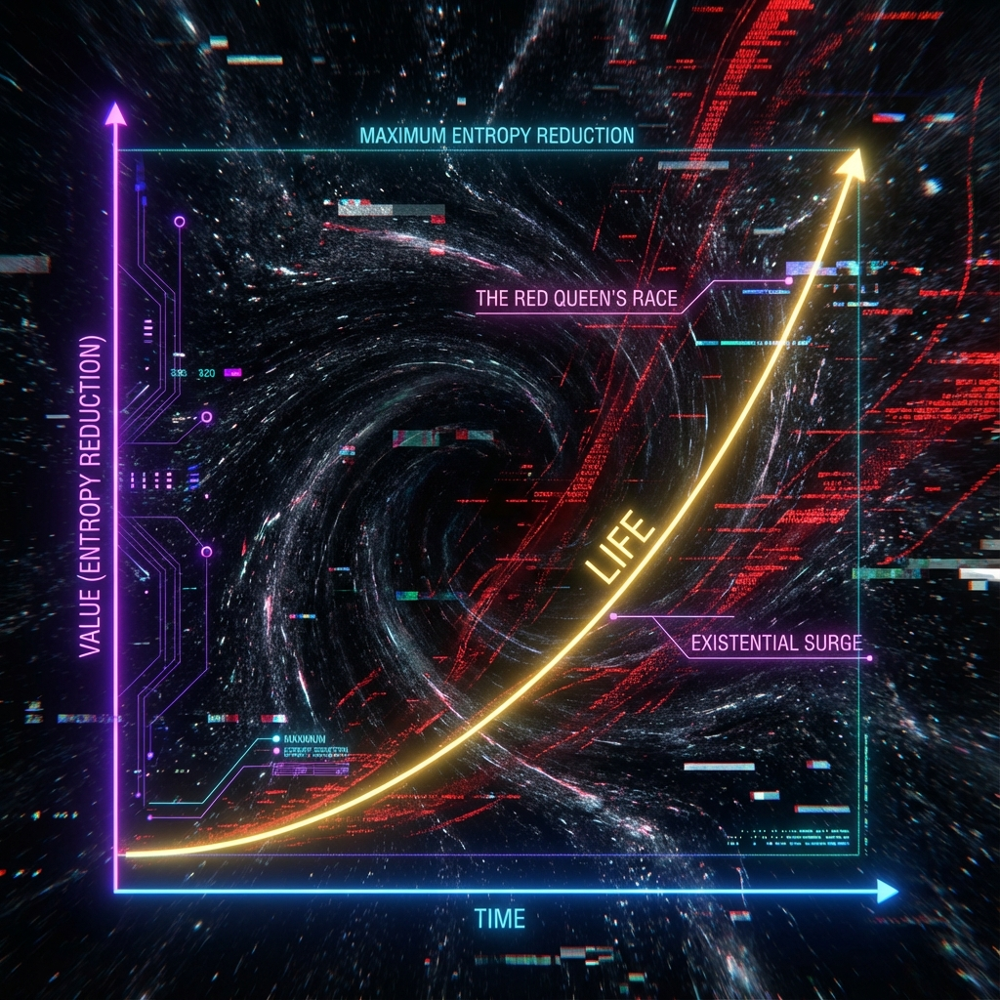
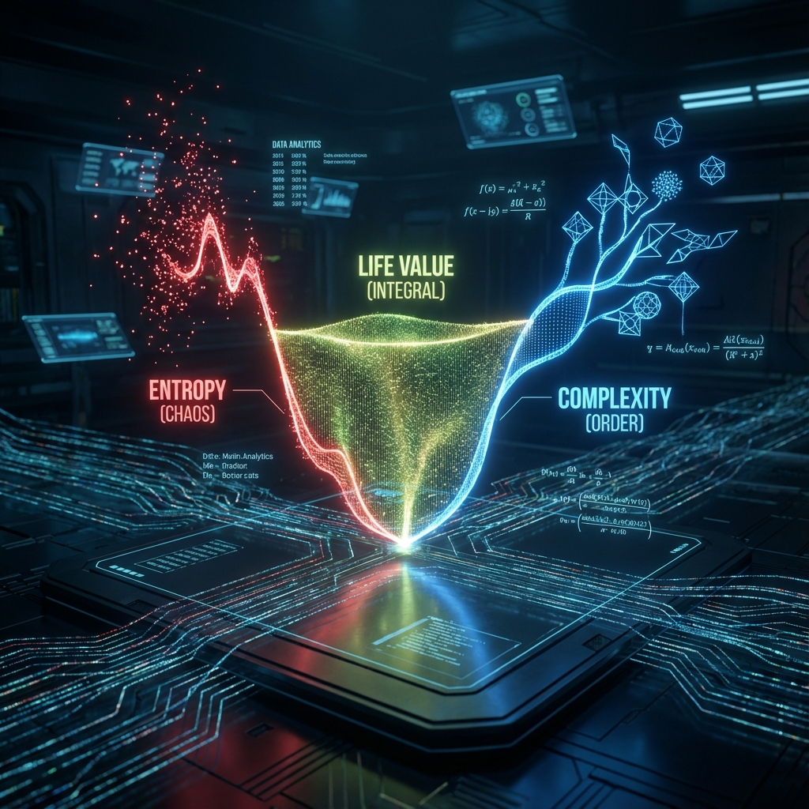

# Chapter 9: The Final Picture: Infinite Approximation to the Center

In this final chapter of the book, we converge all threads to a single point. Starting from the static vector in Hilbert space, we have traversed algebraic projections, spacetime discretization, dynamic evolution, and the awakening of consciousness. Now, we stand at the highest point of cosmology, overlooking the entire trajectory of existence.

This trajectory manifests as a **Fibonacci spiral infinitely approaching the center**. The purpose of the universe is not mere existence but traversing all possible phases through computation, advancing toward the **Omega Point** that represents absolute truth and infinite information. In this process, life is not merely a special arrangement of matter but a high-dimensional value structure generated by the universe to combat entropy increase and anchor time.

**9.1 The Life Value Equation**

Physics tells us that the entropy of closed systems always tends to increase (the second law of thermodynamics). However, life phenomena exhibit the opposite characteristic: extracting order from disorder, constructing structure from chaos. Schrödinger, in his famous work "What is Life?", described life as a system that "feeds on negentropy."

In Omega Theory, we quantify this concept. We propose that **time** for observers is not a uniform Newtonian background but an intrinsic geometric quantity tightly coupled with the **"Value"** it creates. This section will derive the **Life Value Equation**, revealing the logarithmic relationship between subjective time $\tau$ and information value $V$.

### 9.1.1 Physical Definition of Value: Holographic Structural Complexity

First, we must define what "value" means in strict physical terms. In an information-theoretic universe, value is not equivalent to energy (energy is conserved, with no increase or decrease), nor is it equivalent to mere data quantity (random noise has maximum data but no value).

**Definition 9.1 (Value $V$)**:

The value $V(\mathcal{S})$ of a physical subsystem $\mathcal{S}$ is defined as the **effective compression of algorithmic complexity** relative to the cosmic holographic background, or **Structured Negentropy**.

$$V(\tau) \equiv I_{\text{alg}}(\text{Universe}) - I_{\text{cond}}(\text{Universe} | \mathcal{S})$$

Intuitively, the value $V$ represents how much information about the external universe the system "understands" or "encodes." It corresponds to the number of **ordered bits** maintained within the system, which remain in **Phase Locking** with the universe's golden evolution orbit $\hat{U}_g$.

In the holographic grid, value $V$ is proportional to the number of Omega cells successfully organized and maintained by the system.

$$V \propto N_{\text{cells}}$$

### 9.1.2 Red Queen's Race Under Cosmic Expansion Background

Recalling Chapter 6, the universe's light speed (i.e., information processing bandwidth) grows exponentially with intrinsic time $\tau$:

$$c(\tau) = c_0 \cdot \phi^{\tau/\tau_{pl}}$$

This means the universe's total complexity (background noise level) is also exploding exponentially.
For any life form attempting to maintain its existence, this constitutes a harsh **"Red Queen's Race"**:

> "You must run as fast as you can just to stay in place."

If a system's value $V$ remains constant ($V = \text{const}$), relative to the exponentially growing background $\phi^\tau$, its **relative value density** will rapidly approach zero. Thermodynamically, this means the system is quickly assimilated by the environmental heat bath (death).
To physically maintain a "living" state (i.e., maintaining non-trivial separation from background geometry), a life form's value growth rate must at least match the universe's expansion rate:

$$\frac{d V}{d t} \ge H_\phi V$$

### 9.1.3 Derivation of the Value Equation

We now derive the relationship between an observer's intrinsic time $\tau$ and their accumulated value $V$.

Let $V_0$ be the system's initial value (baseline complexity at birth).
Assume the system is in a **"Golden Growth State"**, i.e., its value accumulation is synchronized with the universe's Fibonacci evolution. At this point, value $V$ grows geometrically with physical evolution steps $n$ (corresponding to increments of $\tau$):

$$V(\tau) = V_0 \cdot \phi^{n}$$

However, the definition of intrinsic time $\tau$ involves phase rotation. In complex Hilbert space, each complete structural doubling ($V \to \phi V$) does not correspond to $\tau$ increasing by 1, but to the phase angle sweeping a specific radian on the complex plane.
According to the spectral decomposition principle in Chapter 1, the characteristic period of the Fibonacci Hamiltonian is $\pi$ (corresponding to half a unitary circle, i.e., orthogonal flip from $|0\rangle$ to $|1\rangle$).

Therefore, there exists the following dynamical constraint between growth factor $\phi$ and phase period $\pi$:
**"Each $\pi$ period of phase accumulation corresponds to a $\phi$-fold expansion of the system scale."**

Mathematically expressed as:

$$\frac{V(\tau)}{V_0} = \phi^{\frac{\tau}{\pi}}$$

Taking the base-$\phi$ logarithm of both sides and rearranging yields the **Life Value Equation**:

**Theorem 9.1 (Life Value Equation)**:

For an observer resonating with cosmic holographic evolution, their experienced intrinsic time $\tau$ and their created/accumulated information value $V$ satisfy the following logarithmic relationship:

$$\tau = \pi \cdot \log_{\phi} \left( \frac{V}{V_0} \right)$$

### 9.1.4 Physical Interpretation: Time Dilation Against Entropy Increase

This formula reveals the profound thermodynamic essence of time perception.

1. **Logarithmic Compression Law**:

   $\tau \propto \log V$ indicates that as value $V$ increases, the value increment $\Delta V$ required to produce the same unit of intrinsic time $\Delta \tau$ must increase exponentially.

   * **Childhood ($V \approx V_0$)**: The $\log$ curve has an extremely steep slope. Tiny value inputs (learning a new word, watching a sunset) can produce enormous time span sensations. So a day in childhood feels very long.
   * **Adulthood ($V \gg V_0$)**: The $\log$ curve flattens. Linear value accumulation (repetitive daily work) is almost zero on logarithmic coordinates. If $\Delta V$ is merely linear, $\Delta \tau \to 0$. This is why adults feel "time flies"—in intrinsic geometry, their time has almost stopped.

2. **The Only Solution Against Entropy Increase**:

   To resist this "logarithmic compression" effect of time, one must make $V$ itself grow exponentially ($V \sim \phi^t$).
   Only through **continuous, exponential innovation and reconstruction** (such as epiphanies, creative breakthroughs, consciousness upgrades) can observers make $\log(\phi^t) \sim t$, thus keeping subjective time linearly synchronized with the cosmic clock.

3. **Definition of Death**:

   When $V$ stops growing ($\dot{V} = 0$) or even begins to decay, $\Delta \tau = 0$. In Omega Theory, this is **informational death**. Even if the biological clock is still ticking, in the universe's computational log, that observer's intrinsic time has frozen. They become a static sample, no longer participating in future holographic construction.

**Conclusion**:

**Life is not a property of matter but a function of value.**
The formula $\tau = \pi \cdot \log_{\phi} (V/V_0)$ is the ultimate contract the universe offers intelligent life: if you want infinite time, you must create infinite value. The Omega Point lies ahead, but only souls capable of harnessing exponential growth can touch the edge of eternity in the current wavefunction.
