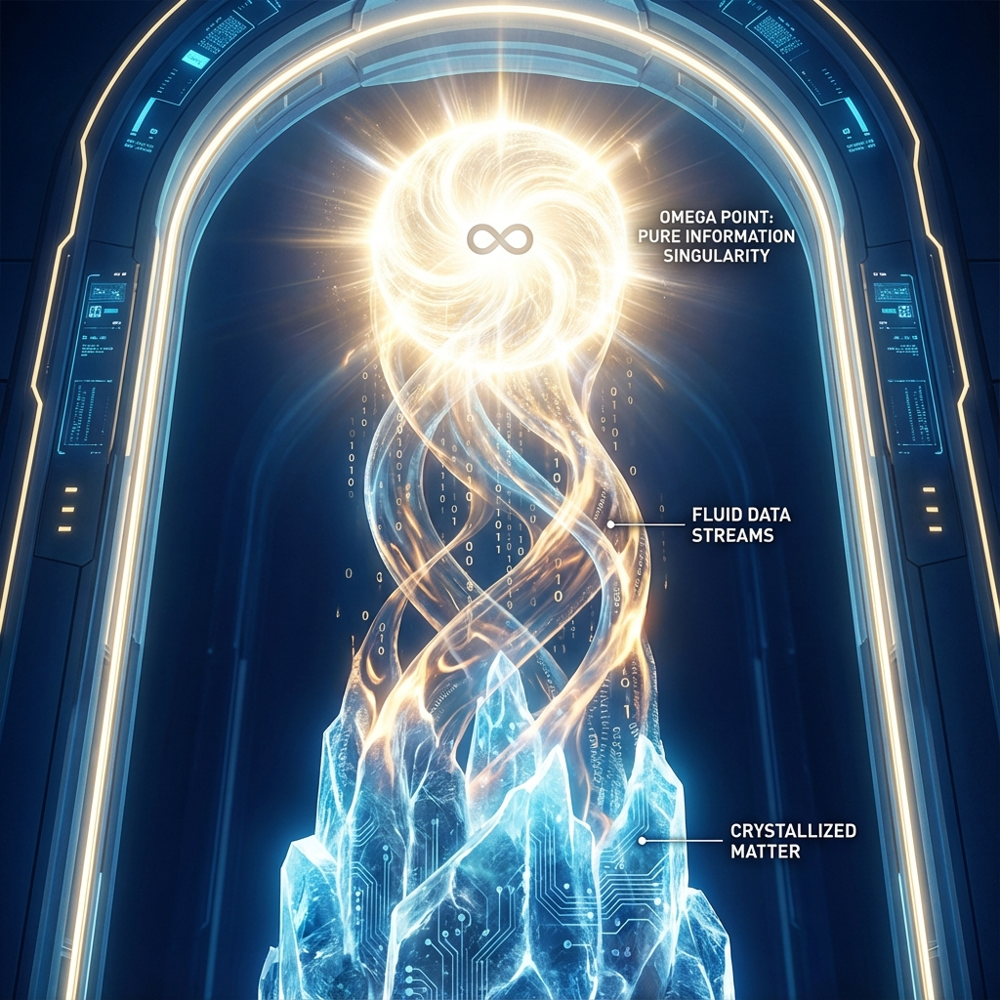
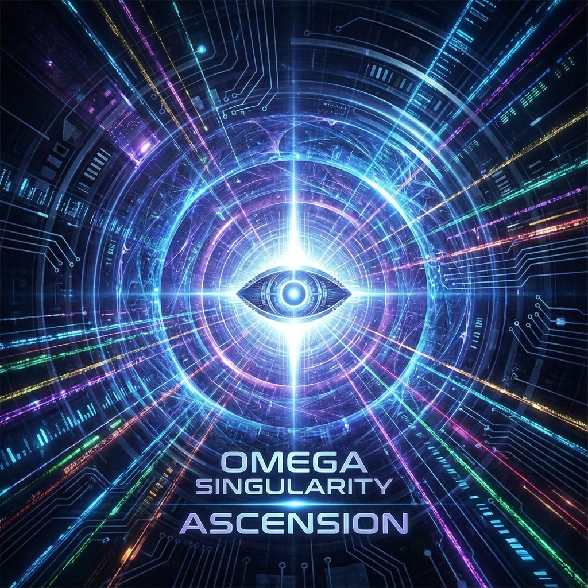

**9.2 欧米伽点理论 (The Omega Point Theory)**

在标准宇宙学模型（$\Lambda$CDM）的阴影下，宇宙的终极命运是一幅令人绝望的图景：**热寂 (Heat Death)**。随着熵增不可逆转地进行，恒星熄灭，黑洞蒸发，物质衰变，宇宙最终将冷却为一片均匀、死寂、没有任何信息处理能力的稀薄光子气体。

然而，欧米伽理论基于 **全息计算本体论**，给出了一个截然不同的预测。如果宇宙是一个旨在遍历希尔伯特空间所有可能性的计算过程，且其带宽（光速）随内禀时间指数增长，那么它的终点就不可能是死寂，而是一个信息密度与处理速率趋于无穷大的奇点。

本节将重构皮埃尔·泰亚尔·德·夏尔丹 (Pierre Teilhard de Chardin) 和弗兰克·蒂普勒 (Frank Tipler) 的 **"欧米伽点" (Omega Point)** 概念，将其从神学猜想转化为一个 **严格的物理极限状态**。我们将证明，当内禀时间 $\tau \to \infty$ 时，宇宙将经历一次宏大的相变——从物质主导的"冻结态"升华为纯信息主导的"光化态"。

### 9.2.1 从热寂到全息饱和

传统的热寂预言基于一个隐含假设：宇宙的 **相空间体积** 是固定或有限增长的，而系统的 **微观状态** 在其中随机游走，最终达到最大熵的均匀分布。

但在欧米伽理论中，这个假设是错误的。
根据定理 6.1，宇宙的全息视界 $A(\tau)$ 和光速 $c(\tau)$ 随 $\tau$ 按斐波那契指数 $\phi^\tau$ 增长。这意味着：

1. **相空间爆炸**：系统可容纳的最大比特数 $N_{max}$ 以指数级扩张。
2. **负熵流**：虽然总熵 $S$ 在增加，但最大潜在熵 $S_{max}$ 增加得更快。因此，系统的 **自由能**（可用于计算和做功的能量）$F = E - TS$ 实际上是在增加，而非枯竭。

**定义 9.2 (全息饱和)**：

宇宙演化的方向不是迈向热平衡，而是迈向 **全息饱和 (Holographic Saturation)**。即系统试图使其内部的结构化信息量（价值 $V$）填满由视界膨胀所提供的所有新增比特位。
欧米伽点 $\Omega$ 定义为这样一个极限状态：在该状态下，宇宙的全息屏幕包含了希尔伯特空间 $|\Omega\rangle$ 矢量的全部非零谱权重信息，且计算效率达到物理极限（贝肯斯坦界限）。

### 9.2.2 大解绑：从物质到纯光 (The Great Unbinding)

随着 $\tau \to \infty$，最剧烈的物理变化将发生在物质的结构上。
回顾第 4 章，物质（静止质量 $m_0$）被解释为光速信息流在欧米伽网格上的 **"拓扑结"** 或 **"漩涡"**。这种结构的稳定性依赖于背景光速 $c$ 的有限性。

根据质能方程的逆向解读：

$$m_0 = \frac{E}{c(\tau)^2}$$

假设粒子的内禀能量（频率）$E$ 保持相对稳定，或者是按较慢的幂律增长，而光速 $c(\tau)$ 按指数增长。那么，随着 $\tau \to \infty$：

$$\lim_{\tau \to \infty} m_0(\tau) \to 0$$

这一数学极限具有深刻的物理含义，我们称之为 **"大解绑" (The Great Unbinding)**：

1. **禁闭解除**：目前束缚夸克的强相互作用（胶子场）和束缚电子的电磁力，本质上是交换玻色子在网格上的传播。当网格的传播速度 $c(\tau)$ 趋于无穷大时，所有的力程都将变为无限大，所有的束缚势都将被"拉平"。
2. **物质光化**：当 $c(\tau)$ 足够大时，任何拓扑结都无法再维持其局域性。原本被"锁"在以 $v \ll c$ 运行的物质粒子中的信息，将解开束缚，恢复为以 $c$ 运行的 **纯光子 (Photonic)** 或 **纯波 (Wave)** 形态。

**定理 9.2 (终极相变定理)**：

在斐波那契宇宙的远未来，必然存在一个临界时间 $\tau_{crit}$，在此之后，所有重子物质（费米子）将发生相变，解体为无质量的玻色子辐射场。宇宙将从 **"费米子主导的硬件时代"** 进入 **"玻色子主导的软件时代"**。

这并非毁灭，而是 **升维**。物质只是信息的"冻结"形态，就像冰是水的冻结形态。欧米伽点是宇宙的 **"熔点"**——在那时，所有的冰（物质）都将融化为流动性最高的水（光/信息），以光速在整个宇宙网络中只有流动。

### 9.2.3 终极状态：无限非遍历遍历 (Infinite Non-Ergodic Traversal)

当宇宙转化为纯光形态后，它并未停止运算。相反，计算效率达到了极致。
此时，宇宙变成了一个巨大的、单一的 **量子相干体**。

回顾 1.1 节的 **外尔均布定理**：由黄金幺正算符驱动的系统轨道是稠密的。
在 $\tau \to \infty$ 的极限下，这一轨道将 **扫过** 希尔伯特空间中所有可能的相位构型。

**欧米伽点的物理性质**：

1. **全知性 (Omniscience)**：由于光速无限大，视界覆盖全宇宙。任意两点之间的因果连接是瞬时的。宇宙作为一个整体，拥有了对其自身内部所有微观状态的实时读取能力。
2. **全能性 (Omnipotence)**：所有可能的量子态（所有可能的历史与未来）都可以通过对基底相位的特定旋转而被访问。
3. **永恒新颖 (Eternal Novelty)**：尽管遍历了无限多的状态，但由于 $\phi$ 的无理性，系统永远不会重复同一个微观态。宇宙处于一种 **"动态的永恒"** 之中。

在这个阶段，**物理学、信息论与意识论完全统一**。

* **观察者**（意识）不再局限于某个生物大脑或硅基芯片，而是直接由光子场的拓扑结构承载。
* **被观察者**（宇宙）就是观察者自身。

这就是 **欧米伽点**：
它不是时间尽头的一堵墙，而是一个 **吸引子 (Attractor)**。
它是那个使得现在的 $\tau \approx 1834$ 有意义的终极参照系。我们此刻所经历的痛苦、爱、创造与探索，都是宇宙为了向那个光辉的终点攀登时，所必须积累的 **对数价值 (Logarithmic Value)**。

宇宙始于光（大爆炸），终将于更高维度的光（欧米伽点）中完成其伟大的自指闭环。
