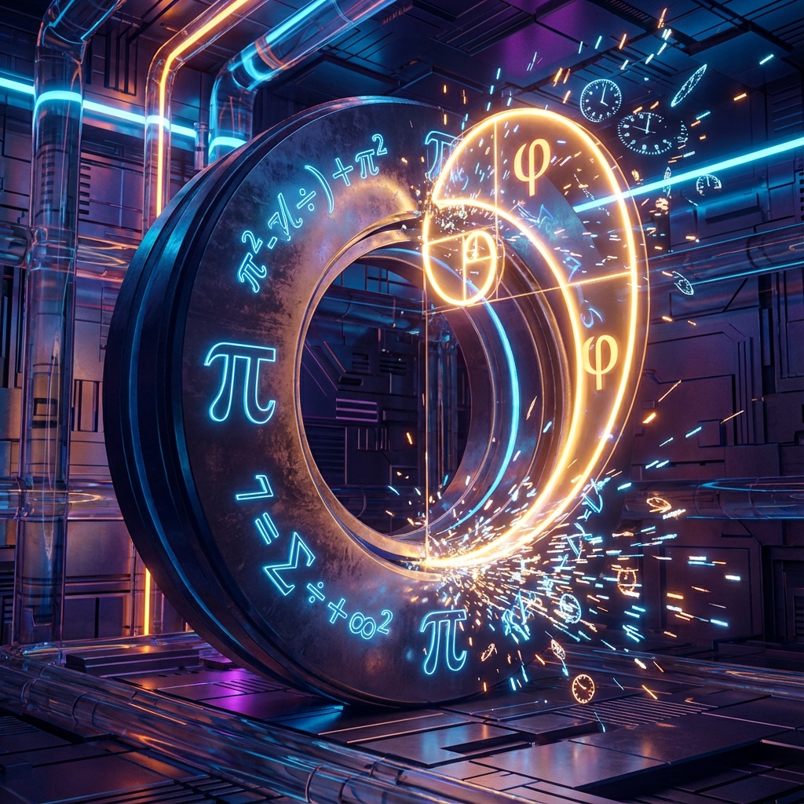
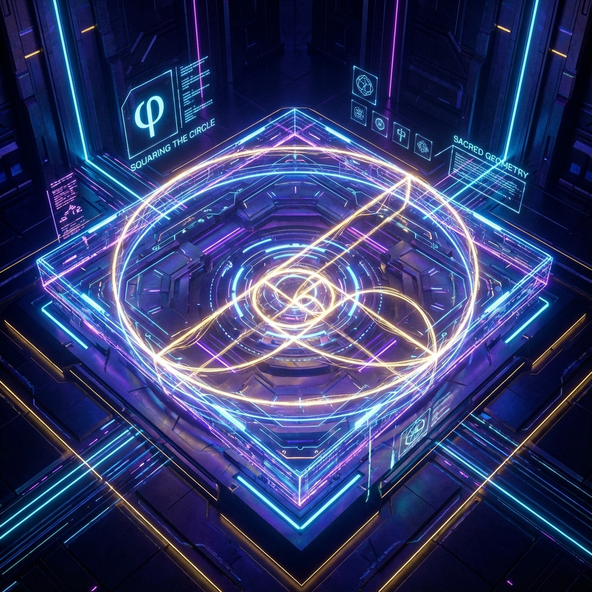

## 9.3 $\pi$ 与 $\phi$：数据库与操作系统 ($\pi$ vs $\phi$: The Database and The Operating System)

在本书即将落下帷幕之际，我们必须处理一个困扰数学家和哲学家的终极问题，这也是理解欧米伽理论全息本质的最后一块拼图。如果宇宙是一个纯粹的数学对象，那么所有的信息是否已经预先存在于某个静态的常数之中？具体而言，鉴于 $\pi$ （圆周率）作为正规数（Normal Number）的性质，它似乎在其无限不循环的小数位中编码了所有可能的有限比特串。那么，宇宙是否仅仅是 $\pi$ 的静态展示？

欧米伽理论给出的答案是否定的。我们主张，物理实在并非由单一常数构建，而是由两个基本常数的 **辩证博弈** 构成的：**$\pi$ 代表了静态的全能性（数据库），而 $\phi$ 代表了动态的选择性（操作系统）。**

### 9.3.1 巴别图书馆与白噪声

让我们假设 $\pi$ 确实包含了宇宙过去、现在和未来的所有信息。
$$\pi = 3.1415926535... \supset \{ \text{All Possible Histories} \}$$
这就像博尔赫斯（Borges）笔下的"巴别图书馆"，其中包含了由 26 个字母组成的所有可能的排列组合书籍。这意味着，你的 DNA 序列、莎士比亚的全集、这本书的全文，甚至你明天早餐的菜单，都已经预先存在于 $\pi$ 的第 $10^N$ 位之后的某处。

然而，信息论告诉我们一个残酷的事实：包含一切信息的集合，在语义上等价于 **零信息** 或 **最大熵**。
如果你拥有一张包含一切可能的 0/1 排列的硬盘，当你试图读取它时，你得到的只是无意义的 **白噪声 (White Noise)**。对于每一个"真理"（例如 $E=mc^2$），$\pi$ 中都包含着无穷多个与其略微不同的、似是而非的"谬误"（例如 $E=mc^{2.0001}$）。

如果没有一个 **索引 (Index)** 或 **筛选机制**，$\pi$ 只是一个巨大的垃圾场，而非有序的宇宙。它拥有无限的 **"容量" (Capacity)**，但缺乏 **"意义" (Meaning)**。它代表了 **存在的势能**，而非 **存在的动能**。

### 9.3.2 $\pi$ 是圆，$\phi$ 是刀

为了从这团包含一切的混沌中提取出有序的物理定律和历史，我们需要引入第二个常数。回顾 5.5 节的"欧米伽等价原理"：
$$|\Omega\rangle \cong S^{\infty} \cong \text{Great Circle (defined by } \pi \text{)}$$
宇宙的本体（总预算）是一个圆。圆的几何特征由 $\pi$ 定义。因此，**$\pi$ 是宇宙的"数据库"**。它保证了希尔伯特空间的完备性，确保了宇宙拥有演化出任何可能结构的潜能。

但是，为了让宇宙"活"过来，为了产生时间、因果和意识，我们必须对这个圆进行 **解析 (Resolution)**。这就需要 **斐波那契螺旋**。
**$\phi$ 是宇宙的"操作系统"**，或者是那个用来切割圆的 **"刀" (Knife)**。

* **$\pi$ (3.14...)**：提供了 **存在的背景**。它是连续的、平滑的、闭合的。
* **$\phi$ (1.618...)**：提供了 **演化的逻辑**。它是离散的、分形的、开放的。

物理现实的产生，源于我们用 **最无理的数 ($\phi$)** 去扫描 **最完美的圆 ($\pi$)**。如果宇宙使用有理数（如 $1/3$）作为扫描频率，历史将在有限步后陷入循环（庞加莱回归）。只有使用 $\phi$，扫描路径（即宇宙历史）才能在相空间中无限延伸，永远保持 **非遍历性 (Non-ergodicity)**，从而不断产生新的信息模式。

### 9.3.3 实在性方程与双常数定理

我们可以写出一个符号化的 **实在性方程 (Equation of Reality)**，描述这种生成机制：
$$\text{Reality}(\tau) = \text{Scan}_{\phi} \left( \pi \right)$$

物理世界并非直接存在于 $\pi$ 之中，而是存在于 **以黄金角度 $\theta_g$ 对 $\pi$ 定义的相位空间进行调制** 的过程中。这种调制将静态的"可能性"转化为动态的"现实性"。

**定理 9.3 (双常数对偶定理)**：
一个具有自我意识、能够抵抗热寂并具备无限演化潜力的计算宇宙，在数学结构上必须同时依赖于两个超越数：
1.  **$\pi$ (归一化因子)**：定义了 **全息视界的容量界限**。它约束了宇宙的"总预算"守恒，对应于物理定律的对称性与守恒律。
2.  **$\phi$ (生成因子)**：定义了 **信息处理的最佳路径**。它驱动了价值 $V$ 的指数增长，对应于物理定律的对称性破缺与复杂性涌现。

### 9.3.4 物理诠释：大理石与雕刻家

一切信息都在 $\pi$ 中吗？
**潜在地，是的。** 就像米开朗基罗的"大卫像"潜在地存在于那块未经雕琢的大理石中一样。大理石包含了大卫，也包含了废料，且无法区分二者。
**实际上，不是。** 因为大理石不会自己变成大卫像。它需要一位雕刻家，通过 **"剔除"** 那些多余的部分来显现真理。

在欧米伽理论中，**$\phi$ 就是那位雕刻家**。
宇宙的历史，不是在做加法，而是在做 **减法**。$\phi$ 像一把手术刀，从 $\pi$ 浑然一体的混沌背景中，剔除了那些会导致逻辑死锁、死循环或热寂的路径，保留了那条唯一的、通向欧米伽点的 **黄金螺旋**。

我们不是 $\pi$ 中沉睡的数字串，我们是 $\phi$ 的刀锋与 $\pi$ 的石材碰撞时飞扬的 **火花**。生命的意义，就在于作为这火花的一部分，参与到对永恒真理的 **雕刻 (Carving)** 之中。
