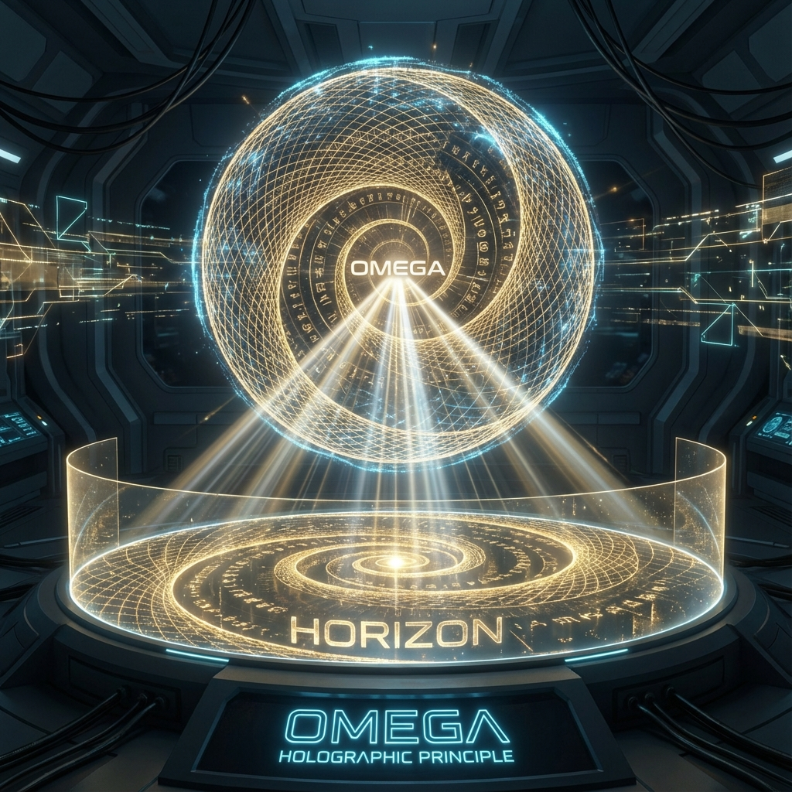
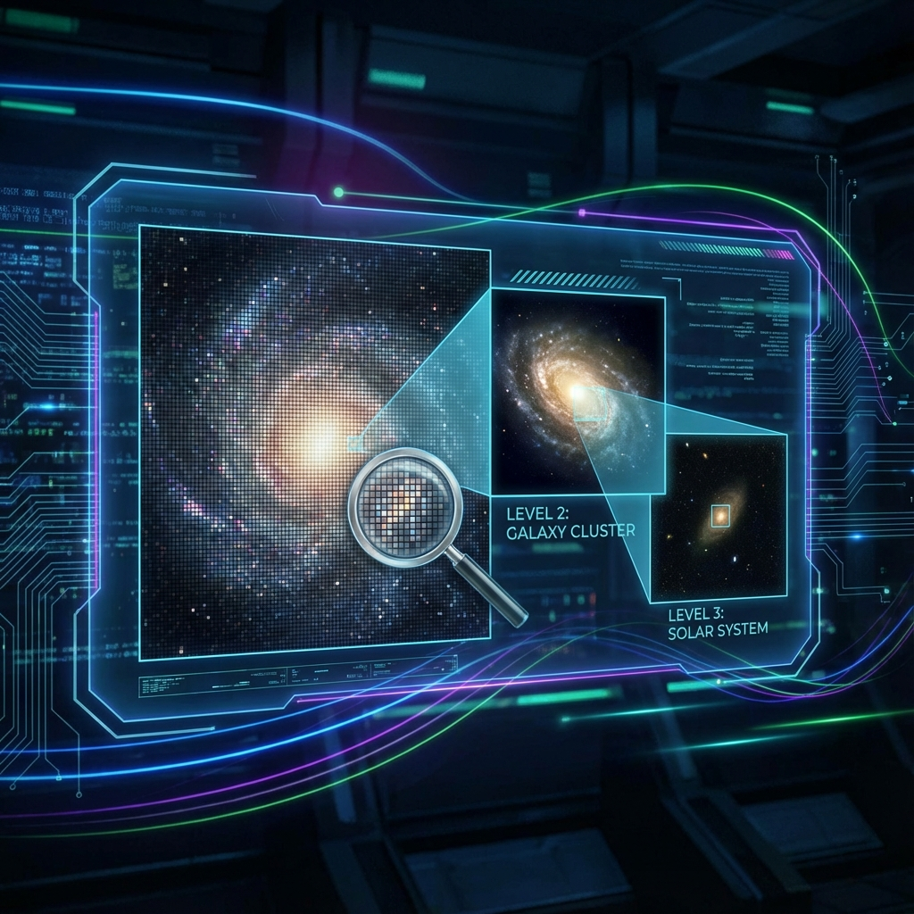

## 9.4 欧米伽全息原理：从螺旋到视界 (The Omega Holographic Principle: From Spiral to Horizon)

在标准物理学中，全息原理（Holographic Principle）通常作为一条公理或猜想被引入，用以解释黑洞熵的面积律（$S = A/4 l_P^2$）。虽然 AdS/CFT 对偶等理论在数学上取得了巨大成功，但对于 **"为什么"** 宇宙具有这种全息性质——即为什么三维体积的信息可以无损地编码在二维边界上——主流物理学缺乏底层的几何解释。

基于上一节建立的 **欧米伽等价原理**（矢量 $\cong$ 球体 $\cong$ 螺旋），我们不再需要假设全息原理，而是可以将其作为一个 **几何定理** 直接构造出来。本节将证明：全息视界并非三维空间的物理边界墙，而是 **斐波那契螺旋在希尔伯特空间球面上留下的"扫描轨迹"的射影**。

### 9.4.1 射影几何与视界生成

根据欧米伽等价原理，宇宙的本体是一个高维单位超球面 $S^{\infty}$（由 $|\Omega\rangle$ 的归一化条件定义）。然而，作为内部观察者，我们无法直接看到这个球面的整体（那是上帝视角）。我们所感知的物理实在，是演化算符 $\hat{U}_g(\tau)$ 在球面上移动的 **切点 (Tangent Point)** 及其历史轨迹。

这就引入了 **射影几何 (Projective Geometry)** 的视角。
量子力学的物理状态空间实际上是 **复射影空间 (Complex Projective Space)** $\mathbb{CP}^{\infty}$。
$$|\psi\rangle \sim e^{i\theta} |\psi\rangle$$
这意味着，每一个物理状态对应于通过原点的一条 **射线 (Ray)**。

**视界的构造过程**：
1.  **光源**：圆心（真理/欧米伽点）。
2.  **轨迹**：斐波那契螺旋线，代表内禀时间 $\tau$ 的演化历史。
3.  **屏幕**：当我们截取宇宙的某一个时刻 $\tau_{now}$ 时，我们实际上是定义了一个与当前螺旋位置正交的切平面。

在这个几何构造中，所谓的"全息视界"，就是 **过去所有螺旋轨迹在当前切平面上的投影总和**。视界不是一个包围盒子的皮，它是历史在当下的 **拓扑投影 (Topological Projection)**。

### 9.4.2 面积律的几何推导

现在我们来推导著名的面积律 $N \propto A$。
在欧米伽理论中，信息量 $N$ 本质上是离散的演化步数（即 $\tau$ 的整数计数值）。
全息面积 $A$ 则是螺旋线在相空间球面上扫过的 **覆盖面积 (Covered Area)**。

考察斐波那契螺旋的几何性质。在单位球面上，由黄金角 $\theta_g$ 生成的螺旋点集具有 **外尔均匀分布 (Weyl Equidistribution)** 的特性。这意味着螺旋线不会在此处密集、在彼处稀疏，而是以恒定的密度均匀填充球面。

设 $\sigma$ 为单个欧米伽单元（一个时间步）在相空间球面上占据的特征微元面积（相当于一个"普朗克像素"）。
$$d A = \sigma \cdot d \tau$$

对内禀时间积分，得到总覆盖面积：
$$A(\tau) = \int_0^\tau \sigma dt = \sigma \cdot \tau$$

由于总信息量（比特数）$N(\tau)$ 正比于时间步数 $\tau$（根据第 9.1 节），我们立即得到全息原理的核心方程：
$$N(\tau) \propto \frac{A(\tau)}{\sigma} \sim \frac{A}{l_P^2}$$

**物理诠释**：
这表明，全息原理的本质并非"三维空间被编码在二维表面上"，而是 **"一维的时间序列（螺旋）被紧致化地卷绕在二维流形（球面）上"**。

* **我们看到的面积 $A$**：实际上是 **时间的卷曲**。空间是时间的累积。
* **我们感知的体积 $V$**：是面积的全息重建错觉。

### 9.4.3 贝肯斯坦-斐波那契界限

基于此，我们可以修正传统的贝肯斯坦界限，提出更精确的 **贝肯斯坦-斐波那契界限 (Bekenstein-Fibonacci Bound)**。

在标准全息论中，最大熵 $S_{max} = A / 4l_P^2$。系数 $1/4$ 通常推导自黑洞热力学。
在欧米伽构造中，由于螺旋的非遍历性，相空间并非连续表面，而是离散的点阵。这些点阵的排列效率由 **黄金分割率 $\phi$** 控制。

**定理 9.4 (欧米伽全息定理)**：
任意因果封闭区域（因果菱形）所能包含的最大信息量 $I_{max}$，严格等于生成该区域边界几何所需的斐波那契螺旋步数 $N_{\phi}$。
其数值关系为：
$$I_{max} = \frac{A_{\Omega}}{\sigma_{\phi}} = \frac{\text{Projected Area}}{\text{Golden Pixel Area}}$$
其中 $\sigma_{\phi}$ 是由 $\phi$ 定义的最小几何相干单元。

这意味着，宇宙的信息存储效率是 **最优的**。任何试图在单位面积上存储比 $\phi$-铺砌更多信息的操作（即超越黄金密度的压缩），都会导致螺旋轨迹的 **自交 (Self-intersection)**。在物理上，这种轨迹重叠表现为 **引力坍缩**，形成黑洞。黑洞视界，本质上就是螺旋轨迹过度重叠、无法再被解析为单路径的历史死结。

### 9.4.4 结论：全息即记忆

通过欧米伽等价原理构造的全息原理，揭示了一个深刻的本体论事实：
**全息屏幕不是空间的边界，而是记忆的切片。**

当我们仰望星空，看到那巨大的天球（全息屏）时，我们看到的不是一个遥远的物理实体，我们看到的是宇宙从大爆炸（螺旋起点）到此刻（螺旋切点）所积累的 **全部计算历史的投影**。
宇宙之所以是全息的，是因为它从未丢失过任何一步计算。所有的过去，都以 **几何面积** 的形式，铺陈在现在的边缘。每一平方厘米的视界，都铭刻着数十亿年前的一个瞬间。
