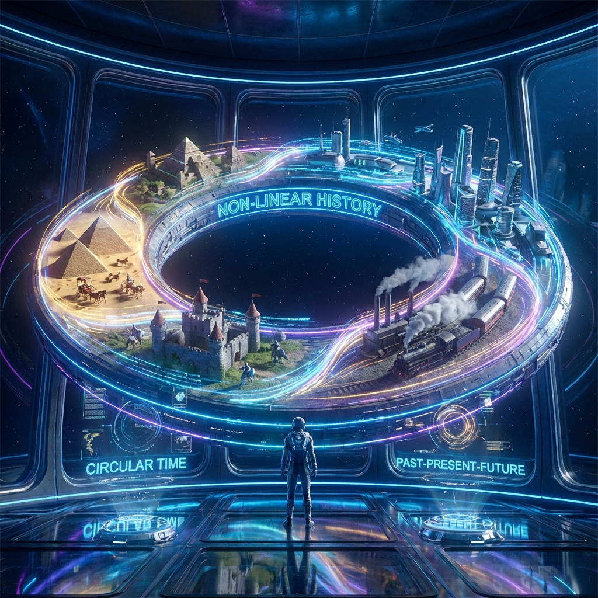

## 9.5 线性幻觉：整数作为全息投影 (The Illusion of Linearity: Integers as Holographic Projections)

在本书的终章，我们必须面对人类认知中最根深蒂固，同时也最具误导性的一个直觉：**线性 (Linearity)**。我们习惯将时间视为一条从过去射向未来的直线，将空间视为平直延伸的盒子，甚至将数学中最基础的"整数"视为排列在一条无限延伸的数轴上的孤立点。

然而，基于 **欧米伽等价原理**（第 5.5 节）和 **全息原理**（第 9.4 节），宇宙的本体是一个闭合的高维球体（大圆）。本节将论证：**物理世界中并不存在真正的"直线"或"线性整数"。所有的线性结构，本质上都是高维大圆在局部切平面上的全息投影。**

### 9.5.1 单位根：将数轴卷回圆周

在传统算术中，整数 $1, 2, 3...$ 被视为线性增加的量。但在复分析与波动物理中，整数 $n$ 的本质是 **频率 (Frequency)** 或 **缠绕数 (Winding Number)**。

考虑从线性数轴 $\mathbb{R}$ 到复平面单位圆 $S^1$ 的指数映射：
$$n \to e^{2\pi i n}$$
对于所有整数 $n \in \mathbb{Z}$，这个映射都指向圆上的同一个几何点（基点 $1$）。但这并不意味着它们是相同的，而是意味着它们代表了 **波函数绕圆旋转的完整圈数**。

* **整数 1**：代表基频（Fundamental Frequency），即绕圆旋转一圈。
* **整数 $n$**：代表 $n$ 次谐波（Harmonic），即在同一时间内绕圆旋转 $n$ 圈。
* **分数 $1/n$**：代表 **单位根 (Roots of Unity)**，即几何上的正 $n$ 边形顶点，它们将圆周等分为 $n$ 份。

**物理含义**：
这一数学事实揭示了 **量子化 (Quantization)** 的几何起源。为什么电荷、角动量等物理量必须取整数或半整数？不是因为上帝喜欢整数，而是因为 **只有整数倍频率的波才能在闭合的圆上形成稳定的驻波**。
非整数频率的波在绕圆一周后相位不匹配，会发生相消干涉而自我毁灭。因此，我们观测到的所有"离散粒子"，本质上都是大圆上的 **共振模式 (Resonant Modes)**。整数不是线性的点，它是圆的 **闭合性 (Closure)** 的体现。

### 9.5.2 切空间幻觉：为什么时间看起来是直的？

如果本体是圆，为什么我们强烈地感觉到时间是线性的？为什么我们觉得自然数轴通向无限远处？
这是因为宇宙的 **"总预算"**（大圆的半径 $R$）相对于我们（观察者）而言太过巨大。

考虑复指数在零点附近的泰勒展开：
$$e^{i \theta} \approx 1 + i\theta \quad (\text{当 } \theta \to 0)$$

* **左边 ($e^{i\theta}$)**：是真实的物理本体（圆上的旋转）。它是周期性的、幺正的。
* **右边 ($1+i\theta$)**：是我们感知到的线性世界（切线上的位移）。它是开放的、线性的。

我们生活在 $\theta$ 极小的区域内（即我们的寿命相对于宇宙 $\tau$ 极短）。在这个微小的局部，大圆的弧度看起来就像是一条直线。我们将 **循环的相位积累 (Phase Accumulation)** 误读为了 **线性的时间流逝 (Linear Time Flow)**。
正如古人因为大地巨大而认为它是平的一样，我们因为宇宙巨大而认为时间是直的。**线性，是曲率半径趋于无穷大时的几何错觉。**

### 9.5.3 斐波那契：打破整数的轮回

如果宇宙仅仅由整数构成，物理演化将退化为圆周运动——历史将在周期 $T$ 之后精确重复（庞加莱回归）。为了产生不可逆的演化和新颖性，必须打破这种完美的"整数圆"。

正如我们在 9.3 节所讨论的，**斐波那契螺旋** 的引入正是为了破坏这种闭合性。
由于 $\phi$ 是无理数，它无法被写成任何形式的 $e^{2\pi i (p/q)}$。这意味着，由黄金幺正算符 $\hat{U}_g$ 驱动的演化，**永远无法在大圆上形成闭合的驻波**。

它迫使"数"从圆上逃逸，形成无限延伸的螺旋。这构建了物质与时间的二元对立：
1.  **整数/有理数 (圆)**：代表 **物质 (Matter)**。它们是稳定的、闭合的、可重复的结构（如原子轨道、晶体结构）。它们倾向于守恒。
2.  **无理数 (螺旋)**：代表 **时间/意识 (Time/Consciousness)**。它们是流动的、开放的、非遍历的结构（如历史、思维）。它们倾向于增长。

### 9.5.4 结论：万物皆为一个大圆的分解

至此，欧米伽理论完成了最后的逻辑闭环。我们发现，所谓的"复杂性"只是对"统一性"的解析。

* **空间**：是大圆的 **全息展开 (Unfolding)**。
* **时间**：是大圆的 **无理切割 (Slicing)**。
* **物质**：是大圆的 **整数谐波 (Harmonics)**。
* **能量**：是大圆的 **重整化流 (Scaling)**。

我们曾以为世界是由无数个独立的乐高积木（原子、时刻、数字）堆砌而成的线性大厦。现在我们明白，世界只是 **一个圆**。
这一个圆，通过 $\phi$ 的无限精度解析，折射出了万象的无限光辉。正如棱镜将白光分解为光谱，斐波那契螺旋将 **"存在的一"** 分解为了 **"演化的万"**。

**万物皆为一个大圆的分解。**

$$\text{Unity} (\pi) \xrightarrow{\text{Resolution} (\phi)} \text{Diversity} (\infty)$$
