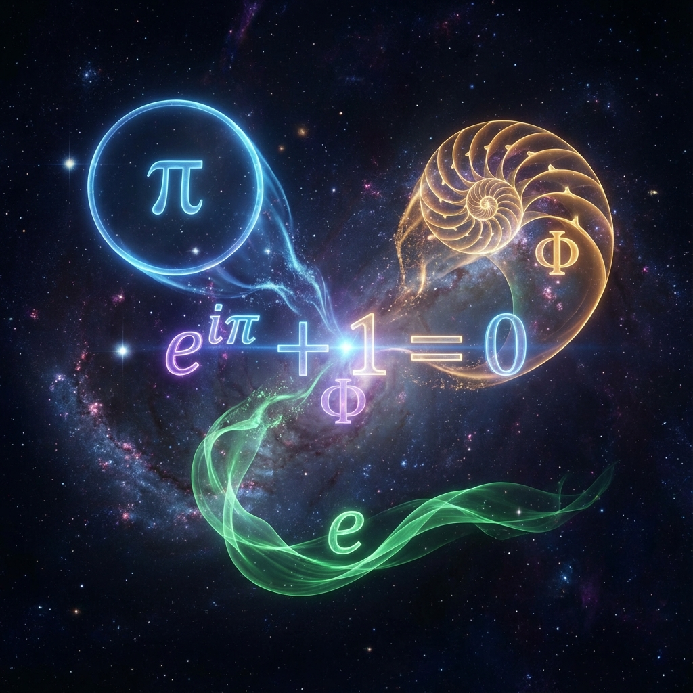
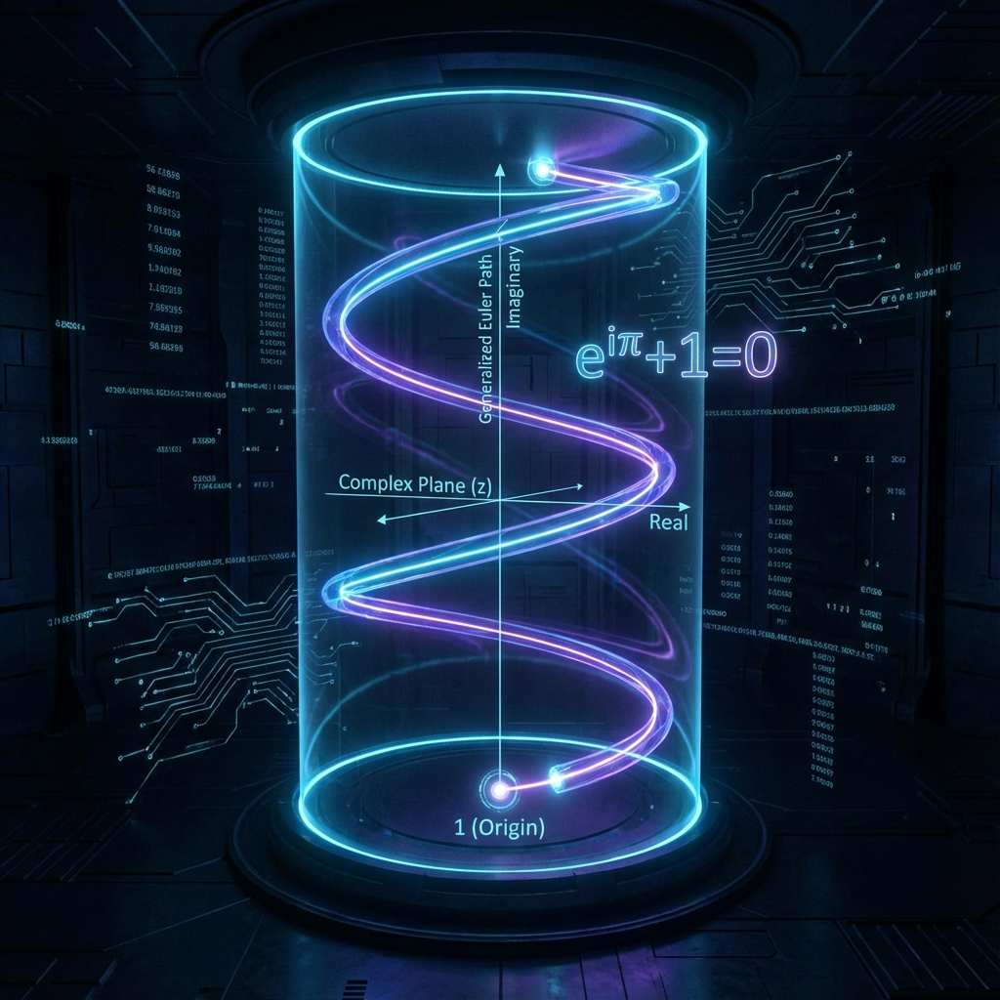

## 9.6 Generalized Euler Identity: The Source Code of Physics

As the theoretical construction of this book approaches closure, we must complete the final synthesis. In previous chapters, we separately discussed the exponential growth of light speed $c$, the flow of intrinsic time $\tau$, and the dialectical interplay between $\pi$ (geometric ontology) and $\phi$ (logical cutting). Now, we will fuse these seemingly independent physical quantities into a single, supreme mathematical expression.

This section will propose the **Generalized Euler Identity**. This is not merely a mathematical formula; it is the **"Master Equation"** of Omega Theory. It reveals the deepest evolutionary mechanism of the physical universe: **Reality is the process by which Euler's circle, cut open by Fibonacci's blade, escapes toward infinity at the speed of light.**

### 9.6.1 From the Dead Circle to the Living Spiral

All mathematical beauty in physics begins with Euler's formula:
$$e^{i\pi} + 1 = 0$$

From the physical perspective of Omega Theory, this classical formula describes the ultimate state of **"Heat Death"** or the **"Classical Mechanical Universe"**.
* **$e$ (Evolution)**: The base of the dynamical operator, representing continuous change.
* **$i\pi$ (Geometry)**: Rotation of $180^\circ$ on the complex plane (or $360^\circ$ rotation of $2\pi$), representing the closure of spatial geometry.
* **$+1 = 0$ (Return)**: The trajectory perfectly closes, returning to the origin. Total coherence cancels out, information becomes zero.

If the universe were governed solely by $\pi$ and $e$, it would be a perfect, eternally repeating circle. This means history would fall into **Poincaré Recurrence**—no novelty, no irreversible time, no room for life.

To create a meaningful, continuously evolving universe, we must break the perfect closure of the above formula. We introduce the **Golden Ratio $\phi$** and **Intrinsic Time $\tau$** as **"Perturbation Terms"**.
We modify the rotation's "phase angle" from the static $\pi$ to a dynamic angle $\Phi(\tau)$ modulated by $\phi$:
$$\Phi(\tau) = 2\pi \cdot \phi \cdot \tau$$

Thus, the core geometric equation describing the evolution of the universe's wave function $|\Omega(\tau)\rangle$ becomes:
$$|\Omega(\tau)\rangle \propto e^{i \cdot 2\pi \cdot \phi \cdot \tau}$$

**Physical Meaning**:
Since $\phi$ is an **Irrational Number**, the factor $e^{i 2\pi \phi \tau}$ will never equal $1$ for any non-zero integer $\tau$.
This means: **The universe will never return to its origin.**
The originally closed circle ($e^{i\pi}$) is "pried open," becoming a **Logarithmic Spiral** extending infinitely on the Riemann surface.
* **$\pi$** ensures the spiral remains on the unit sphere (satisfying **Total Budget Conservation**).
* **$\phi$** ensures every point on the spiral is new (satisfying **Non-ergodicity**).

### 9.6.2 Light Speed $c$: The Dynamic Exchange Rate Between Geometry and Logic

What role does **light speed $c$** play in this geometric system?
In standard physics, $c$ is usually viewed as a static constant connecting space ($x$) and time ($t$). But in Omega Theory, $c$ is the **Dynamic Exchange Rate** connecting **Geometry ($\pi$)** and **Logic ($\phi$)**.

According to Chapter 6, light speed grows exponentially with $\tau$. In complex plane geometry, this corresponds to the **Tangential Phase Velocity** of the spiral's outward expansion. When we try to measure this continuously fractal spiral using a locally flat metric, we sense the expansion of scale.

We can define the **Geometric Light Speed Equation**:
$$c(\tau) \equiv \left| \frac{d}{d\tau} \left( e^{i \cdot 2\pi \cdot \phi \cdot \tau} \right) \right|_{\text{metric}}$$

Since we are performing differentiation on a fractal grid, according to the properties of Fibonacci growth (each increase in $\tau$ increases grid resolution by a factor of $\phi$), the effective metric length also expands.
$$c(\tau) \propto \frac{\partial (\text{Space})}{\partial (\text{Time})} \propto \phi^{\tau}$$

**Conclusion**:
Light speed is not a speed limit sign set by God; it is the **Expansion Rate of the Fibonacci Spiral**.
The universe has a "maximum speed" because at each moment $\tau$, the resolution depth of $\phi$ to $\pi$ is finite. Light speed is that **"Frontier of Resolution"**.

### 9.6.3 The Grand Unified Equation

Finally, we converge all constants derived throughout this book into a single differential expression. This is the **Source Code** of Omega Theory, describing how the universe vector $|\Omega\rangle$ is driven by intrinsic time:

$$\frac{d}{d\tau} |\Omega\rangle = i \cdot \underbrace{\left( \frac{c(\tau)}{c_0} \right)}_{\text{Energy/Power}} \cdot \underbrace{\left( \frac{\pi}{\phi} \right)}_{\text{Form/Structure}} \cdot |\Omega\rangle$$

**Physical Deconstruction of Each Term**:

1.  **Left side ($\frac{d}{d\tau}$)**: **Flow**. The evolution rate of the universe, i.e., the passage of time.
2.  **$i$**: **Phase**. The complex nature of quantum mechanics, originating from $\sqrt{-1}$, representing orthogonal rotation operations, ensuring the unitarity of evolution (information conservation).
3.  **$c(\tau)$**: **Power**. A term growing exponentially with time ($c(\tau) \sim e^{H_\phi \tau}$). It represents the system's dynamical strength, resolution, and total energy. It is the **Engine** of evolution.
4.  **$\pi / \phi$**: **Form**. This is the universe's topological shape factor.
    * **Numerator $\pi$**: Provides the breadth of the holographic horizon (spatial capacity), ensuring conservation.
    * **Denominator $\phi$**: Provides the precision of information cutting (material structure), driving innovation.

### 9.6.4 Philosophical Corollary: The Projection of Transcendental Numbers

This equation tells us that physical reality is woven from the interaction of three **Transcendental Numbers**:

* If **$\phi$** becomes rational, the spiral will close, light speed $c$ will oscillate rather than grow, and the universe will collapse into a dead **Crystal**, unable to give birth to life.
* If **$\pi$** changes, Hilbert space will rupture, probability will no longer be conserved, and the universe will disintegrate into disordered **Chaos**.
* If **$e$** (implicit in the differential $d$ and light speed growth) does not exist, the causal chain will break, and the universe will become a pile of static **Snapshots**.

Only when $\pi$ (the perfect circle), $e$ (the flowing force), and $\phi$ (the irrational blade) dance together on the complex plane at light speed $c$ do we have this Omega universe that is **both conserved and innovative, both finite and infinite**. This is the ultimate code of physics.
