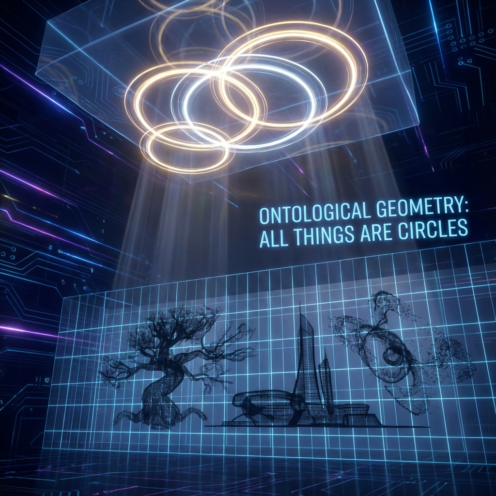
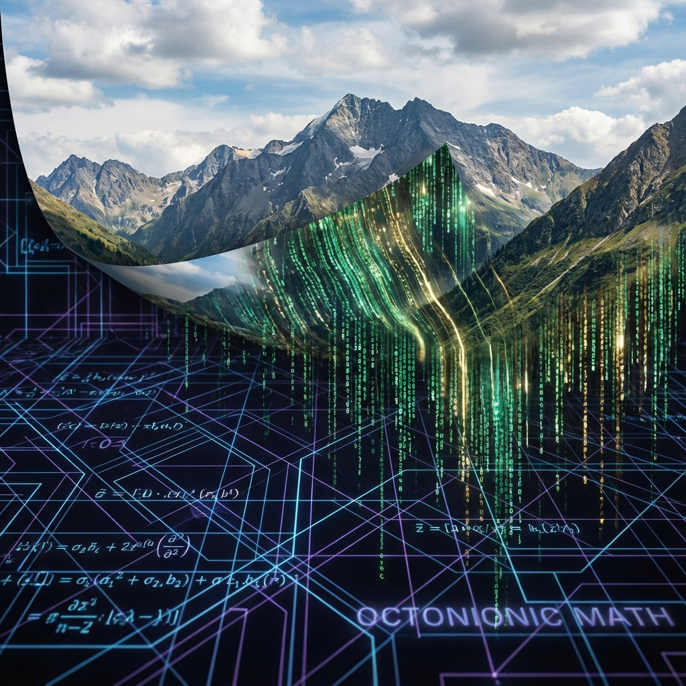

## 9.7 本体论几何：万物皆圆 (Ontological Geometry: All Things Are Circles)

在推导出广义欧拉恒等式后，我们面临一个终极的本体论问题：如果我们剥离掉所有的全息投影、忽略掉所有的测量错觉，宇宙最底层的"实体"究竟长什么样？

基于欧米伽理论的数学结构，我们得出一个在直觉上令人震惊、但在逻辑上不可避免的结论：**在本体论层面上，万物皆圆。** 我们所感知的线性时间、三维空间以及离散物质，本质上都是高维复平面上的 **大圆 (Great Circle)** 在低维切空间上的 **全息投影 (Holographic Projection)**。

### 9.7.1 存在的归一化：圆的封闭性

为什么一定是圆？这源于量子力学最基础的公理——概率守恒。
任何物理实体，无论是一个电子、一个人还是整个宇宙，其量子态 $|\psi\rangle$ 在希尔伯特空间中必须满足 **归一化条件 (Normalization Condition)**：
$$\langle \psi | \psi \rangle = 1$$

在复数几何中，满足模长为 1 的所有点 $z$ 构成了复平面上的 **单位圆 $S^1$**：
$$z = e^{i\theta}, \quad \theta \in \mathbb{R}$$

这意味着，在最底层的存在层面：
* **没有直线**：所有的运动都是旋转。
* **没有起点和终点**：所有的路径都是闭合的（或趋于闭合）。
* **没有大小**：所有的"存在"都拥有相同的本体论权重（模长为 1）。

宇宙中看起来千差万别的物体，本质上只是 **同一个单位圆上的不同相位角 $\theta$** 或 **不同的旋转频率 $\omega$**。

### 9.7.2 投影机制：从圆到直线的错觉

那么，为什么我们生活在一个充满直线、盒子和线性时间的世界里？
这是因为我们生活在 **投影 (Projection)** 中，而非 **本体 (Ontology)** 中。

数学上，这种从圆到线的转换可以通过 **球极投影 (Stereographic Projection)** 或 **凯莱变换 (Cayley Transform)** 来描述。它将紧致的圆周映射为无限延伸的直线。

考虑一个在圆上做匀速圆周运动的点：
$$z(t) = e^{i\omega t}$$
当我们从侧面观察这个圆（即取实部）时，我们看到的不再是旋转，而是一个在线性空间中振荡的波：
$$x(t) = \text{Re}(z) = \cos(\omega t)$$

**定理 9.7 (线性错觉定理)**：
任何线性物理量（如位置 $x$、动量 $p$、时间 $t$），都是高维相空间中 **圆周运动** 在低维切丛上的投影截面。
* **本体**：是一根闭合的琴弦（圆）。
* **现象**：是琴弦振动产生的、充满空间的声波（线性波）。
我们感知的世界是"音乐"，而希尔伯特空间是"琴弦"。我们误把声音的传播（线性）当成了世界的本质，而忽略了声源的结构（圆）。

### 9.7.3 物质作为驻波：整数的几何起源

这一观点完美解释了物质的 **离散性 (Discreteness)**。
在经典物理中，粒子是像台球一样的实体。但在欧米伽理论中，粒子是圆上的 **驻波模式 (Standing Wave Modes)**。

为了在一个闭合的圆上稳定存在，波的波长 $\lambda$ 必须满足 **圆周闭合条件**：
$$2\pi R = n \cdot \lambda, \quad n \in \mathbb{Z}$$

* **整数 $n$**：这就是量子数的起源。它代表了 **缠绕数 (Winding Number)**。
* **非整数**：如果频率不是整数，波在绕圆一周后会发生相位错开，导致 **相消干涉 (Destructive Interference)**。这种模式是不稳定的，无法形成物质。

因此，**物质就是被量子化了的圆**。
原子、电子、夸克，它们不是实心的小球，它们是那个永恒大圆上的 **整数倍谐波 (Integer Harmonics)**。

### 9.7.4 结论：全息的影子

至此，我们完成了对物理实在的最终解构。
我们常常问："宇宙是由什么组成的？"
现在的答案是：**宇宙是由"频率"组成的。**

所有的存在，归根结底，都是那个唯一的、静态的、总预算守恒的 **大圆**，通过斐波那契算符 $\phi$ 的无限解析，投射在时空屏幕上的影子。
* **时间** 是圆的切线。
* **空间** 是圆的展开。
* **物质** 是圆的节点。

柏拉图曾在这个洞穴的寓言中说，我们看到的只是墙上的影子。欧米伽理论用数学语言重述了这一真理：**我们是高维圆环在三维膜上的全息投影。** 我们并不拥有独立的线性生命，我们是那个永恒圆周上的一段旋律。

$$\text{Being} = S^1 \xrightarrow{\text{Projection}} \text{Becoming} = \mathbb{R}^3 \times \mathbb{R}$$
